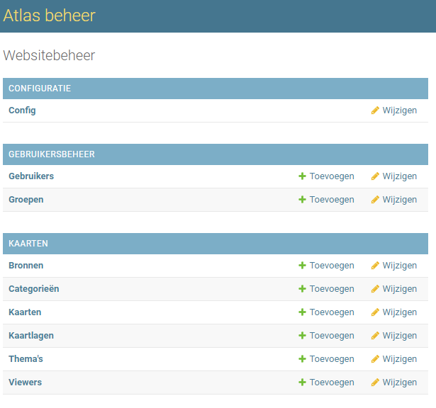

Last login: Mon Feb 26 13:29:35 on ttys004

The default interactive shell is now zsh.
To update your account to use zsh, please run `chsh -s /bin/zsh`.
For more details, please visit https://support.apple.com/kb/HT208050.
iProvanGemeente:~ vanvlijm$ crontab -e
crontab: no crontab for vanvlijm - using an empty one
crontab: no changes made to crontab
iProvanGemeente:~ vanvlijm$ man crontab
iProvanGemeente:~ vanvlijm$ man crontab
iProvanGemeente:~ vanvlijm$ man cron
iProvanGemeente:~ vanvlijm$ 
  [Hersteld 29 feb 2024 12:34:11]
Last login: Thu Feb 29 12:34:11 on ttys004
Restored session: do 29 feb 2024 12:09:49 CET

The default interactive shell is now zsh.
To update your account to use zsh, please run `chsh -s /bin/zsh`.
For more details, please visit https://support.apple.com/kb/HT208050.
iProvanGemeente:~ vanvlijm$ 
  [Hersteld 9 mrt 2024 23:46:59]
Last login: Sat Mar  9 23:46:59 on ttys004
Restored session: za  9 mrt 2024 20:36:21 CET

The default interactive shell is now zsh.
To update your account to use zsh, please run `chsh -s /bin/zsh`.
For more details, please visit https://support.apple.com/kb/HT208050.
iMac-Pro-van-Gemeente:~ vanvlijm$ 
  [Hersteld 10 mrt 2024 19:03:29]
Last login: Sun Mar 10 19:03:29 on ttys004

The default interactive shell is now zsh.
To update your account to use zsh, please run `chsh -s /bin/zsh`.
For more details, please visit https://support.apple.com/kb/HT208050.
iMac-Pro-van-Gemeente:~ vanvlijm$ 
  [Hersteld 15 apr 2024 08:17:15]
Last login: Mon Apr 15 08:17:15 on ttys004

The default interactive shell is now zsh.
To update your account to use zsh, please run `chsh -s /bin/zsh`.
For more details, please visit https://support.apple.com/kb/HT208050.
iProvanGemeente:~ vanvlijm$ 
  [Hersteld 27 mei 2024 21:48:09]
Last login: Mon May 27 21:48:09 on ttys004
date: illegal time format
usage: date [-jnRu] [-I[date|hours|minutes|seconds]] [-f input_fmt]
            [-r filename|seconds] [-v[+|-]val[y|m|w|d|H|M|S]]
            [[[[mm]dd]HH]MM[[cc]yy][.SS] | new_date] [+output_fmt]
-bash: Saving: command not found

The default interactive shell is now zsh.
To update your account to use zsh, please run `chsh -s /bin/zsh`.
For more details, please visit https://support.apple.com/kb/HT208050.
iProvanGemeente:~ vanvlijm$ 
  [Hersteld 18 jun 2024 12:38:20]
Last login: Tue Jun 18 12:38:20 on ttys004
date: illegal time format
usage: date [-jnRu] [-I[date|hours|minutes|seconds]] [-f input_fmt]
            [-r filename|seconds] [-v[+|-]val[y|m|w|d|H|M|S]]
            [[[[mm]dd]HH]MM[[cc]yy][.SS] | new_date] [+output_fmt]
-bash: Saving: command not found

The default interactive shell is now zsh.
To update your account to use zsh, please run `chsh -s /bin/zsh`.
For more details, please visit https://support.apple.com/kb/HT208050.
iProvanGemeente:~ vanvlijm$ 
  [Hersteld 24 jun 2024 09:17:55]
Last login: Mon Jun 24 09:17:54 on ttys004

The default interactive shell is now zsh.
To update your account to use zsh, please run `chsh -s /bin/zsh`.
For more details, please visit https://support.apple.com/kb/HT208050.
iMac-Pro-van-Gemeente:~ vanvlijm$ 
  [Hersteld 16 jul 2024, 22:19:23]
Last login: Tue Jul 16 22:19:22 on ttys000

The default interactive shell is now zsh.
To update your account to use zsh, please run `chsh -s /bin/zsh`.
For more details, please visit https://support.apple.com/kb/HT208050.
iMac-Pro-van-Gemeente:~ vanvlijm$ pwd
/Users/vanvlijm
iMac-Pro-van-Gemeente:~ vanvlijm$ cd Library/
iMac-Pro-van-Gemeente:Library vanvlijm$ cd Application\ Support/
iMac-Pro-van-Gemeente:Application Support vanvlijm$ cd Citrix\ Receiver/
iMac-Pro-van-Gemeente:Citrix Receiver vanvlijm$ ll
total 224
2913019754 drwxr-xr-x   17 vanvlijm  staff    544 21 aug 06:18 .
   2126717 drwx------+ 126 vanvlijm  staff   4032 16 jul 22:19 ..
2913019868 -rw-r--r--@   1 vanvlijm  staff     36  5 sep  2022 .Citrix_UUID.txt
2916107994 -rw-r--r--    1 vanvlijm  staff   3172 18 sep  2022 Account Info Cache https_sf_purmerend_localcitrixstorediscovery.ctx
2916107209 -rw-r--r--    1 vanvlijm  staff   4114 18 sep  2022 Apps Cache https_sf_purmerend_localcitrixstorediscovery.ctx
3044340023 drwxr-xr-x    2 vanvlijm  staff     64 16 jul 22:20 CAS
2913449339 drwxr-xr-x    2 vanvlijm  staff     64  7 sep  2022 CLSyncRoot
2913021648 -rw-r--r--@   1 vanvlijm  staff      0  5 sep  2022 CitrixID
2913019758 -rw-r--r--    1 vanvlijm  staff   1258 21 aug 12:22 Config
2913019831 -rw-r--r--    1 vanvlijm  staff     16  5 sep  2022 ConnectionLeaseKeyID.ctx
2916134721 -rw-r--r--    1 vanvlijm  staff  61947 18 sep  2022 Delivery Services Icon Cache.ctx
2918532153 -rw-r--r--    1 vanvlijm  staff    313 16 nov  2022 Installed Application List.ctx
2913019759 -rw-r--r--    1 vanvlijm  staff   2857  5 sep  2022 Modules
2916107211 -rw-r--r--    1 vanvlijm  staff    120 18 sep  2022 Store Info Cache https_sf_purmerend_localcitrixstorediscovery.ctx
2913019760 -rw-r--r--    1 vanvlijm  staff   4225  5 sep  2022 ViewerLogging.plist
2916107954 drwx------    3 vanvlijm  staff     96 18 sep  2022 WebUICache
2913021667 drwxr-xr-x    3 vanvlijm  staff     96  5 sep  2022 keystore
iMac-Pro-van-Gemeente:Citrix Receiver vanvlijm$ vi config
iMac-Pro-van-Gemeente:Citrix Receiver vanvlijm$ ll
total 232
2913019754 drwxr-xr-x   19 vanvlijm  staff    608 21 aug 12:39 .
   2126717 drwx------+ 126 vanvlijm  staff   4032 16 jul 22:19 ..
2913019868 -rw-r--r--@   1 vanvlijm  staff     36  5 sep  2022 .Citrix_UUID.txt
2916107994 -rw-r--r--    1 vanvlijm  staff   3172 18 sep  2022 Account Info Cache https_sf_purmerend_localcitrixstorediscovery.ctx
2916107209 -rw-r--r--    1 vanvlijm  staff   4114 18 sep  2022 Apps Cache https_sf_purmerend_localcitrixstorediscovery.ctx
3046786422 drwxr-xr-x    2 vanvlijm  staff     64 21 aug 12:39 CAS
3046786492 drwxr-xr-x    3 vanvlijm  staff     96 21 aug 12:39 CEIP
2913449339 drwxr-xr-x    2 vanvlijm  staff     64  7 sep  2022 CLSyncRoot
2913021648 -rw-r--r--@   1 vanvlijm  staff      0  5 sep  2022 CitrixID
3046775083 -rw-r--r--    1 vanvlijm  staff   1249 21 aug 12:41 Config
3046786434 -rw-r--r--    1 vanvlijm  staff     16 21 aug 12:39 ConnectionLeaseKeyID.ctx
2916134721 -rw-r--r--    1 vanvlijm  staff  61947 18 sep  2022 Delivery Services Icon Cache.ctx
2918532153 -rw-r--r--    1 vanvlijm  staff    313 16 nov  2022 Installed Application List.ctx
2913019759 -rw-r--r--    1 vanvlijm  staff   2857  5 sep  2022 Modules
2916107211 -rw-r--r--    1 vanvlijm  staff    120 18 sep  2022 Store Info Cache https_sf_purmerend_localcitrixstorediscovery.ctx
3046786470 -rw-r--r--    1 vanvlijm  staff    557 21 aug 12:39 TAPDiscoveryConfig
2913019760 -rw-r--r--    1 vanvlijm  staff   4225  5 sep  2022 ViewerLogging.plist
2916107954 drwx------    3 vanvlijm  staff     96 18 sep  2022 WebUICache
2913021667 drwxr-xr-x    3 vanvlijm  staff     96  5 sep  2022 keystore
iMac-Pro-van-Gemeente:Citrix Receiver vanvlijm$ ll
total 0
2913019754 drwxr-xr-x    2 vanvlijm  staff    64 21 aug 12:47 .
   2126717 drwx------+ 118 vanvlijm  staff  3776 21 aug 12:47 ..
iMac-Pro-van-Gemeente:Citrix Receiver vanvlijm$ ll
total 0
2913019754 drwxr-xr-x    2 vanvlijm  staff    64 21 aug 12:47 .
   2126717 drwx------+ 118 vanvlijm  staff  3776 21 aug 12:47 ..
iMac-Pro-van-Gemeente:Citrix Receiver vanvlijm$ cd ..
iMac-Pro-van-Gemeente:Application Support vanvlijm$ ll
total 72
   2126717 drwx------+ 118 vanvlijm  staff  3776 21 aug 12:47 .
   2126693 drwx------@ 118 vanvlijm  staff  3776 16 jul 22:14 ..
   2134290 -rw-r--r--    1 vanvlijm  staff     0 21 mei  2019 .ACCC_Lock
   2134984 -rw-r--r--    1 vanvlijm  staff     0 21 mei  2019 .ADCS_Lock
  11558648 -rw-r--r--    1 vanvlijm  staff     0 30 sep  2020 .CCH_NGLW_Lock
1306693692 -rw-r--r--    1 vanvlijm  staff     0  2 mrt  2021 .CCH_UPI_Lock
3043471565 -rw-r--r--    1 vanvlijm  staff     0 29 jun 09:04 .COSY_Lock
3017960250 -rw-r--r--@   1 vanvlijm  staff  6148 18 dec  2023 .DS_Store
 767904025 drwxr-xr-x    8 vanvlijm  staff   256 27 dec  2021 5KPlayer
   2127915 drwx------   14 vanvlijm  staff   448 25 jul  2022 AddressBook
   2134980 drwxr-xr-x   65 vanvlijm  staff  2080 30 jul 15:47 Adobe
2901410966 drwxr-xr-x    5 vanvlijm  staff   160 17 jun 15:50 Animoji
   3691034 drwxr-xr-x    4 vanvlijm  staff   128 18 mrt  2022 App Store
  39989280 drwx------    4 vanvlijm  staff   128  4 nov  2021 Avenza
 769411784 drwxr-xr-x    3 vanvlijm  staff    96  6 mrt  2021 Avid
   2134977 drwx------    3 vanvlijm  staff    96 21 mei  2019 CEF
   2128425 drwxr-xr-x    6 vanvlijm  staff   192 16 jul 23:07 CallHistoryDB
   2128423 drwxr-xr-x    4 vanvlijm  staff   128 30 sep  2020 CallHistoryTransactions
2913019753 drwxr-xr-x    3 vanvlijm  staff    96 21 aug 12:47 Citrix
   2128612 drwxr-xr-x    9 vanvlijm  staff   288 21 aug 10:56 CloudDocs
1187304610 -rw-r--r--@   1 vanvlijm  staff  9355  8 mrt  2021 ContactSheetII.log
1187304609 -rw-r--r--@   1 vanvlijm  staff   701  8 mrt  2021 Contactblad II.xml
   2285682 drwxr-xr-x    2 vanvlijm  staff    64 21 mei  2019 CoreParsec
   2128602 drwx------   62 vanvlijm  staff  1984 21 aug 11:41 CrashReporter
2880380912 drwxr-xr-x    3 vanvlijm  staff    96  4 apr  2022 DVD Player
 767900589 drwxr-xr-x    4 vanvlijm  staff   128 19 jan  2021 Digiarty
1999483229 drwx------    3 vanvlijm  staff    96  6 mei  2021 DiskDrill
   2278424 drwx------    3 vanvlijm  staff    96 21 mei  2019 DiskImages
   2133958 drwxr-xr-x    3 vanvlijm  staff    96 28 feb 10:52 Dock
1939506368 drwxrwxrwx    9 root      staff   288  1 mei  2021 EaseUS
2901384874 drwxr-xr-x    5 vanvlijm  staff   160 25 jul  2022 FaceTime
   8732353 drwxr-xr-x   11 vanvlijm  staff   352 20 dec  2021 FileProvider
   2810575 drwx------    7 vanvlijm  staff   224 28 mei  2019 Firefox
2875462761 drwxr-xr-x   13 vanvlijm  staff   416 17 mrt  2022 Gemini 2
2008168624 drwxr-xr-x    5 vanvlijm  staff   160  6 jul  2022 Google
2004524419 drwxr-xr-x    6 vanvlijm  staff   192  1 jun  2021 Google Earth
2317211244 drwxr-xr-x    3 vanvlijm  staff    96 13 okt  2021 HP
2902295037 drwx------    4 vanvlijm  staff   128 25 jul  2022 Instruments
   2130074 drwxr-xr-x    5 vanvlijm  staff   160 21 mei  2019 Knowledge
1174554895 drwx------    3 vanvlijm  staff    96 13 feb  2021 LaserSoft Imaging
1190923427 drwxr-xr-x    4 vanvlijm  staff   128 25 feb  2021 MacDown
  36072108 drwxr-xr-x    4 vanvlijm  staff   128 29 apr  2021 Microsoft
 729549251 drwxr-xr-x    4 vanvlijm  staff   128  6 jan  2021 Microsoft AU Daemon
 729549919 drwx------   36 vanvlijm  staff  1152 16 nov  2021 Microsoft Edge
   3598369 drwxr-xr-x@   3 vanvlijm  staff    96 25 jun  2019 MobileSync
   2810610 drwx------@   4 vanvlijm  staff   128 29 jan  2021 Mozilla
  36693288 drwxr-xr-x    2 vanvlijm  staff    64 11 okt  2020 OpenVR
2914533033 drwx------   16 vanvlijm  staff   512 12 sep  2022 Postman
   3483736 drwxr-xr-x    4 vanvlijm  staff   128 18 dec  2023 QGIS
   2128534 drwxr-xr-x    4 vanvlijm  staff   128 25 jul  2022 Quick Look
   3208147 drwxr-xr-x    3 vanvlijm  staff    96 11 jun  2019 ShareFile
2962010253 drwx------    6 vanvlijm  staff   192 21 aug 10:57 Spotify
1694151002 drwxr-xr-x    7 vanvlijm  staff   224 19 dec  2022 Sublime Text 3
   3598312 drwx------    3 vanvlijm  staff    96 25 jun  2019 SyncServices
2897885975 drwxr-xr-x    2 vanvlijm  staff    64 11 jul  2022 System Preferences
  39639055 drwx------    3 vanvlijm  staff    96 22 okt  2020 Teams
   8730479 drwxr-xr-x    2 vanvlijm  staff    64 16 sep  2020 TrustedPeersHelper
1939465694 drwxr-xr-x    6 vanvlijm  staff   192  1 mei  2021 WAF
1939465874 drwxr-xr-x    4 vanvlijm  staff   128  1 mei  2021 Wondershare Repairit
3000590162 drwxr-xr-x    5 vanvlijm  staff   160 18 okt  2023 Xcode
1945505436 drwxr-xr-x    3 vanvlijm  staff    96  1 mei  2021 Yodot Software
   2130734 drwxr-xr-x    2 vanvlijm  staff    64 21 mei  2019 accountsd
3042834958 drwxr-xr-x@   3 vanvlijm  staff    96 17 jun 16:10 astropad
  37941241 drwxr-xr-x    3 vanvlijm  staff    96 16 okt  2020 com.Brother.application
2012375616 drwxr-xr-x   14 vanvlijm  staff   448 16 jul 22:23 com.adobe.dunamis
   8972909 drwxr-xr-x    4 vanvlijm  staff   128  7 jul  2022 com.apple.AMPLibraryAgent
 580829075 drwxr-xr-x    3 vanvlijm  staff    96 17 dec  2020 com.apple.AssistiveControl
  11085438 drwxr-xr-x    3 vanvlijm  staff    96 16 jul 22:09 com.apple.ContextStoreAgent
2901407197 drwxr-xr-x@   3 vanvlijm  staff    96 25 jul  2022 com.apple.MediaPlayer
2901387360 drwxr-xr-x    3 vanvlijm  staff    96 22 jul 09:11 com.apple.NewDeviceOutreach
   2128167 drwxr-xr-x   14 vanvlijm  staff   448 17 jul  2023 com.apple.ProtectedCloudStorage
2977431773 drwx------@   5 vanvlijm  staff   160 17 jul 10:09 com.apple.RemoteManagementAgent
   2127902 drwx------    4 vanvlijm  staff   128 21 aug 12:39 com.apple.TCC
   8971670 drwxr-xr-x    4 vanvlijm  staff   128 23 jul  2023 com.apple.akd
2901390373 drwxr-xr-x    7 vanvlijm  staff   224 17 jul 02:00 com.apple.ap.promotedcontentd
2902488012 drwxr-xr-x    3 vanvlijm  staff    96 26 jul  2022 com.apple.avfoundation
   2127778 drwxr-xr-x    3 vanvlijm  staff    96 16 jul 22:20 com.apple.backgroundtaskmanagementagent
3044328759 drwxr-xr-x    3 vanvlijm  staff    96 16 jul 22:09 com.apple.control-center.tips
   8736295 drwxr-xr-x    3 vanvlijm  staff    96 16 sep  2020 com.apple.exchangesync
   8731212 drwxr-xr-x    3 vanvlijm  staff    96 16 sep  2020 com.apple.kvs
2978031428 drwxr-xr-x    3 vanvlijm  staff    96 20 jul  2023 com.apple.mobileAssetDesktop
   8732352 drwx--x--x    2 vanvlijm  staff    64 16 sep  2020 com.apple.replayd
   2131617 drwxr-xr-x    3 vanvlijm  staff    96 21 mei  2019 com.apple.sbd
   2127779 drwxr-xr-x   12 vanvlijm  staff   384 21 aug 12:46 com.apple.sharedfilelist
   2134229 drwxr-xr-x    8 vanvlijm  staff   256 21 aug 12:40 com.apple.spotlight
   2161041 drwxr-xr-x   15 vanvlijm  staff   480 25 jul  2022 com.apple.touristd
3035132495 drwxr-xr-x    3 vanvlijm  staff    96 29 feb 12:18 com.apple.wallpaper
2977147378 drwxr-xr-x    3 vanvlijm  staff    96 29 feb 12:09 com.apple.windowmanager
3042834770 drwxr-xr-x@   3 vanvlijm  staff    96 17 jun 16:10 com.astro-hq.LunaSecondaryMac
  37942203 drwxr-xr-x    3 vanvlijm  staff    96  7 mrt 12:46 com.brother.utility.NETserver
  37944250 drwxr-xr-x    2 vanvlijm  staff    64 16 okt  2020 com.brother.utility.USBAppControlServer
  37942117 drwxr-xr-x    3 vanvlijm  staff    96  7 mrt 12:46 com.brother.utility.USBserver
  37944246 drwxr-xr-x    3 vanvlijm  staff    96 16 okt  2020 com.brother.utility.WorkflowAppControlServer
1939506379 drwxrwxrwx    3 root      staff    96  1 mei  2021 com.easeus.datarecoverywizard
  37693363 drwxr-xr-x    3 vanvlijm  staff    96 15 okt  2020 com.paragon-software.ntfs.fsapp
  37689631 drwxr-xr-x    3 vanvlijm  staff    96 15 okt  2020 com.paragon-software.ntfs.notification-agent
2906345666 drwxr-xr-x    3 vanvlijm  staff    96 10 aug  2022 com.sharefile.desktop.widget
1939463246 drwxr-xr-x    3 vanvlijm  staff    96  1 mei  2021 com.wondershare.Installer
   2134521 drwxr-xr-x    2 vanvlijm  staff    64 21 mei  2019 dmd
3044335509 drwxr-xr-x    2 vanvlijm  staff    64 16 jul 22:14 homeenergyd
   2130436 drwxr-xr-x    3 vanvlijm  staff    96 21 mei  2019 iCloud
 729580862 drwxr-xr-x    2 vanvlijm  staff    64  6 jan  2021 iLifeMediaBrowser
1945503818 drwxr-xr-x@   3 vanvlijm  staff    96  1 mei  2021 iMovie
   2134114 drwx------    4 vanvlijm  staff   128 20 aug 07:17 icdd
 726183583 drwxr-xr-x    7 vanvlijm  staff   224 18 jan  2024 io.branch
3035132513 drwxr-xr-x    5 vanvlijm  staff   160 29 feb 12:18 networkserviceproxy
2851910072 drwxr-xr-x    7 vanvlijm  staff   224 20 mrt  2023 obs-studio
1945492358 drwx------    3 vanvlijm  staff    96  8 nov  2023 org.videolan.vlc
1494834310 drwx------   18 vanvlijm  staff   576 21 aug 12:37 pgAdmin 4
1494834751 drwxr-xr-x@  46 vanvlijm  staff  1472 12 aug 12:37 pgadmin
1494642560 -rw-------    1 vanvlijm  staff    65 23 mrt  2021 pgadmin4.d41d8cd98f00b204e9800998ecf8427e.addr
1494641300 -rw-------    1 vanvlijm  staff    92 23 mrt  2021 pgadmin4.d41d8cd98f00b204e9800998ecf8427e.log
 298676539 -rw-------    1 vanvlijm  staff  1661 23 mrt  2021 pgadmin4.startup.log
   8730261 drwxr-xr-x    2 vanvlijm  staff    64 16 sep  2020 syncdefaultsd
   8966157 drwxr-xr-x    2 vanvlijm  staff    64 16 sep  2020 transparencyd
   2134586 drwxr-xr-x   10 vanvlijm  staff   320 25 mrt 09:00 videosubscriptionsd
1939465896 drwxr-xr-x    4 vanvlijm  staff   128  1 mei  2021 wondershare
 317229989 drwxr-xr-x    4 vanvlijm  staff   128 10 mei  2021 zoom.us
iMac-Pro-van-Gemeente:Application Support vanvlijm$ cd Citrix/ 
Display all 116 possibilities? (y or n)
.ACCC_Lock                                      Microsoft/                                      com.apple.mobileAssetDesktop/
.ADCS_Lock                                      Microsoft AU Daemon/                            com.apple.replayd/
.CCH_NGLW_Lock                                  Microsoft Edge/                                 com.apple.sbd/
.CCH_UPI_Lock                                   MobileSync/                                     com.apple.sharedfilelist/
.COSY_Lock                                      Mozilla/                                        com.apple.spotlight/
.DS_Store                                       OpenVR/                                         com.apple.touristd/
5KPlayer/                                       Postman/                                        com.apple.wallpaper/
AddressBook/                                    QGIS/                                           com.apple.windowmanager/
Adobe/                                          Quick Look/                                     com.astro-hq.LunaSecondaryMac/
Animoji/                                        ShareFile/                                      com.brother.utility.NETserver/
App Store/                                      Spotify/                                        com.brother.utility.USBAppControlServer/
Avenza/                                         Sublime Text 3/                                 com.brother.utility.USBserver/
Avid/                                           SyncServices/                                   com.brother.utility.WorkflowAppControlServer/
CEF/                                            System Preferences/                             com.easeus.datarecoverywizard/
CallHistoryDB/                                  Teams/                                          com.paragon-software.ntfs.fsapp/
CallHistoryTransactions/                        TrustedPeersHelper/                             com.paragon-software.ntfs.notification-agent/
Citrix/                                         WAF/                                            com.sharefile.desktop.widget/
CloudDocs/                                      Wondershare Repairit/                           com.wondershare.Installer/
ContactSheetII.log                              Xcode/                                          dmd/
Contactblad II.xml                              Yodot Software/                                 homeenergyd/
CoreParsec/                                     accountsd/                                      iCloud/
CrashReporter/                                  astropad/                                       iLifeMediaBrowser/
DVD Player/                                     com.Brother.application/                        iMovie/
Digiarty/                                       com.adobe.dunamis/                              icdd/
DiskDrill/                                      com.apple.AMPLibraryAgent/                      io.branch/
DiskImages/                                     com.apple.AssistiveControl/                     networkserviceproxy/
Dock/                                           com.apple.ContextStoreAgent/                    obs-studio/
EaseUS/                                         com.apple.MediaPlayer/                          org.videolan.vlc/
FaceTime/                                       com.apple.NewDeviceOutreach/                    pgAdmin 4/
FileProvider/                                   com.apple.ProtectedCloudStorage/                pgadmin/
Firefox/                                        com.apple.RemoteManagementAgent/                pgadmin4.d41d8cd98f00b204e9800998ecf8427e.addr
Gemini 2/                                       com.apple.TCC/                                  pgadmin4.d41d8cd98f00b204e9800998ecf8427e.log
Google/                                         com.apple.akd/                                  pgadmin4.startup.log
Google Earth/                                   com.apple.ap.promotedcontentd/                  syncdefaultsd/
HP/                                             com.apple.avfoundation/                         transparencyd/
Instruments/                                    com.apple.backgroundtaskmanagementagent/        videosubscriptionsd/
Knowledge/                                      com.apple.control-center.tips/                  wondershare/
LaserSoft Imaging/                              com.apple.exchangesync/                         zoom.us/
MacDown/                                        com.apple.kvs/                                  
iMac-Pro-van-Gemeente:Application Support vanvlijm$ cd Citrix/ 
iMac-Pro-van-Gemeente:Citrix vanvlijm$ ssh dpt
Enter passphrase for key '/Users/vanvlijm/.ssh/id_rsa': 
Welcome to Ubuntu 20.04.6 LTS (GNU/Linux 5.4.0-169-generic x86_64)

 * Documentation:  https://help.ubuntu.com
 * Management:     https://landscape.canonical.com
 * Support:        https://ubuntu.com/pro
Last login: Tue Aug 20 14:01:07 2024 from 100.114.86.112
vanvlijm@vdl01:~$ sudo su -
[sudo] password for vanvlijm: 
root@vdl01:~# cd /opt
root@vdl01:/opt# ll
total 29468
drwxr-xr-x 12 root          root               4096 Feb  3  2024 ./
drwxr-xr-x 19 root          root               4096 Dec  7  2023 ../
drwxr-xr-x  3 root          root               4096 May 27 20:14 api/
drwxr-xr-x  5 root          root               4096 Aug 20 14:01 atlas/
drwxr-xr-x  4 root          root               4096 Nov 28  2022 ckan/
drwx--x--x  4 root          root               4096 Apr  8  2021 containerd/
drwxr-xr-x  3 root          root               4096 Jun 25 07:50 dex/
drwxr-xr-x  3 geoserveruser geoserverusers     4096 Aug 20 19:46 geoserver/
drwxr-xr-x  4 root          root               4096 Sep  5  2023 keycloak/
drwxr-xr-x 10 root          root               4096 Feb  9  2024 metadata/
-rw-r--r--  1 vanvlijm      vanvlijm       30124542 Nov 20  2023 metadata.tar
drwxr-xr-x  6 root          root               4096 Aug  6 20:30 sphinx/
drwxr-xr-x  9 vkeijzer      vkeijzer           4096 Jan 13  2022 website/
root@vdl01:/opt# cd /home/vanvlijm
root@vdl01:/home/vanvlijm# ll
total 35644
drwx------ 16 vanvlijm vanvlijm     4096 May  1 14:01 ./
drwxr-xr-x 11 root     root         4096 Dec 12  2022 ../
-rw-rw-r--  1 vanvlijm vanvlijm    12967 Aug 19  2022 alcoholverbod1.svg
drwx------  3 vanvlijm vanvlijm     4096 Feb  8  2021 .ansible/
-rw-------  1 vanvlijm vanvlijm    13383 Aug  5 13:06 .bash_history
-rw-r--r--  1 vanvlijm vanvlijm      220 Apr  6  2021 .bash_logout
-rw-r--r--  1 vanvlijm vanvlijm      141 Nov  8  2019 .bash_profile
-rw-r--r--  1 vanvlijm vanvlijm     3771 Apr  6  2021 .bashrc
drwx------  2 vanvlijm vanvlijm     4096 Apr  6  2021 .cache/
drwxr-xr-x  3 root     root         4096 Mar 17  2016 commons-math3-3.6.1/
-rw-rw-r--  1 vanvlijm vanvlijm 22232796 Feb  1  2024 commons-math3-3.6.1-bin.zip
drwx------  3 vanvlijm vanvlijm     4096 Apr  6  2021 .config/
-rw-rw-r--  1 vanvlijm vanvlijm     6758 Dec 14  2023 conf.py
-rw-r--r--  1 root     root          558 May 26  2021 convert_to_lowercase.sh
drwxrwxr-x  5 vanvlijm vanvlijm     4096 Jan  5  2024 docs/
-rw-r--r--  1 root     root         1029 Jun  7  2021 error.nginx
-rw-rw-r--  1 vanvlijm vanvlijm    71187 Apr 10 10:40 filters1.png
-rw-rw-r--  1 vanvlijm vanvlijm    16481 Apr 10 10:12 filters.png
-rw-r--r--  1 root     root           55 May 21  2023 find-strings-in-files.txt
drwxr-xr-x  2 root     root         4096 May 31  2021 geodb/
-rw-rw-r--  1 vanvlijm vanvlijm     1934 May 31  2021 geodb_queries
-rw-rw-r--  1 vanvlijm vanvlijm 12670619 Jan 10  2024 geoserver-2.23-SNAPSHOT-monitor-plugin.zip
drwxr-xr-x  2 root     root         4096 Jan 10  2024 geoserver-monitoring-plugin/
drwxrwxr-x  2 vanvlijm vanvlijm     4096 Mar  6 14:49 geotiff/
-rw-rw-r--  1 vanvlijm vanvlijm       69 Feb 22  2021 .gitconfig
-rw-rw-r--  1 vanvlijm vanvlijm     4545 Dec 19  2023 installlokaal.md
-rw-r--r--  1 root     root          457 Mar 23  2023 logfiles-postgres
-rw-rw-r--  1 vanvlijm vanvlijm   194246 Oct  8  2023 opnamedatums.png
drwxrwxr-x  2 vanvlijm vanvlijm     4096 Mar  6 14:49 png/
-rw-r--r--  1 vanvlijm vanvlijm      807 Apr  6  2021 .profile
-rw-rw-r--  1 vanvlijm vanvlijm    59067 Apr  8 10:56 rd-wgs84-projectie.png
-rw-rw-r--  1 vanvlijm vanvlijm  1038336 Dec 13  2023 sphinx.tar
drwx------  2 vanvlijm vanvlijm     4096 Jan 13  2023 .ssh/
-rw-r--r--  1 vanvlijm vanvlijm        0 Apr  6  2021 .sudo_as_admin_successful
drwxrwxr-x  2 vanvlijm vanvlijm     4096 Feb 27 15:17 svg/
drwxrwxr-x  2 vanvlijm vanvlijm     4096 Mar  6 14:49 tiff/
-rw-r--r--  1 vanvlijm vanvlijm       30 Feb  6  2024 .vimrc
-rw-r--r--  1 root     root          152 Oct 26  2022 x
drwxr-xr-x  2 root     root         4096 Mar  6 13:28 xml2postgres/
drwxrwxr-x  2 vanvlijm vanvlijm     4096 Mar  6 13:24 xxx/
-rw-rw-r--  1 vanvlijm vanvlijm    30669 Apr  8 11:06 zoek-op-coordinaat.png
root@vdl01:/home/vanvlijm# pip install mkdocs
Collecting mkdocs
  Downloading mkdocs-1.6.0-py3-none-any.whl (3.9 MB)
     |████████████████████████████████| 3.9 MB 12.8 MB/s 
Collecting importlib-metadata>=4.4; python_version < "3.10"
  Downloading importlib_metadata-8.4.0-py3-none-any.whl (26 kB)
Collecting ghp-import>=1.0
  Downloading ghp_import-2.1.0-py3-none-any.whl (11 kB)
Collecting pathspec>=0.11.1
  Downloading pathspec-0.12.1-py3-none-any.whl (31 kB)
Requirement already satisfied: watchdog>=2.0 in /usr/local/lib/python3.8/dist-packages (from mkdocs) (4.0.0)
Collecting mergedeep>=1.3.4
  Downloading mergedeep-1.3.4-py3-none-any.whl (6.4 kB)
Collecting pyyaml-env-tag>=0.1
  Downloading pyyaml_env_tag-0.1-py3-none-any.whl (3.9 kB)
Collecting mkdocs-get-deps>=0.2.0
  Downloading mkdocs_get_deps-0.2.0-py3-none-any.whl (9.5 kB)
Collecting markupsafe>=2.0.1
  Downloading MarkupSafe-2.1.5-cp38-cp38-manylinux_2_17_x86_64.manylinux2014_x86_64.whl (26 kB)
Collecting markdown>=3.3.6
  Downloading Markdown-3.7-py3-none-any.whl (106 kB)
     |████████████████████████████████| 106 kB 47.2 MB/s 
Collecting packaging>=20.5
  Downloading packaging-24.1-py3-none-any.whl (53 kB)
     |████████████████████████████████| 53 kB 2.9 MB/s 
Requirement already satisfied: pyyaml>=5.1 in /usr/lib/python3/dist-packages (from mkdocs) (5.3.1)
Collecting click>=7.0
  Downloading click-8.1.7-py3-none-any.whl (97 kB)
     |████████████████████████████████| 97 kB 9.9 MB/s 
Collecting jinja2>=2.11.1
  Downloading jinja2-3.1.4-py3-none-any.whl (133 kB)
     |████████████████████████████████| 133 kB 39.1 MB/s 
Requirement already satisfied: zipp>=0.5 in /usr/lib/python3/dist-packages (from importlib-metadata>=4.4; python_version < "3.10"->mkdocs) (1.0.0)
Requirement already satisfied: python-dateutil>=2.8.1 in /usr/local/lib/python3.8/dist-packages (from ghp-import>=1.0->mkdocs) (2.8.2)
Collecting platformdirs>=2.2.0
  Downloading platformdirs-4.2.2-py3-none-any.whl (18 kB)
Requirement already satisfied: six>=1.5 in /usr/lib/python3/dist-packages (from python-dateutil>=2.8.1->ghp-import>=1.0->mkdocs) (1.14.0)
Installing collected packages: importlib-metadata, ghp-import, pathspec, mergedeep, pyyaml-env-tag, platformdirs, mkdocs-get-deps, markupsafe, markdown, packaging, click, jinja2, mkdocs
  Attempting uninstall: importlib-metadata
    Found existing installation: importlib-metadata 1.5.0
    Not uninstalling importlib-metadata at /usr/lib/python3/dist-packages, outside environment /usr
    Can't uninstall 'importlib-metadata'. No files were found to uninstall.
  Attempting uninstall: markupsafe
    Found existing installation: MarkupSafe 1.1.0
    Not uninstalling markupsafe at /usr/lib/python3/dist-packages, outside environment /usr
    Can't uninstall 'MarkupSafe'. No files were found to uninstall.
  Attempting uninstall: jinja2
    Found existing installation: Jinja2 2.10.1
    Not uninstalling jinja2 at /usr/lib/python3/dist-packages, outside environment /usr
    Can't uninstall 'Jinja2'. No files were found to uninstall.
Successfully installed click-8.1.7 ghp-import-2.1.0 importlib-metadata-8.4.0 jinja2-3.1.4 markdown-3.7 markupsafe-2.1.5 mergedeep-1.3.4 mkdocs-1.6.0 mkdocs-get-deps-0.2.0 packaging-24.1 pathspec-0.12.1 platformdirs-4.2.2 pyyaml-env-tag-0.1
root@vdl01:/home/vanvlijm# ll
total 35644
drwx------ 16 vanvlijm vanvlijm     4096 May  1 14:01 ./
drwxr-xr-x 11 root     root         4096 Dec 12  2022 ../
-rw-rw-r--  1 vanvlijm vanvlijm    12967 Aug 19  2022 alcoholverbod1.svg
drwx------  3 vanvlijm vanvlijm     4096 Feb  8  2021 .ansible/
-rw-------  1 vanvlijm vanvlijm    13383 Aug  5 13:06 .bash_history
-rw-r--r--  1 vanvlijm vanvlijm      220 Apr  6  2021 .bash_logout
-rw-r--r--  1 vanvlijm vanvlijm      141 Nov  8  2019 .bash_profile
-rw-r--r--  1 vanvlijm vanvlijm     3771 Apr  6  2021 .bashrc
drwx------  2 vanvlijm vanvlijm     4096 Apr  6  2021 .cache/
drwxr-xr-x  3 root     root         4096 Mar 17  2016 commons-math3-3.6.1/
-rw-rw-r--  1 vanvlijm vanvlijm 22232796 Feb  1  2024 commons-math3-3.6.1-bin.zip
drwx------  3 vanvlijm vanvlijm     4096 Apr  6  2021 .config/
-rw-rw-r--  1 vanvlijm vanvlijm     6758 Dec 14  2023 conf.py
-rw-r--r--  1 root     root          558 May 26  2021 convert_to_lowercase.sh
drwxrwxr-x  5 vanvlijm vanvlijm     4096 Jan  5  2024 docs/
-rw-r--r--  1 root     root         1029 Jun  7  2021 error.nginx
-rw-rw-r--  1 vanvlijm vanvlijm    71187 Apr 10 10:40 filters1.png
-rw-rw-r--  1 vanvlijm vanvlijm    16481 Apr 10 10:12 filters.png
-rw-r--r--  1 root     root           55 May 21  2023 find-strings-in-files.txt
drwxr-xr-x  2 root     root         4096 May 31  2021 geodb/
-rw-rw-r--  1 vanvlijm vanvlijm     1934 May 31  2021 geodb_queries
-rw-rw-r--  1 vanvlijm vanvlijm 12670619 Jan 10  2024 geoserver-2.23-SNAPSHOT-monitor-plugin.zip
drwxr-xr-x  2 root     root         4096 Jan 10  2024 geoserver-monitoring-plugin/
drwxrwxr-x  2 vanvlijm vanvlijm     4096 Mar  6 14:49 geotiff/
-rw-rw-r--  1 vanvlijm vanvlijm       69 Feb 22  2021 .gitconfig
-rw-rw-r--  1 vanvlijm vanvlijm     4545 Dec 19  2023 installlokaal.md
-rw-r--r--  1 root     root          457 Mar 23  2023 logfiles-postgres
-rw-rw-r--  1 vanvlijm vanvlijm   194246 Oct  8  2023 opnamedatums.png
drwxrwxr-x  2 vanvlijm vanvlijm     4096 Mar  6 14:49 png/
-rw-r--r--  1 vanvlijm vanvlijm      807 Apr  6  2021 .profile
-rw-rw-r--  1 vanvlijm vanvlijm    59067 Apr  8 10:56 rd-wgs84-projectie.png
-rw-rw-r--  1 vanvlijm vanvlijm  1038336 Dec 13  2023 sphinx.tar
drwx------  2 vanvlijm vanvlijm     4096 Jan 13  2023 .ssh/
-rw-r--r--  1 vanvlijm vanvlijm        0 Apr  6  2021 .sudo_as_admin_successful
drwxrwxr-x  2 vanvlijm vanvlijm     4096 Feb 27 15:17 svg/
drwxrwxr-x  2 vanvlijm vanvlijm     4096 Mar  6 14:49 tiff/
-rw-r--r--  1 vanvlijm vanvlijm       30 Feb  6  2024 .vimrc
-rw-r--r--  1 root     root          152 Oct 26  2022 x
drwxr-xr-x  2 root     root         4096 Mar  6 13:28 xml2postgres/
drwxrwxr-x  2 vanvlijm vanvlijm     4096 Mar  6 13:24 xxx/
-rw-rw-r--  1 vanvlijm vanvlijm    30669 Apr  8 11:06 zoek-op-coordinaat.png
root@vdl01:/home/vanvlijm# cd docs
root@vdl01:/home/vanvlijm/docs# ll
total 92
drwxrwxr-x  5 vanvlijm vanvlijm  4096 Jan  5  2024 ./
drwx------ 16 vanvlijm vanvlijm  4096 May  1 14:01 ../
-rw-rw-r--  1 vanvlijm vanvlijm 14276 Jan  5  2024 admin.md
drwxrwxr-x  7 vanvlijm vanvlijm  4096 Jan  5  2024 _build_html/
-rw-rw-r--  1 vanvlijm vanvlijm  6983 Jan  4  2024 conf.py
-rw-rw-r--  1 vanvlijm vanvlijm  6148 Jan  2  2024 .DS_Store
-rw-rw-r--  1 vanvlijm vanvlijm  1912 Jan  5  2024 gebruiktetermen.md
-rw-rw-r--  1 vanvlijm vanvlijm 14433 Jan  5  2024 help.md
-rw-rw-r--  1 vanvlijm vanvlijm   520 Jan  5  2024 index.rst
-rw-rw-r--  1 vanvlijm vanvlijm  4766 Jan  4  2024 installlokaal.md
drwxrwxr-x  3 vanvlijm vanvlijm  4096 Jan  5  2024 pics/
-rw-rw-r--  1 vanvlijm vanvlijm  2445 Jan  5  2024 schermuitleg.md
drwxrwxr-x  2 vanvlijm vanvlijm  4096 Jan  2  2024 _static/
-rw-rw-r--  1 vanvlijm vanvlijm   698 Jan  4  2024 watisatlas.md
root@vdl01:/home/vanvlijm/docs# cd ..
root@vdl01:/home/vanvlijm# ll
total 35644
drwx------ 16 vanvlijm vanvlijm     4096 May  1 14:01 ./
drwxr-xr-x 11 root     root         4096 Dec 12  2022 ../
-rw-rw-r--  1 vanvlijm vanvlijm    12967 Aug 19  2022 alcoholverbod1.svg
drwx------  3 vanvlijm vanvlijm     4096 Feb  8  2021 .ansible/
-rw-------  1 vanvlijm vanvlijm    13383 Aug  5 13:06 .bash_history
-rw-r--r--  1 vanvlijm vanvlijm      220 Apr  6  2021 .bash_logout
-rw-r--r--  1 vanvlijm vanvlijm      141 Nov  8  2019 .bash_profile
-rw-r--r--  1 vanvlijm vanvlijm     3771 Apr  6  2021 .bashrc
drwx------  2 vanvlijm vanvlijm     4096 Apr  6  2021 .cache/
drwxr-xr-x  3 root     root         4096 Mar 17  2016 commons-math3-3.6.1/
-rw-rw-r--  1 vanvlijm vanvlijm 22232796 Feb  1  2024 commons-math3-3.6.1-bin.zip
drwx------  3 vanvlijm vanvlijm     4096 Apr  6  2021 .config/
-rw-rw-r--  1 vanvlijm vanvlijm     6758 Dec 14  2023 conf.py
-rw-r--r--  1 root     root          558 May 26  2021 convert_to_lowercase.sh
drwxrwxr-x  5 vanvlijm vanvlijm     4096 Jan  5  2024 docs/
-rw-r--r--  1 root     root         1029 Jun  7  2021 error.nginx
-rw-rw-r--  1 vanvlijm vanvlijm    71187 Apr 10 10:40 filters1.png
-rw-rw-r--  1 vanvlijm vanvlijm    16481 Apr 10 10:12 filters.png
-rw-r--r--  1 root     root           55 May 21  2023 find-strings-in-files.txt
drwxr-xr-x  2 root     root         4096 May 31  2021 geodb/
-rw-rw-r--  1 vanvlijm vanvlijm     1934 May 31  2021 geodb_queries
-rw-rw-r--  1 vanvlijm vanvlijm 12670619 Jan 10  2024 geoserver-2.23-SNAPSHOT-monitor-plugin.zip
drwxr-xr-x  2 root     root         4096 Jan 10  2024 geoserver-monitoring-plugin/
drwxrwxr-x  2 vanvlijm vanvlijm     4096 Mar  6 14:49 geotiff/
-rw-rw-r--  1 vanvlijm vanvlijm       69 Feb 22  2021 .gitconfig
-rw-rw-r--  1 vanvlijm vanvlijm     4545 Dec 19  2023 installlokaal.md
-rw-r--r--  1 root     root          457 Mar 23  2023 logfiles-postgres
-rw-rw-r--  1 vanvlijm vanvlijm   194246 Oct  8  2023 opnamedatums.png
drwxrwxr-x  2 vanvlijm vanvlijm     4096 Mar  6 14:49 png/
-rw-r--r--  1 vanvlijm vanvlijm      807 Apr  6  2021 .profile
-rw-rw-r--  1 vanvlijm vanvlijm    59067 Apr  8 10:56 rd-wgs84-projectie.png
-rw-rw-r--  1 vanvlijm vanvlijm  1038336 Dec 13  2023 sphinx.tar
drwx------  2 vanvlijm vanvlijm     4096 Jan 13  2023 .ssh/
-rw-r--r--  1 vanvlijm vanvlijm        0 Apr  6  2021 .sudo_as_admin_successful
drwxrwxr-x  2 vanvlijm vanvlijm     4096 Feb 27 15:17 svg/
drwxrwxr-x  2 vanvlijm vanvlijm     4096 Mar  6 14:49 tiff/
-rw-r--r--  1 vanvlijm vanvlijm       30 Feb  6  2024 .vimrc
-rw-r--r--  1 root     root          152 Oct 26  2022 x
drwxr-xr-x  2 root     root         4096 Mar  6 13:28 xml2postgres/
drwxrwxr-x  2 vanvlijm vanvlijm     4096 Mar  6 13:24 xxx/
-rw-rw-r--  1 vanvlijm vanvlijm    30669 Apr  8 11:06 zoek-op-coordinaat.png
root@vdl01:/home/vanvlijm# pip install click-man
Collecting click-man
  Downloading click_man-0.4.1-py3-none-any.whl (9.1 kB)
Requirement already satisfied: click in /usr/local/lib/python3.8/dist-packages (from click-man) (8.1.7)
Installing collected packages: click-man
Successfully installed click-man-0.4.1
root@vdl01:/home/vanvlijm# man man
root@vdl01:/home/vanvlijm# cd /usr/share/man
root@vdl01:/usr/share/man# ll
total 400
drwxr-xr-x  33 root root  4096 Apr  6  2021 ./
drwxr-xr-x 113 root root  4096 Jan 29  2024 ../
drwxr-xr-x   5 root root  4096 Nov 17  2019 cs/
drwxr-xr-x   5 root root  4096 Apr  6  2021 da/
drwxr-xr-x   7 root root  4096 Jan 29  2024 de/
drwxr-xr-x   5 root root  4096 Apr  6  2021 es/
drwxr-xr-x   4 root root  4096 Apr  6  2021 fi/
drwxr-xr-x   6 root root  4096 Jan 29  2024 fr/
drwxr-xr-x   3 root root  4096 Apr  6  2021 gl/
drwxr-xr-x   5 root root  4096 Apr  6  2021 hu/
drwxr-xr-x   5 root root  4096 Apr  6  2021 id/
drwxr-xr-x   5 root root  4096 Nov 17  2019 it/
drwxr-xr-x   5 root root  4096 Nov 17  2019 ja/
drwxr-xr-x   5 root root  4096 Apr  6  2021 ko/
drwxr-xr-x   2 root root 69632 Jul  2 07:55 man1/
drwxr-xr-x   2 root root 32768 Jan 29  2024 man2/
drwxr-xr-x   2 root root 98304 Jul  2 07:55 man3/
drwxr-xr-x   2 root root  4096 Jan 29  2024 man4/
drwxr-xr-x   2 root root 20480 Jul  2 07:55 man5/
drwxr-xr-x   2 root root  4096 Apr  6  2021 man6/
drwxr-xr-x   2 root root 20480 Jul  2 07:55 man7/
drwxr-xr-x   2 root root 45056 Jul  2 07:55 man8/
drwxr-xr-x   6 root root  4096 Jan 29  2024 nl/
drwxr-xr-x   5 root root  4096 Nov 17  2019 pl/
drwxr-xr-x   5 root root  4096 Apr  6  2021 pt/
drwxr-xr-x   5 root root  4096 Apr  6  2021 pt_BR/
drwxr-xr-x   5 root root  4096 Apr 16  2020 ru/
drwxr-xr-x   4 root root  4096 Apr  6  2021 sl/
drwxr-xr-x   5 root root  4096 Apr  6  2021 sr/
drwxr-xr-x   5 root root  4096 Apr 16  2020 sv/
drwxr-xr-x   5 root root  4096 Apr  6  2021 tr/
drwxr-xr-x   5 root root  4096 Apr 16  2020 zh_CN/
drwxr-xr-x   5 root root  4096 Apr  6  2021 zh_TW/
root@vdl01:/usr/share/man# cd /home/vanvlijm
root@vdl01:/home/vanvlijm# click-man --target /usr/share/man mkdocs
Load entry point mkdocs
Generate man pages for mkdocs in /usr/share/man
Traceback (most recent call last):
  File "/usr/local/bin/click-man", line 8, in <module>
    sys.exit(cli())
  File "/usr/local/lib/python3.8/dist-packages/click/core.py", line 1157, in __call__
    return self.main(*args, **kwargs)
  File "/usr/local/lib/python3.8/dist-packages/click/core.py", line 1078, in main
    rv = self.invoke(ctx)
  File "/usr/local/lib/python3.8/dist-packages/click/core.py", line 1434, in invoke
    return ctx.invoke(self.callback, **ctx.params)
  File "/usr/local/lib/python3.8/dist-packages/click/core.py", line 783, in invoke
    return __callback(*args, **kwargs)
  File "/usr/local/lib/python3.8/dist-packages/click_man/__main__.py", line 65, in cli
    write_man_pages(name, cli, version=entry_point.dist.version, target_dir=target)
  File "/usr/local/lib/python3.8/dist-packages/click_man/core.py", line 73, in write_man_pages
    write_man_pages(name, command, parent_ctx=ctx, version=version, target_dir=target_dir)
  File "/usr/local/lib/python3.8/dist-packages/click_man/core.py", line 58, in write_man_pages
    man_page = generate_man_page(ctx, version)
  File "/usr/local/lib/python3.8/dist-packages/click_man/core.py", line 42, in generate_man_page
    return str(man_page)
  File "/usr/local/lib/python3.8/dist-packages/click_man/man.py", line 91, in __str__
    for option, description in self.options:
TypeError: cannot unpack non-iterable NoneType object
root@vdl01:/home/vanvlijm# click-man --target /usr/share/man mkdocs
Load entry point mkdocs
Generate man pages for mkdocs in /usr/share/man
Traceback (most recent call last):
  File "/usr/local/bin/click-man", line 8, in <module>
    sys.exit(cli())
  File "/usr/local/lib/python3.8/dist-packages/click/core.py", line 1157, in __call__
    return self.main(*args, **kwargs)
  File "/usr/local/lib/python3.8/dist-packages/click/core.py", line 1078, in main
    rv = self.invoke(ctx)
  File "/usr/local/lib/python3.8/dist-packages/click/core.py", line 1434, in invoke
    return ctx.invoke(self.callback, **ctx.params)
  File "/usr/local/lib/python3.8/dist-packages/click/core.py", line 783, in invoke
    return __callback(*args, **kwargs)
  File "/usr/local/lib/python3.8/dist-packages/click_man/__main__.py", line 65, in cli
    write_man_pages(name, cli, version=entry_point.dist.version, target_dir=target)
  File "/usr/local/lib/python3.8/dist-packages/click_man/core.py", line 73, in write_man_pages
    write_man_pages(name, command, parent_ctx=ctx, version=version, target_dir=target_dir)
  File "/usr/local/lib/python3.8/dist-packages/click_man/core.py", line 58, in write_man_pages
    man_page = generate_man_page(ctx, version)
  File "/usr/local/lib/python3.8/dist-packages/click_man/core.py", line 42, in generate_man_page
    return str(man_page)
  File "/usr/local/lib/python3.8/dist-packages/click_man/man.py", line 91, in __str__
    for option, description in self.options:
TypeError: cannot unpack non-iterable NoneType object
root@vdl01:/home/vanvlijm# man mkdocs
No manual entry for mkdocs
root@vdl01:/home/vanvlijm# click-man --target /usr/share/man mkdocs
Load entry point mkdocs
Generate man pages for mkdocs in /usr/share/man
Traceback (most recent call last):
  File "/usr/local/bin/click-man", line 8, in <module>
    sys.exit(cli())
  File "/usr/local/lib/python3.8/dist-packages/click/core.py", line 1157, in __call__
    return self.main(*args, **kwargs)
  File "/usr/local/lib/python3.8/dist-packages/click/core.py", line 1078, in main
    rv = self.invoke(ctx)
  File "/usr/local/lib/python3.8/dist-packages/click/core.py", line 1434, in invoke
    return ctx.invoke(self.callback, **ctx.params)
  File "/usr/local/lib/python3.8/dist-packages/click/core.py", line 783, in invoke
    return __callback(*args, **kwargs)
  File "/usr/local/lib/python3.8/dist-packages/click_man/__main__.py", line 65, in cli
    write_man_pages(name, cli, version=entry_point.dist.version, target_dir=target)
  File "/usr/local/lib/python3.8/dist-packages/click_man/core.py", line 73, in write_man_pages
    write_man_pages(name, command, parent_ctx=ctx, version=version, target_dir=target_dir)
  File "/usr/local/lib/python3.8/dist-packages/click_man/core.py", line 58, in write_man_pages
    man_page = generate_man_page(ctx, version)
  File "/usr/local/lib/python3.8/dist-packages/click_man/core.py", line 42, in generate_man_page
    return str(man_page)
  File "/usr/local/lib/python3.8/dist-packages/click_man/man.py", line 91, in __str__
    for option, description in self.options:
TypeError: cannot unpack non-iterable NoneType object
root@vdl01:/home/vanvlijm# cd /usr/share/man
root@vdl01:/usr/share/man# ll
total 404
drwxr-xr-x  33 root root  4096 Aug 21 14:37 ./
drwxr-xr-x 113 root root  4096 Jan 29  2024 ../
drwxr-xr-x   5 root root  4096 Nov 17  2019 cs/
drwxr-xr-x   5 root root  4096 Apr  6  2021 da/
drwxr-xr-x   7 root root  4096 Jan 29  2024 de/
drwxr-xr-x   5 root root  4096 Apr  6  2021 es/
drwxr-xr-x   4 root root  4096 Apr  6  2021 fi/
drwxr-xr-x   6 root root  4096 Jan 29  2024 fr/
drwxr-xr-x   3 root root  4096 Apr  6  2021 gl/
drwxr-xr-x   5 root root  4096 Apr  6  2021 hu/
drwxr-xr-x   5 root root  4096 Apr  6  2021 id/
drwxr-xr-x   5 root root  4096 Nov 17  2019 it/
drwxr-xr-x   5 root root  4096 Nov 17  2019 ja/
drwxr-xr-x   5 root root  4096 Apr  6  2021 ko/
drwxr-xr-x   2 root root 69632 Jul  2 07:55 man1/
drwxr-xr-x   2 root root 32768 Jan 29  2024 man2/
drwxr-xr-x   2 root root 98304 Jul  2 07:55 man3/
drwxr-xr-x   2 root root  4096 Jan 29  2024 man4/
drwxr-xr-x   2 root root 20480 Jul  2 07:55 man5/
drwxr-xr-x   2 root root  4096 Apr  6  2021 man6/
drwxr-xr-x   2 root root 20480 Jul  2 07:55 man7/
drwxr-xr-x   2 root root 45056 Jul  2 07:55 man8/
-rw-r--r--   1 root root  1206 Aug 21 14:39 mkdocs.1
drwxr-xr-x   6 root root  4096 Jan 29  2024 nl/
drwxr-xr-x   5 root root  4096 Nov 17  2019 pl/
drwxr-xr-x   5 root root  4096 Apr  6  2021 pt/
drwxr-xr-x   5 root root  4096 Apr  6  2021 pt_BR/
drwxr-xr-x   5 root root  4096 Apr 16  2020 ru/
drwxr-xr-x   4 root root  4096 Apr  6  2021 sl/
drwxr-xr-x   5 root root  4096 Apr  6  2021 sr/
drwxr-xr-x   5 root root  4096 Apr 16  2020 sv/
drwxr-xr-x   5 root root  4096 Apr  6  2021 tr/
drwxr-xr-x   5 root root  4096 Apr 16  2020 zh_CN/
drwxr-xr-x   5 root root  4096 Apr  6  2021 zh_TW/
root@vdl01:/usr/share/man# cd man1
root@vdl01:/usr/share/man/man1# ll
total 6568
drwxr-xr-x  2 root root  69632 Jul  2 07:55  ./
drwxr-xr-x 33 root root   4096 Aug 21 14:37  ../
lrwxrwxrwx  1 root root      9 Sep  5  2019 '[.1.gz' -> test.1.gz
-rw-r--r--  1 root root   2362 Oct 10  2023  aa-enabled.1.gz
-rw-r--r--  1 root root   2676 Oct 10  2023  aa-exec.1.gz
-rw-r--r--  1 root root    629 Apr 14  2020  activate-global-python-argcomplete.1.gz
-rw-r--r--  1 root root    629 Apr 14  2020  activate-global-python-argcomplete3.1.gz
-rw-r--r--  1 root root   4552 Jan 23  2024  addr2line.1.gz
-rw-r--r--  1 root root   2802 Mar 16  2020  ansible.1.gz
-rw-r--r--  1 root root   1413 Mar 16  2020  ansible-config.1.gz
-rw-r--r--  1 root root   2529 Mar 16  2020  ansible-console.1.gz
-rw-r--r--  1 root root   1884 Mar 16  2020  ansible-doc.1.gz
-rw-r--r--  1 root root   1359 Mar 16  2020  ansible-galaxy.1.gz
-rw-r--r--  1 root root   1865 Mar 16  2020  ansible-inventory.1.gz
-rw-r--r--  1 root root   2785 Mar 16  2020  ansible-playbook.1.gz
-rw-r--r--  1 root root   3236 Mar 16  2020  ansible-pull.1.gz
-rw-r--r--  1 root root   2030 Mar 16  2020  ansible-vault.1.gz
-rw-r--r--  1 root root   2676 Feb 25  2020  apropos.1.gz
-rw-r--r--  1 root root   1567 Oct  6  2023  apt-extracttemplates.1.gz
-rw-r--r--  1 root root   6422 Oct  6  2023  apt-ftparchive.1.gz
-rw-r--r--  1 root root   1870 Feb 27  2020  aptitude-create-state-bundle.1.gz
-rw-r--r--  1 root root   1963 Feb 27  2020  aptitude-run-state-bundle.1.gz
-rw-r--r--  1 root root   1462 Oct  6  2023  apt-sortpkgs.1.gz
-rw-r--r--  1 root root   2899 Oct  6  2023  apt-transport-http.1.gz
-rw-r--r--  1 root root   2626 Oct  6  2023  apt-transport-https.1.gz
-rw-r--r--  1 root root   3144 Oct  6  2023  apt-transport-mirror.1.gz
-rw-r--r--  1 root root   7858 Jan 23  2024  ar.1.gz
-rw-r--r--  1 root root    689 Sep  5  2019  arch.1.gz
-rw-r--r--  1 root root  27790 Jan 23  2024  as.1.gz
-rw-r--r--  1 root root   4600 Feb 16  2024  asn1parse.1ssl.gz
lrwxrwxrwx  1 root root     26 Apr  6  2021  awk.1.gz -> /etc/alternatives/awk.1.gz
-rw-r--r--  1 root root   1267 Sep  5  2019  b2sum.1.gz
-rw-r--r--  1 root root    981 Sep  5  2019  base32.1.gz
-rw-r--r--  1 root root    981 Sep  5  2019  base64.1.gz
-rw-r--r--  1 root root    965 Sep  5  2019  basename.1.gz
-rw-r--r--  1 root root  90010 Apr 18  2022  bash.1.gz
-rw-r--r--  1 root root    804 Apr 18  2022  bashbug.1.gz
-rw-r--r--  1 root root   2581 Nov 21  2023  bootctl.1.gz
-rw-r--r--  1 root root   1465 Mar 30  2020  bsd-from.1.gz
-rw-r--r--  1 root root   1846 Mar 30  2020  bsd-write.1.gz
lrwxrwxrwx  1 root root     10 Sep  5  2019  bunzip2.1.gz -> bzip2.1.gz
-rw-r--r--  1 root root   4954 Nov 21  2023  busctl.1.gz
-rw-r--r--  1 root root  36590 Nov 24  2021  busybox.1.gz
lrwxrwxrwx  1 root root     10 Sep  5  2019  bzcat.1.gz -> bzip2.1.gz
lrwxrwxrwx  1 root root     11 Sep  5  2019  bzcmp.1.gz -> bzdiff.1.gz
-rw-r--r--  1 root root    484 Sep  5  2019  bzdiff.1.gz
lrwxrwxrwx  1 root root     11 Sep  5  2019  bzegrep.1.gz -> bzgrep.1.gz
-rw-r--r--  1 root root    717 Sep  5  2019  bzexe.1.gz
lrwxrwxrwx  1 root root     11 Sep  5  2019  bzfgrep.1.gz -> bzgrep.1.gz
-rw-r--r--  1 root root    629 Sep  5  2019  bzgrep.1.gz
-rw-r--r--  1 root root   6578 Sep  5  2019  bzip2.1.gz
lrwxrwxrwx  1 root root     10 Sep  5  2019  bzip2recover.1.gz -> bzip2.1.gz
lrwxrwxrwx  1 root root     11 Sep  5  2019  bzless.1.gz -> bzmore.1.gz
-rw-r--r--  1 root root   1864 Sep  5  2019  bzmore.1.gz
lrwxrwxrwx  1 root root     26 Jan 29  2024  c++.1.gz -> /etc/alternatives/c++.1.gz
lrwxrwxrwx  1 root root     26 Jan 29  2024  c89.1.gz -> /etc/alternatives/c89.1.gz
-rw-r--r--  1 root root   1365 Feb 27  2001  c89-gcc.1.gz
lrwxrwxrwx  1 root root     26 Jan 29  2024  c99.1.gz -> /etc/alternatives/c99.1.gz
-rw-r--r--  1 root root   1420 Mar 20  2020  c99-gcc.1.gz
-rw-r--r--  1 root root  11051 Feb 16  2024  ca.1ssl.gz
lrwxrwxrwx  1 root root      9 Mar 30  2020  cal.1.gz -> ncal.1.gz
-rw-r--r--  1 root root   4099 Mar 30  2020  calendar.1.gz
-rw-r--r--  1 root root   4533 Feb 16  2024  CA.pl.1ssl.gz
-rw-r--r--  1 root root   2872 Jun  7  2023  capsh.1.gz
-rw-r--r--  1 root root   3014 May 16  2023  captoinfo.1.gz
-rw-r--r--  1 root root   1001 Sep  5  2019  cat.1.gz
-rw-r--r--  1 root root   2227 Apr 30 20:20  catchsegv.1.gz
lrwxrwxrwx  1 root root     25 Jan 29  2024  cc.1.gz -> /etc/alternatives/cc.1.gz
-rw-r--r--  1 root root   2617 Feb 13  2020  cct.1.gz
-rw-r--r--  1 root root   4742 Jan 23  2024  c++filt.1.gz
-rw-r--r--  1 root root   1938 Feb  6  2024  chage.1.gz
-rw-r--r--  1 root root    462 Dec 17  2019  chardet3.1.gz
lrwxrwxrwx  1 root root     13 Dec 17  2019  chardetect3.1.gz -> chardet3.1.gz
-rw-r--r--  1 root root   3067 Jun  2  2022  chattr.1.gz
-rw-r--r--  1 root root   1286 Sep  5  2019  chcon.1.gz
-rw-r--r--  1 root root    473 Sep 27  2020  check-language-support.1.gz
-rw-r--r--  1 root root   1804 Feb  6  2024  chfn.1.gz
-rw-r--r--  1 root root   1277 Sep  5  2019  chgrp.1.gz
-rw-r--r--  1 root root   2695 Sep  5  2019  chmod.1.gz
-rw-r--r--  1 root root   1362 Apr  9 17:34  choom.1.gz
-rw-r--r--  1 root root   1792 Sep  5  2019  chown.1.gz
-rw-r--r--  1 root root   1945 Apr  9 17:34  chrt.1.gz
-rw-r--r--  1 root root   1284 Feb  6  2024  chsh.1.gz
-rw-r--r--  1 root root    329 May  9  2019  chvt.1.gz
-rw-r--r--  1 root root   9403 Feb 16  2024  ciphers.1ssl.gz
-rw-r--r--  1 root root   1776 Mar 27  2020  ckbcomp.1.gz
-rw-r--r--  1 root root    676 Sep  5  2019  cksum.1.gz
-rw-r--r--  1 root root   2720 May 16  2023  clear.1.gz
-rw-r--r--  1 root root   1194 Apr 18  2022  clear_console.1.gz
lrwxrwxrwx  1 root root     32 Apr 14  2021  clusterdb.1.gz -> /etc/alternatives/clusterdb.1.gz
-rw-r--r--  1 root root   1183 Apr  8  2019  cmp.1.gz
-rw-r--r--  1 root root  10055 Feb 16  2024  cms.1ssl.gz
-rw-r--r--  1 root root    497 May  9  2019  codepage.1.gz
-rw-r--r--  1 root root   2257 Mar 30  2020  col.1.gz
-rw-r--r--  1 root root   1960 Mar 30  2020  colcrt.1.gz
-rw-r--r--  1 root root   1479 Mar 30  2020  colrm.1.gz
-rw-r--r--  1 root root   1790 Mar 30  2020  column.1.gz
-rw-r--r--  1 root root   1115 Sep  5  2019  comm.1.gz
lrwxrwxrwx  1 root root     16 Oct 19  2019  compose.1.gz -> run-mailcap.1.gz
-rw-r--r--  1 root root   2910 Nov 23  2023  corelist.1.gz
-rw-r--r--  1 root root   2329 Sep  5  2019  cp.1.gz
-rw-r--r--  1 root root   4686 Nov 23  2023  cpan.1.gz
-rw-r--r--  1 root root   4686 Nov 23  2023  cpan5.30-x86_64-linux-gnu.1.gz
-rw-r--r--  1 root root   4158 Apr 28 14:31  cpio.1.gz
lrwxrwxrwx  1 root root     10 Mar 20  2020  cpp.1.gz -> cpp-9.1.gz
lrwxrwxrwx  1 root root     27 Oct 24  2022  cpp-9.1.gz -> x86_64-linux-gnu-cpp-9.1.gz
lrwxrwxrwx  1 root root     31 Apr 14  2021  createdb.1.gz -> /etc/alternatives/createdb.1.gz
lrwxrwxrwx  1 root root     33 Apr 14  2021  createuser.1.gz -> /etc/alternatives/createuser.1.gz
lrwxrwxrwx  1 root root     14 Feb 16  2024  c_rehash.1ssl.gz -> rehash.1ssl.gz
-rw-r--r--  1 root root   3074 Feb 16  2024  crl.1ssl.gz
-rw-r--r--  1 root root   2943 Feb 16  2024  crl2pkcs7.1ssl.gz
-rw-r--r--  1 root root   2745 Feb 13  2020  crontab.1.gz
-rw-r--r--  1 root root   3012 Feb 13  2020  cs2cs.1.gz
-rw-r--r--  1 root root   1199 Sep  5  2019  csplit.1.gz
-rw-r--r--  1 root root  43264 Mar 19 14:53  curl.1.gz
-rw-r--r--  1 root root   1242 Sep  5  2019  cut.1.gz
-rw-r--r--  1 root root   4170 Apr  4  2023  cvtsudoers.1.gz
-rw-r--r--  1 root root  21242 Jul 18  2019  dash.1.gz
-rw-r--r--  1 root root   2645 Sep  5  2019  date.1.gz
-rw-r--r--  1 root root   1178 Oct 25  2022  dbus-cleanup-sockets.1.gz
-rw-r--r--  1 root root  13416 Oct 25  2022  dbus-daemon.1.gz
-rw-r--r--  1 root root   1697 Oct 25  2022  dbus-monitor.1.gz
-rw-r--r--  1 root root   1712 Oct 25  2022  dbus-run-session.1.gz
-rw-r--r--  1 root root   2125 Oct 25  2022  dbus-send.1.gz
-rw-r--r--  1 root root   2222 Oct 25  2022  dbus-update-activation-environment.1.gz
-rw-r--r--  1 root root   1702 Oct 25  2022  dbus-uuidgen.1.gz
-rw-r--r--  1 root root   1838 Sep  5  2019  dd.1.gz
-rw-r--r--  1 root root    384 May  9  2019  deallocvt.1.gz
-rw-r--r--  1 root root   1904 Aug  3  2019  debconf.1.gz
-rw-r--r--  1 root root   2999 Aug  3  2019  debconf-apt-progress.1.gz
-rw-r--r--  1 root root   1623 Aug  3  2019  debconf-communicate.1.gz
-rw-r--r--  1 root root   2158 Aug  3  2019  debconf-copydb.1.gz
-rw-r--r--  1 root root   1456 Aug  3  2019  debconf-escape.1.gz
-rw-r--r--  1 root root   2151 Aug  3  2019  debconf-set-selections.1.gz
-rw-r--r--  1 root root   1570 Aug  3  2019  debconf-show.1.gz
-rw-r--r--  1 root root   1360 Apr 25  2023  debian-distro-info.1.gz
-rw-r--r--  1 root root   1989 Jun 21  2019  deb-systemd-helper.1p.gz
-rw-r--r--  1 root root   1409 Jun 21  2019  deb-systemd-invoke.1p.gz
-rw-r--r--  1 root root   4893 Feb 14  2024  delv.1.gz
-rw-r--r--  1 root root   1827 Sep  5  2019  df.1.gz
-rw-r--r--  1 root root   4636 Feb 16  2024  dgst.1ssl.gz
-rw-r--r--  1 root root   2242 Feb  2  2020  dh_bash-completion.1.gz
-rw-r--r--  1 root root   3754 Feb 16  2024  dhparam.1ssl.gz
-rw-r--r--  1 root root   2648 Apr  8  2019  diff.1.gz
-rw-r--r--  1 root root   1360 Apr  8  2019  diff3.1.gz
-rw-r--r--  1 root root   9040 Feb 14  2024  dig.1.gz
-rw-r--r--  1 root root   3193 Sep  5  2019  dir.1.gz
-rw-r--r--  1 root root    877 Sep  5  2019  dircolors.1.gz
-rw-r--r--  1 root root   1744 Jul  4  2022  dirmngr-client.1.gz
-rw-r--r--  1 root root    869 Sep  5  2019  dirname.1.gz
-rw-r--r--  1 root root   1251 Apr 25  2023  distro-info.1.gz
-rw-r--r--  1 root root   2889 Apr  9 17:34  dmesg.1.gz
lrwxrwxrwx  1 root root     13 Nov  7  2019  dnsdomainname.1.gz -> hostname.1.gz
-rw-r--r--  1 root root   1134 Jun  2  2021  docker.1.gz
-rw-r--r--  1 root root    384 Jun  2  2021  docker-attach.1.gz
-rw-r--r--  1 root root   5648 Jun  2  2021  docker-build.1.gz
-rw-r--r--  1 root root    221 Jun  2  2021  docker-builder.1.gz
-rw-r--r--  1 root root   1254 Jun  2  2021  docker-builder-build.1.gz
-rw-r--r--  1 root root    367 Jun  2  2021  docker-builder-prune.1.gz
-rw-r--r--  1 root root    229 Jun  2  2021  docker-checkpoint.1.gz
-rw-r--r--  1 root root    319 Jun  2  2021  docker-checkpoint-create.1.gz
-rw-r--r--  1 root root    276 Jun  2  2021  docker-checkpoint-ls.1.gz
-rw-r--r--  1 root root    276 Jun  2  2021  docker-checkpoint-rm.1.gz
-rw-r--r--  1 root root    432 Jun  2  2021  docker-commit.1.gz
-rw-r--r--  1 root root   2438 Nov 23  2019  docker-compose.1.gz
-rw-r--r--  1 root root    235 Jun  2  2021  docker-config.1.gz
-rw-r--r--  1 root root    291 Jun  2  2021  docker-config-create.1.gz
-rw-r--r--  1 root root    336 Jun  2  2021  docker-config-inspect.1.gz
-rw-r--r--  1 root root    320 Jun  2  2021  docker-config-ls.1.gz
-rw-r--r--  1 root root    237 Jun  2  2021  docker-config-rm.1.gz
-rw-r--r--  1 root root    325 Jun  2  2021  docker-container.1.gz
-rw-r--r--  1 root root   1681 Jun  2  2021  docker-container-attach.1.gz
-rw-r--r--  1 root root   1037 Jun  2  2021  docker-container-commit.1.gz
-rw-r--r--  1 root root   2834 Jun  2  2021  docker-container-cp.1.gz
-rw-r--r--  1 root root   5185 Jun  2  2021  docker-container-create.1.gz
-rw-r--r--  1 root root    654 Jun  2  2021  docker-container-diff.1.gz
-rw-r--r--  1 root root   1287 Jun  2  2021  docker-container-exec.1.gz
-rw-r--r--  1 root root    564 Jun  2  2021  docker-container-export.1.gz
-rw-r--r--  1 root root    329 Jun  2  2021  docker-container-inspect.1.gz
-rw-r--r--  1 root root    343 Jun  2  2021  docker-container-kill.1.gz
-rw-r--r--  1 root root   1378 Jun  2  2021  docker-container-logs.1.gz
-rw-r--r--  1 root root   1985 Jun  2  2021  docker-container-ls.1.gz
-rw-r--r--  1 root root    567 Jun  2  2021  docker-container-pause.1.gz
-rw-r--r--  1 root root    609 Jun  2  2021  docker-container-port.1.gz
-rw-r--r--  1 root root    304 Jun  2  2021  docker-container-prune.1.gz
-rw-r--r--  1 root root    267 Jun  2  2021  docker-container-rename.1.gz
-rw-r--r--  1 root root    299 Jun  2  2021  docker-container-restart.1.gz
-rw-r--r--  1 root root    860 Jun  2  2021  docker-container-rm.1.gz
-rw-r--r--  1 root root   2627 Jun  2  2021  docker-container-run.1.gz
-rw-r--r--  1 root root    415 Jun  2  2021  docker-container-start.1.gz
-rw-r--r--  1 root root   1329 Jun  2  2021  docker-container-stats.1.gz
-rw-r--r--  1 root root    325 Jun  2  2021  docker-container-stop.1.gz
-rw-r--r--  1 root root    461 Jun  2  2021  docker-container-top.1.gz
-rw-r--r--  1 root root    408 Jun  2  2021  docker-container-unpause.1.gz
-rw-r--r--  1 root root   1935 Jun  2  2021  docker-container-update.1.gz
-rw-r--r--  1 root root    388 Jun  2  2021  docker-container-wait.1.gz
-rw-r--r--  1 root root    254 Jun  2  2021  docker-context.1.gz
-rw-r--r--  1 root root    668 Jun  2  2021  docker-context-create.1.gz
-rw-r--r--  1 root root    276 Jun  2  2021  docker-context-export.1.gz
-rw-r--r--  1 root root    251 Jun  2  2021  docker-context-import.1.gz
-rw-r--r--  1 root root    306 Jun  2  2021  docker-context-inspect.1.gz
-rw-r--r--  1 root root    283 Jun  2  2021  docker-context-ls.1.gz
-rw-r--r--  1 root root    270 Jun  2  2021  docker-context-rm.1.gz
-rw-r--r--  1 root root    654 Jun  2  2021  docker-context-update.1.gz
-rw-r--r--  1 root root    231 Jun  2  2021  docker-context-use.1.gz
-rw-r--r--  1 root root    381 Jun  2  2021  docker-cp.1.gz
-rw-r--r--  1 root root   2542 Jun  2  2021  docker-create.1.gz
-rw-r--r--  1 root root    272 Jun  2  2021  docker-diff.1.gz
-rw-r--r--  1 root root    374 Jun  2  2021  docker-events.1.gz
-rw-r--r--  1 root root    538 Jun  2  2021  docker-exec.1.gz
-rw-r--r--  1 root root    307 Jun  2  2021  docker-export.1.gz
-rw-r--r--  1 root root    371 Jun  2  2021  docker-history.1.gz
-rw-r--r--  1 root root    270 Jun  2  2021  docker-image.1.gz
-rw-r--r--  1 root root   1272 Jun  2  2021  docker-image-build.1.gz
-rw-r--r--  1 root root   1296 Jun  2  2021  docker-image-history.1.gz
-rw-r--r--  1 root root    936 Jun  2  2021  docker-image-import.1.gz
-rw-r--r--  1 root root    302 Jun  2  2021  docker-image-inspect.1.gz
-rw-r--r--  1 root root    669 Jun  2  2021  docker-image-load.1.gz
-rw-r--r--  1 root root   2182 Jun  2  2021  docker-image-ls.1.gz
-rw-r--r--  1 root root    330 Jun  2  2021  docker-image-prune.1.gz
-rw-r--r--  1 root root   3234 Jun  2  2021  docker-image-pull.1.gz
-rw-r--r--  1 root root   1375 Jun  2  2021  docker-image-push.1.gz
-rw-r--r--  1 root root    561 Jun  2  2021  docker-image-rm.1.gz
-rw-r--r--  1 root root    419 Jun  2  2021  docker-images.1.gz
-rw-r--r--  1 root root    562 Jun  2  2021  docker-image-save.1.gz
-rw-r--r--  1 root root   1100 Jun  2  2021  docker-image-tag.1.gz
-rw-r--r--  1 root root    391 Jun  2  2021  docker-import.1.gz
-rw-r--r--  1 root root    290 Jun  2  2021  docker-info.1.gz
-rw-r--r--  1 root root   2957 Jun  2  2021  docker-inspect.1.gz
-rw-r--r--  1 root root    295 Jun  2  2021  docker-kill.1.gz
-rw-r--r--  1 root root    314 Jun  2  2021  docker-load.1.gz
-rw-r--r--  1 root root    908 Jun  2  2021  docker-login.1.gz
-rw-r--r--  1 root root    460 Jun  2  2021  docker-logout.1.gz
-rw-r--r--  1 root root    449 Jun  2  2021  docker-logs.1.gz
-rw-r--r--  1 root root    436 Jun  2  2021  docker-manifest.1.gz
-rw-r--r--  1 root root    347 Jun  2  2021  docker-manifest-annotate.1.gz
-rw-r--r--  1 root root    329 Jun  2  2021  docker-manifest-create.1.gz
-rw-r--r--  1 root root    341 Jun  2  2021  docker-manifest-inspect.1.gz
-rw-r--r--  1 root root    308 Jun  2  2021  docker-manifest-push.1.gz
-rw-r--r--  1 root root    263 Jun  2  2021  docker-manifest-rm.1.gz
-rw-r--r--  1 root root    252 Jun  2  2021  docker-network.1.gz
-rw-r--r--  1 root root   1104 Jun  2  2021  docker-network-connect.1.gz
-rw-r--r--  1 root root   3020 Jun  2  2021  docker-network-create.1.gz
-rw-r--r--  1 root root    315 Jun  2  2021  docker-network-disconnect.1.gz
-rw-r--r--  1 root root   2169 Jun  2  2021  docker-network-inspect.1.gz
-rw-r--r--  1 root root   2167 Jun  2  2021  docker-network-ls.1.gz
-rw-r--r--  1 root root    303 Jun  2  2021  docker-network-prune.1.gz
-rw-r--r--  1 root root    567 Jun  2  2021  docker-network-rm.1.gz
-rw-r--r--  1 root root    249 Jun  2  2021  docker-node.1.gz
-rw-r--r--  1 root root    253 Jun  2  2021  docker-node-demote.1.gz
-rw-r--r--  1 root root    338 Jun  2  2021  docker-node-inspect.1.gz
-rw-r--r--  1 root root    328 Jun  2  2021  docker-node-ls.1.gz
-rw-r--r--  1 root root    253 Jun  2  2021  docker-node-promote.1.gz
-rw-r--r--  1 root root    403 Jun  2  2021  docker-node-ps.1.gz
-rw-r--r--  1 root root    269 Jun  2  2021  docker-node-rm.1.gz
-rw-r--r--  1 root root    345 Jun  2  2021  docker-node-update.1.gz
-rw-r--r--  1 root root    268 Jun  2  2021  docker-pause.1.gz
-rw-r--r--  1 root root    265 Jun  2  2021  docker-plugin.1.gz
-rw-r--r--  1 root root    327 Jun  2  2021  docker-plugin-create.1.gz
-rw-r--r--  1 root root    261 Jun  2  2021  docker-plugin-disable.1.gz
-rw-r--r--  1 root root    265 Jun  2  2021  docker-plugin-enable.1.gz
-rw-r--r--  1 root root    304 Jun  2  2021  docker-plugin-inspect.1.gz
-rw-r--r--  1 root root    365 Jun  2  2021  docker-plugin-install.1.gz
-rw-r--r--  1 root root    874 Jun  2  2021  docker-plugin-ls.1.gz
-rw-r--r--  1 root root    281 Jun  2  2021  docker-plugin-push.1.gz
-rw-r--r--  1 root root    274 Jun  2  2021  docker-plugin-rm.1.gz
-rw-r--r--  1 root root    246 Jun  2  2021  docker-plugin-set.1.gz
-rw-r--r--  1 root root    375 Jun  2  2021  docker-plugin-upgrade.1.gz
-rw-r--r--  1 root root    281 Jun  2  2021  docker-port.1.gz
-rw-r--r--  1 root root    467 Jun  2  2021  docker-ps.1.gz
-rw-r--r--  1 root root    411 Jun  2  2021  docker-pull.1.gz
-rw-r--r--  1 root root    355 Jun  2  2021  docker-push.1.gz
-rw-r--r--  1 root root    247 Jun  2  2021  docker-rename.1.gz
-rw-r--r--  1 root root    304 Jun  2  2021  docker-restart.1.gz
-rw-r--r--  1 root root    361 Jun  2  2021  docker-rm.1.gz
-rw-r--r--  1 root root    309 Jun  2  2021  docker-rmi.1.gz
-rw-r--r--  1 root root  16362 Jun  2  2021  docker-run.1.gz
-rw-r--r--  1 root root    320 Jun  2  2021  docker-save.1.gz
-rw-r--r--  1 root root    915 Jun  2  2021  docker-search.1.gz
-rw-r--r--  1 root root    232 Jun  2  2021  docker-secret.1.gz
-rw-r--r--  1 root root    310 Jun  2  2021  docker-secret-create.1.gz
-rw-r--r--  1 root root    335 Jun  2  2021  docker-secret-inspect.1.gz
-rw-r--r--  1 root root    321 Jun  2  2021  docker-secret-ls.1.gz
-rw-r--r--  1 root root    235 Jun  2  2021  docker-secret-rm.1.gz
-rw-r--r--  1 root root    261 Jun  2  2021  docker-service.1.gz
-rw-r--r--  1 root root   2007 Jun  2  2021  docker-service-create.1.gz
-rw-r--r--  1 root root    339 Jun  2  2021  docker-service-inspect.1.gz
-rw-r--r--  1 root root    503 Jun  2  2021  docker-service-logs.1.gz
-rw-r--r--  1 root root    322 Jun  2  2021  docker-service-ls.1.gz
-rw-r--r--  1 root root    398 Jun  2  2021  docker-service-ps.1.gz
-rw-r--r--  1 root root    239 Jun  2  2021  docker-service-rm.1.gz
-rw-r--r--  1 root root    334 Jun  2  2021  docker-service-rollback.1.gz
-rw-r--r--  1 root root    309 Jun  2  2021  docker-service-scale.1.gz
-rw-r--r--  1 root root   2086 Jun  2  2021  docker-service-update.1.gz
-rw-r--r--  1 root root    307 Jun  2  2021  docker-stack.1.gz
-rw-r--r--  1 root root    552 Jun  2  2021  docker-stack-deploy.1.gz
-rw-r--r--  1 root root    382 Jun  2  2021  docker-stack-ls.1.gz
-rw-r--r--  1 root root    475 Jun  2  2021  docker-stack-ps.1.gz
-rw-r--r--  1 root root    345 Jun  2  2021  docker-stack-rm.1.gz
-rw-r--r--  1 root root    436 Jun  2  2021  docker-stack-services.1.gz
-rw-r--r--  1 root root    424 Jun  2  2021  docker-start.1.gz
-rw-r--r--  1 root root    422 Jun  2  2021  docker-stats.1.gz
-rw-r--r--  1 root root    301 Jun  2  2021  docker-stop.1.gz
-rw-r--r--  1 root root    259 Jun  2  2021  docker-swarm.1.gz
-rw-r--r--  1 root root    518 Jun  2  2021  docker-swarm-ca.1.gz
-rw-r--r--  1 root root    815 Jun  2  2021  docker-swarm-init.1.gz
-rw-r--r--  1 root root    415 Jun  2  2021  docker-swarm-join.1.gz
-rw-r--r--  1 root root    284 Jun  2  2021  docker-swarm-join-token.1.gz
-rw-r--r--  1 root root    262 Jun  2  2021  docker-swarm-leave.1.gz
-rw-r--r--  1 root root    214 Jun  2  2021  docker-swarm-unlock.1.gz
-rw-r--r--  1 root root    271 Jun  2  2021  docker-swarm-unlock-key.1.gz
-rw-r--r--  1 root root    504 Jun  2  2021  docker-swarm-update.1.gz
-rw-r--r--  1 root root    233 Jun  2  2021  docker-system.1.gz
-rw-r--r--  1 root root    301 Jun  2  2021  docker-system-df.1.gz
-rw-r--r--  1 root root   2649 Jun  2  2021  docker-system-events.1.gz
-rw-r--r--  1 root root   2546 Jun  2  2021  docker-system-info.1.gz
-rw-r--r--  1 root root    348 Jun  2  2021  docker-system-prune.1.gz
-rw-r--r--  1 root root    270 Jun  2  2021  docker-tag.1.gz
-rw-r--r--  1 root root    265 Jun  2  2021  docker-top.1.gz
-rw-r--r--  1 root root    248 Jun  2  2021  docker-trust.1.gz
-rw-r--r--  1 root root    307 Jun  2  2021  docker-trust-inspect.1.gz
-rw-r--r--  1 root root    252 Jun  2  2021  docker-trust-key.1.gz
-rw-r--r--  1 root root    287 Jun  2  2021  docker-trust-key-generate.1.gz
-rw-r--r--  1 root root    278 Jun  2  2021  docker-trust-key-load.1.gz
-rw-r--r--  1 root root    274 Jun  2  2021  docker-trust-revoke.1.gz
-rw-r--r--  1 root root    250 Jun  2  2021  docker-trust-sign.1.gz
-rw-r--r--  1 root root    256 Jun  2  2021  docker-trust-signer.1.gz
-rw-r--r--  1 root root    276 Jun  2  2021  docker-trust-signer-add.1.gz
-rw-r--r--  1 root root    299 Jun  2  2021  docker-trust-signer-remove.1.gz
-rw-r--r--  1 root root    270 Jun  2  2021  docker-unpause.1.gz
-rw-r--r--  1 root root    668 Jun  2  2021  docker-update.1.gz
-rw-r--r--  1 root root    692 Jun  2  2021  docker-version.1.gz
-rw-r--r--  1 root root    559 Jun  2  2021  docker-volume.1.gz
-rw-r--r--  1 root root    909 Jun  2  2021  docker-volume-create.1.gz
-rw-r--r--  1 root root    462 Jun  2  2021  docker-volume-inspect.1.gz
-rw-r--r--  1 root root    574 Jun  2  2021  docker-volume-ls.1.gz
-rw-r--r--  1 root root    306 Jun  2  2021  docker-volume-prune.1.gz
-rw-r--r--  1 root root    333 Jun  2  2021  docker-volume-rm.1.gz
-rw-r--r--  1 root root    282 Jun  2  2021  docker-wait.1.gz
lrwxrwxrwx  1 root root     13 Nov  7  2019  domainname.1.gz -> hostname.1.gz
-rw-r--r--  1 root root  14114 May 25  2022  dpkg.1.gz
-rw-r--r--  1 root root   4483 May 25  2022  dpkg-architecture.1.gz
-rw-r--r--  1 root root   8109 May 25  2022  dpkg-buildflags.1.gz
-rw-r--r--  1 root root   6853 May 25  2022  dpkg-buildpackage.1.gz
-rw-r--r--  1 root root   1595 May 25  2022  dpkg-checkbuilddeps.1.gz
-rw-r--r--  1 root root   4277 May 25  2022  dpkg-deb.1.gz
-rw-r--r--  1 root root   1198 May 25  2022  dpkg-distaddfile.1.gz
-rw-r--r--  1 root root   2814 May 25  2022  dpkg-divert.1.gz
-rw-r--r--  1 root root   2283 May 25  2022  dpkg-genbuildinfo.1.gz
-rw-r--r--  1 root root   2390 May 25  2022  dpkg-genchanges.1.gz
-rw-r--r--  1 root root   2461 May 25  2022  dpkg-gencontrol.1.gz
-rw-r--r--  1 root root   9282 May 25  2022  dpkg-gensymbols.1.gz
-rw-r--r--  1 root root   4112 May 25  2022  dpkg-maintscript-helper.1.gz
-rw-r--r--  1 root root   1753 May 25  2022  dpkg-mergechangelogs.1.gz
-rw-r--r--  1 root root   2026 May 25  2022  dpkg-name.1.gz
-rw-r--r--  1 root root   3405 May 25  2022  dpkg-parsechangelog.1.gz
-rw-r--r--  1 root root   4890 May 25  2022  dpkg-query.1.gz
-rw-r--r--  1 root root   2157 May 25  2022  dpkg-scanpackages.1.gz
-rw-r--r--  1 root root   1841 May 25  2022  dpkg-scansources.1.gz
-rw-r--r--  1 root root   5921 May 25  2022  dpkg-shlibdeps.1.gz
-rw-r--r--  1 root root  12120 May 25  2022  dpkg-source.1.gz
-rw-r--r--  1 root root   3194 May 25  2022  dpkg-split.1.gz
-rw-r--r--  1 root root   2581 May 25  2022  dpkg-statoverride.1.gz
-rw-r--r--  1 root root   1872 May 25  2022  dpkg-trigger.1.gz
-rw-r--r--  1 root root   1201 May 25  2022  dpkg-vendor.1.gz
lrwxrwxrwx  1 root root     29 Apr 14  2021  dropdb.1.gz -> /etc/alternatives/dropdb.1.gz
lrwxrwxrwx  1 root root     31 Apr 14  2021  dropuser.1.gz -> /etc/alternatives/dropuser.1.gz
-rw-r--r--  1 root root   3783 Feb 16  2024  dsa.1ssl.gz
-rw-r--r--  1 root root   3263 Feb 16  2024  dsaparam.1ssl.gz
-rw-r--r--  1 root root   2244 Sep  5  2019  du.1.gz
-rw-r--r--  1 root root   2214 May  9  2019  dumpkeys.1.gz
-rw-r--r--  1 root root    622 Jan 23  2024  dwp.1.gz
-rw-r--r--  1 root root   4104 Feb 16  2024  ec.1ssl.gz
-rw-r--r--  1 root root   1039 Sep  5  2019  echo.1.gz
-rw-r--r--  1 root root   3869 Feb 16  2024  ecparam.1ssl.gz
-rw-r--r--  1 root root   1284 Feb 22  2020  ed.1.gz
lrwxrwxrwx  1 root root     16 Oct 19  2019  edit.1.gz -> run-mailcap.1.gz
lrwxrwxrwx  1 root root     29 Apr  6  2021  editor.1.gz -> /etc/alternatives/editor.1.gz
lrwxrwxrwx  1 root root      9 Jan 29  2020  egrep.1.gz -> grep.1.gz
-rw-r--r--  1 root root   3621 Jul  8  2019  eject.1.gz
-rw-r--r--  1 root root   3426 Jan 23  2024  elfedit.1.gz
-rw-r--r--  1 root root   6655 Feb 16  2024  enc.1ssl.gz
-rw-r--r--  1 root root   4703 Nov 23  2023  enc2xs.1.gz
-rw-r--r--  1 root root   2026 Nov 23  2023  encguess.1.gz
-rw-r--r--  1 root root   3030 Feb 16  2024  engine.1ssl.gz
-rw-r--r--  1 root root   1248 Sep  5  2019  env.1.gz
-rw-r--r--  1 root root    964 Mar 22  2020  envsubst.1.gz
-rw-r--r--  1 root root   8411 Mar 21  2020  eqn.1.gz
-rw-r--r--  1 root root   2303 Feb 16  2024  errstr.1ssl.gz
lrwxrwxrwx  1 root root     25 Apr  6  2021  ex.1.gz -> /etc/alternatives/ex.1.gz
-rw-r--r--  1 root root    977 Sep  5  2019  expand.1.gz
-rw-r--r--  1 root root    833 Feb  6  2024  expiry.1.gz
-rw-r--r--  1 root root   1322 Sep  5  2019  expr.1.gz
-rw-r--r--  1 root root    732 Sep  5  2019  factor.1.gz
lrwxrwxrwx  1 root root     28 Jan 29  2024  faked.1.gz -> /etc/alternatives/faked.1.gz
-rw-r--r--  1 root root   1190 Sep  7  2019  faked-sysv.1.gz
-rw-r--r--  1 root root   1190 Sep  7  2019  faked-tcp.1.gz
lrwxrwxrwx  1 root root     31 Jan 29  2024  fakeroot.1.gz -> /etc/alternatives/fakeroot.1.gz
-rw-r--r--  1 root root   4006 Sep  7  2019  fakeroot-sysv.1.gz
-rw-r--r--  1 root root   4006 Sep  7  2019  fakeroot-tcp.1.gz
-rw-r--r--  1 root root   2209 Apr  9 17:34  fallocate.1.gz
-rw-r--r--  1 root root    787 Sep  5  2019  false.1.gz
-rw-r--r--  1 root root    556 May  9  2019  fgconsole.1.gz
lrwxrwxrwx  1 root root      9 Jan 29  2020  fgrep.1.gz -> grep.1.gz
-rw-r--r--  1 root root   8708 Jan 16  2020  file.1.gz
-rw-r--r--  1 root root    994 Apr  9 17:34  fincore.1.gz
-rw-r--r--  1 root root  21931 Feb 18  2020  find.1.gz
-rw-r--r--  1 root root   2853 Apr  9 17:34  flock.1.gz
-rw-r--r--  1 root root   1066 Sep  5  2019  fmt.1.gz
-rw-r--r--  1 root root    834 Sep  5  2019  fold.1.gz
-rw-r--r--  1 root root   1659 Oct 31  2023  free.1.gz
lrwxrwxrwx  1 root root     27 Apr  6  2021  from.1.gz -> /etc/alternatives/from.1.gz
lrwxrwxrwx  1 root root     26 Apr  6  2021  ftp.1.gz -> /etc/alternatives/ftp.1.gz
-rw-r--r--  1 root root   1977 Feb  1  2024  funzip.1.gz
-rw-r--r--  1 root root   3086 Nov 12  2019  fuser.1.gz
-rw-r--r--  1 root root    591 Mar  7  2020  fusermount.1.gz
lrwxrwxrwx  1 root root     10 Mar 20  2020  g++.1.gz -> g++-9.1.gz
lrwxrwxrwx  1 root root     27 Oct 24  2022  g++-9.1.gz -> x86_64-linux-gnu-g++-9.1.gz
lrwxrwxrwx  1 root root     10 Mar 20  2020  gcc.1.gz -> gcc-9.1.gz
lrwxrwxrwx  1 root root     27 Oct 24  2022  gcc-9.1.gz -> x86_64-linux-gnu-gcc-9.1.gz
lrwxrwxrwx  1 root root     13 Mar 20  2020  gcc-ar.1.gz -> gcc-ar-9.1.gz
lrwxrwxrwx  1 root root     30 Oct 24  2022  gcc-ar-9.1.gz -> x86_64-linux-gnu-gcc-ar-9.1.gz
lrwxrwxrwx  1 root root     13 Mar 20  2020  gcc-nm.1.gz -> gcc-nm-9.1.gz
lrwxrwxrwx  1 root root     30 Oct 24  2022  gcc-nm-9.1.gz -> x86_64-linux-gnu-gcc-nm-9.1.gz
lrwxrwxrwx  1 root root     17 Mar 20  2020  gcc-ranlib.1.gz -> gcc-ranlib-9.1.gz
lrwxrwxrwx  1 root root     34 Oct 24  2022  gcc-ranlib-9.1.gz -> x86_64-linux-gnu-gcc-ranlib-9.1.gz
lrwxrwxrwx  1 root root     11 Mar 20  2020  gcov.1.gz -> gcov-9.1.gz
lrwxrwxrwx  1 root root     28 Oct 24  2022  gcov-9.1.gz -> x86_64-linux-gnu-gcov-9.1.gz
lrwxrwxrwx  1 root root     16 Mar 20  2020  gcov-dump.1.gz -> gcov-dump-9.1.gz
lrwxrwxrwx  1 root root     33 Oct 24  2022  gcov-dump-9.1.gz -> x86_64-linux-gnu-gcov-dump-9.1.gz
lrwxrwxrwx  1 root root     16 Mar 20  2020  gcov-tool.1.gz -> gcov-tool-9.1.gz
lrwxrwxrwx  1 root root     33 Oct 24  2022  gcov-tool-9.1.gz -> x86_64-linux-gnu-gcov-tool-9.1.gz
-rw-r--r--  1 root root   1730 Mar 29  2020  gdal2tiles.1.gz
-rw-r--r--  1 root root   2871 Mar 29  2020  gdaladdo.1.gz
-rw-r--r--  1 root root   3245 Mar 29  2020  gdalbuildvrt.1.gz
-rw-r--r--  1 root root   1059 Mar 29  2020  gdal_calc.1.gz
-rw-r--r--  1 root root    762 Mar 29  2020  gdalcompare.1.gz
-rw-r--r--  1 root root   1355 Mar 29  2020  gdal_contour.1.gz
-rw-r--r--  1 root root   4543 Mar 29  2020  gdaldem.1.gz
-rw-r--r--  1 root root   2051 Mar 29  2020  gdal_edit.1.gz
-rw-r--r--  1 root root    952 Mar 29  2020  gdal_fillnodata.1.gz
-rw-r--r--  1 root root   4412 Mar 29  2020  gdal_grid.1.gz
-rw-r--r--  1 root root   2155 Mar 29  2020  gdalinfo.1.gz
-rw-r--r--  1 root root   1676 Mar 29  2020  gdallocationinfo.1.gz
-rw-r--r--  1 root root    945 Mar 29  2020  gdalmanage.1.gz
-rw-r--r--  1 root root   1526 Mar 29  2020  gdal_merge.1.gz
-rw-r--r--  1 root root    962 Mar 29  2020  gdalmove.1.gz
-rw-r--r--  1 root root   1595 Mar 29  2020  gdal_pansharpen.1.gz
-rw-r--r--  1 root root   1098 Mar 29  2020  gdal_polygonize.1.gz
-rw-r--r--  1 root root   1279 Mar 29  2020  gdal_proximity.1.gz
-rw-r--r--  1 root root   2932 Mar 29  2020  gdal_rasterize.1.gz
-rw-r--r--  1 root root   1899 Mar 29  2020  gdal_retile.1.gz
-rw-r--r--  1 root root   1123 Mar 29  2020  gdal_sieve.1.gz
-rw-r--r--  1 root root   2188 Mar 29  2020  gdalsrsinfo.1.gz
-rw-r--r--  1 root root   1506 Mar 29  2020  gdaltindex.1.gz
-rw-r--r--  1 root root   2149 Mar 29  2020  gdaltransform.1.gz
-rw-r--r--  1 root root   3783 Mar 29  2020  gdal_translate.1.gz
-rw-r--r--  1 root root   3294 Mar 29  2020  gdal_utilities.1.gz
-rw-r--r--  1 root root   4975 Mar 29  2020  gdalwarp.1.gz
-rw-r--r--  1 root root   2589 Apr 30 20:20  gencat.1.gz
-rw-r--r--  1 root root    857 Feb 18  2020  gendiff.1.gz
-rw-r--r--  1 root root   2954 Feb 16  2024  gendsa.1ssl.gz
-rw-r--r--  1 root root   5127 Feb 16  2024  genpkey.1ssl.gz
-rw-r--r--  1 root root   3459 Feb 16  2024  genrsa.1ssl.gz
-rw-r--r--  1 root root   2837 Feb 13  2020  geod.1.gz
lrwxrwxrwx  1 root root      8 Mar 21  2020  geqn.1.gz -> eqn.1.gz
-rw-r--r--  1 root root   2346 Apr 30 20:20  getconf.1.gz
-rw-r--r--  1 root root   2527 Feb  9  2020  getent.1.gz
-rw-r--r--  1 root root   4557 Apr  9 17:34  getopt.1.gz
-rw-r--r--  1 root root   1717 Jun  7  2023  getpcaps.1.gz
-rw-r--r--  1 root root   1145 Mar 22  2020  gettext.1.gz
-rw-r--r--  1 root root   4818 Feb 13  2020  gie.1.gz
lrwxrwxrwx  1 root root     17 Oct 11  2019  ginstall-info.1.gz -> install-info.1.gz
-rw-r--r--  1 root root  16160 Jun 13 18:56  git.1.gz
-rw-r--r--  1 root root   6100 Jun 13 18:56  git-add.1.gz
-rw-r--r--  1 root root   3516 Jun 13 18:56  git-am.1.gz
-rw-r--r--  1 root root   3183 Jun 13 18:56  git-annotate.1.gz
-rw-r--r--  1 root root   4641 Jun 13 18:56  git-apply.1.gz
-rw-r--r--  1 root root   3008 Jun 13 18:56  git-archive.1.gz
-rw-r--r--  1 root root   6178 Jun 13 18:56  git-bisect.1.gz
-rw-r--r--  1 root root   6907 Jun 13 18:56  git-blame.1.gz
-rw-r--r--  1 root root   5634 Jun 13 18:56  git-branch.1.gz
-rw-r--r--  1 root root   3680 Jun 13 18:56  git-bundle.1.gz
-rw-r--r--  1 root root   4303 Jun 13 18:56  git-cat-file.1.gz
-rw-r--r--  1 root root   1740 Jun 13 18:56  git-check-attr.1.gz
-rw-r--r--  1 root root   2209 Jun 13 18:56  git-check-ignore.1.gz
-rw-r--r--  1 root root   1778 Jun 13 18:56  git-check-mailmap.1.gz
-rw-r--r--  1 root root   7676 Jun 13 18:56  git-checkout.1.gz
-rw-r--r--  1 root root   2772 Jun 13 18:56  git-checkout-index.1.gz
-rw-r--r--  1 root root   2889 Jun 13 18:56  git-check-ref-format.1.gz
-rw-r--r--  1 root root   1904 Jun 13 18:56  git-cherry.1.gz
-rw-r--r--  1 root root   4090 Jun 13 18:56  git-cherry-pick.1.gz
-rw-r--r--  1 root root   2354 Jun 13 18:56  git-clean.1.gz
-rw-r--r--  1 root root   6330 Jun 13 18:56  git-clone.1.gz
-rw-r--r--  1 root root   1374 Jun 13 18:56  git-column.1.gz
-rw-r--r--  1 root root   9007 Jun 13 18:56  git-commit.1.gz
-rw-r--r--  1 root root   1825 Jun 13 18:56  git-commit-graph.1.gz
-rw-r--r--  1 root root   3449 Jun 13 18:56  git-commit-tree.1.gz
-rw-r--r--  1 root root  69514 Jun 13 18:56  git-config.1.gz
-rw-r--r--  1 root root   1073 Jun 13 18:56  git-count-objects.1.gz
-rw-r--r--  1 root root   2789 Jun 13 18:56  git-credential.1.gz
-rw-r--r--  1 root root   1474 Jun 13 18:56  git-credential-cache.1.gz
-rw-r--r--  1 root root    965 Jun 13 18:56  git-credential-cache--daemon.1.gz
-rw-r--r--  1 root root   1984 Jun 13 18:56  git-credential-store.1.gz
-rw-r--r--  1 root root   5055 Jun 13 18:56  git-daemon.1.gz
-rw-r--r--  1 root root   3498 Jun 13 18:56  git-describe.1.gz
-rw-r--r--  1 root root  15958 Jun 13 18:56  git-diff.1.gz
-rw-r--r--  1 root root  14533 Jun 13 18:56  git-diff-files.1.gz
-rw-r--r--  1 root root  15850 Jun 13 18:56  git-diff-index.1.gz
-rw-r--r--  1 root root   2334 Jun 13 18:56  git-difftool.1.gz
-rw-r--r--  1 root root  20813 Jun 13 18:56  git-diff-tree.1.gz
-rw-r--r--  1 root root   4312 Jun 13 18:56  git-fast-export.1.gz
-rw-r--r--  1 root root  20234 Jun 13 18:56  git-fast-import.1.gz
-rw-r--r--  1 root root  11164 Jun 13 18:56  git-fetch.1.gz
-rw-r--r--  1 root root   2314 Jun 13 18:56  git-fetch-pack.1.gz
-rw-r--r--  1 root root  11785 Jun 13 18:56  git-filter-branch.1.gz
-rw-r--r--  1 root root   1328 Jun 13 18:56  git-fmt-merge-msg.1.gz
-rw-r--r--  1 root root   5876 Jun 13 18:56  git-for-each-ref.1.gz
-rw-r--r--  1 root root  15109 Jun 13 18:56  git-format-patch.1.gz
-rw-r--r--  1 root root   4141 Jun 13 18:56  git-fsck.1.gz
-rw-r--r--  1 root root    653 Jun 13 18:56  git-fsck-objects.1.gz
-rw-r--r--  1 root root   4829 Jun 13 18:56  git-gc.1.gz
-rw-r--r--  1 root root    828 Jun 13 18:56  git-get-tar-commit-id.1.gz
-rw-r--r--  1 root root   4490 Jun 13 18:56  git-grep.1.gz
-rw-r--r--  1 root root   1421 Jun 13 18:56  git-hash-object.1.gz
-rw-r--r--  1 root root   2834 Jun 13 18:56  git-help.1.gz
-rw-r--r--  1 root root   3837 Jun 13 18:56  git-http-backend.1.gz
-rw-r--r--  1 root root   1095 Jun 13 18:56  git-http-fetch.1.gz
-rw-r--r--  1 root root   1850 Jun 13 18:56  git-http-push.1.gz
-rw-r--r--  1 root root   2629 Jun 13 18:56  git-imap-send.1.gz
-rw-r--r--  1 root root   2042 Jun 13 18:56  git-index-pack.1.gz
-rw-r--r--  1 root root   2705 Jun 13 18:56  git-init.1.gz
-rw-r--r--  1 root root    695 Jun 13 18:56  git-init-db.1.gz
-rw-r--r--  1 root root   1418 Jun 13 18:56  git-instaweb.1.gz
-rw-r--r--  1 root root   4581 Jun 13 18:56  git-interpret-trailers.1.gz
-rw-r--r--  1 root root  30208 Jun 13 18:56  git-log.1.gz
-rw-r--r--  1 root root   3628 Jun 13 18:56  git-ls-files.1.gz
-rw-r--r--  1 root root   2261 Jun 13 18:56  git-ls-remote.1.gz
-rw-r--r--  1 root root   1972 Jun 13 18:56  git-ls-tree.1.gz
-rw-r--r--  1 root root   1971 Jun 13 18:56  git-mailinfo.1.gz
-rw-r--r--  1 root root   1245 Jun 13 18:56  git-mailsplit.1.gz
-rw-r--r--  1 root root  10829 Jun 13 18:56  git-merge.1.gz
-rw-r--r--  1 root root   3335 Jun 13 18:56  git-merge-base.1.gz
-rw-r--r--  1 root root   1798 Jun 13 18:56  git-merge-file.1.gz
-rw-r--r--  1 root root   1601 Jun 13 18:56  git-merge-index.1.gz
-rw-r--r--  1 root root    655 Jun 13 18:56  git-merge-one-file.1.gz
-rw-r--r--  1 root root   2008 Jun 13 18:56  git-mergetool.1.gz
-rw-r--r--  1 root root   1138 Jun 13 18:56  git-mergetool--lib.1.gz
-rw-r--r--  1 root root    831 Jun 13 18:56  git-merge-tree.1.gz
-rw-r--r--  1 root root    934 Jun 13 18:56  git-mktag.1.gz
-rw-r--r--  1 root root   1027 Jun 13 18:56  git-mktree.1.gz
-rw-r--r--  1 root root   1625 Jun 13 18:56  git-multi-pack-index.1.gz
-rw-r--r--  1 root root   1467 Jun 13 18:56  git-mv.1.gz
-rw-r--r--  1 root root   1609 Jun 13 18:56  git-name-rev.1.gz
-rw-r--r--  1 root root   5556 Jun 13 18:56  git-notes.1.gz
-rw-r--r--  1 root root   6798 Jun 13 18:56  git-pack-objects.1.gz
-rw-r--r--  1 root root   1054 Jun 13 18:56  git-pack-redundant.1.gz
-rw-r--r--  1 root root   1459 Jun 13 18:56  git-pack-refs.1.gz
-rw-r--r--  1 root root    728 Jun 13 18:56  git-parse-remote.1.gz
-rw-r--r--  1 root root   1514 Jun 13 18:56  git-patch-id.1.gz
-rw-r--r--  1 root root   1447 Jun 13 18:56  git-prune.1.gz
-rw-r--r--  1 root root    974 Jun 13 18:56  git-prune-packed.1.gz
-rw-r--r--  1 root root  12980 Jun 13 18:56  git-pull.1.gz
-rw-r--r--  1 root root  11903 Jun 13 18:56  git-push.1.gz
-rw-r--r--  1 root root   1194 Jun 13 18:56  git-quiltimport.1.gz
-rw-r--r--  1 root root   4390 Jun 13 18:56  git-range-diff.1.gz
-rw-r--r--  1 root root   6713 Jun 13 18:56  git-read-tree.1.gz
-rw-r--r--  1 root root  15594 Jun 13 18:56  git-rebase.1.gz
-rw-r--r--  1 root root   3967 Jun 13 18:56  git-receive-pack.1.gz
-rw-r--r--  1 root root   2340 Jun 13 18:56  git-reflog.1.gz
-rw-r--r--  1 root root   3529 Jun 13 18:56  git-remote.1.gz
-rw-r--r--  1 root root   1932 Jun 13 18:56  git-remote-ext.1.gz
-rw-r--r--  1 root root   1226 Jun 13 18:56  git-remote-fd.1.gz
-rw-r--r--  1 root root   3275 Jun 13 18:56  git-repack.1.gz
-rw-r--r--  1 root root   2529 Jun 13 18:56  git-replace.1.gz
-rw-r--r--  1 root root   1367 Jun 13 18:56  git-request-pull.1.gz
-rw-r--r--  1 root root   3381 Jun 13 18:56  git-rerere.1.gz
-rw-r--r--  1 root root   6489 Jun 13 18:56  git-reset.1.gz
-rw-r--r--  1 root root   2948 Jun 13 18:56  git-restore.1.gz
-rw-r--r--  1 root root   2626 Jun 13 18:56  git-revert.1.gz
-rw-r--r--  1 root root  17779 Jun 13 18:56  git-rev-list.1.gz
-rw-r--r--  1 root root  10976 Jun 13 18:56  git-rev-parse.1.gz
-rw-r--r--  1 root root   3118 Jun 13 18:56  git-rm.1.gz
-rw-r--r--  1 root root   2703 Jun 13 18:56  git-send-pack.1.gz
-rw-r--r--  1 root root   1784 Jun 13 18:56  git-shell.1.gz
-rw-r--r--  1 root root   1021 Jun 13 18:56  git-sh-i18n.1.gz
-rw-r--r--  1 root root    965 Jun 13 18:56  git-sh-i18n--envsubst.1.gz
-rw-r--r--  1 root root   9135 Jun 13 18:56  git-shortlog.1.gz
-rw-r--r--  1 root root  19103 Jun 13 18:56  git-show.1.gz
-rw-r--r--  1 root root   3156 Jun 13 18:56  git-show-branch.1.gz
-rw-r--r--  1 root root   1049 Jun 13 18:56  git-show-index.1.gz
-rw-r--r--  1 root root   2833 Jun 13 18:56  git-show-ref.1.gz
-rw-r--r--  1 root root   1914 Jun 13 18:56  git-sh-setup.1.gz
-rw-r--r--  1 root root   2736 Jun 13 18:56  git-sparse-checkout.1.gz
-rw-r--r--  1 root root    625 Jun 13 18:56  git-stage.1.gz
-rw-r--r--  1 root root   4536 Jun 13 18:56  git-stash.1.gz
-rw-r--r--  1 root root   6381 Jun 13 18:56  git-status.1.gz
-rw-r--r--  1 root root   1361 Jun 13 18:56  git-stripspace.1.gz
-rw-r--r--  1 root root   6598 Jun 13 18:56  git-submodule.1.gz
-rw-r--r--  1 root root   5218 Jun 13 18:56  git-subtree.1.gz
-rw-r--r--  1 root root   3840 Jun 13 18:56  git-switch.1.gz
-rw-r--r--  1 root root   1364 Jun 13 18:56  git-symbolic-ref.1.gz
-rw-r--r--  1 root root   6279 Jun 13 18:56  git-tag.1.gz
-rw-r--r--  1 root root    700 Jun 13 18:56  git-unpack-file.1.gz
-rw-r--r--  1 root root   1083 Jun 13 18:56  git-unpack-objects.1.gz
-rw-r--r--  1 root root   7888 Jun 13 18:56  git-update-index.1.gz
-rw-r--r--  1 root root   2734 Jun 13 18:56  git-update-ref.1.gz
-rw-r--r--  1 root root    892 Jun 13 18:56  git-update-server-info.1.gz
-rw-r--r--  1 root root   1500 Jun 13 18:56  git-upload-archive.1.gz
-rw-r--r--  1 root root   1509 Jun 13 18:56  git-upload-pack.1.gz
-rw-r--r--  1 root root   1238 Jun 13 18:56  git-var.1.gz
-rw-r--r--  1 root root    759 Jun 13 18:56  git-verify-commit.1.gz
-rw-r--r--  1 root root   1003 Jun 13 18:56  git-verify-pack.1.gz
-rw-r--r--  1 root root    765 Jun 13 18:56  git-verify-tag.1.gz
-rw-r--r--  1 root root   9062 Jun 13 18:56  gitweb.1.gz
-rw-r--r--  1 root root   2007 Jun 13 18:56  git-web--browse.1.gz
-rw-r--r--  1 root root   1027 Jun 13 18:56  git-whatchanged.1.gz
-rw-r--r--  1 root root   5734 Jun 13 18:56  git-worktree.1.gz
-rw-r--r--  1 root root    963 Jun 13 18:56  git-write-tree.1.gz
-rw-r--r--  1 root root    949 Mar 29  2020  gnmanalyse.1.gz
-rw-r--r--  1 root root   1210 Mar 29  2020  gnmmanage.1.gz
-rw-r--r--  1 root root    221 Mar 29  2020  gnm_utilities.1.gz
lrwxrwxrwx  1 root root     12 Jan 23  2024  gold.1.gz -> ld.gold.1.gz
-rw-r--r--  1 root root   2562 Feb  6  2024  gpasswd.1.gz
-rw-r--r--  1 root root  45644 Jul  4  2022  gpg.1.gz
-rw-r--r--  1 root root  10692 Jul  4  2022  gpg-agent.1.gz
-rw-r--r--  1 root root    588 Jul  4  2022  gpg-check-pattern.1.gz
-rw-r--r--  1 root root    705 Jul  4  2022  gpgcompose.1.gz
-rw-r--r--  1 root root   8406 Jul  4  2022  gpgconf.1.gz
-rw-r--r--  1 root root   3935 Jul  4  2022  gpg-connect-agent.1.gz
-rw-r--r--  1 root root    293 Jul  4  2022  gpgparsemail.1.gz
-rw-r--r--  1 root root   1334 Jul  4  2022  gpg-preset-passphrase.1.gz
-rw-r--r--  1 root root  11961 Jul  4  2022  gpgsm.1.gz
-rw-r--r--  1 root root    457 Jul  4  2022  gpgsplit.1.gz
-rw-r--r--  1 root root   1739 Jul  4  2022  gpgtar.1.gz
-rw-r--r--  1 root root   2517 Jul  4  2022  gpgv.1.gz
-rw-r--r--  1 root root   2281 Jul  4  2022  gpg-wks-client.1.gz
-rw-r--r--  1 root root   2280 Jul  4  2022  gpg-wks-server.1.gz
-rw-r--r--  1 root root   1077 Jul  4  2022  gpg-zip.1.gz
lrwxrwxrwx  1 root root      8 Mar 21  2020  gpic.1.gz -> pic.1.gz
-rw-r--r--  1 root root   8925 Jan 23  2024  gprof.1.gz
-rw-r--r--  1 root root  11259 Jan 29  2020  grep.1.gz
-rw-r--r--  1 root root  10150 Mar 21  2020  groff.1.gz
-rw-r--r--  1 root root   2915 Mar 21  2020  grog.1.gz
-rw-r--r--  1 root root   9651 Mar 21  2020  grops.1.gz
-rw-r--r--  1 root root   3455 Mar 21  2020  grotty.1.gz
-rw-r--r--  1 root root    756 Sep  5  2019  groups.1.gz
-rw-r--r--  1 root root    713 Dec 18  2022  grub-editenv.1.gz
-rw-r--r--  1 root root    885 Dec 18  2022  grub-file.1.gz
-rw-r--r--  1 root root    932 Dec 18  2022  grub-fstest.1.gz
-rw-r--r--  1 root root    711 Dec 18  2022  grub-glue-efi.1.gz
-rw-r--r--  1 root root    623 Dec 18  2022  grub-kbdcomp.1.gz
-rw-r--r--  1 root root    401 Dec 18  2022  grub-menulst2cfg.1.gz
-rw-r--r--  1 root root    820 Dec 18  2022  grub-mkfont.1.gz
-rw-r--r--  1 root root   1228 Dec 18  2022  grub-mkimage.1.gz
-rw-r--r--  1 root root    712 Dec 18  2022  grub-mklayout.1.gz
-rw-r--r--  1 root root   1006 Dec 18  2022  grub-mknetdir.1.gz
-rw-r--r--  1 root root    648 Dec 18  2022  grub-mkpasswd-pbkdf2.1.gz
-rw-r--r--  1 root root    532 Dec 18  2022  grub-mkrelpath.1.gz
-rw-r--r--  1 root root   1365 Dec 18  2022  grub-mkrescue.1.gz
-rw-r--r--  1 root root   1296 Dec 18  2022  grub-mkstandalone.1.gz
-rw-r--r--  1 root root    664 Dec 18  2022  grub-mount.1.gz
-rw-r--r--  1 root root    719 Dec 18  2022  grub-render-label.1.gz
-rw-r--r--  1 root root    550 Dec 18  2022  grub-script-check.1.gz
-rw-r--r--  1 root root    813 Dec 18  2022  grub-syslinux2cfg.1.gz
lrwxrwxrwx  1 root root      8 Mar 21  2020  gtbl.1.gz -> tbl.1.gz
lrwxrwxrwx  1 root root      9 Apr  8  2022  gunzip.1.gz -> gzip.1.gz
-rw-r--r--  1 root root    754 Apr  8  2022  gzexe.1.gz
-rw-r--r--  1 root root   6300 Apr  8  2022  gzip.1.gz
-rw-r--r--  1 root root   2656 Nov 23  2023  h2ph.1.gz
-rw-r--r--  1 root root   6967 Nov 23  2023  h2xs.1.gz
lrwxrwxrwx  1 root root     12 Mar 30  2020  hd.1.gz -> hexdump.1.gz
-rw-r--r--  1 root root   1067 Sep  5  2019  head.1.gz
-rw-r--r--  1 root root   2196 May  3 04:36  helpztags.1.gz
-rw-r--r--  1 root root   4587 Mar 30  2020  hexdump.1.gz
-rw-r--r--  1 root root   2799 Feb 14  2024  host.1.gz
-rw-r--r--  1 root root    683 Sep  5  2019  hostid.1.gz
-rw-r--r--  1 root root   2715 Nov  7  2019  hostname.1.gz
-rw-r--r--  1 root root   2626 Nov 21  2023  hostnamectl.1.gz
-rw-r--r--  1 root root   4844 Dec  4  2019  htop.1.gz
-rw-r--r--  1 root root   2556 Feb  9  2020  iconv.1.gz
-rw-r--r--  1 root root    961 Sep  5  2019  id.1.gz
-rw-r--r--  1 root root   1416 Oct 11  2019  info.1.gz
lrwxrwxrwx  1 root root     34 Apr  6  2021  infobrowser.1.gz -> /etc/alternatives/infobrowser.1.gz
-rw-r--r--  1 root root   8224 May 16  2023  infocmp.1.gz
-rw-r--r--  1 root root   1639 May 16  2023  infotocap.1.gz
-rw-r--r--  1 root root     39 Nov 21  2023  init.1.gz
-rw-r--r--  1 root root   1857 Sep  5  2019  install.1.gz
-rw-r--r--  1 root root   1746 Oct 11  2019  install-info.1.gz
-rw-r--r--  1 root root   1322 Nov 23  2023  instmodsh.1.gz
-rw-r--r--  1 root root   3887 Feb  9  2020  intro.1.gz
lrwxrwxrwx  1 root root      9 Feb 13  2020  invgeod.1.gz -> geod.1.gz
lrwxrwxrwx  1 root root      9 Feb 13  2020  invproj.1.gz -> proj.1.gz
-rw-r--r--  1 root root   1845 Apr  9 17:34  ionice.1.gz
-rw-r--r--  1 root root    791 Apr  9 17:34  ipcmk.1.gz
-rw-r--r--  1 root root   1724 Apr  9 17:34  ipcrm.1.gz
-rw-r--r--  1 root root   1240 Apr  9 17:34  ipcs.1.gz
-rw-r--r--  1 root root   1468 May  9  2023  iptables-xml.1.gz
-rw-r--r--  1 root root   3024 Feb 13  2020  irqbalance.1.gz
-rw-r--r--  1 root root    488 Feb 13  2020  irqbalance-ui.1.gz
-rw-r--r--  1 root root    452 Dec  7  2019  ischroot.1.gz
-rw-r--r--  1 root root   3160 Nov 15  2018  ispell-wrapper.1.gz
-rw-r--r--  1 root root   1541 Sep  5  2019  join.1.gz
-rw-r--r--  1 root root  10690 Nov 21  2023  journalctl.1.gz
-rw-r--r--  1 root root  31165 Jan  5  2021  jq.1.gz
-rw-r--r--  1 root root   2137 Nov 23  2023  json_pp.1.gz
-rw-r--r--  1 root root    697 May  9  2019  kbdinfo.1.gz
-rw-r--r--  1 root root    773 May  9  2019  kbd_mode.1.gz
-rw-r--r--  1 root root    665 Jul  4  2022  kbxutil.1.gz
-rw-r--r--  1 root root   1261 Oct 31  2023  kill.1.gz
-rw-r--r--  1 root root   2255 Nov 12  2019  killall.1.gz
-rw-r--r--  1 root root    775 Aug 12  2017  laptop-detect.1.gz
-rw-r--r--  1 root root   2326 Apr  9 17:34  last.1.gz
lrwxrwxrwx  1 root root      9 Apr  9 17:34  lastb.1.gz -> last.1.gz
-rw-r--r--  1 root root   1540 Dec 14  2018  lcf.1.gz
lrwxrwxrwx  1 root root     11 Jan 23  2024  ld.1.gz -> ld.bfd.1.gz
-rw-r--r--  1 root root  38187 Jan 23  2024  ld.bfd.1.gz
-rw-r--r--  1 root root   2567 Feb  9  2020  ldd.1.gz
-rw-r--r--  1 root root   6505 Jan 23  2024  ld.gold.1.gz
-rw-r--r--  1 root root  21249 Apr 28 13:42  less.1.gz
-rw-r--r--  1 root root    695 Apr 28 13:42  lessecho.1.gz
lrwxrwxrwx  1 root root     13 Apr 28 13:42  lessfile.1.gz -> lesspipe.1.gz
-rw-r--r--  1 root root   3730 Apr 28 13:42  lesskey.1.gz
-rw-r--r--  1 root root   1917 Apr 28 13:42  lesspipe.1.gz
-rw-r--r--  1 root root   2298 Feb 25  2020  lexgrog.1.gz
-rw-r--r--  1 root root   1797 Nov 23  2023  libnetcfg.1.gz
-rw-r--r--  1 root root    681 Sep  5  2019  link.1.gz
lrwxrwxrwx  1 root root     20 Apr  9 17:34  linux32.1.gz -> ../man8/setarch.8.gz
lrwxrwxrwx  1 root root     20 Apr  9 17:34  linux64.1.gz -> ../man8/setarch.8.gz
-rw-r--r--  1 root root    730 Jul  7  2021  linux-check-removal.1.gz
-rw-r--r--  1 root root   1367 Jul  7  2021  linux-update-symlinks.1.gz
-rw-r--r--  1 root root    849 Jul  7  2021  linux-version.1.gz
-rw-r--r--  1 root root   2594 Feb 16  2024  list.1ssl.gz
-rw-r--r--  1 root root   1707 Sep  5  2019  ln.1.gz
-rw-r--r--  1 root root   2448 May  9  2019  loadkeys.1.gz
-rw-r--r--  1 root root   2445 Feb  9  2020  locale.1.gz
-rw-r--r--  1 root root   3022 Nov 21  2023  localectl.1.gz
-rw-r--r--  1 root root   3894 Feb  9  2020  localedef.1.gz
lrwxrwxrwx  1 root root     29 Apr  6  2021  locate.1.gz -> /etc/alternatives/locate.1.gz
-rw-r--r--  1 root root   5847 Apr  9 17:34  logger.1.gz
-rw-r--r--  1 root root   3683 Feb  6  2024  login.1.gz
-rw-r--r--  1 root root   4216 Nov 21  2023  loginctl.1.gz
-rw-r--r--  1 root root    659 Sep  5  2019  logname.1.gz
-rw-r--r--  1 root root   1965 Mar 30  2020  look.1.gz
-rw-r--r--  1 root root   1506 Mar 30  2020  lorder.1.gz
-rw-r--r--  1 root root   3190 Sep  5  2019  ls.1.gz
-rw-r--r--  1 root root    638 Jun  2  2022  lsattr.1.gz
-rw-r--r--  1 root root    824 Dec 23  2019  lsb_release.1.gz
-rw-r--r--  1 root root   2947 Apr  9 17:34  lscpu.1.gz
-rw-r--r--  1 root root   1968 Dec 17  2020  lshw.1.gz
-rw-r--r--  1 root root   1492 Apr  9 17:34  lsipc.1.gz
-rw-r--r--  1 root root   2036 Apr  9 17:34  lslogins.1.gz
-rw-r--r--  1 root root   1780 Apr  9 17:34  lsmem.1.gz
-rw-r--r--  1 root root    289 Jul  4  2022  lspgpot.1.gz
-rw-r--r--  1 root root   4266 Jan 15  2024  ltrace.1.gz
-rw-r--r--  1 root root   3414 May 20  2021  lz4.1.gz
-rw-r--r--  1 root root   3414 May 20  2021  lz4c.1.gz
-rw-r--r--  1 root root   3414 May 20  2021  lz4cat.1.gz
lrwxrwxrwx  1 root root     28 Apr  6  2021  lzcat.1.gz -> /etc/alternatives/lzcat.1.gz
lrwxrwxrwx  1 root root     28 Apr  6  2021  lzcmp.1.gz -> /etc/alternatives/lzcmp.1.gz
lrwxrwxrwx  1 root root     29 Apr  6  2021  lzdiff.1.gz -> /etc/alternatives/lzdiff.1.gz
lrwxrwxrwx  1 root root     30 Apr  6  2021  lzegrep.1.gz -> /etc/alternatives/lzegrep.1.gz
lrwxrwxrwx  1 root root     30 Apr  6  2021  lzfgrep.1.gz -> /etc/alternatives/lzfgrep.1.gz
lrwxrwxrwx  1 root root     29 Apr  6  2021  lzgrep.1.gz -> /etc/alternatives/lzgrep.1.gz
lrwxrwxrwx  1 root root     29 Apr  6  2021  lzless.1.gz -> /etc/alternatives/lzless.1.gz
lrwxrwxrwx  1 root root     27 Apr  6  2021  lzma.1.gz -> /etc/alternatives/lzma.1.gz
-rw-r--r--  1 root root    697 Apr  8  2022  lzmainfo.1.gz
lrwxrwxrwx  1 root root     29 Apr  6  2021  lzmore.1.gz -> /etc/alternatives/lzmore.1.gz
-rw-r--r--  1 root root   5278 Jul 28  2018  make.1.gz
-rw-r--r--  1 root root   2542 Jul 28  2018  make-first-existing-target.1.gz
-rw-r--r--  1 root root  11615 Feb 25  2020  man.1.gz
-rw-r--r--  1 root root    976 Feb 25  2020  manconv.1.gz
-rw-r--r--  1 root root   1440 Feb 25  2020  manpath.1.gz
-rw-r--r--  1 root root   1078 Feb 25  2020  man-recode.1.gz
-rw-r--r--  1 root root  15716 Feb 16  2020  mawk.1.gz
-rw-r--r--  1 root root   1057 Apr  9 17:34  mcookie.1.gz
-rw-r--r--  1 root root   1315 Sep  5  2019  md5sum.1.gz
lrwxrwxrwx  1 root root     11 Sep  5  2019  md5sum.textutils.1.gz -> md5sum.1.gz
-rw-r--r--  1 root root   4673 Feb 14  2024  mdig.1.gz
-rw-r--r--  1 root root   3096 Feb  9  2020  memusage.1.gz
-rw-r--r--  1 root root   1376 Feb  9  2020  memusagestat.1.gz
-rw-r--r--  1 root root   1908 Apr  9 17:34  mesg.1.gz
-rw-r--r--  1 root root   1408 Jul  4  2022  migrate-pubring-from-classic-gpg.1.gz
-rw-r--r--  1 root root    946 Sep  5  2019  mkdir.1.gz
-rw-r--r--  1 root root    864 Sep  5  2019  mkfifo.1.gz
-rw-r--r--  1 root root   1137 Sep  5  2019  mknod.1.gz
-rw-r--r--  1 root root   1189 Sep  5  2019  mktemp.1.gz
-rw-r--r--  1 root root   2644 Jul 17  2019  mlocate.1.gz
-rw-r--r--  1 root root   2965 Apr  9 17:34  more.1.gz
-rw-r--r--  1 root root    706 Apr  9 17:34  mountpoint.1.gz
lrwxrwxrwx  1 root root     25 Apr  6  2021  mt.1.gz -> /etc/alternatives/mt.1.gz
-rw-r--r--  1 root root   2031 Apr 28 14:31  mt-gnu.1.gz
-rw-r--r--  1 root root   1160 Feb  9  2020  mtrace.1.gz
-rw-r--r--  1 root root   1430 Sep  5  2019  mv.1.gz
-rw-r--r--  1 root root   1088 Apr  9 17:34  namei.1.gz
-rw-r--r--  1 root root   6595 Apr 10  2020  nano.1.gz
lrwxrwxrwx  1 root root     27 Apr  6  2021  nawk.1.gz -> /etc/alternatives/nawk.1.gz
lrwxrwxrwx  1 root root     25 Apr  6  2021  nc.1.gz -> /etc/alternatives/nc.1.gz
-rw-r--r--  1 root root   2869 Mar 30  2020  ncal.1.gz
lrwxrwxrwx  1 root root     15 Mar  9  2020  nc.openbsd.1.gz -> nc_openbsd.1.gz
-rw-r--r--  1 root root   6277 Mar  9  2020  nc_openbsd.1.gz
-rw-r--r--  1 root root   1515 Mar 29  2020  nearblack.1.gz
-rw-r--r--  1 root root    695 Mar 21  2020  neqn.1.gz
lrwxrwxrwx  1 root root     29 Apr  6  2021  netcat.1.gz -> /etc/alternatives/netcat.1.gz
-rw-r--r--  1 root root   9241 Feb 24  2019  netkit-ftp.1.gz
-rw-r--r--  1 root root   2807 Nov 21  2023  networkctl.1.gz
-rw-r--r--  1 root root   1225 Feb  6  2024  newgrp.1.gz
-rw-r--r--  1 root root   1148 Mar 22  2020  ngettext.1.gz
-rw-r--r--  1 root root    966 Sep  5  2019  nice.1.gz
lrwxrwxrwx  1 root root     13 Nov  7  2019  nisdomainname.1.gz -> hostname.1.gz
-rw-r--r--  1 root root   1310 Sep  5  2019  nl.1.gz
-rw-r--r--  1 root root   7248 Jan 23  2024  nm.1.gz
-rw-r--r--  1 root root    915 Sep  5  2019  nohup.1.gz
-rw-r--r--  1 root root    735 Sep  5  2019  nproc.1.gz
-rw-r--r--  1 root root   1729 Mar 21  2020  nroff.1.gz
-rw-r--r--  1 root root   2355 Apr  9 17:34  nsenter.1.gz
-rw-r--r--  1 root root   2678 Feb 16  2024  nseq.1ssl.gz
-rw-r--r--  1 root root   2583 Feb 14  2024  nslookup.1.gz
-rw-r--r--  1 root root   5217 Feb 14  2024  nsupdate.1.gz
-rw-r--r--  1 root root   2133 Sep  5  2019  numfmt.1.gz
-rw-r--r--  1 root root  14494 Jan 23  2024  objcopy.1.gz
-rw-r--r--  1 root root  13864 Jan 23  2024  objdump.1.gz
-rw-r--r--  1 root root   7761 Feb 16  2024  ocsp.1ssl.gz
-rw-r--r--  1 root root   2026 Sep  5  2019  od.1.gz
-rw-r--r--  1 root root   1168 Mar 21 13:34  odbcinst.1.gz
-rw-r--r--  1 root root   6375 Mar 29  2020  ogr2ogr.1.gz
-rw-r--r--  1 root root   3149 Mar 29  2020  ogrinfo.1.gz
-rw-r--r--  1 root root   1347 Mar 29  2020  ogrlineref.1.gz
-rw-r--r--  1 root root   2212 Mar 29  2020  ogrmerge.1.gz
-rw-r--r--  1 root root   1310 Mar 29  2020  ogrtindex.1.gz
-rw-r--r--  1 root root   1169 Mar 29  2020  ogr_utilities.1.gz
-rw-r--r--  1 root root    916 Jul 20  2019  on_ac_power.1.gz
-rw-r--r--  1 root root   7019 Feb 16  2024  openssl.1ssl.gz
lrwxrwxrwx  1 root root     17 Feb 16  2024  openssl-asn1parse.1ssl.gz -> asn1parse.1ssl.gz
lrwxrwxrwx  1 root root     10 Feb 16  2024  openssl-ca.1ssl.gz -> ca.1ssl.gz
lrwxrwxrwx  1 root root     15 Feb 16  2024  openssl-ciphers.1ssl.gz -> ciphers.1ssl.gz
lrwxrwxrwx  1 root root     11 Feb 16  2024  openssl-cms.1ssl.gz -> cms.1ssl.gz
lrwxrwxrwx  1 root root     14 Feb 16  2024  openssl-c_rehash.1ssl.gz -> rehash.1ssl.gz
lrwxrwxrwx  1 root root     11 Feb 16  2024  openssl-crl.1ssl.gz -> crl.1ssl.gz
lrwxrwxrwx  1 root root     17 Feb 16  2024  openssl-crl2pkcs7.1ssl.gz -> crl2pkcs7.1ssl.gz
lrwxrwxrwx  1 root root     12 Feb 16  2024  openssl-dgst.1ssl.gz -> dgst.1ssl.gz
lrwxrwxrwx  1 root root     15 Feb 16  2024  openssl-dhparam.1ssl.gz -> dhparam.1ssl.gz
lrwxrwxrwx  1 root root     11 Feb 16  2024  openssl-dsa.1ssl.gz -> dsa.1ssl.gz
lrwxrwxrwx  1 root root     16 Feb 16  2024  openssl-dsaparam.1ssl.gz -> dsaparam.1ssl.gz
lrwxrwxrwx  1 root root     10 Feb 16  2024  openssl-ec.1ssl.gz -> ec.1ssl.gz
lrwxrwxrwx  1 root root     15 Feb 16  2024  openssl-ecparam.1ssl.gz -> ecparam.1ssl.gz
lrwxrwxrwx  1 root root     11 Feb 16  2024  openssl-enc.1ssl.gz -> enc.1ssl.gz
lrwxrwxrwx  1 root root     14 Feb 16  2024  openssl-engine.1ssl.gz -> engine.1ssl.gz
lrwxrwxrwx  1 root root     14 Feb 16  2024  openssl-errstr.1ssl.gz -> errstr.1ssl.gz
lrwxrwxrwx  1 root root     14 Feb 16  2024  openssl-gendsa.1ssl.gz -> gendsa.1ssl.gz
lrwxrwxrwx  1 root root     15 Feb 16  2024  openssl-genpkey.1ssl.gz -> genpkey.1ssl.gz
lrwxrwxrwx  1 root root     14 Feb 16  2024  openssl-genrsa.1ssl.gz -> genrsa.1ssl.gz
lrwxrwxrwx  1 root root     12 Feb 16  2024  openssl-list.1ssl.gz -> list.1ssl.gz
lrwxrwxrwx  1 root root     12 Feb 16  2024  openssl-nseq.1ssl.gz -> nseq.1ssl.gz
lrwxrwxrwx  1 root root     12 Feb 16  2024  openssl-ocsp.1ssl.gz -> ocsp.1ssl.gz
lrwxrwxrwx  1 root root     14 Feb 16  2024  openssl-passwd.1ssl.gz -> passwd.1ssl.gz
lrwxrwxrwx  1 root root     14 Feb 16  2024  openssl-pkcs12.1ssl.gz -> pkcs12.1ssl.gz
lrwxrwxrwx  1 root root     13 Feb 16  2024  openssl-pkcs7.1ssl.gz -> pkcs7.1ssl.gz
lrwxrwxrwx  1 root root     13 Feb 16  2024  openssl-pkcs8.1ssl.gz -> pkcs8.1ssl.gz
lrwxrwxrwx  1 root root     12 Feb 16  2024  openssl-pkey.1ssl.gz -> pkey.1ssl.gz
lrwxrwxrwx  1 root root     17 Feb 16  2024  openssl-pkeyparam.1ssl.gz -> pkeyparam.1ssl.gz
lrwxrwxrwx  1 root root     15 Feb 16  2024  openssl-pkeyutl.1ssl.gz -> pkeyutl.1ssl.gz
lrwxrwxrwx  1 root root     13 Feb 16  2024  openssl-prime.1ssl.gz -> prime.1ssl.gz
lrwxrwxrwx  1 root root     12 Feb 16  2024  openssl-rand.1ssl.gz -> rand.1ssl.gz
lrwxrwxrwx  1 root root     14 Feb 16  2024  openssl-rehash.1ssl.gz -> rehash.1ssl.gz
lrwxrwxrwx  1 root root     11 Feb 16  2024  openssl-req.1ssl.gz -> req.1ssl.gz
lrwxrwxrwx  1 root root     11 Feb 16  2024  openssl-rsa.1ssl.gz -> rsa.1ssl.gz
lrwxrwxrwx  1 root root     14 Feb 16  2024  openssl-rsautl.1ssl.gz -> rsautl.1ssl.gz
lrwxrwxrwx  1 root root     16 Feb 16  2024  openssl-s_client.1ssl.gz -> s_client.1ssl.gz
lrwxrwxrwx  1 root root     15 Feb 16  2024  openssl-sess_id.1ssl.gz -> sess_id.1ssl.gz
lrwxrwxrwx  1 root root     13 Feb 16  2024  openssl-smime.1ssl.gz -> smime.1ssl.gz
lrwxrwxrwx  1 root root     13 Feb 16  2024  openssl-speed.1ssl.gz -> speed.1ssl.gz
lrwxrwxrwx  1 root root     13 Feb 16  2024  openssl-spkac.1ssl.gz -> spkac.1ssl.gz
lrwxrwxrwx  1 root root     11 Feb 16  2024  openssl-srp.1ssl.gz -> srp.1ssl.gz
lrwxrwxrwx  1 root root     16 Feb 16  2024  openssl-s_server.1ssl.gz -> s_server.1ssl.gz
lrwxrwxrwx  1 root root     14 Feb 16  2024  openssl-s_time.1ssl.gz -> s_time.1ssl.gz
lrwxrwxrwx  1 root root     16 Feb 16  2024  openssl-storeutl.1ssl.gz -> storeutl.1ssl.gz
lrwxrwxrwx  1 root root     10 Feb 16  2024  openssl-ts.1ssl.gz -> ts.1ssl.gz
lrwxrwxrwx  1 root root     13 Feb 16  2024  openssl-tsget.1ssl.gz -> tsget.1ssl.gz
lrwxrwxrwx  1 root root     14 Feb 16  2024  openssl-verify.1ssl.gz -> verify.1ssl.gz
lrwxrwxrwx  1 root root     15 Feb 16  2024  openssl-version.1ssl.gz -> version.1ssl.gz
lrwxrwxrwx  1 root root     12 Feb 16  2024  openssl-x509.1ssl.gz -> x509.1ssl.gz
-rw-r--r--  1 root root   1338 May  9  2019  openvt.1.gz
lrwxrwxrwx  1 root root     28 Apr  6  2021  pager.1.gz -> /etc/alternatives/pager.1.gz
-rw-r--r--  1 root root   4011 Oct 29  2018  parsechangelog.1p.gz
-rw-r--r--  1 root root   3186 Feb  6  2024  passwd.1.gz
-rw-r--r--  1 root root   3080 Feb 16  2024  passwd.1ssl.gz
-rw-r--r--  1 root root    889 Sep  5  2019  paste.1.gz
-rw-r--r--  1 root root  11853 Jul 27  2019  patch.1.gz
-rw-r--r--  1 root root    781 Sep  5  2019  pathchk.1.gz
-rw-r--r--  1 root root    650 Mar 29  2020  pct2rgb.1.gz
lrwxrwxrwx  1 root root     11 Mar 13  2020  pdb3.1.gz -> pdb3.8.1.gz
-rw-r--r--  1 root root    297 Nov 22  2023  pdb3.8.1.gz
-rw-r--r--  1 root root    987 Nov 12  2019  peekfd.1.gz
-rw-r--r--  1 root root   7198 Nov 23  2023  perl.1.gz
lrwxrwxrwx  1 root root      9 Nov 23  2023  perl5.30.0.1.gz -> perl.1.gz
-rw-r--r--  1 root root   7198 Nov 23  2023  perl5.30-x86_64-linux-gnu.1.gz
-rw-r--r--  1 root root   6134 Nov 23  2023  perlbug.1.gz
-rw-r--r--  1 root root   2333 Nov 23  2023  perlivp.1.gz
lrwxrwxrwx  1 root root     12 Nov 23  2023  perlthanks.1.gz -> perlbug.1.gz
lrwxrwxrwx  1 root root     27 Apr  6  2021  pftp.1.gz -> /etc/alternatives/pftp.1.gz
lrwxrwxrwx  1 root root     36 Apr 14  2021  pg_basebackup.1.gz -> /etc/alternatives/pg_basebackup.1.gz
lrwxrwxrwx  1 root root     30 Apr 14  2021  pg_dump.1.gz -> /etc/alternatives/pg_dump.1.gz
lrwxrwxrwx  1 root root     33 Apr 14  2021  pg_dumpall.1.gz -> /etc/alternatives/pg_dumpall.1.gz
lrwxrwxrwx  1 root root     33 Apr 14  2021  pg_isready.1.gz -> /etc/alternatives/pg_isready.1.gz
lrwxrwxrwx  1 root root     36 Apr 14  2021  pg_receivewal.1.gz -> /etc/alternatives/pg_receivewal.1.gz
lrwxrwxrwx  1 root root     37 Apr 14  2021  pg_recvlogical.1.gz -> /etc/alternatives/pg_recvlogical.1.gz
-rw-r--r--  1 root root   2408 Oct 31  2023  pgrep.1.gz
lrwxrwxrwx  1 root root     33 Apr 14  2021  pg_restore.1.gz -> /etc/alternatives/pg_restore.1.gz
-rw-r--r--  1 root root   3502 Aug 24  2020  pg_wrapper.1.gz
-rw-r--r--  1 root root   8628 Mar 21  2020  pic.1.gz
lrwxrwxrwx  1 root root     27 Apr  6  2021  pico.1.gz -> /etc/alternatives/pico.1.gz
-rw-r--r--  1 root root   2577 Nov 23  2023  piconv.1.gz
-rw-r--r--  1 root root   2585 Dec 27  2017  pigz.1.gz
lrwxrwxrwx  1 root root     31 Apr  6  2021  pinentry.1.gz -> /etc/alternatives/pinentry.1.gz
-rw-r--r--  1 root root   1414 Mar 22  2020  pinentry-curses.1.gz
-rw-r--r--  1 root root    895 Sep  5  2019  pinky.1.gz
lrwxrwxrwx  1 root root      9 Nov  9  2023  pip.1.gz -> pip3.1.gz
-rw-r--r--  1 root root   3126 Nov  9  2023  pip3.1.gz
-rw-r--r--  1 root root   6328 Feb 16  2024  pkcs12.1ssl.gz
-rw-r--r--  1 root root   3019 Feb 16  2024  pkcs7.1ssl.gz
-rw-r--r--  1 root root   5517 Feb 16  2024  pkcs8.1ssl.gz
-rw-r--r--  1 root root   3420 Feb 16  2024  pkey.1ssl.gz
-rw-r--r--  1 root root   2691 Feb 16  2024  pkeyparam.1ssl.gz
-rw-r--r--  1 root root   5984 Feb 16  2024  pkeyutl.1ssl.gz
lrwxrwxrwx  1 root root     10 Oct 31  2023  pkill.1.gz -> pgrep.1.gz
-rw-r--r--  1 root root   1391 Nov 23  2023  pl2pm.1.gz
-rw-r--r--  1 root root   1809 Feb  9  2020  pldd.1.gz
-rw-r--r--  1 root root   1790 Nov  2  2020  plymouth.1.gz
-rw-r--r--  1 root root    952 Oct 31  2023  pmap.1.gz
-rw-r--r--  1 root root   2662 Nov 23  2023  pod2html.1.gz
-rw-r--r--  1 root root   6151 Nov 23  2023  pod2man.1.gz
-rw-r--r--  1 root root   4614 Nov 23  2023  pod2text.1.gz
-rw-r--r--  1 root root   2199 Nov 23  2023  pod2usage.1.gz
-rw-r--r--  1 root root   2033 Nov 23  2023  podchecker.1.gz
-rw-r--r--  1 root root   1798 Nov 23  2023  podselect.1.gz
-rw-r--r--  1 root root   2051 Sep  5  2019  pr.1.gz
-rw-r--r--  1 root root   3345 Mar 21  2020  preconv.1.gz
-rw-r--r--  1 root root   2387 Feb 16  2024  prime.1ssl.gz
lrwxrwxrwx  1 root root     16 Oct 19  2019  print.1.gz -> run-mailcap.1.gz
-rw-r--r--  1 root root    867 Sep  5  2019  printenv.1.gz
-rw-r--r--  1 root root   1570 Mar 30  2020  printerbanner.1.gz
-rw-r--r--  1 root root   1274 Sep  5  2019  printf.1.gz
-rw-r--r--  1 root root   1718 Apr  9 17:34  prlimit.1.gz
lrwxrwxrwx  1 root root     21 Jun  7 19:52  pro.1.gz -> ubuntu-advantage.1.gz
-rw-r--r--  1 root root  14331 Oct 31  2023  procps.1.gz
-rw-r--r--  1 root root   3145 Feb 13  2020  proj.1.gz
-rw-r--r--  1 root root   5361 Feb 13  2020  projinfo.1.gz
-rw-r--r--  1 root root   6757 Nov 23  2023  prove.1.gz
-rw-r--r--  1 root root    499 Nov 12  2019  prtstat.1.gz
-rw-r--r--  1 root root  14331 Oct 31  2023  ps.1.gz
-rw-r--r--  1 root root    743 May  9  2019  psfaddtable.1.gz
-rw-r--r--  1 root root    326 May  9  2019  psfgettable.1.gz
-rw-r--r--  1 root root    327 May  9  2019  psfstriptable.1.gz
-rw-r--r--  1 root root    652 May  9  2019  psfxtable.1.gz
-rw-r--r--  1 root root    515 Nov 12  2019  pslog.1.gz
lrwxrwxrwx  1 root root     27 Apr 14  2021  psql.1.gz -> /etc/alternatives/psql.1.gz
-rw-r--r--  1 root root   2255 Nov 12  2019  pstree.1.gz
lrwxrwxrwx  1 root root     11 Nov 12  2019  pstree.x11.1.gz -> pstree.1.gz
-rw-r--r--  1 root root   1551 Nov 23  2023  ptar.1.gz
-rw-r--r--  1 root root   1497 Nov 23  2023  ptardiff.1.gz
-rw-r--r--  1 root root   1978 Nov 23  2023  ptargrep.1.gz
-rw-r--r--  1 root root   1321 Sep  5  2019  ptx.1.gz
-rw-r--r--  1 root root    872 Sep  5  2019  pwd.1.gz
-rw-r--r--  1 root root    494 Oct 31  2023  pwdx.1.gz
-rw-r--r--  1 root root    590 Mar 13  2020  py3clean.1.gz
-rw-r--r--  1 root root   1015 Mar 13  2020  py3compile.1.gz
-rw-r--r--  1 root root    707 Mar 13  2020  py3versions.1.gz
lrwxrwxrwx  1 root root     13 Mar 13  2020  pydoc3.1.gz -> pydoc3.8.1.gz
-rw-r--r--  1 root root    582 Nov 22  2023  pydoc3.8.1.gz
lrwxrwxrwx  1 root root     17 Mar 13  2020  pygettext3.1.gz -> pygettext3.8.1.gz
-rw-r--r--  1 root root   1682 Nov 23  2013  pygettext3.8.1.gz
-rw-r--r--  1 root root    589 Nov 23  2013  pysetup3.8.1.gz
lrwxrwxrwx  1 root root     14 Mar 13  2020  python3.1.gz -> python3.8.1.gz
-rw-r--r--  1 root root   6834 Nov 22  2023  python3.8.1.gz
lrwxrwxrwx  1 root root     38 Nov 22  2023  python3.8-config.1.gz -> x86_64-linux-gnu-python3.8-config.1.gz
lrwxrwxrwx  1 root root     21 Mar 13  2020  python3-config.1.gz -> python3.8-config.1.gz
-rw-r--r--  1 root root    384 Apr 14  2020  python-argcomplete-check-easy-install-script.1.gz
-rw-r--r--  1 root root    384 Apr 14  2020  python-argcomplete-check-easy-install-script3.1.gz
-rw-r--r--  1 root root   2989 Feb 16  2024  rand.1ssl.gz
-rw-r--r--  1 root root   3102 Jan 23  2024  ranlib.1.gz
-rw-r--r--  1 root root    154 Apr 18  2022  rbash.1.gz
lrwxrwxrwx  1 root root     26 Apr  6  2021  rcp.1.gz -> /etc/alternatives/rcp.1.gz
-rw-r--r--  1 root root   6623 Jan 23  2024  readelf.1.gz
-rw-r--r--  1 root root   1012 Sep  5  2019  readlink.1.gz
-rw-r--r--  1 root root    979 Sep  5  2019  realpath.1.gz
lrwxrwxrwx  1 root root      7 Feb 22  2020  red.1.gz -> ed.1.gz
-rw-r--r--  1 root root    753 Apr 14  2020  register-python-argcomplete.1.gz
-rw-r--r--  1 root root    753 Apr 14  2020  register-python-argcomplete3.1.gz
-rw-r--r--  1 root root   3771 Feb 16  2024  rehash.1ssl.gz
lrwxrwxrwx  1 root root     32 Apr 14  2021  reindexdb.1.gz -> /etc/alternatives/reindexdb.1.gz
-rw-r--r--  1 root root   1377 Apr  9 17:34  rename.ul.1.gz
-rw-r--r--  1 root root   2071 Apr  9 17:34  renice.1.gz
-rw-r--r--  1 root root    263 Apr 27  2017  report-hw.1.gz
-rw-r--r--  1 root root  10164 Feb 16  2024  req.1ssl.gz
lrwxrwxrwx  1 root root      9 May 16  2023  reset.1.gz -> tset.1.gz
lrwxrwxrwx  1 root root     15 Nov 21  2023  resolvconf.1.gz -> resolvectl.1.gz
-rw-r--r--  1 root root   5612 Nov 21  2023  resolvectl.1.gz
-rw-r--r--  1 root root   1337 Apr  9 17:34  rev.1.gz
-rw-r--r--  1 root root   1142 Mar 29  2020  rgb2pct.1.gz
lrwxrwxrwx  1 root root      9 Jan 29  2020  rgrep.1.gz -> grep.1.gz
lrwxrwxrwx  1 root root     29 Apr  6  2021  rlogin.1.gz -> /etc/alternatives/rlogin.1.gz
-rw-r--r--  1 root root   1663 Sep  5  2019  rm.1.gz
-rw-r--r--  1 root root    843 Sep  5  2019  rmdir.1.gz
-rw-r--r--  1 root root    908 Apr 10  2020  rnano.1.gz
-rw-r--r--  1 root root   4087 Apr 30 20:20  rpcgen.1.gz
-rw-r--r--  1 root root   3865 Feb 16  2024  rsa.1ssl.gz
-rw-r--r--  1 root root   4233 Feb 16  2024  rsautl.1ssl.gz
lrwxrwxrwx  1 root root     26 Apr  6  2021  rsh.1.gz -> /etc/alternatives/rsh.1.gz
-rw-r--r--  1 root root  59823 Sep  1  2023  rsync.1.gz
-rw-r--r--  1 root root   1102 Sep  5  2019  runcon.1.gz
-rw-r--r--  1 root root   1526 Oct 19  2019  run-mailcap.1.gz
-rw-r--r--  1 root root   2571 Apr  9 17:34  runuser.1.gz
lrwxrwxrwx  1 root root      8 May  3 04:36  rview.1.gz -> vim.1.gz
lrwxrwxrwx  1 root root      8 May  3 04:36  rvim.1.gz -> vim.1.gz
-rw-r--r--  1 root root  11977 Feb 16  2024  s_client.1ssl.gz
-rw-r--r--  1 root root   2620 Jan  2  2024  scp.1.gz
-rw-r--r--  1 root root    563 May  9  2019  screendump.1.gz
-rw-r--r--  1 root root   3174 Apr  9 17:34  script.1.gz
-rw-r--r--  1 root root   1490 Apr  9 17:34  scriptreplay.1.gz
-rw-r--r--  1 root root   1361 Apr  8  2019  sdiff.1.gz
-rw-r--r--  1 root root   3999 Dec 22  2018  sed.1.gz
lrwxrwxrwx  1 root root     16 Oct 19  2019  see.1.gz -> run-mailcap.1.gz
-rw-r--r--  1 root root   1949 Nov 15  2018  select-default-iwrap.1.gz
-rw-r--r--  1 root root    439 Nov 17  2019  select-editor.1.gz
-rw-r--r--  1 root root    505 Nov 17  2019  sensible-browser.1.gz
-rw-r--r--  1 root root    505 Nov 17  2019  sensible-editor.1.gz
-rw-r--r--  1 root root    505 Nov 17  2019  sensible-pager.1.gz
-rw-r--r--  1 root root   1142 Sep  5  2019  seq.1.gz
-rw-r--r--  1 root root   3707 Feb 16  2024  sess_id.1ssl.gz
-rw-r--r--  1 root root   1047 May  9  2019  setleds.1.gz
-rw-r--r--  1 root root    519 May  9  2019  setmetamode.1.gz
-rw-r--r--  1 root root   2793 Apr  9 17:34  setpriv.1.gz
-rw-r--r--  1 root root    622 Apr  9 17:34  setsid.1.gz
-rw-r--r--  1 root root   3222 Apr  9 17:34  setterm.1.gz
-rw-r--r--  1 root root   1784 Mar 27  2020  setupcon.1.gz
-rw-r--r--  1 root root    832 May  9  2019  setvtrgb.1.gz
-rw-r--r--  1 root root   5676 Jan  2  2024  sftp.1.gz
-rw-r--r--  1 root root   1060 Feb  6  2024  sg.1.gz
lrwxrwxrwx  1 root root      9 Apr  6  2021  sh.1.gz -> dash.1.gz
-rw-r--r--  1 root root   1322 Sep  5  2019  sha1sum.1.gz
-rw-r--r--  1 root root   1210 Sep  5  2019  sha224sum.1.gz
-rw-r--r--  1 root root   1213 Sep  5  2019  sha256sum.1.gz
-rw-r--r--  1 root root   1214 Sep  5  2019  sha384sum.1.gz
-rw-r--r--  1 root root   1214 Sep  5  2019  sha512sum.1.gz
-rw-r--r--  1 root root   2609 Nov 23  2023  shasum.1.gz
-rw-r--r--  1 root root   1565 May  9  2019  showkey.1.gz
-rw-r--r--  1 root root   1993 Sep  5  2019  shred.1.gz
-rw-r--r--  1 root root    972 Sep  5  2019  shuf.1.gz
-rw-r--r--  1 root root   3892 Jan 23  2024  size.1.gz
-rw-r--r--  1 root root   1564 Oct 31  2023  skill.1.gz
-rw-r--r--  1 root root   1428 Oct 31  2023  slabtop.1.gz
-rw-r--r--  1 root root    857 Sep  5  2019  sleep.1.gz
-rw-r--r--  1 root root   3307 Feb 16  2020  slirp4netns.1.gz
lrwxrwxrwx  1 root root      8 Jan  2  2024  slogin.1.gz -> ssh.1.gz
-rw-r--r--  1 root root   7786 Feb 16  2024  smime.1ssl.gz
lrwxrwxrwx  1 root root     10 Oct 31  2023  snice.1.gz -> skill.1.gz
-rw-r--r--  1 root root   1932 Mar 21  2020  soelim.1.gz
-rw-r--r--  1 root root   2296 Sep  5  2019  sort.1.gz
-rw-r--r--  1 root root    830 Apr 30 20:20  sotruss.1.gz
-rw-r--r--  1 root root   3113 Feb 16  2024  speed.1ssl.gz
-rw-r--r--  1 root root   3670 Feb 16  2024  spkac.1ssl.gz
-rw-r--r--  1 root root   3783 Nov 23  2023  splain.1.gz
-rw-r--r--  1 root root   1507 Sep  5  2019  split.1.gz
-rw-r--r--  1 root root    335 May  9  2019  splitfont.1.gz
-rw-r--r--  1 root root   2877 Feb  9  2020  sprof.1.gz
-rw-r--r--  1 root root   2602 Feb 16  2024  srp.1ssl.gz
-rw-r--r--  1 root root  10812 Feb 16  2024  s_server.1ssl.gz
-rw-r--r--  1 root root  14961 Jan  2  2024  ssh.1.gz
-rw-r--r--  1 root root   3190 Jan  2  2024  ssh-add.1.gz
-rw-r--r--  1 root root   3331 Jan  2  2024  ssh-agent.1.gz
-rw-r--r--  1 root root    720 Jan  2  2024  ssh-argv0.1.gz
-rw-r--r--  1 root root   2956 Jan  2  2024  ssh-copy-id.1.gz
-rw-r--r--  1 root root   1147 Feb 28  2020  ssh-import-id.1.gz
lrwxrwxrwx  1 root root     18 Feb 28  2020  ssh-import-id-gh.1.gz -> ssh-import-id.1.gz
lrwxrwxrwx  1 root root     18 Feb 28  2020  ssh-import-id-lp.1.gz -> ssh-import-id.1.gz
-rw-r--r--  1 root root  12039 Jan  2  2024  ssh-keygen.1.gz
-rw-r--r--  1 root root   1933 Jan  2  2024  ssh-keyscan.1.gz
-rw-r--r--  1 root root   1729 Sep  5  2019  stat.1.gz
-rw-r--r--  1 root root   1225 Sep  5  2019  stdbuf.1.gz
-rw-r--r--  1 root root   4722 Feb 16  2024  s_time.1ssl.gz
-rw-r--r--  1 root root   3191 Feb 16  2024  storeutl.1ssl.gz
-rw-r--r--  1 root root  13677 Apr 17  2020  strace.1.gz
-rw-r--r--  1 root root   1380 Apr 17  2020  strace-log-merge.1.gz
-rw-r--r--  1 root root   4248 Jan 23  2024  strings.1.gz
-rw-r--r--  1 root root   5818 Jan 23  2024  strip.1.gz
-rw-r--r--  1 root root   3296 Sep  5  2019  stty.1.gz
-rw-r--r--  1 root root   2969 Apr  9 17:34  su.1.gz
-rw-r--r--  1 root root    776 Sep  5  2019  sum.1.gz
-rw-r--r--  1 root root   1777 Jul  4  2022  symcryptrun.1.gz
-rw-r--r--  1 root root    851 Sep  5  2019  sync.1.gz
-rw-r--r--  1 root root  21037 Nov 21  2023  systemctl.1.gz
-rw-r--r--  1 root root  12089 Nov 21  2023  systemd.1.gz
-rw-r--r--  1 root root   8811 Nov 21  2023  systemd-analyze.1.gz
-rw-r--r--  1 root root   2489 Nov 21  2023  systemd-ask-password.1.gz
-rw-r--r--  1 root root   1785 Nov 21  2023  systemd-cat.1.gz
-rw-r--r--  1 root root   1077 Nov 21  2023  systemd-cgls.1.gz
-rw-r--r--  1 root root   2688 Nov 21  2023  systemd-cgtop.1.gz
-rw-r--r--  1 root root   1621 Nov 21  2023  systemd-delta.1.gz
-rw-r--r--  1 root root   2155 Nov 21  2023  systemd-detect-virt.1.gz
-rw-r--r--  1 root root   1807 Nov 21  2023  systemd-escape.1.gz
-rw-r--r--  1 root root   1290 Nov 21  2023  systemd-id128.1.gz
-rw-r--r--  1 root root   2481 Nov 21  2023  systemd-inhibit.1.gz
-rw-r--r--  1 root root   1753 Nov 21  2023  systemd-machine-id-setup.1.gz
-rw-r--r--  1 root root   4206 Nov 21  2023  systemd-mount.1.gz
-rw-r--r--  1 root root   2195 Nov 21  2023  systemd-notify.1.gz
-rw-r--r--  1 root root    874 Nov 21  2023  systemd-path.1.gz
lrwxrwxrwx  1 root root     15 Nov 21  2023  systemd-resolve.1.gz -> resolvectl.1.gz
-rw-r--r--  1 root root   5974 Nov 21  2023  systemd-run.1.gz
-rw-r--r--  1 root root   1804 Nov 21  2023  systemd-socket-activate.1.gz
-rw-r--r--  1 root root   1081 Nov 21  2023  systemd-tty-ask-password-agent.1.gz
lrwxrwxrwx  1 root root     18 Nov 21  2023  systemd-umount.1.gz -> systemd-mount.1.gz
-rw-r--r--  1 root root   3445 May 16  2023  tabs.1.gz
-rw-r--r--  1 root root    872 Sep  5  2019  tac.1.gz
-rw-r--r--  1 root root   1667 Sep  5  2019  tail.1.gz
-rw-r--r--  1 root root  13470 Dec  5  2023  tar.1.gz
-rw-r--r--  1 root root    366 Dec  5  2023  tarcat.1.gz
-rw-r--r--  1 root root   2075 Apr  9 17:34  taskset.1.gz
-rw-r--r--  1 root root   8287 Mar 21  2020  tbl.1.gz
-rw-r--r--  1 root root    994 Sep  5  2019  tee.1.gz
lrwxrwxrwx  1 root root     29 Apr  6  2021  telnet.1.gz -> /etc/alternatives/telnet.1.gz
-rw-r--r--  1 root root   9014 Mar 23  2020  telnet.netkit.1.gz
-rw-r--r--  1 root root   1054 Dec  7  2019  tempfile.1.gz
-rw-r--r--  1 root root   1720 Sep  5  2019  test.1.gz
-rw-r--r--  1 root root   7684 May 16  2023  tic.1.gz
-rw-r--r--  1 root root   3839 Apr 21  2017  time.1.gz
-rw-r--r--  1 root root   3992 Nov 21  2023  timedatectl.1.gz
-rw-r--r--  1 root root   1406 Sep  5  2019  timeout.1.gz
-rw-r--r--  1 root root    805 Oct 31  2023  tload.1.gz
-rw-r--r--  1 root root   2867 May 16  2023  toe.1.gz
-rw-r--r--  1 root root  30370 Oct 31  2023  top.1.gz
-rw-r--r--  1 root root   1471 Sep  5  2019  touch.1.gz
-rw-r--r--  1 root root   7773 May 16  2023  tput.1.gz
-rw-r--r--  1 root root   1473 Sep  5  2019  tr.1.gz
-rw-r--r--  1 root root   4481 Mar 21  2020  troff.1.gz
-rw-r--r--  1 root root    780 Sep  5  2019  true.1.gz
-rw-r--r--  1 root root   1148 Sep  5  2019  truncate.1.gz
-rw-r--r--  1 root root   8666 Feb 16  2024  ts.1ssl.gz
-rw-r--r--  1 root root   6542 May 16  2023  tset.1.gz
-rw-r--r--  1 root root   4230 Feb 16  2024  tsget.1ssl.gz
-rw-r--r--  1 root root    709 Sep  5  2019  tsort.1.gz
-rw-r--r--  1 root root    711 Sep  5  2019  tty.1.gz
-rw-r--r--  1 root root   1165 Apr 30 20:20  tzselect.1.gz
lrwxrwxrwx  1 root root     21 Jun  7 19:52  ua.1.gz -> ubuntu-advantage.1.gz
-rw-r--r--  1 root root   4025 Jun  7 19:52  ubuntu-advantage.1.gz
-rw-r--r--  1 root root   1291 Apr 25  2023  ubuntu-distro-info.1.gz
-rw-r--r--  1 root root   5422 Dec 14  2018  ucf.1.gz
-rw-r--r--  1 root root   3388 Dec 14  2018  ucfq.1.gz
-rw-r--r--  1 root root   2489 Dec 14  2018  ucfr.1.gz
-rw-r--r--  1 root root   1767 Mar 30  2020  ul.1.gz
-rw-r--r--  1 root root    529 Mar  7  2020  ulockmgr_server.1.gz
-rw-r--r--  1 root root    896 Sep  5  2019  uname.1.gz
lrwxrwxrwx  1 root root     11 Apr  8  2022  uncompress.1.gz -> gunzip.1.gz
-rw-r--r--  1 root root   1034 Sep  5  2019  unexpand.1.gz
-rw-r--r--  1 root root    649 May  9  2019  unicode_start.1.gz
-rw-r--r--  1 root root    299 May  9  2019  unicode_stop.1.gz
-rw-r--r--  1 root root   1344 Sep  5  2019  uniq.1.gz
-rw-r--r--  1 root root    671 Sep  5  2019  unlink.1.gz
-rw-r--r--  1 root root   3414 May 20  2021  unlz4.1.gz
lrwxrwxrwx  1 root root     29 Apr  6  2021  unlzma.1.gz -> /etc/alternatives/unlzma.1.gz
lrwxrwxrwx  1 root root      9 Dec 27  2017  unpigz.1.gz -> pigz.1.gz
-rw-r--r--  1 root root   3394 Apr  9 17:34  unshare.1.gz
lrwxrwxrwx  1 root root      7 Apr  8  2022  unxz.1.gz -> xz.1.gz
-rw-r--r--  1 root root  18130 Feb  1  2024  unzip.1.gz
-rw-r--r--  1 root root   5508 Feb  1  2024  unzipsfx.1.gz
-rw-r--r--  1 root root   5688 May 25  2022  update-alternatives.1.gz
-rw-r--r--  1 root root    778 Mar 24  2020  update-mime-database.1.gz
-rw-r--r--  1 root root    891 Oct 31  2023  uptime.1.gz
-rw-r--r--  1 root root    830 Oct  1  2019  usb-devices.1.gz
-rw-r--r--  1 root root    770 Sep  5  2019  users.1.gz
-rw-r--r--  1 root root   1424 Apr  9 17:34  utmpdump.1.gz
-rw-r--r--  1 root root   1429 Apr  9 17:34  uuidgen.1.gz
-rw-r--r--  1 root root    993 Apr  9 17:34  uuidparse.1.gz
lrwxrwxrwx  1 root root     31 Apr 14  2021  vacuumdb.1.gz -> /etc/alternatives/vacuumdb.1.gz
-rw-r--r--  1 root root   3197 Sep  5  2019  vdir.1.gz
-rw-r--r--  1 root root   9904 Feb 16  2024  verify.1ssl.gz
-rw-r--r--  1 root root   2359 Feb 16  2024  version.1ssl.gz
lrwxrwxrwx  1 root root     25 Apr  6  2021  vi.1.gz -> /etc/alternatives/vi.1.gz
lrwxrwxrwx  1 root root     27 Apr  6  2021  view.1.gz -> /etc/alternatives/view.1.gz
-rw-r--r--  1 root root   5414 May  3 04:36  vim.1.gz
-rw-r--r--  1 root root    701 May  3 04:36  vimdiff.1.gz
-rw-r--r--  1 root root    543 Jul  8  2019  volname.1.gz
lrwxrwxrwx  1 root root     24 Apr  6  2021  w.1.gz -> /etc/alternatives/w.1.gz
-rw-r--r--  1 root root   1934 Apr  9 17:34  wall.1.gz
-rw-r--r--  1 root root   2034 Oct 31  2023  watch.1.gz
-rw-r--r--  1 root root   1438 Jul  4  2022  watchgnupg.1.gz
-rw-r--r--  1 root root   1020 Sep  5  2019  wc.1.gz
-rw-r--r--  1 root root  36128 Jun 19 14:19  wget.1.gz
-rw-r--r--  1 root root   2513 Feb 25  2020  whatis.1.gz
-rw-r--r--  1 root root   2448 Apr  9 17:34  whereis.1.gz
-rw-r--r--  1 root root    432 Dec  7  2019  which.1.gz
-rw-r--r--  1 root root   3527 Feb 18  2020  whiptail.1.gz
-rw-r--r--  1 root root   1231 Sep  5  2019  who.1.gz
-rw-r--r--  1 root root    685 Sep  5  2019  whoami.1.gz
-rw-r--r--  1 root root   1280 Oct 31  2023  w.procps.1.gz
lrwxrwxrwx  1 root root     28 Apr  6  2021  write.1.gz -> /etc/alternatives/write.1.gz
-rw-r--r--  1 root root  11551 Feb 16  2024  x509.1ssl.gz
lrwxrwxrwx  1 root root     14 Jan 23  2024  x86_64-linux-gnu-addr2line.1.gz -> addr2line.1.gz
lrwxrwxrwx  1 root root      7 Jan 23  2024  x86_64-linux-gnu-ar.1.gz -> ar.1.gz
lrwxrwxrwx  1 root root      7 Jan 23  2024  x86_64-linux-gnu-as.1.gz -> as.1.gz
lrwxrwxrwx  1 root root     12 Jan 23  2024  x86_64-linux-gnu-c++filt.1.gz -> c++filt.1.gz
lrwxrwxrwx  1 root root     10 Mar 20  2020  x86_64-linux-gnu-cpp.1.gz -> cpp-9.1.gz
-rw-r--r--  1 root root  13573 Oct 24  2022  x86_64-linux-gnu-cpp-9.1.gz
lrwxrwxrwx  1 root root      8 Jan 23  2024  x86_64-linux-gnu-dwp.1.gz -> dwp.1.gz
lrwxrwxrwx  1 root root     12 Jan 23  2024  x86_64-linux-gnu-elfedit.1.gz -> elfedit.1.gz
lrwxrwxrwx  1 root root     10 Mar 20  2020  x86_64-linux-gnu-g++.1.gz -> g++-9.1.gz
-rw-r--r--  1 root root 335571 Oct 24  2022  x86_64-linux-gnu-g++-9.1.gz
lrwxrwxrwx  1 root root     10 Mar 20  2020  x86_64-linux-gnu-gcc.1.gz -> gcc-9.1.gz
-rw-r--r--  1 root root 335571 Oct 24  2022  x86_64-linux-gnu-gcc-9.1.gz
lrwxrwxrwx  1 root root     13 Mar 20  2020  x86_64-linux-gnu-gcc-ar.1.gz -> gcc-ar-9.1.gz
-rw-r--r--  1 root root    269 Oct 24  2022  x86_64-linux-gnu-gcc-ar-9.1.gz
lrwxrwxrwx  1 root root     13 Mar 20  2020  x86_64-linux-gnu-gcc-nm.1.gz -> gcc-nm-9.1.gz
-rw-r--r--  1 root root    269 Oct 24  2022  x86_64-linux-gnu-gcc-nm-9.1.gz
lrwxrwxrwx  1 root root     17 Mar 20  2020  x86_64-linux-gnu-gcc-ranlib.1.gz -> gcc-ranlib-9.1.gz
-rw-r--r--  1 root root    274 Oct 24  2022  x86_64-linux-gnu-gcc-ranlib-9.1.gz
lrwxrwxrwx  1 root root     11 Mar 20  2020  x86_64-linux-gnu-gcov.1.gz -> gcov-9.1.gz
-rw-r--r--  1 root root  11262 Oct 24  2022  x86_64-linux-gnu-gcov-9.1.gz
lrwxrwxrwx  1 root root     16 Mar 20  2020  x86_64-linux-gnu-gcov-dump.1.gz -> gcov-dump-9.1.gz
-rw-r--r--  1 root root   2491 Oct 24  2022  x86_64-linux-gnu-gcov-dump-9.1.gz
lrwxrwxrwx  1 root root     16 Mar 20  2020  x86_64-linux-gnu-gcov-tool.1.gz -> gcov-tool-9.1.gz
-rw-r--r--  1 root root   4028 Oct 24  2022  x86_64-linux-gnu-gcov-tool-9.1.gz
lrwxrwxrwx  1 root root      9 Jan 23  2024  x86_64-linux-gnu-gold.1.gz -> gold.1.gz
lrwxrwxrwx  1 root root     10 Jan 23  2024  x86_64-linux-gnu-gprof.1.gz -> gprof.1.gz
lrwxrwxrwx  1 root root      7 Jan 23  2024  x86_64-linux-gnu-ld.1.gz -> ld.1.gz
lrwxrwxrwx  1 root root     11 Jan 23  2024  x86_64-linux-gnu-ld.bfd.1.gz -> ld.bfd.1.gz
lrwxrwxrwx  1 root root     12 Jan 23  2024  x86_64-linux-gnu-ld.gold.1.gz -> ld.gold.1.gz
lrwxrwxrwx  1 root root      7 Jan 23  2024  x86_64-linux-gnu-nm.1.gz -> nm.1.gz
lrwxrwxrwx  1 root root     12 Jan 23  2024  x86_64-linux-gnu-objcopy.1.gz -> objcopy.1.gz
lrwxrwxrwx  1 root root     12 Jan 23  2024  x86_64-linux-gnu-objdump.1.gz -> objdump.1.gz
-rw-r--r--  1 root root    907 Nov 23  2013  x86_64-linux-gnu-python3.8-config.1.gz
lrwxrwxrwx  1 root root     38 Mar 13  2020  x86_64-linux-gnu-python3-config.1.gz -> x86_64-linux-gnu-python3.8-config.1.gz
lrwxrwxrwx  1 root root     11 Jan 23  2024  x86_64-linux-gnu-ranlib.1.gz -> ranlib.1.gz
lrwxrwxrwx  1 root root     12 Jan 23  2024  x86_64-linux-gnu-readelf.1.gz -> readelf.1.gz
lrwxrwxrwx  1 root root      9 Jan 23  2024  x86_64-linux-gnu-size.1.gz -> size.1.gz
lrwxrwxrwx  1 root root     12 Jan 23  2024  x86_64-linux-gnu-strings.1.gz -> strings.1.gz
lrwxrwxrwx  1 root root     10 Jan 23  2024  x86_64-linux-gnu-strip.1.gz -> strip.1.gz
-rw-r--r--  1 root root   5466 Feb 18  2020  xargs.1.gz
-rw-r--r--  1 root root   4269 Aug 25  2019  xauth.1.gz
-rw-r--r--  1 root root    853 Jan 24  2019  xdg-user-dir.1.gz
-rw-r--r--  1 root root   1598 Jan 24  2019  xdg-user-dirs-update.1.gz
-rw-r--r--  1 root root   2908 Nov 23  2023  xsubpp.1.gz
-rw-r--r--  1 root root   4346 May  3 04:36  xxd.1.gz
-rw-r--r--  1 root root  20347 Apr  8  2022  xz.1.gz
lrwxrwxrwx  1 root root      7 Apr  8  2022  xzcat.1.gz -> xz.1.gz
lrwxrwxrwx  1 root root     11 Apr  8  2022  xzcmp.1.gz -> xzdiff.1.gz
-rw-r--r--  1 root root    664 Apr  8  2022  xzdiff.1.gz
lrwxrwxrwx  1 root root     11 Apr  8  2022  xzegrep.1.gz -> xzgrep.1.gz
lrwxrwxrwx  1 root root     11 Apr  8  2022  xzfgrep.1.gz -> xzgrep.1.gz
-rw-r--r--  1 root root    700 Apr  8  2022  xzgrep.1.gz
-rw-r--r--  1 root root    743 Apr  8  2022  xzless.1.gz
-rw-r--r--  1 root root    636 Apr  8  2022  xzmore.1.gz
-rw-r--r--  1 root root    689 Sep  5  2019  yes.1.gz
lrwxrwxrwx  1 root root     13 Nov  7  2019  ypdomainname.1.gz -> hostname.1.gz
lrwxrwxrwx  1 root root      9 Apr  8  2022  zcat.1.gz -> gzip.1.gz
lrwxrwxrwx  1 root root     10 Apr  8  2022  zcmp.1.gz -> zdiff.1.gz
-rw-r--r--  1 root root    453 Apr  8  2022  zdiff.1.gz
lrwxrwxrwx  1 root root     10 Apr  8  2022  zegrep.1.gz -> zgrep.1.gz
lrwxrwxrwx  1 root root     10 Apr  8  2022  zfgrep.1.gz -> zgrep.1.gz
-rw-r--r--  1 root root    378 Apr  8  2022  zforce.1.gz
-rw-r--r--  1 root root    605 Apr  8  2022  zgrep.1.gz
-rw-r--r--  1 root root   2208 Nov 23  2023  zipdetails.1.gz
-rw-r--r--  1 root root   1541 Feb  1  2024  zipgrep.1.gz
-rw-r--r--  1 root root   8884 Feb  1  2024  zipinfo.1.gz
-rw-r--r--  1 root root   1008 Apr  8  2022  zless.1.gz
-rw-r--r--  1 root root   1652 Apr  8  2022  zmore.1.gz
-rw-r--r--  1 root root    577 Apr  8  2022  znew.1.gz
-rw-r--r--  1 root root   1029 Feb 25  2020  zsoelim.1.gz
root@vdl01:/usr/share/man/man1# cd ..
root@vdl01:/usr/share/man# ll
total 404
drwxr-xr-x  33 root root  4096 Aug 21 14:37 ./
drwxr-xr-x 113 root root  4096 Jan 29  2024 ../
drwxr-xr-x   5 root root  4096 Nov 17  2019 cs/
drwxr-xr-x   5 root root  4096 Apr  6  2021 da/
drwxr-xr-x   7 root root  4096 Jan 29  2024 de/
drwxr-xr-x   5 root root  4096 Apr  6  2021 es/
drwxr-xr-x   4 root root  4096 Apr  6  2021 fi/
drwxr-xr-x   6 root root  4096 Jan 29  2024 fr/
drwxr-xr-x   3 root root  4096 Apr  6  2021 gl/
drwxr-xr-x   5 root root  4096 Apr  6  2021 hu/
drwxr-xr-x   5 root root  4096 Apr  6  2021 id/
drwxr-xr-x   5 root root  4096 Nov 17  2019 it/
drwxr-xr-x   5 root root  4096 Nov 17  2019 ja/
drwxr-xr-x   5 root root  4096 Apr  6  2021 ko/
drwxr-xr-x   2 root root 69632 Jul  2 07:55 man1/
drwxr-xr-x   2 root root 32768 Jan 29  2024 man2/
drwxr-xr-x   2 root root 98304 Jul  2 07:55 man3/
drwxr-xr-x   2 root root  4096 Jan 29  2024 man4/
drwxr-xr-x   2 root root 20480 Jul  2 07:55 man5/
drwxr-xr-x   2 root root  4096 Apr  6  2021 man6/
drwxr-xr-x   2 root root 20480 Jul  2 07:55 man7/
drwxr-xr-x   2 root root 45056 Jul  2 07:55 man8/
-rw-r--r--   1 root root  1206 Aug 21 14:39 mkdocs.1
drwxr-xr-x   6 root root  4096 Jan 29  2024 nl/
drwxr-xr-x   5 root root  4096 Nov 17  2019 pl/
drwxr-xr-x   5 root root  4096 Apr  6  2021 pt/
drwxr-xr-x   5 root root  4096 Apr  6  2021 pt_BR/
drwxr-xr-x   5 root root  4096 Apr 16  2020 ru/
drwxr-xr-x   4 root root  4096 Apr  6  2021 sl/
drwxr-xr-x   5 root root  4096 Apr  6  2021 sr/
drwxr-xr-x   5 root root  4096 Apr 16  2020 sv/
drwxr-xr-x   5 root root  4096 Apr  6  2021 tr/
drwxr-xr-x   5 root root  4096 Apr 16  2020 zh_CN/
drwxr-xr-x   5 root root  4096 Apr  6  2021 zh_TW/
root@vdl01:/usr/share/man# click-man --target /usr/share/man mkdocs
Load entry point mkdocs
Generate man pages for mkdocs in /usr/share/man
Traceback (most recent call last):
  File "/usr/local/bin/click-man", line 8, in <module>
    sys.exit(cli())
  File "/usr/local/lib/python3.8/dist-packages/click/core.py", line 1157, in __call__
    return self.main(*args, **kwargs)
  File "/usr/local/lib/python3.8/dist-packages/click/core.py", line 1078, in main
    rv = self.invoke(ctx)
  File "/usr/local/lib/python3.8/dist-packages/click/core.py", line 1434, in invoke
    return ctx.invoke(self.callback, **ctx.params)
  File "/usr/local/lib/python3.8/dist-packages/click/core.py", line 783, in invoke
    return __callback(*args, **kwargs)
  File "/usr/local/lib/python3.8/dist-packages/click_man/__main__.py", line 65, in cli
    write_man_pages(name, cli, version=entry_point.dist.version, target_dir=target)
  File "/usr/local/lib/python3.8/dist-packages/click_man/core.py", line 73, in write_man_pages
    write_man_pages(name, command, parent_ctx=ctx, version=version, target_dir=target_dir)
  File "/usr/local/lib/python3.8/dist-packages/click_man/core.py", line 58, in write_man_pages
    man_page = generate_man_page(ctx, version)
  File "/usr/local/lib/python3.8/dist-packages/click_man/core.py", line 42, in generate_man_page
    return str(man_page)
  File "/usr/local/lib/python3.8/dist-packages/click_man/man.py", line 91, in __str__
    for option, description in self.options:
TypeError: cannot unpack non-iterable NoneType object
root@vdl01:/usr/share/man# cd /usr/bin
root@vdl01:/usr/bin# ls
'['                                    fmt                          md5sum                                          sg
 aa-enabled                            fold                         md5sum.textutils                                sh
 aa-exec                               free                         mdig                                            sha1sum
 acpi_listen                           from                         mesg                                            sha224sum
 activate-global-python-argcomplete3   ftp                          migrate-pubring-from-classic-gpg                sha256sum
 addpart                               funzip                       mkdir                                           sha384sum
 addr2line                             fuser                        mkfifo                                          sha512sum
 ansible                               fusermount                   mkgraticule.py                                  shasum
 ansible-config                        g++                          mk_modmap                                       showconsolefont
 ansible-connection                    g++-9                        mknod                                           showkey
 ansible-console                       gcc                          mktemp                                          shred
 ansible-doc                           gcc-9                        mlocate                                         shuf
 ansible-galaxy                        gcc-ar                       more                                            size
 ansible-inventory                     gcc-ar-9                     mount                                           skill
 ansible-playbook                      gcc-nm                       mountpoint                                      slabtop
 ansible-pull                          gcc-nm-9                     mt                                              sleep
 ansible-vault                         gcc-ranlib                   mt-gnu                                          slirp4netns
 apropos                               gcc-ranlib-9                 mtr                                             slogin
 apt                                   gcov                         mtrace                                          snice
 apt-cache                             gcov-9                       mtr-packet                                      soelim
 apt-cdrom                             gcov-dump                    multirootca                                     sort
 apt-config                            gcov-dump-9                  mv                                              sotruss
 apt-extracttemplates                  gcov-tool                    namei                                           splain
 apt-ftparchive                        gcov-tool-9                  nano                                            split
 apt-get                               gcps2vec.py                  nawk                                            splitfont
 aptitude                              gcps2wld.py                  nc                                              sprof
 aptitude-create-state-bundle          gdal2tiles.py                ncal                                            ss
 aptitude-curses                       gdal2xyz.py                  nc.openbsd                                      ssh
 aptitude-run-state-bundle             gdaladdo                     nearblack                                       ssh-add
 apt-key                               gdal_auth.py                 neqn                                            ssh-agent
 apt-mark                              gdalbuildvrt                 netcat                                          ssh-argv0
 apt-sortpkgs                          gdal_calc.py                 netkit-ftp                                      ssh-copy-id
 ar                                    gdalchksum.py                netstat                                         ssh-import-id
 arch                                  gdalcompare.py               networkctl                                      ssh-import-id-gh
 as                                    gdal_contour                 networkd-dispatcher                             ssh-import-id-lp
 awk                                   gdaldem                      newgrp                                          ssh-keygen
 b2sum                                 gdal_edit.py                 ngettext                                        ssh-keyscan
 base32                                gdalenhance                  nice                                            stat
 base64                                gdal_fillnodata.py           nisdomainname                                   static-sh
 basename                              gdal_grid                    nl                                              stdbuf
 bash                                  gdalident.py                 nm                                              strace
 bashbug                               gdalimport.py                nohup                                           strace-log-merge
 bootctl                               gdalinfo                     nproc                                           strings
 bsd-from                              gdallocationinfo             nroff                                           strip
 bsd-write                             gdalmanage                   nsenter                                         stty
 bunzip2                               gdal_merge.py                nslookup                                        su
 busctl                                gdalmove.py                  nstat                                           sudo
 busybox                               gdal_pansharpen.py           nsupdate                                        sudoedit
 bzcat                                 gdal_polygonize.py           ntfs-3g                                         sudoreplay
 bzcmp                                 gdal_proximity.py            ntfs-3g.probe                                   sum
 bzdiff                                gdal_rasterize               ntfscat                                         symcryptrun
 bzegrep                               gdal_retile.py               ntfscluster                                     sync
 bzexe                                 gdalserver                   ntfscmp                                         systemctl
 bzfgrep                               gdal_sieve.py                ntfsdecrypt                                     systemd
 bzgrep                                gdalsrsinfo                  ntfsfallocate                                   systemd-analyze
 bzip2                                 gdaltindex                   ntfsfix                                         systemd-ask-password
 bzip2recover                          gdaltransform                ntfsinfo                                        systemd-cat
 bzless                                gdal_translate               ntfsls                                          systemd-cgls
 bzmore                                gdalwarp                     ntfsmove                                        systemd-cgtop
 c++                                   gencat                       ntfsrecover                                     systemd-delta
 c89                                   gendiff                      ntfssecaudit                                    systemd-detect-virt
 c89-gcc                               gen-preseed                  ntfstruncate                                    systemd-escape
 c99                                   geod                         ntfsusermap                                     systemd-hwdb
 c99-gcc                               geqn                         ntfswipe                                        systemd-id128
 cal                                   getconf                      numfmt                                          systemd-inhibit
 calendar                              getent                       objcopy                                         systemd-machine-id-setup
 captoinfo                             getkeycodes                  objdump                                         systemd-mount
 cat                                   getopt                       od                                              systemd-notify
 catchsegv                             gettext                      odbcinst                                        systemd-path
 catman                                gettext.sh                   ogr2ogr                                         systemd-resolve
 cautious-launcher                     gie                          ogrinfo                                         systemd-run
 cc                                    ginstall-info                ogrlineref                                      systemd-socket-activate
 cct                                   git                          ogrmerge.py                                     systemd-stdio-bridge
 c++filt                               git-receive-pack             ogrtindex                                       systemd-sysusers
 cfssl                                 git-shell                    on_ac_power                                     systemd-tmpfiles
 cfssl-bundle                          git-upload-archive           openssl                                         systemd-tty-ask-password-agent
 cfssl-certinfo                        git-upload-pack              openvt                                          systemd-umount
 cfssljson                             gnmanalyse                   os-prober                                       tabs
 cfssl-mkbundle                        gnmmanage                    pager                                           tac
 cfssl-newkey                          gold                         parsechangelog                                  tail
 cfssl-scan                            gpasswd                      partx                                           tailscale
 cgroupfs-mount                        gpg                          passwd                                          tar
 cgroupfs-umount                       gpg-agent                    paste                                           tasksel
 chage                                 gpgcompose                   patch                                           taskset
 chardet3                              gpgconf                      pathchk                                         tbl
 chardetect3                           gpg-connect-agent            pct2rgb.py                                      tee
 chattr                                gpgparsemail                 pdb3                                            telnet
 chcon                                 gpgsm                        pdb3.8                                          telnet.netkit
 check-language-support                gpgsplit                     peekfd                                          tempfile
 chfn                                  gpgtar                       perl                                            test
 chgrp                                 gpgv                         perl5.30.0                                      testepsg
 chmod                                 gpg-wks-server               perl5.30-x86_64-linux-gnu                       tic
 choom                                 gpg-zip                      perlbug                                         time
 chown                                 gpic                         perldoc                                         timedatectl
 chrt                                  gprof                        perlivp                                         timeout
 chsh                                  grep                         perlthanks                                      tload
 chvt                                  groff                        pftp                                            toe
 ckbcomp                               grog                         pg_basebackup                                   top
 cksum                                 grops                        pgbench                                         touch
 clear                                 grotty                       pg_dump                                         tput
 clear_console                         groups                       pg_dumpall                                      tr
 clusterdb                             grub-editenv                 pg_isready                                      tracepath
 cmp                                   grub-file                    pg_receivewal                                   traceroute6
 codepage                              grub-fstest                  pg_receivexlog                                  traceroute6.iputils
 col                                   grub-glue-efi                pg_recvlogical                                  troff
 colcrt                                grub-kbdcomp                 pgrep                                           true
 colrm                                 grub-menulst2cfg             pg_restore                                      truncate
 column                                grub-mkfont                  pic                                             tset
 comm                                  grub-mkimage                 pico                                            tsort
 compose                               grub-mklayout                piconv                                          tty
 containerd                            grub-mknetdir                pidof                                           tzselect
 containerd-shim                       grub-mkpasswd-pbkdf2         pigz                                            ua
 containerd-shim-runc-v1               grub-mkrelpath               pinentry                                        ubuntu-advantage
 containerd-shim-runc-v2               grub-mkrescue                pinentry-curses                                 ubuntu-distro-info
 corelist                              grub-mkstandalone            ping                                            ubuntu-security-status
 cp                                    grub-mount                   ping4                                           ucf
 cpan                                  grub-ntldr-img               ping6                                           ucfq
 cpan5.30-x86_64-linux-gnu             grub-render-label            pinky                                           ucfr
 cpio                                  grub-script-check            pip                                             udevadm
 cpp                                   grub-syslinux2cfg            pip3                                            ul
 cpp-9                                 gtbl                         pkill                                           ulockmgr_server
 createdb                              gunzip                       pl2pm                                           umount
 createlang                            gzexe                        pldd                                            uname
 createuser                            gzip                         plymouth                                        uncompress
 c_rehash                              h2ph                         pmap                                            unexpand
 crontab                               h2xs                         pod2html                                        unicode_start
 cs2cs                                 hd                           pod2man                                         unicode_stop
 csplit                                head                         pod2text                                        uniq
 ctr                                   helpztags                    pod2usage                                       unlink
 ctstat                                hexdump                      podchecker                                      unlz4
 curl                                  host                         podselect                                       unlzma
 cut                                   hostid                       pr                                              unmkinitramfs
 cvtsudoers                            hostname                     preconv                                         unpigz
 dash                                  hostnamectl                  print                                           unshare
 date                                  htop                         printenv                                        unxz
 dbus-cleanup-sockets                  hwe-support-status           printerbanner                                   unzip
 dbus-daemon                           i386                         printf                                          unzipsfx
 dbus-monitor                          iconv                        prlimit                                         update-alternatives
 dbus-run-session                      id                           pro                                             updatedb
 dbus-send                             info                         proj                                            updatedb.mlocate
 dbus-update-activation-environment    infobrowser                  projinfo                                        update-mime-database
 dbus-uuidgen                          infocmp                      prove                                           uptime
 dd                                    infotocap                    prtstat                                         usb-devices
 deallocvt                             install                      ps                                              usbhid-dump
 debconf                               install-info                 psfaddtable                                     usbreset
 debconf-apt-progress                  instmodsh                    psfgettable                                     users
 debconf-communicate                   invgeod                      psfstriptable                                   utmpdump
 debconf-copydb                        invproj                      psfxtable                                       uuidgen
 debconf-escape                        ionice                       pslog                                           uuidparse
 debconf-set-selections                ip                           psql                                            vacuumdb
 debconf-show                          ipcmk                        pstree                                          vacuumlo
 debian-distro-info                    ipcrm                        pstree.x11                                      vdir
 deb-systemd-helper                    ipcs                         ptar                                            vi
 deb-systemd-invoke                    iptables-xml                 ptardiff                                        view
 debugedit                             ischroot                     ptargrep                                        vim.tiny
 delpart                               ispell-wrapper               ptx                                             vmstat
 delv                                  join                         pwd                                             volname
 df                                    journalctl                   pwdx                                            w
 dh_bash-completion                    jq                           py3clean                                        wall
 dh_numpy3                             json_pp                      py3compile                                      watch
 diff                                  jsonschema                   py3versions                                     watchgnupg
 diff3                                 kbdinfo                      pydoc3                                          wc
 dig                                   kbd_mode                     pydoc3.8                                        wdctl
 dir                                   kbxutil                      pygettext3                                      wget
 dircolors                             kernel-install               pygettext3.8                                    whatis
 dirmngr                               kill                         python3                                         whereis
 dirmngr-client                        killall                      python3.8                                       which
 dirname                               kmod                         python3.8-config                                whiptail
 distro-info                           laptop-detect                python3-config                                  who
 dmesg                                 last                         python3-wsdump                                  whoami
 dnsdomainname                         lastb                        python-argcomplete-check-easy-install-script3   w.procps
 docker                                lastlog                      python-argcomplete-tcsh3                        write
 docker-compose                        lcf                          ranlib                                          wsdump
 dockerd                               ld                           rbash                                           x86_64
 dockerd-rootless-setuptool.sh         ld.bfd                       rcp                                             x86_64-linux-gnu-addr2line
 dockerd-rootless.sh                   ldd                          rdma                                            x86_64-linux-gnu-ar
 docker-init                           ld.gold                      readelf                                         x86_64-linux-gnu-as
 docker-proxy                          less                         readlink                                        x86_64-linux-gnu-c++filt
 domainname                            lessecho                     realpath                                        x86_64-linux-gnu-cpp
 do-release-upgrade                    lessfile                     red                                             x86_64-linux-gnu-cpp-9
 dpkg                                  lesskey                      register-python-argcomplete3                    x86_64-linux-gnu-dwp
 dpkg-architecture                     lesspipe                     reindexdb                                       x86_64-linux-gnu-elfedit
 dpkg-buildflags                       lexgrog                      rename.ul                                       x86_64-linux-gnu-g++
 dpkg-buildpackage                     libnetcfg                    renice                                          x86_64-linux-gnu-g++-9
 dpkg-checkbuilddeps                   link                         report-hw                                       x86_64-linux-gnu-gcc
 dpkg-deb                              linux32                      reset                                           x86_64-linux-gnu-gcc-9
 dpkg-distaddfile                      linux64                      resizecons                                      x86_64-linux-gnu-gcc-ar
 dpkg-divert                           linux-boot-prober            resizepart                                      x86_64-linux-gnu-gcc-ar-9
 dpkg-genbuildinfo                     linux-check-removal          resolvectl                                      x86_64-linux-gnu-gcc-nm
 dpkg-genchanges                       linux-update-symlinks        rev                                             x86_64-linux-gnu-gcc-nm-9
 dpkg-gencontrol                       linux-version                rgb2pct.py                                      x86_64-linux-gnu-gcc-ranlib
 dpkg-gensymbols                       ln                           rgrep                                           x86_64-linux-gnu-gcc-ranlib-9
 dpkg-maintscript-helper               lnstat                       rlogin                                          x86_64-linux-gnu-gcov
 dpkg-mergechangelogs                  loadkeys                     rm                                              x86_64-linux-gnu-gcov-9
 dpkg-name                             loadunimap                   rmdir                                           x86_64-linux-gnu-gcov-dump
 dpkg-parsechangelog                   locale                       rnano                                           x86_64-linux-gnu-gcov-dump-9
 dpkg-query                            locale-check                 rootlesskit                                     x86_64-linux-gnu-gcov-tool
 dpkg-scanpackages                     localectl                    rootlesskit-docker-proxy                        x86_64-linux-gnu-gcov-tool-9
 dpkg-scansources                      localedef                    routef                                          x86_64-linux-gnu-gold
 dpkg-shlibdeps                        locate                       routel                                          x86_64-linux-gnu-gprof
 dpkg-source                           logger                       rpcgen                                          x86_64-linux-gnu-ld
 dpkg-split                            login                        rpm                                             x86_64-linux-gnu-ld.bfd
 dpkg-statoverride                     loginctl                     rpm2archive                                     x86_64-linux-gnu-ld.gold
 dpkg-trigger                          logname                      rpm2cpio                                        x86_64-linux-gnu-nm
 dpkg-vendor                           look                         rpmbuild                                        x86_64-linux-gnu-objcopy
 dropdb                                lorder                       rpmdb                                           x86_64-linux-gnu-objdump
 droplang                              lowntfs-3g                   rpmgraph                                        x86_64-linux-gnu-python3.8-config
 dropuser                              ls                           rpmkeys                                         x86_64-linux-gnu-python3-config
 du                                    lsattr                       rpmquery                                        x86_64-linux-gnu-ranlib
 dumpkeys                              lsblk                        rpmsign                                         x86_64-linux-gnu-readelf
 dwp                                   lsb_release                  rpmspec                                         x86_64-linux-gnu-size
 echo                                  lscpu                        rpmverify                                       x86_64-linux-gnu-strings
 ed                                    lshw                         rrsync                                          x86_64-linux-gnu-strip
 edit                                  lsinitramfs                  rsh                                             xargs
 editor                                lsipc                        rsync                                           xauth
 egrep                                 lslocks                      rtstat                                          xdg-user-dir
 eject                                 lslogins                     runc                                            xdg-user-dirs-update
 elfedit                               lsmem                        runcon                                          xsubpp
 enc2xs                                lsmod                        run-mailcap                                     xxd
 encguess                              lsns                         run-parts                                       xz
 env                                   lsof                         rview                                           xzcat
 envsubst                              lspci                        savelog                                         xzcmp
 epsg_tr.py                            lspgpot                      scp                                             xzdiff
 eqn                                   lsusb                        screendump                                      xzegrep
 esri2wkt.py                           ltrace                       script                                          xzfgrep
 ex                                    lz4                          scriptreplay                                    xzgrep
 expand                                lz4c                         sdiff                                           xzless
 expiry                                lz4cat                       sed                                             xzmore
 expr                                  lzcat                        see                                             yes
 f2py3                                 lzcmp                        select-default-iwrap                            ypdomainname
 f2py3.8                               lzdiff                       select-editor                                   zcat
 factor                                lzegrep                      sensible-browser                                zcmp
 faillog                               lzfgrep                      sensible-editor                                 zdiff
 faked-sysv                            lzgrep                       sensible-pager                                  zdump
 faked-tcp                             lzless                       seq                                             zegrep
 fakeroot                              lzma                         setarch                                         zfgrep
 fakeroot-sysv                         lzmainfo                     setfont                                         zforce
 fakeroot-tcp                          lzmore                       setkeycodes                                     zgrep
 fallocate                             make                         setleds                                         zipdetails
 false                                 make-first-existing-target   setlogcons                                      zipgrep
 fgconsole                             man                          setmetamode                                     zipinfo
 fgrep                                 mandb                        setpci                                          zless
 file                                  manpath                      setpriv                                         zmore
 fincore                               man-recode                   setsid                                          znew
 find                                  mapscrn                      setterm
 findmnt                               mawk                         setupcon
 flock                                 mcookie                      sftp
root@vdl01:/usr/bin# cd /home/vanvlijm
root@vdl01:/home/vanvlijm# mkdocs --version
mkdocs, version 1.6.0 from /usr/local/lib/python3.8/dist-packages/mkdocs (Python 3.8)
root@vdl01:/home/vanvlijm# cd /usr/local/lib/python3.8/dist-packages/mkdocs
root@vdl01:/usr/local/lib/python3.8/dist-packages/mkdocs# ll
total 104
drwxr-sr-x 11 root staff  4096 Aug 21 14:26 ./
drwxrwsr-x 48 root staff  4096 Aug 21 14:35 ../
drwxr-sr-x  3 root staff  4096 Aug 21 14:26 commands/
drwxr-sr-x  3 root staff  4096 Aug 21 14:26 config/
drwxr-sr-x  4 root staff  4096 Aug 21 14:26 contrib/
-rw-r--r--  1 root staff  1018 Aug 21 14:26 exceptions.py
-rw-r--r--  1 root staff   126 Aug 21 14:26 __init__.py
drwxr-sr-x  3 root staff  4096 Aug 21 14:26 livereload/
-rw-r--r--  1 root staff  3049 Aug 21 14:26 localization.py
-rw-r--r--  1 root staff 12107 Aug 21 14:26 __main__.py
-rw-r--r--  1 root staff 25265 Aug 21 14:26 plugins.py
drwxr-sr-x  2 root staff  4096 Aug 21 14:26 __pycache__/
-rw-r--r--  1 root staff     0 Aug 21 14:26 py.typed
drwxr-sr-x  3 root staff  4096 Aug 21 14:26 structure/
drwxr-sr-x  2 root staff  4096 Aug 21 14:26 templates/
-rw-r--r--  1 root staff  5240 Aug 21 14:26 theme.py
drwxr-sr-x  5 root staff  4096 Aug 21 14:26 themes/
drwxr-sr-x  3 root staff  4096 Aug 21 14:26 utils/
root@vdl01:/usr/local/lib/python3.8/dist-packages/mkdocs# cd -
/home/vanvlijm
root@vdl01:/home/vanvlijm# ll
total 35644
drwx------ 16 vanvlijm vanvlijm     4096 May  1 14:01 ./
drwxr-xr-x 11 root     root         4096 Dec 12  2022 ../
-rw-rw-r--  1 vanvlijm vanvlijm    12967 Aug 19  2022 alcoholverbod1.svg
drwx------  3 vanvlijm vanvlijm     4096 Feb  8  2021 .ansible/
-rw-------  1 vanvlijm vanvlijm    13383 Aug  5 13:06 .bash_history
-rw-r--r--  1 vanvlijm vanvlijm      220 Apr  6  2021 .bash_logout
-rw-r--r--  1 vanvlijm vanvlijm      141 Nov  8  2019 .bash_profile
-rw-r--r--  1 vanvlijm vanvlijm     3771 Apr  6  2021 .bashrc
drwx------  2 vanvlijm vanvlijm     4096 Apr  6  2021 .cache/
drwxr-xr-x  3 root     root         4096 Mar 17  2016 commons-math3-3.6.1/
-rw-rw-r--  1 vanvlijm vanvlijm 22232796 Feb  1  2024 commons-math3-3.6.1-bin.zip
drwx------  3 vanvlijm vanvlijm     4096 Apr  6  2021 .config/
-rw-rw-r--  1 vanvlijm vanvlijm     6758 Dec 14  2023 conf.py
-rw-r--r--  1 root     root          558 May 26  2021 convert_to_lowercase.sh
drwxrwxr-x  5 vanvlijm vanvlijm     4096 Jan  5  2024 docs/
-rw-r--r--  1 root     root         1029 Jun  7  2021 error.nginx
-rw-rw-r--  1 vanvlijm vanvlijm    71187 Apr 10 10:40 filters1.png
-rw-rw-r--  1 vanvlijm vanvlijm    16481 Apr 10 10:12 filters.png
-rw-r--r--  1 root     root           55 May 21  2023 find-strings-in-files.txt
drwxr-xr-x  2 root     root         4096 May 31  2021 geodb/
-rw-rw-r--  1 vanvlijm vanvlijm     1934 May 31  2021 geodb_queries
-rw-rw-r--  1 vanvlijm vanvlijm 12670619 Jan 10  2024 geoserver-2.23-SNAPSHOT-monitor-plugin.zip
drwxr-xr-x  2 root     root         4096 Jan 10  2024 geoserver-monitoring-plugin/
drwxrwxr-x  2 vanvlijm vanvlijm     4096 Mar  6 14:49 geotiff/
-rw-rw-r--  1 vanvlijm vanvlijm       69 Feb 22  2021 .gitconfig
-rw-rw-r--  1 vanvlijm vanvlijm     4545 Dec 19  2023 installlokaal.md
-rw-r--r--  1 root     root          457 Mar 23  2023 logfiles-postgres
-rw-rw-r--  1 vanvlijm vanvlijm   194246 Oct  8  2023 opnamedatums.png
drwxrwxr-x  2 vanvlijm vanvlijm     4096 Mar  6 14:49 png/
-rw-r--r--  1 vanvlijm vanvlijm      807 Apr  6  2021 .profile
-rw-rw-r--  1 vanvlijm vanvlijm    59067 Apr  8 10:56 rd-wgs84-projectie.png
-rw-rw-r--  1 vanvlijm vanvlijm  1038336 Dec 13  2023 sphinx.tar
drwx------  2 vanvlijm vanvlijm     4096 Jan 13  2023 .ssh/
-rw-r--r--  1 vanvlijm vanvlijm        0 Apr  6  2021 .sudo_as_admin_successful
drwxrwxr-x  2 vanvlijm vanvlijm     4096 Feb 27 15:17 svg/
drwxrwxr-x  2 vanvlijm vanvlijm     4096 Mar  6 14:49 tiff/
-rw-r--r--  1 vanvlijm vanvlijm       30 Feb  6  2024 .vimrc
-rw-r--r--  1 root     root          152 Oct 26  2022 x
drwxr-xr-x  2 root     root         4096 Mar  6 13:28 xml2postgres/
drwxrwxr-x  2 vanvlijm vanvlijm     4096 Mar  6 13:24 xxx/
-rw-rw-r--  1 vanvlijm vanvlijm    30669 Apr  8 11:06 zoek-op-coordinaat.png
root@vdl01:/home/vanvlijm# mkdocs new atlashelp
INFO    -  Creating project directory: atlashelp
INFO    -  Writing config file: atlashelp/mkdocs.yml
INFO    -  Writing initial docs: atlashelp/docs/index.md
root@vdl01:/home/vanvlijm# cd atlashelp/
root@vdl01:/home/vanvlijm/atlashelp# ll
total 16
drwxr-xr-x  3 root     root     4096 Aug 21 14:51 ./
drwx------ 17 vanvlijm vanvlijm 4096 Aug 21 14:51 ../
drwxr-xr-x  2 root     root     4096 Aug 21 14:51 docs/
-rw-r--r--  1 root     root       19 Aug 21 14:51 mkdocs.yml
root@vdl01:/home/vanvlijm/atlashelp# vi mkdocs.yml 
root@vdl01:/home/vanvlijm/atlashelp# cd /etc/nginx
root@vdl01:/etc/nginx# ll
total 80
drwxr-xr-x 10 root root 4096 Apr  4 20:13 ./
drwxr-xr-x 85 root root 4096 Jul 12 11:25 ../
drwxr-xr-x  2 root root 4096 Feb 19  2024 conf.d/
drwxr-xr-x  2 root root 4096 Apr 15 15:58 default.d/
-rw-r--r--  1 root root 1077 Feb  4  2019 fastcgi.conf
-rw-r--r--  1 root root 1007 Feb  4  2019 fastcgi_params
-rw-r--r--  1 root root 2837 Feb  4  2019 koi-utf
-rw-r--r--  1 root root 2223 Feb  4  2019 koi-win
-rw-r--r--  1 root root 3957 Feb  4  2019 mime.types
drwxr-xr-x  2 root root 4096 Apr 21  2020 modules-available/
drwxr-xr-x  2 root root 4096 Apr  8  2021 modules-enabled/
-rw-r--r--  1 root root 1170 Apr  4 20:13 nginx.conf
-rw-r--r--  1 root root  180 Feb  4  2019 proxy_params
-rw-r--r--  1 root root  636 Feb  4  2019 scgi_params
drwxr-xr-x  2 root root 4096 Nov  8  2023 security-headers/
drwxr-xr-x  2 root root 4096 Dec 11  2023 sites-available/
drwxr-xr-x  2 root root 4096 Jan 13  2024 sites-enabled/
drwxr-xr-x  2 root root 4096 Sep  5  2023 snippets/
-rw-r--r--  1 root root  664 Feb  4  2019 uwsgi_params
-rw-r--r--  1 root root 3071 Feb  4  2019 win-utf
root@vdl01:/etc/nginx# cd conf.d
root@vdl01:/etc/nginx/conf.d# ll
total 16
drwxr-xr-x  2 root root 4096 Feb 19  2024 ./
drwxr-xr-x 10 root root 4096 Apr  4 20:13 ../
-rw-r--r--  1 root root 1839 Sep  6  2022 purmerend.conf
-rw-r--r--  1 root root  137 Sep  6  2022 x
root@vdl01:/etc/nginx/conf.d# vi purmerend.conf 
root@vdl01:/etc/nginx/conf.d# ll
total 16
drwxr-xr-x  2 root root 4096 Aug 21 14:54 ./
drwxr-xr-x 10 root root 4096 Apr  4 20:13 ../
-rw-r--r--  1 root root 1839 Sep  6  2022 purmerend.conf
-rw-r--r--  1 root root  137 Sep  6  2022 x
root@vdl01:/etc/nginx/conf.d# cd ..
root@vdl01:/etc/nginx# ll
total 80
drwxr-xr-x 10 root root 4096 Apr  4 20:13 ./
drwxr-xr-x 85 root root 4096 Jul 12 11:25 ../
drwxr-xr-x  2 root root 4096 Aug 21 14:54 conf.d/
drwxr-xr-x  2 root root 4096 Apr 15 15:58 default.d/
-rw-r--r--  1 root root 1077 Feb  4  2019 fastcgi.conf
-rw-r--r--  1 root root 1007 Feb  4  2019 fastcgi_params
-rw-r--r--  1 root root 2837 Feb  4  2019 koi-utf
-rw-r--r--  1 root root 2223 Feb  4  2019 koi-win
-rw-r--r--  1 root root 3957 Feb  4  2019 mime.types
drwxr-xr-x  2 root root 4096 Apr 21  2020 modules-available/
drwxr-xr-x  2 root root 4096 Apr  8  2021 modules-enabled/
-rw-r--r--  1 root root 1170 Apr  4 20:13 nginx.conf
-rw-r--r--  1 root root  180 Feb  4  2019 proxy_params
-rw-r--r--  1 root root  636 Feb  4  2019 scgi_params
drwxr-xr-x  2 root root 4096 Nov  8  2023 security-headers/
drwxr-xr-x  2 root root 4096 Dec 11  2023 sites-available/
drwxr-xr-x  2 root root 4096 Jan 13  2024 sites-enabled/
drwxr-xr-x  2 root root 4096 Sep  5  2023 snippets/
-rw-r--r--  1 root root  664 Feb  4  2019 uwsgi_params
-rw-r--r--  1 root root 3071 Feb  4  2019 win-utf
root@vdl01:/etc/nginx# cd default.d/
root@vdl01:/etc/nginx/default.d# ll
total 48
drwxr-xr-x  2 root root 4096 Apr 15 15:58 ./
drwxr-xr-x 10 root root 4096 Apr  4 20:13 ../
-rw-r--r--  1 root root  339 Dec 28  2023 api.conf
-rw-r--r--  1 root root  485 Feb 19  2024 atlas.conf
-rw-r--r--  1 root root   67 May 26  2021 bestanden.conf
-rw-r--r--  1 root root  607 Dec 28  2023 ckan.conf
-rw-r--r--  1 root root  252 Dec 28  2023 dex.conf
-rw-r--r--  1 root root  608 Dec 28  2023 geoserver.conf
-rw-r--r--  1 root root  256 Nov  8  2023 keycloak.conf
-rw-r--r--  1 root root 1489 Dec 28  2023 metadata.conf
-rw-r--r--  1 root root  260 Jan  2  2024 sphinx.conf
-rw-r--r--  1 root root  367 Sep  7  2022 website.conf.disabled
root@vdl01:/etc/nginx/default.d# vi sphinx.conf 
root@vdl01:/etc/nginx/default.d# cp sphinx.conf mkdocs.conf
root@vdl01:/etc/nginx/default.d# vi mkdocs.conf 
root@vdl01:/etc/nginx/default.d# systemctl restart nginx
root@vdl01:/etc/nginx/default.d# systemctl status nginx
● nginx.service - A high performance web server and a reverse proxy server
     Loaded: loaded (/lib/systemd/system/nginx.service; enabled; vendor preset: enabled)
     Active: active (running) since Wed 2024-08-21 14:57:51 CEST; 16s ago
       Docs: man:nginx(8)
    Process: 1181937 ExecStartPre=/usr/sbin/nginx -t -q -g daemon on; master_process on; (code=exited, status=0/SUCCESS)
    Process: 1181953 ExecStart=/usr/sbin/nginx -g daemon on; master_process on; (code=exited, status=0/SUCCESS)
   Main PID: 1181954 (nginx)
      Tasks: 4 (limit: 4631)
     Memory: 16.1M
     CGroup: /system.slice/nginx.service
             ├─1181954 nginx: master process /usr/sbin/nginx -g daemon on; master_process on;
             ├─1181955 nginx: worker process
             ├─1181956 nginx: worker process
             └─1181957 nginx: worker process

Aug 21 14:57:51 vdl01 systemd[1]: Starting A high performance web server and a reverse proxy server...
Aug 21 14:57:51 vdl01 systemd[1]: Started A high performance web server and a reverse proxy server.
root@vdl01:/etc/nginx/default.d# cd /home/vanvlijm/atlashelp/
root@vdl01:/home/vanvlijm/atlashelp# vi mkdocs.yml 
root@vdl01:/home/vanvlijm/atlashelp# ll
total 16
drwxr-xr-x  3 root     root     4096 Aug 21 14:59 ./
drwx------ 17 vanvlijm vanvlijm 4096 Aug 21 14:51 ../
drwxr-xr-x  2 root     root     4096 Aug 21 14:51 docs/
-rw-r--r--  1 root     root      277 Aug 21 14:59 mkdocs.yml
root@vdl01:/home/vanvlijm/atlashelp# cd docs/
root@vdl01:/home/vanvlijm/atlashelp/docs# ll
total 12
drwxr-xr-x 2 root root 4096 Aug 21 14:51 ./
drwxr-xr-x 3 root root 4096 Aug 21 14:59 ../
-rw-r--r-- 1 root root  491 Aug 21 14:51 index.md
root@vdl01:/home/vanvlijm/atlashelp/docs# ll
total 12
drwxr-xr-x 2 root root 4096 Aug 21 14:51 ./
drwxr-xr-x 3 root root 4096 Aug 21 14:59 ../
-rw-r--r-- 1 root root  491 Aug 21 14:51 index.md
root@vdl01:/home/vanvlijm/atlashelp/docs# mkdir stylesheets
root@vdl01:/home/vanvlijm/atlashelp/docs# cd stylesheets/
root@vdl01:/home/vanvlijm/atlashelp/docs/stylesheets# vi extra.css
root@vdl01:/home/vanvlijm/atlashelp/docs/stylesheets# cd ..
root@vdl01:/home/vanvlijm/atlashelp/docs# ll
total 16
drwxr-xr-x 3 root root 4096 Aug 21 15:00 ./
drwxr-xr-x 3 root root 4096 Aug 21 14:59 ../
-rw-r--r-- 1 root root  491 Aug 21 14:51 index.md
drwxr-xr-x 2 root root 4096 Aug 21 15:00 stylesheets/
root@vdl01:/home/vanvlijm/atlashelp/docs# vi index.md 
root@vdl01:/home/vanvlijm/atlashelp/docs# mkdocs build
Error: Config file 'mkdocs.yml' does not exist.
root@vdl01:/home/vanvlijm/atlashelp/docs# ll
total 16
drwxr-xr-x 3 root root 4096 Aug 21 15:01 ./
drwxr-xr-x 3 root root 4096 Aug 21 14:59 ../
-rw-r--r-- 1 root root  491 Aug 21 14:51 index.md
drwxr-xr-x 2 root root 4096 Aug 21 15:00 stylesheets/
root@vdl01:/home/vanvlijm/atlashelp/docs# cd ..
root@vdl01:/home/vanvlijm/atlashelp# ll
total 16
drwxr-xr-x  3 root     root     4096 Aug 21 14:59 ./
drwx------ 17 vanvlijm vanvlijm 4096 Aug 21 14:51 ../
drwxr-xr-x  3 root     root     4096 Aug 21 15:01 docs/
-rw-r--r--  1 root     root      277 Aug 21 14:59 mkdocs.yml
root@vdl01:/home/vanvlijm/atlashelp# mkdocs build
ERROR   -  Config value 'site_url': The URL isn't valid, it should include the http:// (scheme)

Aborted with a configuration error!
root@vdl01:/home/vanvlijm/atlashelp# vi mkdocs.yml 
root@vdl01:/home/vanvlijm/atlashelp# mkdocs build
ERROR   -  Config value 'theme': Unrecognised theme name: 'material'. The available installed themes are: mkdocs, readthedocs

Aborted with a configuration error!
root@vdl01:/home/vanvlijm/atlashelp# vi mkdocs.yml 
root@vdl01:/home/vanvlijm/atlashelp# mkdocs build
INFO    -  Cleaning site directory
INFO    -  Building documentation to directory: /home/vanvlijm/atlashelp/site
INFO    -  Documentation built in 0.13 seconds
root@vdl01:/home/vanvlijm/atlashelp# ll
total 20
drwxr-xr-x  4 root     root     4096 Aug 21 15:05 ./
drwx------ 17 vanvlijm vanvlijm 4096 Aug 21 14:51 ../
drwxr-xr-x  3 root     root     4096 Aug 21 15:01 docs/
-rw-r--r--  1 root     root      283 Aug 21 15:05 mkdocs.yml
drwxr-xr-x  8 root     root     4096 Aug 21 15:05 site/
root@vdl01:/home/vanvlijm/atlashelp# cd site
root@vdl01:/home/vanvlijm/atlashelp/site# ll
total 56
drwxr-xr-x 8 root root 4096 Aug 21 15:05 ./
drwxr-xr-x 4 root root 4096 Aug 21 15:05 ../
-rw-r--r-- 1 root root 5411 Aug 21 15:05 404.html
drwxr-xr-x 2 root root 4096 Aug 21 15:05 css/
drwxr-xr-x 2 root root 4096 Aug 21 15:05 img/
-rw-r--r-- 1 root root 7216 Aug 21 15:05 index.html
drwxr-xr-x 2 root root 4096 Aug 21 15:05 js/
drwxr-xr-x 2 root root 4096 Aug 21 15:05 search/
-rw-r--r-- 1 root root  253 Aug 21 15:05 sitemap.xml
-rw-r--r-- 1 root root  201 Aug 21 15:05 sitemap.xml.gz
drwxr-xr-x 2 root root 4096 Aug 21 15:05 stylesheets/
drwxr-xr-x 2 root root 4096 Aug 21 15:05 webfonts/
root@vdl01:/home/vanvlijm/atlashelp/site# cd /etc/nginx
root@vdl01:/etc/nginx# cd default.d/
root@vdl01:/etc/nginx/default.d# ll
total 52
drwxr-xr-x  2 root root 4096 Aug 21 14:55 ./
drwxr-xr-x 10 root root 4096 Apr  4 20:13 ../
-rw-r--r--  1 root root  339 Dec 28  2023 api.conf
-rw-r--r--  1 root root  485 Feb 19  2024 atlas.conf
-rw-r--r--  1 root root   67 May 26  2021 bestanden.conf
-rw-r--r--  1 root root  607 Dec 28  2023 ckan.conf
-rw-r--r--  1 root root  252 Dec 28  2023 dex.conf
-rw-r--r--  1 root root  608 Dec 28  2023 geoserver.conf
-rw-r--r--  1 root root  256 Nov  8  2023 keycloak.conf
-rw-r--r--  1 root root 1489 Dec 28  2023 metadata.conf
-rw-r--r--  1 root root  261 Aug 21 14:55 mkdocs.conf
-rw-r--r--  1 root root  260 Jan  2  2024 sphinx.conf
-rw-r--r--  1 root root  367 Sep  7  2022 website.conf.disabled
root@vdl01:/etc/nginx/default.d# vi mkdocs.conf 
root@vdl01:/etc/nginx/default.d# cd -
/etc/nginx
root@vdl01:/etc/nginx# cd /home/vanvlijm/atlashelp/
root@vdl01:/home/vanvlijm/atlashelp# ll
total 20
drwxr-xr-x  4 root     root     4096 Aug 21 15:05 ./
drwx------ 17 vanvlijm vanvlijm 4096 Aug 21 14:51 ../
drwxr-xr-x  3 root     root     4096 Aug 21 15:01 docs/
-rw-r--r--  1 root     root      283 Aug 21 15:05 mkdocs.yml
drwxr-xr-x  8 root     root     4096 Aug 21 15:05 site/
root@vdl01:/home/vanvlijm/atlashelp# vi mkdocs.yml 
root@vdl01:/home/vanvlijm/atlashelp# ll
total 20
drwxr-xr-x  4 root     root     4096 Aug 21 15:11 ./
drwx------ 17 vanvlijm vanvlijm 4096 Aug 21 14:51 ../
drwxr-xr-x  3 root     root     4096 Aug 21 15:01 docs/
-rw-r--r--  1 root     root      269 Aug 21 15:11 mkdocs.yml
drwxr-xr-x  8 root     root     4096 Aug 21 15:05 site/
root@vdl01:/home/vanvlijm/atlashelp# mkdoc serv

Command 'mkdoc' not found, did you mean:

  command 'mkdic' from deb canna-utils (3.7p3-14)
  command 'mdoc' from deb monodoc-base (6.8.0.105+dfsg-2)
  command 'mkdocs' from deb mkdocs (1.0.4+dfsg-1)

Try: apt install <deb name>

root@vdl01:/home/vanvlijm/atlashelp# mkdocs serv
Usage: mkdocs [OPTIONS] COMMAND [ARGS]...
Try 'mkdocs -h' for help.

Error: No such command 'serv'.
root@vdl01:/home/vanvlijm/atlashelp# mkdocs serve
INFO    -  Building documentation...
INFO    -  Cleaning site directory
INFO    -  Documentation built in 0.10 seconds
INFO    -  [15:12:08] Watching paths for changes: 'docs', 'mkdocs.yml'
INFO    -  [15:12:08] Serving on http://127.0.0.1:8808/
^CINFO    -  Shutting down...
root@vdl01:/home/vanvlijm/atlashelp# vi mkdocs.yml 
root@vdl01:/home/vanvlijm/atlashelp# pip install mkdocs-material
Collecting mkdocs-material
  Downloading mkdocs_material-9.5.32-py3-none-any.whl (8.8 MB)
     |████████████████████████████████| 8.8 MB 23.6 MB/s 
Requirement already satisfied: markdown~=3.2 in /usr/local/lib/python3.8/dist-packages (from mkdocs-material) (3.7)
Collecting paginate~=0.5
  Downloading paginate-0.5.6.tar.gz (12 kB)
Requirement already satisfied: mkdocs~=1.6 in /usr/local/lib/python3.8/dist-packages (from mkdocs-material) (1.6.0)
Collecting babel~=2.10
  Downloading babel-2.16.0-py3-none-any.whl (9.6 MB)
     |████████████████████████████████| 9.6 MB 37.5 MB/s 
Requirement already satisfied: jinja2~=3.0 in /usr/local/lib/python3.8/dist-packages (from mkdocs-material) (3.1.4)
Collecting pymdown-extensions~=10.2
  Downloading pymdown_extensions-10.9-py3-none-any.whl (250 kB)
     |████████████████████████████████| 250 kB 55.9 MB/s 
Collecting regex>=2022.4
  Downloading regex-2024.7.24-cp38-cp38-manylinux_2_17_x86_64.manylinux2014_x86_64.whl (778 kB)
     |████████████████████████████████| 778 kB 41.3 MB/s 
Collecting colorama~=0.4
  Downloading colorama-0.4.6-py2.py3-none-any.whl (25 kB)
Collecting pygments~=2.16
  Downloading pygments-2.18.0-py3-none-any.whl (1.2 MB)
     |████████████████████████████████| 1.2 MB 37.7 MB/s 
Collecting requests~=2.26
  Downloading requests-2.32.3-py3-none-any.whl (64 kB)
     |████████████████████████████████| 64 kB 5.5 MB/s 
Collecting mkdocs-material-extensions~=1.3
  Downloading mkdocs_material_extensions-1.3.1-py3-none-any.whl (8.7 kB)
Requirement already satisfied: importlib-metadata>=4.4; python_version < "3.10" in /usr/local/lib/python3.8/dist-packages (from markdown~=3.2->mkdocs-material) (8.4.0)
Requirement already satisfied: ghp-import>=1.0 in /usr/local/lib/python3.8/dist-packages (from mkdocs~=1.6->mkdocs-material) (2.1.0)
Requirement already satisfied: pathspec>=0.11.1 in /usr/local/lib/python3.8/dist-packages (from mkdocs~=1.6->mkdocs-material) (0.12.1)
Requirement already satisfied: pyyaml-env-tag>=0.1 in /usr/local/lib/python3.8/dist-packages (from mkdocs~=1.6->mkdocs-material) (0.1)
Requirement already satisfied: mergedeep>=1.3.4 in /usr/local/lib/python3.8/dist-packages (from mkdocs~=1.6->mkdocs-material) (1.3.4)
Requirement already satisfied: packaging>=20.5 in /usr/local/lib/python3.8/dist-packages (from mkdocs~=1.6->mkdocs-material) (24.1)
Requirement already satisfied: pyyaml>=5.1 in /usr/lib/python3/dist-packages (from mkdocs~=1.6->mkdocs-material) (5.3.1)
Requirement already satisfied: markupsafe>=2.0.1 in /usr/local/lib/python3.8/dist-packages (from mkdocs~=1.6->mkdocs-material) (2.1.5)
Requirement already satisfied: click>=7.0 in /usr/local/lib/python3.8/dist-packages (from mkdocs~=1.6->mkdocs-material) (8.1.7)
Requirement already satisfied: mkdocs-get-deps>=0.2.0 in /usr/local/lib/python3.8/dist-packages (from mkdocs~=1.6->mkdocs-material) (0.2.0)
Requirement already satisfied: watchdog>=2.0 in /usr/local/lib/python3.8/dist-packages (from mkdocs~=1.6->mkdocs-material) (4.0.0)
Collecting pytz>=2015.7; python_version < "3.9"
  Downloading pytz-2024.1-py2.py3-none-any.whl (505 kB)
     |████████████████████████████████| 505 kB 34.6 MB/s 
Requirement already satisfied: certifi>=2017.4.17 in /usr/lib/python3/dist-packages (from requests~=2.26->mkdocs-material) (2019.11.28)
Collecting charset-normalizer<4,>=2
  Downloading charset_normalizer-3.3.2-cp38-cp38-manylinux_2_17_x86_64.manylinux2014_x86_64.whl (141 kB)
     |████████████████████████████████| 141 kB 38.4 MB/s 
Requirement already satisfied: idna<4,>=2.5 in /usr/lib/python3/dist-packages (from requests~=2.26->mkdocs-material) (2.8)
Requirement already satisfied: urllib3<3,>=1.21.1 in /usr/lib/python3/dist-packages (from requests~=2.26->mkdocs-material) (1.25.8)
Requirement already satisfied: zipp>=0.5 in /usr/lib/python3/dist-packages (from importlib-metadata>=4.4; python_version < "3.10"->markdown~=3.2->mkdocs-material) (1.0.0)
Requirement already satisfied: python-dateutil>=2.8.1 in /usr/local/lib/python3.8/dist-packages (from ghp-import>=1.0->mkdocs~=1.6->mkdocs-material) (2.8.2)
Requirement already satisfied: platformdirs>=2.2.0 in /usr/local/lib/python3.8/dist-packages (from mkdocs-get-deps>=0.2.0->mkdocs~=1.6->mkdocs-material) (4.2.2)
Requirement already satisfied: six>=1.5 in /usr/lib/python3/dist-packages (from python-dateutil>=2.8.1->ghp-import>=1.0->mkdocs~=1.6->mkdocs-material) (1.14.0)
Building wheels for collected packages: paginate
  Building wheel for paginate (setup.py) ... done
  Created wheel for paginate: filename=paginate-0.5.6-py3-none-any.whl size=12889 sha256=67f222ad8c063563e45e76a4bc34fac04b1c3c74b020cfd00bc1bcd7afbc7cbd
  Stored in directory: /root/.cache/pip/wheels/b5/e4/ab/746ac995ee1b63d7ed7da47c3ad971e3daf5cbc5b3651160a5
Successfully built paginate
Installing collected packages: paginate, pytz, babel, pymdown-extensions, regex, colorama, pygments, charset-normalizer, requests, mkdocs-material-extensions, mkdocs-material
  Attempting uninstall: requests
    Found existing installation: requests 2.22.0
    Not uninstalling requests at /usr/lib/python3/dist-packages, outside environment /usr
    Can't uninstall 'requests'. No files were found to uninstall.
Successfully installed babel-2.16.0 charset-normalizer-3.3.2 colorama-0.4.6 mkdocs-material-9.5.32 mkdocs-material-extensions-1.3.1 paginate-0.5.6 pygments-2.18.0 pymdown-extensions-10.9 pytz-2024.1 regex-2024.7.24 requests-2.32.3
root@vdl01:/home/vanvlijm/atlashelp# ll
total 20
drwxr-xr-x  4 root     root     4096 Aug 21 15:25 ./
drwx------ 17 vanvlijm vanvlijm 4096 Aug 21 14:51 ../
drwxr-xr-x  3 root     root     4096 Aug 21 15:01 docs/
-rw-r--r--  1 root     root      271 Aug 21 15:20 mkdocs.yml
drwxr-xr-x  8 root     root     4096 Aug 21 15:05 site/
root@vdl01:/home/vanvlijm/atlashelp# vi mkdocs.yml 
root@vdl01:/home/vanvlijm/atlashelp# mkdocs build
INFO    -  Cleaning site directory
INFO    -  Building documentation to directory: /home/vanvlijm/atlashelp/site
INFO    -  Documentation built in 0.60 seconds
root@vdl01:/home/vanvlijm/atlashelp# mkdocs serve
INFO    -  Building documentation...
INFO    -  Cleaning site directory
INFO    -  Documentation built in 0.57 seconds
INFO    -  [15:26:36] Watching paths for changes: 'docs', 'mkdocs.yml'
INFO    -  [15:26:36] Serving on http://127.0.0.1:8808/
INFO    -  [10:36:44] Detected file changes
INFO    -  Building documentation...
INFO    -  Documentation built in 0.63 seconds
INFO    -  [10:36:45] Reloading browsers
INFO    -  [10:36:55] Detected file changes
INFO    -  Building documentation...
WARNING -  Doc file 'schermuitleg.md' contains a link './gebruiktetermen.md#kaartscherm', but the target 'gebruiktetermen.md' is not found among documentation
           files.
WARNING -  Doc file 'schermuitleg.md' contains a link 'pics/startscherm.jpg', but the target is not found among documentation files.
WARNING -  Doc file 'schermuitleg.md' contains a link './help.md#keuze-van-de-zichtbare-kaartlagen', but the target 'help.md' is not found among documentation
           files.
WARNING -  Doc file 'schermuitleg.md' contains a link './help.md#zoek-adres', but the target 'help.md' is not found among documentation files.
WARNING -  Doc file 'schermuitleg.md' contains a link './help.md#objecten-selecteren-op-de-kaart-binnen-een-polygoon', but the target 'help.md' is not found among
           documentation files.
WARNING -  Doc file 'schermuitleg.md' contains a link './help.md#meten', but the target 'help.md' is not found among documentation files.
WARNING -  Doc file 'schermuitleg.md' contains a link './help.md#tekenen', but the target 'help.md' is not found among documentation files.
WARNING -  Doc file 'schermuitleg.md' contains a link './help.md#extra-instellingen-menu', but the target 'help.md' is not found among documentation files.
WARNING -  Doc file 'schermuitleg.md' contains a link './help.md#inloggen-binnen-atlas-intern-en-extern', but the target 'help.md' is not found among
           documentation files.
WARNING -  Doc file 'schermuitleg.md' contains a link './help.md#printen-naar-pdf', but the target 'help.md' is not found among documentation files.
WARNING -  Doc file 'schermuitleg.md' contains a link 'pics/locatie.png', but the target is not found among documentation files.
INFO    -  Documentation built in 0.44 seconds
INFO    -  [10:36:55] Reloading browsers
INFO    -  [10:37:08] Detected file changes
INFO    -  Building documentation...
WARNING -  Doc file 'gebruiktetermen.md' contains a link './help.md#gebruikte-afkortingen', but the target 'help.md' is not found among documentation files.
WARNING -  Doc file 'gebruiktetermen.md' contains a link './help.md#keuze-van-de-zichtbare-kaartlagen', but the target 'help.md' is not found among documentation
           files.
WARNING -  Doc file 'gebruiktetermen.md' contains a link './help.md#meten', but the target 'help.md' is not found among documentation files.
WARNING -  Doc file 'gebruiktetermen.md' contains a link './help.md#keuze-van-de-zichtbare-kaartlagen', but the target 'help.md' is not found among documentation
           files.
WARNING -  Doc file 'gebruiktetermen.md' contains a link './help.md#details-van-objecten-tonen', but the target 'help.md' is not found among documentation files.
WARNING -  Doc file 'gebruiktetermen.md' contains a link './afkortingen.md', but the target 'afkortingen.md' is not found among documentation files.
WARNING -  Doc file 'schermuitleg.md' contains a link 'pics/startscherm.jpg', but the target is not found among documentation files.
WARNING -  Doc file 'schermuitleg.md' contains a link './help.md#keuze-van-de-zichtbare-kaartlagen', but the target 'help.md' is not found among documentation
           files.
WARNING -  Doc file 'schermuitleg.md' contains a link './help.md#zoek-adres', but the target 'help.md' is not found among documentation files.
WARNING -  Doc file 'schermuitleg.md' contains a link './help.md#objecten-selecteren-op-de-kaart-binnen-een-polygoon', but the target 'help.md' is not found among
           documentation files.
WARNING -  Doc file 'schermuitleg.md' contains a link './help.md#meten', but the target 'help.md' is not found among documentation files.
WARNING -  Doc file 'schermuitleg.md' contains a link './help.md#tekenen', but the target 'help.md' is not found among documentation files.
WARNING -  Doc file 'schermuitleg.md' contains a link './help.md#extra-instellingen-menu', but the target 'help.md' is not found among documentation files.
WARNING -  Doc file 'schermuitleg.md' contains a link './help.md#inloggen-binnen-atlas-intern-en-extern', but the target 'help.md' is not found among
           documentation files.
WARNING -  Doc file 'schermuitleg.md' contains a link './help.md#printen-naar-pdf', but the target 'help.md' is not found among documentation files.
WARNING -  Doc file 'schermuitleg.md' contains a link 'pics/locatie.png', but the target is not found among documentation files.
INFO    -  Documentation built in 0.43 seconds
INFO    -  [10:37:08] Reloading browsers
INFO    -  [10:37:19] Detected file changes
INFO    -  Building documentation...
WARNING -  Doc file 'gebruiktetermen.md' contains a link './help.md#gebruikte-afkortingen', but the target 'help.md' is not found among documentation files.
WARNING -  Doc file 'gebruiktetermen.md' contains a link './help.md#keuze-van-de-zichtbare-kaartlagen', but the target 'help.md' is not found among documentation
           files.
WARNING -  Doc file 'gebruiktetermen.md' contains a link './help.md#meten', but the target 'help.md' is not found among documentation files.
WARNING -  Doc file 'gebruiktetermen.md' contains a link './help.md#keuze-van-de-zichtbare-kaartlagen', but the target 'help.md' is not found among documentation
           files.
WARNING -  Doc file 'gebruiktetermen.md' contains a link './help.md#details-van-objecten-tonen', but the target 'help.md' is not found among documentation files.
WARNING -  Doc file 'schermuitleg.md' contains a link 'pics/startscherm.jpg', but the target is not found among documentation files.
WARNING -  Doc file 'schermuitleg.md' contains a link './help.md#keuze-van-de-zichtbare-kaartlagen', but the target 'help.md' is not found among documentation
           files.
WARNING -  Doc file 'schermuitleg.md' contains a link './help.md#zoek-adres', but the target 'help.md' is not found among documentation files.
WARNING -  Doc file 'schermuitleg.md' contains a link './help.md#objecten-selecteren-op-de-kaart-binnen-een-polygoon', but the target 'help.md' is not found among
           documentation files.
WARNING -  Doc file 'schermuitleg.md' contains a link './help.md#meten', but the target 'help.md' is not found among documentation files.
WARNING -  Doc file 'schermuitleg.md' contains a link './help.md#tekenen', but the target 'help.md' is not found among documentation files.
WARNING -  Doc file 'schermuitleg.md' contains a link './help.md#extra-instellingen-menu', but the target 'help.md' is not found among documentation files.
WARNING -  Doc file 'schermuitleg.md' contains a link './help.md#inloggen-binnen-atlas-intern-en-extern', but the target 'help.md' is not found among
           documentation files.
WARNING -  Doc file 'schermuitleg.md' contains a link './help.md#printen-naar-pdf', but the target 'help.md' is not found among documentation files.
WARNING -  Doc file 'schermuitleg.md' contains a link 'pics/locatie.png', but the target is not found among documentation files.
INFO    -  Doc file 'afkortingen.md' contains a link './gebruiktetermen.md#gebruikte-termen', but the doc 'gebruiktetermen.md' does not contain an anchor
           '#gebruikte-termen'.
INFO    -  [10:37:20] Reloading browsers
INFO    -  [10:37:37] Detected file changes
INFO    -  Building documentation...
WARNING -  Doc file 'help.md' contains a link 'pics/image4.png', but the target is not found among documentation files.
WARNING -  Doc file 'help.md' contains a link 'pics/icoonzichtbarelagen.png', but the target is not found among documentation files.
WARNING -  Doc file 'help.md' contains a link 'pics/toon-metadata.png', but the target is not found among documentation files.
WARNING -  Doc file 'help.md' contains a link 'pics/toondetails1.png', but the target is not found among documentation files.
WARNING -  Doc file 'help.md' contains a link 'pics/tekeneenvlak.png', but the target is not found among documentation files.
WARNING -  Doc file 'help.md' contains a link 'pics/objectenbinnenditvlak.png', but the target is not found among documentation files.
WARNING -  Doc file 'help.md' contains a link 'pics/rondkijkfoto.png', but the target is not found among documentation files.
WARNING -  Doc file 'help.md' contains a link 'pics/panorama-groot-sluit.png', but the target is not found among documentation files.
WARNING -  Doc file 'help.md' contains a link 'pics/rondkijkfoto2.png', but the target is not found among documentation files.
WARNING -  Doc file 'help.md' contains a link 'pics/meten.png', but the target is not found among documentation files.
WARNING -  Doc file 'help.md' contains a link 'pics/zoekenopdata.png', but the target is not found among documentation files.
WARNING -  Doc file 'help.md' contains a link 'pics/externe_inlog.png', but the target is not found among documentation files.
WARNING -  Doc file 'schermuitleg.md' contains a link 'pics/startscherm.jpg', but the target is not found among documentation files.
WARNING -  Doc file 'schermuitleg.md' contains a link 'pics/locatie.png', but the target is not found among documentation files.
INFO    -  Doc file 'afkortingen.md' contains a link './gebruiktetermen.md#gebruikte-termen', but the doc 'gebruiktetermen.md' does not contain an anchor
           '#gebruikte-termen'.
INFO    -  Doc file 'gebruiktetermen.md' contains a link './help.md#gebruikte-afkortingen', but the doc 'help.md' does not contain an anchor
           '#gebruikte-afkortingen'.
INFO    -  Doc file 'help.md' contains a link './help.md#zichtbaarheid-transparantie-opacity', but there is no such anchor on this page.
INFO    -  Documentation built in 0.52 seconds
INFO    -  [10:37:38] Reloading browsers
INFO    -  [10:37:48] Detected file changes
INFO    -  Building documentation...
WARNING -  Doc file 'help.md' contains a link 'pics/image4.png', but the target is not found among documentation files.
WARNING -  Doc file 'help.md' contains a link 'pics/icoonzichtbarelagen.png', but the target is not found among documentation files.
WARNING -  Doc file 'help.md' contains a link 'pics/toon-metadata.png', but the target is not found among documentation files.
WARNING -  Doc file 'help.md' contains a link 'pics/toondetails1.png', but the target is not found among documentation files.
WARNING -  Doc file 'help.md' contains a link 'pics/tekeneenvlak.png', but the target is not found among documentation files.
WARNING -  Doc file 'help.md' contains a link 'pics/objectenbinnenditvlak.png', but the target is not found among documentation files.
WARNING -  Doc file 'help.md' contains a link 'pics/rondkijkfoto.png', but the target is not found among documentation files.
WARNING -  Doc file 'help.md' contains a link 'pics/panorama-groot-sluit.png', but the target is not found among documentation files.
WARNING -  Doc file 'help.md' contains a link 'pics/rondkijkfoto2.png', but the target is not found among documentation files.
WARNING -  Doc file 'help.md' contains a link 'pics/meten.png', but the target is not found among documentation files.
WARNING -  Doc file 'help.md' contains a link 'pics/zoekenopdata.png', but the target is not found among documentation files.
WARNING -  Doc file 'help.md' contains a link 'pics/externe_inlog.png', but the target is not found among documentation files.
WARNING -  Doc file 'schermuitleg.md' contains a link 'pics/startscherm.jpg', but the target is not found among documentation files.
WARNING -  Doc file 'schermuitleg.md' contains a link 'pics/locatie.png', but the target is not found among documentation files.
INFO    -  Doc file 'afkortingen.md' contains a link './gebruiktetermen.md#gebruikte-termen', but the doc 'gebruiktetermen.md' does not contain an anchor
           '#gebruikte-termen'.
INFO    -  Doc file 'gebruiktetermen.md' contains a link './help.md#gebruikte-afkortingen', but the doc 'help.md' does not contain an anchor
           '#gebruikte-afkortingen'.
INFO    -  Doc file 'help.md' contains a link './help.md#zichtbaarheid-transparantie-opacity', but there is no such anchor on this page.
INFO    -  Documentation built in 0.49 seconds
INFO    -  [10:37:48] Reloading browsers
INFO    -  [10:37:52] Detected file changes
INFO    -  Building documentation...
WARNING -  Doc file 'help.md' contains a link 'pics/image4.png', but the target is not found among documentation files.
WARNING -  Doc file 'help.md' contains a link 'pics/icoonzichtbarelagen.png', but the target is not found among documentation files.
WARNING -  Doc file 'help.md' contains a link 'pics/toon-metadata.png', but the target is not found among documentation files.
WARNING -  Doc file 'help.md' contains a link 'pics/toondetails1.png', but the target is not found among documentation files.
WARNING -  Doc file 'help.md' contains a link 'pics/tekeneenvlak.png', but the target is not found among documentation files.
WARNING -  Doc file 'help.md' contains a link 'pics/objectenbinnenditvlak.png', but the target is not found among documentation files.
WARNING -  Doc file 'help.md' contains a link 'pics/rondkijkfoto.png', but the target is not found among documentation files.
WARNING -  Doc file 'help.md' contains a link 'pics/panorama-groot-sluit.png', but the target is not found among documentation files.
WARNING -  Doc file 'help.md' contains a link 'pics/rondkijkfoto2.png', but the target is not found among documentation files.
WARNING -  Doc file 'help.md' contains a link 'pics/meten.png', but the target is not found among documentation files.
WARNING -  Doc file 'help.md' contains a link 'pics/zoekenopdata.png', but the target is not found among documentation files.
WARNING -  Doc file 'help.md' contains a link 'pics/externe_inlog.png', but the target is not found among documentation files.
WARNING -  Doc file 'schermuitleg.md' contains a link 'pics/startscherm.jpg', but the target is not found among documentation files.
WARNING -  Doc file 'schermuitleg.md' contains a link 'pics/locatie.png', but the target is not found among documentation files.
INFO    -  Doc file 'afkortingen.md' contains a link './gebruiktetermen.md#gebruikte-termen', but the doc 'gebruiktetermen.md' does not contain an anchor
           '#gebruikte-termen'.
INFO    -  Doc file 'gebruiktetermen.md' contains a link './help.md#gebruikte-afkortingen', but the doc 'help.md' does not contain an anchor
           '#gebruikte-afkortingen'.
INFO    -  Doc file 'help.md' contains a link './help.md#zichtbaarheid-transparantie-opacity', but there is no such anchor on this page.
INFO    -  [10:37:53] Reloading browsers
INFO    -  [10:39:39] Detected file changes
INFO    -  Building documentation...
WARNING -  Doc file 'help.md' contains a link 'pics/image4.png', but the target is not found among documentation files.
WARNING -  Doc file 'help.md' contains a link 'pics/icoonzichtbarelagen.png', but the target is not found among documentation files.
WARNING -  Doc file 'help.md' contains a link 'pics/toon-metadata.png', but the target is not found among documentation files.
WARNING -  Doc file 'help.md' contains a link 'pics/toondetails1.png', but the target is not found among documentation files.
WARNING -  Doc file 'help.md' contains a link 'pics/tekeneenvlak.png', but the target is not found among documentation files.
WARNING -  Doc file 'help.md' contains a link 'pics/objectenbinnenditvlak.png', but the target is not found among documentation files.
WARNING -  Doc file 'help.md' contains a link 'pics/rondkijkfoto.png', but the target is not found among documentation files.
WARNING -  Doc file 'help.md' contains a link 'pics/panorama-groot-sluit.png', but the target is not found among documentation files.
WARNING -  Doc file 'help.md' contains a link 'pics/rondkijkfoto2.png', but the target is not found among documentation files.
WARNING -  Doc file 'help.md' contains a link 'pics/meten.png', but the target is not found among documentation files.
WARNING -  Doc file 'help.md' contains a link 'pics/zoekenopdata.png', but the target is not found among documentation files.
WARNING -  Doc file 'help.md' contains a link 'pics/externe_inlog.png', but the target is not found among documentation files.
WARNING -  Doc file 'schermuitleg.md' contains a link 'pics/startscherm.jpg', but the target is not found among documentation files.
WARNING -  Doc file 'schermuitleg.md' contains a link 'pics/locatie.png', but the target is not found among documentation files.
INFO    -  Doc file 'afkortingen.md' contains a link './gebruiktetermen.md#gebruikte-termen', but the doc 'gebruiktetermen.md' does not contain an anchor
           '#gebruikte-termen'.
INFO    -  Doc file 'gebruiktetermen.md' contains a link './help.md#gebruikte-afkortingen', but the doc 'help.md' does not contain an anchor
           '#gebruikte-afkortingen'.
INFO    -  Doc file 'help.md' contains a link './help.md#zichtbaarheid-transparantie-opacity', but there is no such anchor on this page.
INFO    -  Documentation built in 0.48 seconds
INFO    -  [10:39:40] Reloading browsers
INFO    -  [10:44:41] Detected file changes
INFO    -  Building documentation...
Traceback (most recent call last):
  File "/usr/local/lib/python3.8/dist-packages/mkdocs/utils/yaml.py", line 132, in yaml_load
    result = yaml.load(source, Loader=loader)
  File "/usr/lib/python3/dist-packages/yaml/__init__.py", line 114, in load
    return loader.get_single_data()
  File "/usr/lib/python3/dist-packages/yaml/constructor.py", line 49, in get_single_data
    node = self.get_single_node()
  File "/usr/lib/python3/dist-packages/yaml/composer.py", line 36, in get_single_node
    document = self.compose_document()
  File "/usr/lib/python3/dist-packages/yaml/composer.py", line 55, in compose_document
    node = self.compose_node(None, None)
  File "/usr/lib/python3/dist-packages/yaml/composer.py", line 84, in compose_node
    node = self.compose_mapping_node(anchor)
  File "/usr/lib/python3/dist-packages/yaml/composer.py", line 133, in compose_mapping_node
    item_value = self.compose_node(node, item_key)
  File "/usr/lib/python3/dist-packages/yaml/composer.py", line 82, in compose_node
    node = self.compose_sequence_node(anchor)
  File "/usr/lib/python3/dist-packages/yaml/composer.py", line 111, in compose_sequence_node
    node.value.append(self.compose_node(node, index))
  File "/usr/lib/python3/dist-packages/yaml/composer.py", line 84, in compose_node
    node = self.compose_mapping_node(anchor)
  File "/usr/lib/python3/dist-packages/yaml/composer.py", line 127, in compose_mapping_node
    while not self.check_event(MappingEndEvent):
  File "/usr/lib/python3/dist-packages/yaml/parser.py", line 98, in check_event
    self.current_event = self.state()
  File "/usr/lib/python3/dist-packages/yaml/parser.py", line 438, in parse_block_mapping_key
    raise ParserError("while parsing a block mapping", self.marks[-1],
yaml.parser.ParserError: while parsing a block mapping
  in "/home/vanvlijm/atlashelp/mkdocs.yml", line 16, column 5
expected <block end>, but found '-'
  in "/home/vanvlijm/atlashelp/mkdocs.yml", line 17, column 5

During handling of the above exception, another exception occurred:

Traceback (most recent call last):
  File "/usr/local/lib/python3.8/dist-packages/mkdocs/livereload/__init__.py", line 211, in _build_loop
    self.builder()
  File "/usr/local/lib/python3.8/dist-packages/mkdocs/commands/serve.py", line 64, in builder
    config = get_config()
  File "/usr/local/lib/python3.8/dist-packages/mkdocs/commands/serve.py", line 43, in get_config
    config = load_config(
  File "/usr/local/lib/python3.8/dist-packages/mkdocs/config/base.py", line 369, in load_config
    cfg.load_file(fd)
  File "/usr/local/lib/python3.8/dist-packages/mkdocs/config/defaults.py", line 213, in load_file
    self.load_dict(yaml_load(config_file, loader))
  File "/usr/local/lib/python3.8/dist-packages/mkdocs/utils/yaml.py", line 134, in yaml_load
    raise exceptions.ConfigurationError(
mkdocs.exceptions.ConfigurationError: MkDocs encountered an error parsing the configuration file: while parsing a block mapping
  in "/home/vanvlijm/atlashelp/mkdocs.yml", line 16, column 5
expected <block end>, but found '-'
  in "/home/vanvlijm/atlashelp/mkdocs.yml", line 17, column 5
ERROR   -  [10:44:41] An error happened during the rebuild. The server will appear stuck until build errors are resolved.
INFO    -  [10:48:06] Detected file changes
INFO    -  Building documentation...
WARNING -  Doc file 'help.md' contains a link 'pics/image4.png', but the target is not found among documentation files.
WARNING -  Doc file 'help.md' contains a link 'pics/icoonzichtbarelagen.png', but the target is not found among documentation files.
WARNING -  Doc file 'help.md' contains a link 'pics/toon-metadata.png', but the target is not found among documentation files.
WARNING -  Doc file 'help.md' contains a link 'pics/toondetails1.png', but the target is not found among documentation files.
WARNING -  Doc file 'help.md' contains a link 'pics/tekeneenvlak.png', but the target is not found among documentation files.
WARNING -  Doc file 'help.md' contains a link 'pics/objectenbinnenditvlak.png', but the target is not found among documentation files.
WARNING -  Doc file 'help.md' contains a link 'pics/rondkijkfoto.png', but the target is not found among documentation files.
WARNING -  Doc file 'help.md' contains a link 'pics/panorama-groot-sluit.png', but the target is not found among documentation files.
WARNING -  Doc file 'help.md' contains a link 'pics/rondkijkfoto2.png', but the target is not found among documentation files.
WARNING -  Doc file 'help.md' contains a link 'pics/meten.png', but the target is not found among documentation files.
WARNING -  Doc file 'help.md' contains a link 'pics/zoekenopdata.png', but the target is not found among documentation files.
WARNING -  Doc file 'help.md' contains a link 'pics/externe_inlog.png', but the target is not found among documentation files.
WARNING -  Doc file 'schermuitleg.md' contains a link 'pics/startscherm.jpg', but the target is not found among documentation files.
WARNING -  Doc file 'schermuitleg.md' contains a link 'pics/locatie.png', but the target is not found among documentation files.
INFO    -  Doc file 'afkortingen.md' contains a link './gebruiktetermen.md#gebruikte-termen', but the doc 'gebruiktetermen.md' does not contain an anchor
           '#gebruikte-termen'.
INFO    -  Doc file 'gebruiktetermen.md' contains a link './help.md#gebruikte-afkortingen', but the doc 'help.md' does not contain an anchor
           '#gebruikte-afkortingen'.
INFO    -  Doc file 'help.md' contains a link './help.md#zichtbaarheid-transparantie-opacity', but there is no such anchor on this page.
INFO    -  Documentation built in 0.66 seconds
INFO    -  [10:48:07] Reloading browsers
WARNING -  [10:49:08] "GET /schermuitleg/_images/rechtsboven.png HTTP/1.0" code 404
WARNING -  [10:49:08] "GET /schermuitleg/_images/achtergrondkaartkeuze.png HTTP/1.0" code 404
WARNING -  [10:49:08] "GET /schermuitleg/pics/startscherm.jpg HTTP/1.0" code 404
WARNING -  [10:49:08] "GET /schermuitleg/_images/image2.png HTTP/1.0" code 404
WARNING -  [10:49:08] "GET /schermuitleg/pics/locatie.png HTTP/1.0" code 404
WARNING -  [10:49:08] "GET /schermuitleg/_images/locatie2.png HTTP/1.0" code 404
WARNING -  [10:49:08] "GET /schermuitleg/pics/startscherm.jpg HTTP/1.0" code 404
WARNING -  [10:49:08] "GET /schermuitleg/_images/rechtsboven.png HTTP/1.0" code 404
WARNING -  [10:49:08] "GET /schermuitleg/_images/image2.png HTTP/1.0" code 404
WARNING -  [10:49:08] "GET /schermuitleg/_images/achtergrondkaartkeuze.png HTTP/1.0" code 404
WARNING -  [10:49:08] "GET /schermuitleg/pics/locatie.png HTTP/1.0" code 404
WARNING -  [10:49:08] "GET /schermuitleg/_images/locatie2.png HTTP/1.0" code 404
INFO    -  [10:50:24] Detected file changes
INFO    -  Building documentation...
INFO    -  The following pages exist in the docs directory, but are not included in the "nav" configuration:
             - index.md
WARNING -  Doc file 'help.md' contains a link 'pics/image4.png', but the target is not found among documentation files.
WARNING -  Doc file 'help.md' contains a link 'pics/icoonzichtbarelagen.png', but the target is not found among documentation files.
WARNING -  Doc file 'help.md' contains a link 'pics/toon-metadata.png', but the target is not found among documentation files.
WARNING -  Doc file 'help.md' contains a link 'pics/toondetails1.png', but the target is not found among documentation files.
WARNING -  Doc file 'help.md' contains a link 'pics/tekeneenvlak.png', but the target is not found among documentation files.
WARNING -  Doc file 'help.md' contains a link 'pics/objectenbinnenditvlak.png', but the target is not found among documentation files.
WARNING -  Doc file 'help.md' contains a link 'pics/rondkijkfoto.png', but the target is not found among documentation files.
WARNING -  Doc file 'help.md' contains a link 'pics/panorama-groot-sluit.png', but the target is not found among documentation files.
WARNING -  Doc file 'help.md' contains a link 'pics/rondkijkfoto2.png', but the target is not found among documentation files.
WARNING -  Doc file 'help.md' contains a link 'pics/meten.png', but the target is not found among documentation files.
WARNING -  Doc file 'help.md' contains a link 'pics/zoekenopdata.png', but the target is not found among documentation files.
WARNING -  Doc file 'help.md' contains a link 'pics/externe_inlog.png', but the target is not found among documentation files.
WARNING -  Doc file 'schermuitleg.md' contains a link 'pics/startscherm.jpg', but the target is not found among documentation files.
WARNING -  Doc file 'schermuitleg.md' contains a link 'pics/locatie.png', but the target is not found among documentation files.
INFO    -  Doc file 'afkortingen.md' contains a link './gebruiktetermen.md#gebruikte-termen', but the doc 'gebruiktetermen.md' does not contain an anchor
           '#gebruikte-termen'.
INFO    -  Doc file 'gebruiktetermen.md' contains a link './help.md#gebruikte-afkortingen', but the doc 'help.md' does not contain an anchor
           '#gebruikte-afkortingen'.
INFO    -  Doc file 'help.md' contains a link './help.md#zichtbaarheid-transparantie-opacity', but there is no such anchor on this page.
INFO    -  Documentation built in 0.53 seconds
INFO    -  [10:50:25] Reloading browsers
WARNING -  [10:51:23] "GET /schermuitleg/_images/rechtsboven.png HTTP/1.0" code 404
WARNING -  [10:51:23] "GET /schermuitleg/pics/startscherm.jpg HTTP/1.0" code 404
WARNING -  [10:51:23] "GET /schermuitleg/_images/image2.png HTTP/1.0" code 404
WARNING -  [10:51:23] "GET /schermuitleg/_images/rechtsboven.png HTTP/1.0" code 404
WARNING -  [10:51:24] "GET /schermuitleg/_images/locatie2.png HTTP/1.0" code 404
WARNING -  [10:51:24] "GET /schermuitleg/pics/locatie.png HTTP/1.0" code 404
WARNING -  [10:51:24] "GET /schermuitleg/_images/achtergrondkaartkeuze.png HTTP/1.0" code 404
WARNING -  [10:51:36] "GET /help/_images/kaartlagenmenu.png HTTP/1.0" code 404
WARNING -  [10:51:36] "GET /help/_images/keuzevandezichtbarekaartlagen.png HTTP/1.0" code 404
WARNING -  [10:51:36] "GET /help/pics/image4.png HTTP/1.0" code 404
WARNING -  [10:51:36] "GET /help/_images/keuzevandezichtbarekaartlagen2.png HTTP/1.0" code 404
WARNING -  [10:51:36] "GET /help/pics/icoonzichtbarelagen.png HTTP/1.0" code 404
WARNING -  [10:51:36] "GET /help/pics/toon-metadata.png HTTP/1.0" code 404
WARNING -  [10:51:36] "GET /help/_images/meerinformatie.png HTTP/1.0" code 404
WARNING -  [10:51:36] "GET /help/_images/legenda.png HTTP/1.0" code 404
WARNING -  [10:51:36] "GET /help/_images/zoek-op-coordinaat.png HTTP/1.0" code 404
WARNING -  [10:51:36] "GET /help/_images/meerinformatie2.png HTTP/1.0" code 404
WARNING -  [10:51:36] "GET /help/pics/panorama-groot-sluit.png HTTP/1.0" code 404
WARNING -  [10:51:36] "GET /help/_images/toondetails2.png HTTP/1.0" code 404
WARNING -  [10:51:36] "GET /help/_images/rd-wgs84-projectie.png HTTP/1.0" code 404
WARNING -  [10:51:36] "GET /help/_images/filters1.png HTTP/1.0" code 404
WARNING -  [10:51:36] "GET /help/pics/objectenbinnenditvlak.png HTTP/1.0" code 404
WARNING -  [10:51:36] "GET /help/_images/afdrukken.png HTTP/1.0" code 404
WARNING -  [10:51:37] "GET /help/pics/rondkijkfoto2.png HTTP/1.0" code 404
WARNING -  [10:51:37] "GET /help/pics/tekeneenvlak.png HTTP/1.0" code 404
WARNING -  [10:51:37] "GET /help/pics/meten.png HTTP/1.0" code 404
WARNING -  [10:51:37] "GET /help/pics/rondkijkfoto.png HTTP/1.0" code 404
WARNING -  [10:51:37] "GET /help/_images/externe_viewer.png HTTP/1.0" code 404
WARNING -  [10:51:37] "GET /help/_images/objectenselecteren.png HTTP/1.0" code 404
WARNING -  [10:51:37] "GET /help/_images/loginscherm.png HTTP/1.0" code 404
WARNING -  [10:51:37] "GET /help/pics/externe_inlog.png HTTP/1.0" code 404
WARNING -  [10:51:37] "GET /help/_images/extra_instellingen.png HTTP/1.0" code 404
WARNING -  [10:51:37] "GET /help/_images/filters.png HTTP/1.0" code 404
WARNING -  [10:51:37] "GET /help/pics/zoekenopdata.png HTTP/1.0" code 404
WARNING -  [10:51:37] "GET /help/_images/tekenknop.png HTTP/1.0" code 404
WARNING -  [10:51:37] "GET /help/_images/zichtbaarheid.png HTTP/1.0" code 404
WARNING -  [10:51:37] "GET /help/_images/zoek_lagen.png HTTP/1.0" code 404
WARNING -  [10:51:37] "GET /help/_images/kimono.png HTTP/1.0" code 404
WARNING -  [10:51:37] "GET /help/pics/toondetails1.png HTTP/1.0" code 404
WARNING -  [10:51:37] "GET /help/_images/gekoppeldegegevens.png HTTP/1.0" code 404
WARNING -  [10:51:37] "GET /help/pics/image4.png HTTP/1.0" code 404
WARNING -  [10:51:37] "GET /help/_images/kaartlagenmenu.png HTTP/1.0" code 404
WARNING -  [10:51:37] "GET /help/_images/keuzevandezichtbarekaartlagen.png HTTP/1.0" code 404
WARNING -  [10:51:37] "GET /help/_images/keuzevandezichtbarekaartlagen2.png HTTP/1.0" code 404
WARNING -  [10:51:37] "GET /help/pics/icoonzichtbarelagen.png HTTP/1.0" code 404
WARNING -  [10:51:37] "GET /help/_images/legenda.png HTTP/1.0" code 404
WARNING -  [10:51:37] "GET /help/pics/toon-metadata.png HTTP/1.0" code 404
WARNING -  [10:51:37] "GET /help/_images/meerinformatie2.png HTTP/1.0" code 404
WARNING -  [10:51:37] "GET /help/_images/meerinformatie.png HTTP/1.0" code 404
WARNING -  [10:51:37] "GET /help/_images/zoek_lagen.png HTTP/1.0" code 404
WARNING -  [10:51:37] "GET /help/_images/zoek-op-coordinaat.png HTTP/1.0" code 404
WARNING -  [10:51:37] "GET /help/_images/rd-wgs84-projectie.png HTTP/1.0" code 404
WARNING -  [10:51:37] "GET /help/_images/kimono.png HTTP/1.0" code 404
WARNING -  [10:51:37] "GET /help/_images/zichtbaarheid.png HTTP/1.0" code 404
WARNING -  [10:51:37] "GET /help/pics/toondetails1.png HTTP/1.0" code 404
WARNING -  [10:51:37] "GET /help/_images/objectenselecteren.png HTTP/1.0" code 404
WARNING -  [10:51:37] "GET /help/_images/gekoppeldegegevens.png HTTP/1.0" code 404
WARNING -  [10:51:37] "GET /help/_images/toondetails2.png HTTP/1.0" code 404
WARNING -  [10:51:37] "GET /help/pics/objectenbinnenditvlak.png HTTP/1.0" code 404
WARNING -  [10:51:37] "GET /help/pics/panorama-groot-sluit.png HTTP/1.0" code 404
WARNING -  [10:51:37] "GET /help/_images/filters.png HTTP/1.0" code 404
WARNING -  [10:51:37] "GET /help/_images/afdrukken.png HTTP/1.0" code 404
WARNING -  [10:51:37] "GET /help/pics/zoekenopdata.png HTTP/1.0" code 404
WARNING -  [10:51:37] "GET /help/pics/rondkijkfoto2.png HTTP/1.0" code 404
WARNING -  [10:51:37] "GET /help/pics/rondkijkfoto.png HTTP/1.0" code 404
WARNING -  [10:51:37] "GET /help/_images/loginscherm.png HTTP/1.0" code 404
WARNING -  [10:51:38] "GET /help/pics/tekeneenvlak.png HTTP/1.0" code 404
WARNING -  [10:51:38] "GET /help/pics/meten.png HTTP/1.0" code 404
WARNING -  [10:51:38] "GET /help/pics/externe_inlog.png HTTP/1.0" code 404
WARNING -  [10:51:38] "GET /help/_images/extra_instellingen.png HTTP/1.0" code 404
WARNING -  [10:51:38] "GET /help/_images/filters1.png HTTP/1.0" code 404
WARNING -  [10:51:38] "GET /help/_images/tekenknop.png HTTP/1.0" code 404
WARNING -  [10:51:38] "GET /help/_images/externe_viewer.png HTTP/1.0" code 404
WARNING -  [10:52:34] "GET /help/pics/tekeneenvlak.png HTTP/1.0" code 404
WARNING -  [10:52:34] "GET /help/pics/meten.png HTTP/1.0" code 404
WARNING -  [10:52:34] "GET /help/pics/image4.png HTTP/1.0" code 404
WARNING -  [10:52:34] "GET /help/_images/kaartlagenmenu.png HTTP/1.0" code 404
WARNING -  [10:52:34] "GET /help/_images/keuzevandezichtbarekaartlagen.png HTTP/1.0" code 404
WARNING -  [10:52:34] "GET /help/_images/keuzevandezichtbarekaartlagen2.png HTTP/1.0" code 404
WARNING -  [10:52:34] "GET /help/pics/icoonzichtbarelagen.png HTTP/1.0" code 404
WARNING -  [10:52:34] "GET /help/_images/zoek-op-coordinaat.png HTTP/1.0" code 404
WARNING -  [10:52:34] "GET /help/pics/objectenbinnenditvlak.png HTTP/1.0" code 404
WARNING -  [10:52:34] "GET /help/pics/image4.png HTTP/1.0" code 404
WARNING -  [10:52:34] "GET /help/_images/kaartlagenmenu.png HTTP/1.0" code 404
WARNING -  [10:52:34] "GET /help/pics/tekeneenvlak.png HTTP/1.0" code 404
WARNING -  [10:52:34] "GET /help/pics/meten.png HTTP/1.0" code 404
WARNING -  [10:52:35] "GET /help/_images/loginscherm.png HTTP/1.0" code 404
WARNING -  [10:52:35] "GET /help/_images/extra_instellingen.png HTTP/1.0" code 404
WARNING -  [10:52:35] "GET /help/_images/afdrukken.png HTTP/1.0" code 404
WARNING -  [10:52:35] "GET /help/_images/filters.png HTTP/1.0" code 404
WARNING -  [10:52:35] "GET /help/pics/externe_inlog.png HTTP/1.0" code 404
WARNING -  [10:52:35] "GET /help/_images/zoek_lagen.png HTTP/1.0" code 404
WARNING -  [10:52:35] "GET /help/_images/legenda.png HTTP/1.0" code 404
WARNING -  [10:52:35] "GET /help/_images/filters1.png HTTP/1.0" code 404
WARNING -  [10:52:35] "GET /help/pics/toon-metadata.png HTTP/1.0" code 404
WARNING -  [10:52:35] "GET /help/_images/kimono.png HTTP/1.0" code 404
WARNING -  [10:52:35] "GET /help/_images/meerinformatie2.png HTTP/1.0" code 404
WARNING -  [10:52:35] "GET /help/_images/meerinformatie.png HTTP/1.0" code 404
WARNING -  [10:52:35] "GET /help/_images/zichtbaarheid.png HTTP/1.0" code 404
WARNING -  [10:52:35] "GET /help/_images/rd-wgs84-projectie.png HTTP/1.0" code 404
WARNING -  [10:52:35] "GET /help/pics/rondkijkfoto2.png HTTP/1.0" code 404
WARNING -  [10:52:35] "GET /help/_images/tekenknop.png HTTP/1.0" code 404
WARNING -  [10:52:35] "GET /help/pics/zoekenopdata.png HTTP/1.0" code 404
WARNING -  [10:52:35] "GET /help/pics/panorama-groot-sluit.png HTTP/1.0" code 404
WARNING -  [10:52:35] "GET /help/pics/rondkijkfoto.png HTTP/1.0" code 404
WARNING -  [10:52:35] "GET /help/_images/externe_viewer.png HTTP/1.0" code 404
WARNING -  [10:52:36] "GET /help/_images/gekoppeldegegevens.png HTTP/1.0" code 404
WARNING -  [10:52:36] "GET /help/_images/toondetails2.png HTTP/1.0" code 404
WARNING -  [10:52:36] "GET /help/pics/toondetails1.png HTTP/1.0" code 404
WARNING -  [10:52:36] "GET /help/_images/objectenselecteren.png HTTP/1.0" code 404
WARNING -  [11:03:44] "GET /help/pics/toon-metadata.png HTTP/1.0" code 404
WARNING -  [11:03:44] "GET /help/pics/image4.png HTTP/1.0" code 404
WARNING -  [11:03:44] "GET /help/_images/kaartlagenmenu.png HTTP/1.0" code 404
WARNING -  [11:03:44] "GET /help/_images/keuzevandezichtbarekaartlagen2.png HTTP/1.0" code 404
WARNING -  [11:03:44] "GET /help/_images/kimono.png HTTP/1.0" code 404
WARNING -  [11:03:44] "GET /help/pics/icoonzichtbarelagen.png HTTP/1.0" code 404
WARNING -  [11:03:44] "GET /help/_images/keuzevandezichtbarekaartlagen.png HTTP/1.0" code 404
WARNING -  [11:03:44] "GET /help/pics/zoekenopdata.png HTTP/1.0" code 404
WARNING -  [11:03:44] "GET /help/pics/image4.png HTTP/1.0" code 404
WARNING -  [11:03:44] "GET /help/_images/kaartlagenmenu.png HTTP/1.0" code 404
WARNING -  [11:03:44] "GET /help/_images/keuzevandezichtbarekaartlagen.png HTTP/1.0" code 404
WARNING -  [11:03:44] "GET /help/_images/keuzevandezichtbarekaartlagen2.png HTTP/1.0" code 404
WARNING -  [11:03:44] "GET /help/pics/icoonzichtbarelagen.png HTTP/1.0" code 404
WARNING -  [11:03:44] "GET /help/pics/toon-metadata.png HTTP/1.0" code 404
WARNING -  [11:03:44] "GET /help/_images/kimono.png HTTP/1.0" code 404
WARNING -  [11:03:45] "GET /help/pics/externe_inlog.png HTTP/1.0" code 404
WARNING -  [11:03:45] "GET /help/_images/extra_instellingen.png HTTP/1.0" code 404
WARNING -  [11:03:45] "GET /help/_images/loginscherm.png HTTP/1.0" code 404
WARNING -  [11:03:45] "GET /help/_images/filters1.png HTTP/1.0" code 404
WARNING -  [11:03:45] "GET /help/_images/afdrukken.png HTTP/1.0" code 404
WARNING -  [11:03:45] "GET /help/_images/filters.png HTTP/1.0" code 404
WARNING -  [11:03:45] "GET /help/_images/zoek-op-coordinaat.png HTTP/1.0" code 404
WARNING -  [11:03:45] "GET /help/_images/legenda.png HTTP/1.0" code 404
WARNING -  [11:03:45] "GET /help/_images/meerinformatie2.png HTTP/1.0" code 404
WARNING -  [11:03:45] "GET /help/_images/zoek_lagen.png HTTP/1.0" code 404
WARNING -  [11:03:45] "GET /help/_images/zichtbaarheid.png HTTP/1.0" code 404
WARNING -  [11:03:45] "GET /help/_images/meerinformatie.png HTTP/1.0" code 404
WARNING -  [11:03:45] "GET /help/_images/rd-wgs84-projectie.png HTTP/1.0" code 404
WARNING -  [11:03:45] "GET /help/_images/tekenknop.png HTTP/1.0" code 404
WARNING -  [11:03:45] "GET /help/pics/meten.png HTTP/1.0" code 404
WARNING -  [11:03:45] "GET /help/pics/rondkijkfoto2.png HTTP/1.0" code 404
WARNING -  [11:03:45] "GET /help/pics/panorama-groot-sluit.png HTTP/1.0" code 404
WARNING -  [11:03:45] "GET /help/pics/rondkijkfoto.png HTTP/1.0" code 404
WARNING -  [11:03:45] "GET /help/_images/externe_viewer.png HTTP/1.0" code 404
WARNING -  [11:03:46] "GET /help/pics/toondetails1.png HTTP/1.0" code 404
WARNING -  [11:03:46] "GET /help/_images/toondetails2.png HTTP/1.0" code 404
WARNING -  [11:03:46] "GET /help/_images/gekoppeldegegevens.png HTTP/1.0" code 404
WARNING -  [11:03:46] "GET /help/pics/objectenbinnenditvlak.png HTTP/1.0" code 404
WARNING -  [11:03:46] "GET /help/pics/tekeneenvlak.png HTTP/1.0" code 404
WARNING -  [11:03:46] "GET /help/_images/objectenselecteren.png HTTP/1.0" code 404
INFO    -  [11:04:38] Detected file changes
INFO    -  Building documentation...
INFO    -  The following pages exist in the docs directory, but are not included in the "nav" configuration:
             - index.md
WARNING -  Doc file 'help.md' contains a link 'pics/image4.png', but the target is not found among documentation files.
WARNING -  Doc file 'help.md' contains a link 'pics/icoonzichtbarelagen.png', but the target is not found among documentation files.
WARNING -  Doc file 'help.md' contains a link 'pics/toon-metadata.png', but the target is not found among documentation files.
WARNING -  Doc file 'help.md' contains a link 'pics/toondetails1.png', but the target is not found among documentation files.
WARNING -  Doc file 'help.md' contains a link 'pics/tekeneenvlak.png', but the target is not found among documentation files.
WARNING -  Doc file 'help.md' contains a link 'pics/objectenbinnenditvlak.png', but the target is not found among documentation files.
WARNING -  Doc file 'help.md' contains a link 'pics/rondkijkfoto.png', but the target is not found among documentation files.
WARNING -  Doc file 'help.md' contains a link 'pics/panorama-groot-sluit.png', but the target is not found among documentation files.
WARNING -  Doc file 'help.md' contains a link 'pics/rondkijkfoto2.png', but the target is not found among documentation files.
WARNING -  Doc file 'help.md' contains a link 'pics/meten.png', but the target is not found among documentation files.
WARNING -  Doc file 'help.md' contains a link 'pics/zoekenopdata.png', but the target is not found among documentation files.
WARNING -  Doc file 'help.md' contains a link 'pics/externe_inlog.png', but the target is not found among documentation files.
WARNING -  Doc file 'schermuitleg.md' contains a link 'pics/startscherm.jpg', but the target is not found among documentation files.
WARNING -  Doc file 'schermuitleg.md' contains a link 'pics/locatie.png', but the target is not found among documentation files.
INFO    -  Doc file 'afkortingen.md' contains a link './gebruiktetermen.md#gebruikte-termen', but the doc 'gebruiktetermen.md' does not contain an anchor
           '#gebruikte-termen'.
INFO    -  Doc file 'gebruiktetermen.md' contains a link './help.md#gebruikte-afkortingen', but the doc 'help.md' does not contain an anchor
           '#gebruikte-afkortingen'.
INFO    -  Doc file 'help.md' contains a link './help.md#zichtbaarheid-transparantie-opacity', but there is no such anchor on this page.
INFO    -  Documentation built in 0.50 seconds
INFO    -  [11:04:39] Reloading browsers
INFO    -  [11:04:42] Detected file changes
INFO    -  Building documentation...
INFO    -  The following pages exist in the docs directory, but are not included in the "nav" configuration:
             - index.md
WARNING -  Doc file 'help.md' contains a link 'pics/image4.png', but the target is not found among documentation files.
WARNING -  Doc file 'help.md' contains a link 'pics/icoonzichtbarelagen.png', but the target is not found among documentation files.
WARNING -  Doc file 'help.md' contains a link 'pics/toon-metadata.png', but the target is not found among documentation files.
WARNING -  Doc file 'help.md' contains a link 'pics/toondetails1.png', but the target is not found among documentation files.
WARNING -  Doc file 'help.md' contains a link 'pics/tekeneenvlak.png', but the target is not found among documentation files.
WARNING -  Doc file 'help.md' contains a link 'pics/objectenbinnenditvlak.png', but the target is not found among documentation files.
WARNING -  Doc file 'help.md' contains a link 'pics/rondkijkfoto.png', but the target is not found among documentation files.
WARNING -  Doc file 'help.md' contains a link 'pics/panorama-groot-sluit.png', but the target is not found among documentation files.
WARNING -  Doc file 'help.md' contains a link 'pics/rondkijkfoto2.png', but the target is not found among documentation files.
WARNING -  Doc file 'help.md' contains a link 'pics/meten.png', but the target is not found among documentation files.
WARNING -  Doc file 'help.md' contains a link 'pics/zoekenopdata.png', but the target is not found among documentation files.
WARNING -  Doc file 'help.md' contains a link 'pics/externe_inlog.png', but the target is not found among documentation files.
WARNING -  Doc file 'schermuitleg.md' contains a link 'pics/startscherm.jpg', but the target is not found among documentation files.
WARNING -  Doc file 'schermuitleg.md' contains a link 'pics/locatie.png', but the target is not found among documentation files.
INFO    -  Doc file 'afkortingen.md' contains a link './gebruiktetermen.md#gebruikte-termen', but the doc 'gebruiktetermen.md' does not contain an anchor
           '#gebruikte-termen'.
INFO    -  Doc file 'gebruiktetermen.md' contains a link './help.md#gebruikte-afkortingen', but the doc 'help.md' does not contain an anchor
           '#gebruikte-afkortingen'.
INFO    -  Doc file 'help.md' contains a link './help.md#zichtbaarheid-transparantie-opacity', but there is no such anchor on this page.
INFO    -  Documentation built in 0.75 seconds
INFO    -  [11:04:43] Reloading browsers
INFO    -  [11:05:00] Detected file changes
INFO    -  Building documentation...
INFO    -  The following pages exist in the docs directory, but are not included in the "nav" configuration:
             - index.md
WARNING -  Doc file 'help.md' contains a link 'pics/image4.png', but the target is not found among documentation files.
WARNING -  Doc file 'help.md' contains a link 'pics/icoonzichtbarelagen.png', but the target is not found among documentation files.
WARNING -  Doc file 'help.md' contains a link 'pics/toon-metadata.png', but the target is not found among documentation files.
WARNING -  Doc file 'help.md' contains a link 'pics/toondetails1.png', but the target is not found among documentation files.
WARNING -  Doc file 'help.md' contains a link 'pics/tekeneenvlak.png', but the target is not found among documentation files.
WARNING -  Doc file 'help.md' contains a link 'pics/objectenbinnenditvlak.png', but the target is not found among documentation files.
WARNING -  Doc file 'help.md' contains a link 'pics/rondkijkfoto.png', but the target is not found among documentation files.
WARNING -  Doc file 'help.md' contains a link 'pics/panorama-groot-sluit.png', but the target is not found among documentation files.
WARNING -  Doc file 'help.md' contains a link 'pics/rondkijkfoto2.png', but the target is not found among documentation files.
WARNING -  Doc file 'help.md' contains a link 'pics/meten.png', but the target is not found among documentation files.
WARNING -  Doc file 'help.md' contains a link 'pics/zoekenopdata.png', but the target is not found among documentation files.
WARNING -  Doc file 'help.md' contains a link 'pics/externe_inlog.png', but the target is not found among documentation files.
WARNING -  Doc file 'schermuitleg.md' contains a link 'pics/startscherm.jpg', but the target is not found among documentation files.
WARNING -  Doc file 'schermuitleg.md' contains a link 'pics/locatie.png', but the target is not found among documentation files.
INFO    -  Doc file 'afkortingen.md' contains a link './gebruiktetermen.md#gebruikte-termen', but the doc 'gebruiktetermen.md' does not contain an anchor
           '#gebruikte-termen'.
INFO    -  Doc file 'gebruiktetermen.md' contains a link './help.md#gebruikte-afkortingen', but the doc 'help.md' does not contain an anchor
           '#gebruikte-afkortingen'.
INFO    -  Doc file 'help.md' contains a link './help.md#zichtbaarheid-transparantie-opacity', but there is no such anchor on this page.
INFO    -  Documentation built in 0.77 seconds
INFO    -  [11:05:01] Reloading browsers
INFO    -  [11:05:04] Detected file changes
INFO    -  Building documentation...
INFO    -  The following pages exist in the docs directory, but are not included in the "nav" configuration:
             - index.md
WARNING -  Doc file 'help.md' contains a link 'pics/image4.png', but the target is not found among documentation files.
WARNING -  Doc file 'help.md' contains a link 'pics/icoonzichtbarelagen.png', but the target is not found among documentation files.
WARNING -  Doc file 'help.md' contains a link 'pics/toon-metadata.png', but the target is not found among documentation files.
WARNING -  Doc file 'help.md' contains a link 'pics/toondetails1.png', but the target is not found among documentation files.
WARNING -  Doc file 'help.md' contains a link 'pics/tekeneenvlak.png', but the target is not found among documentation files.
WARNING -  Doc file 'help.md' contains a link 'pics/objectenbinnenditvlak.png', but the target is not found among documentation files.
WARNING -  Doc file 'help.md' contains a link 'pics/rondkijkfoto.png', but the target is not found among documentation files.
WARNING -  Doc file 'help.md' contains a link 'pics/panorama-groot-sluit.png', but the target is not found among documentation files.
WARNING -  Doc file 'help.md' contains a link 'pics/rondkijkfoto2.png', but the target is not found among documentation files.
WARNING -  Doc file 'help.md' contains a link 'pics/meten.png', but the target is not found among documentation files.
WARNING -  Doc file 'help.md' contains a link 'pics/zoekenopdata.png', but the target is not found among documentation files.
WARNING -  Doc file 'help.md' contains a link 'pics/externe_inlog.png', but the target is not found among documentation files.
WARNING -  Doc file 'schermuitleg.md' contains a link 'pics/startscherm.jpg', but the target is not found among documentation files.
WARNING -  Doc file 'schermuitleg.md' contains a link 'pics/locatie.png', but the target is not found among documentation files.
INFO    -  Doc file 'afkortingen.md' contains a link './gebruiktetermen.md#gebruikte-termen', but the doc 'gebruiktetermen.md' does not contain an anchor
           '#gebruikte-termen'.
INFO    -  Doc file 'gebruiktetermen.md' contains a link './help.md#gebruikte-afkortingen', but the doc 'help.md' does not contain an anchor
           '#gebruikte-afkortingen'.
INFO    -  Doc file 'help.md' contains a link './help.md#zichtbaarheid-transparantie-opacity', but there is no such anchor on this page.
INFO    -  Documentation built in 0.68 seconds
INFO    -  [11:05:05] Reloading browsers
INFO    -  [11:05:08] Detected file changes
INFO    -  Building documentation...
INFO    -  The following pages exist in the docs directory, but are not included in the "nav" configuration:
             - index.md
WARNING -  Doc file 'help.md' contains a link 'pics/image4.png', but the target is not found among documentation files.
WARNING -  Doc file 'help.md' contains a link 'pics/icoonzichtbarelagen.png', but the target is not found among documentation files.
WARNING -  Doc file 'help.md' contains a link 'pics/toon-metadata.png', but the target is not found among documentation files.
WARNING -  Doc file 'help.md' contains a link 'pics/toondetails1.png', but the target is not found among documentation files.
WARNING -  Doc file 'help.md' contains a link 'pics/tekeneenvlak.png', but the target is not found among documentation files.
WARNING -  Doc file 'help.md' contains a link 'pics/objectenbinnenditvlak.png', but the target is not found among documentation files.
WARNING -  Doc file 'help.md' contains a link 'pics/rondkijkfoto.png', but the target is not found among documentation files.
WARNING -  Doc file 'help.md' contains a link 'pics/panorama-groot-sluit.png', but the target is not found among documentation files.
WARNING -  Doc file 'help.md' contains a link 'pics/rondkijkfoto2.png', but the target is not found among documentation files.
WARNING -  Doc file 'help.md' contains a link 'pics/meten.png', but the target is not found among documentation files.
WARNING -  Doc file 'help.md' contains a link 'pics/zoekenopdata.png', but the target is not found among documentation files.
WARNING -  Doc file 'help.md' contains a link 'pics/externe_inlog.png', but the target is not found among documentation files.
WARNING -  Doc file 'schermuitleg.md' contains a link 'pics/startscherm.jpg', but the target is not found among documentation files.
WARNING -  Doc file 'schermuitleg.md' contains a link 'pics/locatie.png', but the target is not found among documentation files.
INFO    -  Doc file 'afkortingen.md' contains a link './gebruiktetermen.md#gebruikte-termen', but the doc 'gebruiktetermen.md' does not contain an anchor
           '#gebruikte-termen'.
INFO    -  Doc file 'gebruiktetermen.md' contains a link './help.md#gebruikte-afkortingen', but the doc 'help.md' does not contain an anchor
           '#gebruikte-afkortingen'.
INFO    -  Doc file 'help.md' contains a link './help.md#zichtbaarheid-transparantie-opacity', but there is no such anchor on this page.
INFO    -  [11:05:08] Reloading browsers
INFO    -  [11:05:11] Detected file changes
INFO    -  Building documentation...
INFO    -  The following pages exist in the docs directory, but are not included in the "nav" configuration:
             - index.md
WARNING -  Doc file 'help.md' contains a link 'pics/image4.png', but the target is not found among documentation files.
WARNING -  Doc file 'help.md' contains a link 'pics/icoonzichtbarelagen.png', but the target is not found among documentation files.
WARNING -  Doc file 'help.md' contains a link 'pics/toon-metadata.png', but the target is not found among documentation files.
WARNING -  Doc file 'help.md' contains a link 'pics/toondetails1.png', but the target is not found among documentation files.
WARNING -  Doc file 'help.md' contains a link 'pics/tekeneenvlak.png', but the target is not found among documentation files.
WARNING -  Doc file 'help.md' contains a link 'pics/objectenbinnenditvlak.png', but the target is not found among documentation files.
WARNING -  Doc file 'help.md' contains a link 'pics/rondkijkfoto.png', but the target is not found among documentation files.
WARNING -  Doc file 'help.md' contains a link 'pics/panorama-groot-sluit.png', but the target is not found among documentation files.
WARNING -  Doc file 'help.md' contains a link 'pics/rondkijkfoto2.png', but the target is not found among documentation files.
WARNING -  Doc file 'help.md' contains a link 'pics/meten.png', but the target is not found among documentation files.
WARNING -  Doc file 'help.md' contains a link 'pics/zoekenopdata.png', but the target is not found among documentation files.
WARNING -  Doc file 'help.md' contains a link 'pics/externe_inlog.png', but the target is not found among documentation files.
WARNING -  Doc file 'schermuitleg.md' contains a link 'pics/startscherm.jpg', but the target is not found among documentation files.
WARNING -  Doc file 'schermuitleg.md' contains a link 'pics/locatie.png', but the target is not found among documentation files.
INFO    -  Doc file 'afkortingen.md' contains a link './gebruiktetermen.md#gebruikte-termen', but the doc 'gebruiktetermen.md' does not contain an anchor
           '#gebruikte-termen'.
INFO    -  Doc file 'gebruiktetermen.md' contains a link './help.md#gebruikte-afkortingen', but the doc 'help.md' does not contain an anchor
           '#gebruikte-afkortingen'.
INFO    -  Doc file 'help.md' contains a link './help.md#zichtbaarheid-transparantie-opacity', but there is no such anchor on this page.
INFO    -  Documentation built in 0.58 seconds
INFO    -  [11:05:11] Reloading browsers
INFO    -  [11:05:15] Detected file changes
INFO    -  Building documentation...
INFO    -  The following pages exist in the docs directory, but are not included in the "nav" configuration:
             - index.md
WARNING -  Doc file 'help.md' contains a link 'pics/image4.png', but the target is not found among documentation files.
WARNING -  Doc file 'help.md' contains a link 'pics/icoonzichtbarelagen.png', but the target is not found among documentation files.
WARNING -  Doc file 'help.md' contains a link 'pics/toon-metadata.png', but the target is not found among documentation files.
WARNING -  Doc file 'help.md' contains a link 'pics/toondetails1.png', but the target is not found among documentation files.
WARNING -  Doc file 'help.md' contains a link 'pics/tekeneenvlak.png', but the target is not found among documentation files.
WARNING -  Doc file 'help.md' contains a link 'pics/objectenbinnenditvlak.png', but the target is not found among documentation files.
WARNING -  Doc file 'help.md' contains a link 'pics/rondkijkfoto.png', but the target is not found among documentation files.
WARNING -  Doc file 'help.md' contains a link 'pics/panorama-groot-sluit.png', but the target is not found among documentation files.
WARNING -  Doc file 'help.md' contains a link 'pics/rondkijkfoto2.png', but the target is not found among documentation files.
WARNING -  Doc file 'help.md' contains a link 'pics/meten.png', but the target is not found among documentation files.
WARNING -  Doc file 'help.md' contains a link 'pics/zoekenopdata.png', but the target is not found among documentation files.
WARNING -  Doc file 'help.md' contains a link 'pics/externe_inlog.png', but the target is not found among documentation files.
WARNING -  Doc file 'schermuitleg.md' contains a link 'pics/startscherm.jpg', but the target is not found among documentation files.
WARNING -  Doc file 'schermuitleg.md' contains a link 'pics/locatie.png', but the target is not found among documentation files.
INFO    -  Doc file 'afkortingen.md' contains a link './gebruiktetermen.md#gebruikte-termen', but the doc 'gebruiktetermen.md' does not contain an anchor
           '#gebruikte-termen'.
INFO    -  Doc file 'gebruiktetermen.md' contains a link './help.md#gebruikte-afkortingen', but the doc 'help.md' does not contain an anchor
           '#gebruikte-afkortingen'.
INFO    -  Doc file 'help.md' contains a link './help.md#zichtbaarheid-transparantie-opacity', but there is no such anchor on this page.
INFO    -  Documentation built in 0.72 seconds
INFO    -  [11:05:16] Reloading browsers
WARNING -  [11:05:20] "GET /help/_images/legenda.png HTTP/1.0" code 404
WARNING -  [11:05:20] "GET /help/pics/toondetails1.png HTTP/1.0" code 404
WARNING -  [11:05:20] "GET /help/pics/image4.png HTTP/1.0" code 404
WARNING -  [11:05:20] "GET /help/_images/kaartlagenmenu.png HTTP/1.0" code 404
WARNING -  [11:05:20] "GET /help/_images/keuzevandezichtbarekaartlagen.png HTTP/1.0" code 404
WARNING -  [11:05:20] "GET /help/_images/keuzevandezichtbarekaartlagen2.png HTTP/1.0" code 404
WARNING -  [11:05:20] "GET /help/pics/icoonzichtbarelagen.png HTTP/1.0" code 404
WARNING -  [11:05:20] "GET /help/pics/toon-metadata.png HTTP/1.0" code 404
WARNING -  [11:05:20] "GET /help/_images/meerinformatie.png HTTP/1.0" code 404
WARNING -  [11:05:20] "GET /help/_images/zoek_lagen.png HTTP/1.0" code 404
WARNING -  [11:05:20] "GET /help/_images/zoek-op-coordinaat.png HTTP/1.0" code 404
WARNING -  [11:05:20] "GET /help/pics/tekeneenvlak.png HTTP/1.0" code 404
WARNING -  [11:05:20] "GET /help/_images/legenda.png HTTP/1.0" code 404
WARNING -  [11:05:20] "GET /help/pics/toondetails1.png HTTP/1.0" code 404
WARNING -  [11:05:21] "GET /help/_images/gekoppeldegegevens.png HTTP/1.0" code 404
WARNING -  [11:05:21] "GET /help/_images/objectenselecteren.png HTTP/1.0" code 404
WARNING -  [11:05:21] "GET /help/_images/toondetails2.png HTTP/1.0" code 404
WARNING -  [11:05:21] "GET /help/_images/rd-wgs84-projectie.png HTTP/1.0" code 404
WARNING -  [11:05:21] "GET /help/_images/kimono.png HTTP/1.0" code 404
WARNING -  [11:05:21] "GET /help/_images/zichtbaarheid.png HTTP/1.0" code 404
WARNING -  [11:05:21] "GET /help/_images/meerinformatie2.png HTTP/1.0" code 404
WARNING -  [11:05:22] "GET /help/pics/objectenbinnenditvlak.png HTTP/1.0" code 404
WARNING -  [11:05:22] "GET /help/_images/externe_viewer.png HTTP/1.0" code 404
WARNING -  [11:05:22] "GET /help/pics/rondkijkfoto.png HTTP/1.0" code 404
WARNING -  [11:05:22] "GET /help/pics/rondkijkfoto2.png HTTP/1.0" code 404
WARNING -  [11:05:22] "GET /help/pics/panorama-groot-sluit.png HTTP/1.0" code 404
WARNING -  [11:05:22] "GET /help/pics/meten.png HTTP/1.0" code 404
WARNING -  [11:05:22] "GET /help/pics/externe_inlog.png HTTP/1.0" code 404
WARNING -  [11:05:22] "GET /help/_images/loginscherm.png HTTP/1.0" code 404
WARNING -  [11:05:22] "GET /help/_images/extra_instellingen.png HTTP/1.0" code 404
WARNING -  [11:05:22] "GET /help/_images/afdrukken.png HTTP/1.0" code 404
WARNING -  [11:05:22] "GET /help/_images/filters.png HTTP/1.0" code 404
WARNING -  [11:05:22] "GET /help/_images/filters1.png HTTP/1.0" code 404
WARNING -  [11:05:22] "GET /help/pics/zoekenopdata.png HTTP/1.0" code 404
WARNING -  [11:05:22] "GET /help/_images/tekenknop.png HTTP/1.0" code 404
WARNING -  [11:05:30] "GET /schermuitleg/_images/rechtsboven.png HTTP/1.0" code 404
WARNING -  [11:05:30] "GET /schermuitleg/pics/startscherm.jpg HTTP/1.0" code 404
WARNING -  [11:05:30] "GET /schermuitleg/_images/image2.png HTTP/1.0" code 404
WARNING -  [11:05:30] "GET /schermuitleg/_images/achtergrondkaartkeuze.png HTTP/1.0" code 404
WARNING -  [11:05:30] "GET /schermuitleg/pics/locatie.png HTTP/1.0" code 404
WARNING -  [11:05:30] "GET /schermuitleg/_images/locatie2.png HTTP/1.0" code 404
WARNING -  [11:05:30] "GET /schermuitleg/pics/startscherm.jpg HTTP/1.0" code 404
WARNING -  [11:05:30] "GET /schermuitleg/_images/rechtsboven.png HTTP/1.0" code 404
WARNING -  [11:05:30] "GET /schermuitleg/_images/image2.png HTTP/1.0" code 404
WARNING -  [11:05:35] "GET /help/pics/image4.png HTTP/1.0" code 404
WARNING -  [11:05:35] "GET /help/_images/kaartlagenmenu.png HTTP/1.0" code 404
WARNING -  [11:05:35] "GET /help/_images/gekoppeldegegevens.png HTTP/1.0" code 404
WARNING -  [11:05:35] "GET /help/_images/keuzevandezichtbarekaartlagen.png HTTP/1.0" code 404
WARNING -  [11:05:35] "GET /help/_images/legenda.png HTTP/1.0" code 404
WARNING -  [11:05:35] "GET /help/pics/toon-metadata.png HTTP/1.0" code 404
WARNING -  [11:05:35] "GET /help/_images/tekenknop.png HTTP/1.0" code 404
WARNING -  [11:05:35] "GET /help/pics/externe_inlog.png HTTP/1.0" code 404
WARNING -  [11:05:35] "GET /help/_images/extra_instellingen.png HTTP/1.0" code 404
WARNING -  [11:05:35] "GET /help/pics/image4.png HTTP/1.0" code 404
WARNING -  [11:05:35] "GET /help/_images/kaartlagenmenu.png HTTP/1.0" code 404
WARNING -  [11:05:36] "GET /help/_images/keuzevandezichtbarekaartlagen2.png HTTP/1.0" code 404
WARNING -  [11:05:36] "GET /help/pics/icoonzichtbarelagen.png HTTP/1.0" code 404
WARNING -  [11:05:36] "GET /help/_images/loginscherm.png HTTP/1.0" code 404
WARNING -  [11:05:36] "GET /help/_images/filters.png HTTP/1.0" code 404
WARNING -  [11:05:36] "GET /help/_images/filters1.png HTTP/1.0" code 404
WARNING -  [11:05:36] "GET /help/_images/afdrukken.png HTTP/1.0" code 404
WARNING -  [11:05:36] "GET /help/pics/zoekenopdata.png HTTP/1.0" code 404
WARNING -  [11:05:36] "GET /help/_images/externe_viewer.png HTTP/1.0" code 404
WARNING -  [11:05:36] "GET /help/_images/meerinformatie.png HTTP/1.0" code 404
WARNING -  [11:05:36] "GET /help/_images/meerinformatie2.png HTTP/1.0" code 404
WARNING -  [11:05:36] "GET /help/_images/zoek_lagen.png HTTP/1.0" code 404
WARNING -  [11:05:36] "GET /help/_images/zichtbaarheid.png HTTP/1.0" code 404
WARNING -  [11:05:36] "GET /help/pics/objectenbinnenditvlak.png HTTP/1.0" code 404
WARNING -  [11:05:36] "GET /help/_images/kimono.png HTTP/1.0" code 404
WARNING -  [11:05:36] "GET /help/pics/rondkijkfoto2.png HTTP/1.0" code 404
WARNING -  [11:05:36] "GET /help/pics/panorama-groot-sluit.png HTTP/1.0" code 404
WARNING -  [11:05:36] "GET /help/pics/meten.png HTTP/1.0" code 404
WARNING -  [11:05:36] "GET /help/pics/rondkijkfoto.png HTTP/1.0" code 404
WARNING -  [11:05:36] "GET /help/_images/objectenselecteren.png HTTP/1.0" code 404
WARNING -  [11:05:36] "GET /help/pics/tekeneenvlak.png HTTP/1.0" code 404
WARNING -  [11:05:36] "GET /help/pics/toondetails1.png HTTP/1.0" code 404
WARNING -  [11:05:36] "GET /help/_images/rd-wgs84-projectie.png HTTP/1.0" code 404
WARNING -  [11:05:36] "GET /help/_images/zoek-op-coordinaat.png HTTP/1.0" code 404
WARNING -  [11:05:36] "GET /help/_images/toondetails2.png HTTP/1.0" code 404
INFO    -  [11:05:41] Detected file changes
INFO    -  Building documentation...
INFO    -  The following pages exist in the docs directory, but are not included in the "nav" configuration:
             - index.md
WARNING -  Doc file 'help.md' contains a link 'pics/image4.png', but the target is not found among documentation files.
WARNING -  Doc file 'help.md' contains a link 'pics/icoonzichtbarelagen.png', but the target is not found among documentation files.
WARNING -  Doc file 'help.md' contains a link 'pics/toon-metadata.png', but the target is not found among documentation files.
WARNING -  Doc file 'help.md' contains a link 'pics/toondetails1.png', but the target is not found among documentation files.
WARNING -  Doc file 'help.md' contains a link 'pics/tekeneenvlak.png', but the target is not found among documentation files.
WARNING -  Doc file 'help.md' contains a link 'pics/objectenbinnenditvlak.png', but the target is not found among documentation files.
WARNING -  Doc file 'help.md' contains a link 'pics/rondkijkfoto.png', but the target is not found among documentation files.
WARNING -  Doc file 'help.md' contains a link 'pics/panorama-groot-sluit.png', but the target is not found among documentation files.
WARNING -  Doc file 'help.md' contains a link 'pics/rondkijkfoto2.png', but the target is not found among documentation files.
WARNING -  Doc file 'help.md' contains a link 'pics/meten.png', but the target is not found among documentation files.
WARNING -  Doc file 'help.md' contains a link 'pics/zoekenopdata.png', but the target is not found among documentation files.
WARNING -  Doc file 'help.md' contains a link 'pics/externe_inlog.png', but the target is not found among documentation files.
WARNING -  Doc file 'schermuitleg.md' contains a link 'pics/startscherm.jpg', but the target is not found among documentation files.
WARNING -  Doc file 'schermuitleg.md' contains a link 'pics/locatie.png', but the target is not found among documentation files.
INFO    -  Doc file 'afkortingen.md' contains a link './gebruiktetermen.md#gebruikte-termen', but the doc 'gebruiktetermen.md' does not contain an anchor
           '#gebruikte-termen'.
INFO    -  Doc file 'gebruiktetermen.md' contains a link './help.md#gebruikte-afkortingen', but the doc 'help.md' does not contain an anchor
           '#gebruikte-afkortingen'.
INFO    -  Doc file 'help.md' contains a link './help.md#zichtbaarheid-transparantie-opacity', but there is no such anchor on this page.
INFO    -  [11:05:42] Reloading browsers
INFO    -  [11:05:43] Detected file changes
INFO    -  Building documentation...
INFO    -  The following pages exist in the docs directory, but are not included in the "nav" configuration:
             - index.md
WARNING -  Doc file 'help.md' contains a link 'pics/image4.png', but the target is not found among documentation files.
WARNING -  Doc file 'help.md' contains a link 'pics/icoonzichtbarelagen.png', but the target is not found among documentation files.
WARNING -  Doc file 'help.md' contains a link 'pics/toon-metadata.png', but the target is not found among documentation files.
WARNING -  Doc file 'help.md' contains a link 'pics/toondetails1.png', but the target is not found among documentation files.
WARNING -  Doc file 'help.md' contains a link 'pics/tekeneenvlak.png', but the target is not found among documentation files.
WARNING -  Doc file 'help.md' contains a link 'pics/objectenbinnenditvlak.png', but the target is not found among documentation files.
WARNING -  Doc file 'help.md' contains a link 'pics/rondkijkfoto.png', but the target is not found among documentation files.
WARNING -  Doc file 'help.md' contains a link 'pics/panorama-groot-sluit.png', but the target is not found among documentation files.
WARNING -  Doc file 'help.md' contains a link 'pics/rondkijkfoto2.png', but the target is not found among documentation files.
WARNING -  Doc file 'help.md' contains a link 'pics/meten.png', but the target is not found among documentation files.
WARNING -  Doc file 'help.md' contains a link 'pics/zoekenopdata.png', but the target is not found among documentation files.
WARNING -  Doc file 'help.md' contains a link 'pics/externe_inlog.png', but the target is not found among documentation files.
WARNING -  Doc file 'schermuitleg.md' contains a link 'pics/startscherm.jpg', but the target is not found among documentation files.
WARNING -  Doc file 'schermuitleg.md' contains a link 'pics/locatie.png', but the target is not found among documentation files.
INFO    -  Doc file 'afkortingen.md' contains a link './gebruiktetermen.md#gebruikte-termen', but the doc 'gebruiktetermen.md' does not contain an anchor
           '#gebruikte-termen'.
INFO    -  Doc file 'gebruiktetermen.md' contains a link './help.md#gebruikte-afkortingen', but the doc 'help.md' does not contain an anchor
           '#gebruikte-afkortingen'.
INFO    -  Doc file 'help.md' contains a link './help.md#zichtbaarheid-transparantie-opacity', but there is no such anchor on this page.
INFO    -  [11:05:44] Reloading browsers
INFO    -  [11:05:46] Detected file changes
INFO    -  Building documentation...
INFO    -  The following pages exist in the docs directory, but are not included in the "nav" configuration:
             - index.md
WARNING -  Doc file 'help.md' contains a link 'pics/image4.png', but the target is not found among documentation files.
WARNING -  Doc file 'help.md' contains a link 'pics/icoonzichtbarelagen.png', but the target is not found among documentation files.
WARNING -  Doc file 'help.md' contains a link 'pics/toon-metadata.png', but the target is not found among documentation files.
WARNING -  Doc file 'help.md' contains a link 'pics/toondetails1.png', but the target is not found among documentation files.
WARNING -  Doc file 'help.md' contains a link 'pics/tekeneenvlak.png', but the target is not found among documentation files.
WARNING -  Doc file 'help.md' contains a link 'pics/objectenbinnenditvlak.png', but the target is not found among documentation files.
WARNING -  Doc file 'help.md' contains a link 'pics/rondkijkfoto.png', but the target is not found among documentation files.
WARNING -  Doc file 'help.md' contains a link 'pics/panorama-groot-sluit.png', but the target is not found among documentation files.
WARNING -  Doc file 'help.md' contains a link 'pics/rondkijkfoto2.png', but the target is not found among documentation files.
WARNING -  Doc file 'help.md' contains a link 'pics/meten.png', but the target is not found among documentation files.
WARNING -  Doc file 'help.md' contains a link 'pics/zoekenopdata.png', but the target is not found among documentation files.
WARNING -  Doc file 'help.md' contains a link 'pics/externe_inlog.png', but the target is not found among documentation files.
WARNING -  Doc file 'schermuitleg.md' contains a link 'pics/startscherm.jpg', but the target is not found among documentation files.
WARNING -  Doc file 'schermuitleg.md' contains a link 'pics/locatie.png', but the target is not found among documentation files.
INFO    -  Doc file 'afkortingen.md' contains a link './gebruiktetermen.md#gebruikte-termen', but the doc 'gebruiktetermen.md' does not contain an anchor
           '#gebruikte-termen'.
INFO    -  Doc file 'gebruiktetermen.md' contains a link './help.md#gebruikte-afkortingen', but the doc 'help.md' does not contain an anchor
           '#gebruikte-afkortingen'.
INFO    -  Doc file 'help.md' contains a link './help.md#zichtbaarheid-transparantie-opacity', but there is no such anchor on this page.
INFO    -  [11:05:47] Reloading browsers
WARNING -  [11:05:49] "GET /help/_images/keuzevandezichtbarekaartlagen2.png HTTP/1.0" code 404
WARNING -  [11:05:49] "GET /help/pics/image4.png HTTP/1.0" code 404
WARNING -  [11:05:49] "GET /help/_images/kaartlagenmenu.png HTTP/1.0" code 404
WARNING -  [11:05:49] "GET /help/_images/keuzevandezichtbarekaartlagen.png HTTP/1.0" code 404
WARNING -  [11:05:49] "GET /help/pics/icoonzichtbarelagen.png HTTP/1.0" code 404
WARNING -  [11:05:49] "GET /help/pics/toon-metadata.png HTTP/1.0" code 404
WARNING -  [11:05:49] "GET /help/_images/legenda.png HTTP/1.0" code 404
WARNING -  [11:05:49] "GET /help/_images/meerinformatie.png HTTP/1.0" code 404
WARNING -  [11:05:49] "GET /help/_images/zoek_lagen.png HTTP/1.0" code 404
WARNING -  [11:05:49] "GET /help/_images/meerinformatie2.png HTTP/1.0" code 404
WARNING -  [11:05:49] "GET /help/_images/kimono.png HTTP/1.0" code 404
WARNING -  [11:05:49] "GET /help/_images/externe_viewer.png HTTP/1.0" code 404
WARNING -  [11:05:49] "GET /help/_images/extra_instellingen.png HTTP/1.0" code 404
WARNING -  [11:05:49] "GET /help/_images/loginscherm.png HTTP/1.0" code 404
WARNING -  [11:05:49] "GET /help/pics/externe_inlog.png HTTP/1.0" code 404
WARNING -  [11:05:49] "GET /help/pics/image4.png HTTP/1.0" code 404
WARNING -  [11:05:49] "GET /help/_images/kaartlagenmenu.png HTTP/1.0" code 404
WARNING -  [11:05:49] "GET /help/_images/keuzevandezichtbarekaartlagen.png HTTP/1.0" code 404
WARNING -  [11:05:49] "GET /help/_images/keuzevandezichtbarekaartlagen2.png HTTP/1.0" code 404
WARNING -  [11:05:49] "GET /help/pics/toon-metadata.png HTTP/1.0" code 404
WARNING -  [11:05:49] "GET /help/pics/icoonzichtbarelagen.png HTTP/1.0" code 404
WARNING -  [11:05:50] "GET /help/pics/rondkijkfoto2.png HTTP/1.0" code 404
WARNING -  [11:05:50] "GET /help/pics/objectenbinnenditvlak.png HTTP/1.0" code 404
WARNING -  [11:05:50] "GET /help/pics/panorama-groot-sluit.png HTTP/1.0" code 404
WARNING -  [11:05:50] "GET /help/pics/rondkijkfoto.png HTTP/1.0" code 404
WARNING -  [11:05:50] "GET /help/_images/objectenselecteren.png HTTP/1.0" code 404
WARNING -  [11:05:50] "GET /help/_images/gekoppeldegegevens.png HTTP/1.0" code 404
WARNING -  [11:05:50] "GET /help/pics/tekeneenvlak.png HTTP/1.0" code 404
WARNING -  [11:05:50] "GET /help/pics/meten.png HTTP/1.0" code 404
WARNING -  [11:05:50] "GET /help/_images/afdrukken.png HTTP/1.0" code 404
WARNING -  [11:05:50] "GET /help/_images/filters.png HTTP/1.0" code 404
WARNING -  [11:05:50] "GET /help/pics/zoekenopdata.png HTTP/1.0" code 404
WARNING -  [11:05:50] "GET /help/_images/filters1.png HTTP/1.0" code 404
WARNING -  [11:05:50] "GET /help/_images/tekenknop.png HTTP/1.0" code 404
WARNING -  [11:05:50] "GET /help/_images/zichtbaarheid.png HTTP/1.0" code 404
WARNING -  [11:05:50] "GET /help/_images/rd-wgs84-projectie.png HTTP/1.0" code 404
WARNING -  [11:05:50] "GET /help/_images/zoek-op-coordinaat.png HTTP/1.0" code 404
WARNING -  [11:05:50] "GET /help/_images/toondetails2.png HTTP/1.0" code 404
WARNING -  [11:05:50] "GET /help/pics/toondetails1.png HTTP/1.0" code 404
WARNING -  [11:05:52] "GET /help/_images/zichtbaarheid.png HTTP/1.0" code 404
WARNING -  [11:05:52] "GET /help/_images/rd-wgs84-projectie.png HTTP/1.0" code 404
WARNING -  [11:05:52] "GET /help/pics/image4.png HTTP/1.0" code 404
WARNING -  [11:05:52] "GET /help/pics/meten.png HTTP/1.0" code 404
WARNING -  [11:05:52] "GET /help/_images/kaartlagenmenu.png HTTP/1.0" code 404
WARNING -  [11:05:52] "GET /help/_images/keuzevandezichtbarekaartlagen.png HTTP/1.0" code 404
WARNING -  [11:05:52] "GET /help/_images/keuzevandezichtbarekaartlagen2.png HTTP/1.0" code 404
WARNING -  [11:05:52] "GET /help/pics/icoonzichtbarelagen.png HTTP/1.0" code 404
WARNING -  [11:05:52] "GET /help/_images/meerinformatie.png HTTP/1.0" code 404
WARNING -  [11:05:52] "GET /help/pics/image4.png HTTP/1.0" code 404
WARNING -  [11:05:52] "GET /help/_images/zichtbaarheid.png HTTP/1.0" code 404
WARNING -  [11:05:52] "GET /help/_images/rd-wgs84-projectie.png HTTP/1.0" code 404
WARNING -  [11:05:52] "GET /help/pics/meten.png HTTP/1.0" code 404
WARNING -  [11:05:53] "GET /help/_images/toondetails2.png HTTP/1.0" code 404
WARNING -  [11:05:53] "GET /help/pics/toondetails1.png HTTP/1.0" code 404
WARNING -  [11:05:53] "GET /help/_images/gekoppeldegegevens.png HTTP/1.0" code 404
WARNING -  [11:05:53] "GET /help/_images/zoek-op-coordinaat.png HTTP/1.0" code 404
WARNING -  [11:05:53] "GET /help/_images/kimono.png HTTP/1.0" code 404
WARNING -  [11:05:53] "GET /help/_images/zoek_lagen.png HTTP/1.0" code 404
WARNING -  [11:05:53] "GET /help/_images/meerinformatie2.png HTTP/1.0" code 404
WARNING -  [11:05:53] "GET /help/pics/externe_inlog.png HTTP/1.0" code 404
WARNING -  [11:05:53] "GET /help/_images/loginscherm.png HTTP/1.0" code 404
WARNING -  [11:05:53] "GET /help/_images/extra_instellingen.png HTTP/1.0" code 404
WARNING -  [11:05:53] "GET /help/_images/afdrukken.png HTTP/1.0" code 404
WARNING -  [11:05:53] "GET /help/_images/filters1.png HTTP/1.0" code 404
WARNING -  [11:05:53] "GET /help/_images/filters.png HTTP/1.0" code 404
WARNING -  [11:05:53] "GET /help/pics/zoekenopdata.png HTTP/1.0" code 404
WARNING -  [11:05:54] "GET /help/_images/legenda.png HTTP/1.0" code 404
WARNING -  [11:05:54] "GET /help/pics/toon-metadata.png HTTP/1.0" code 404
WARNING -  [11:05:54] "GET /help/pics/tekeneenvlak.png HTTP/1.0" code 404
WARNING -  [11:05:54] "GET /help/_images/objectenselecteren.png HTTP/1.0" code 404
WARNING -  [11:05:54] "GET /help/pics/objectenbinnenditvlak.png HTTP/1.0" code 404
WARNING -  [11:05:54] "GET /help/pics/rondkijkfoto.png HTTP/1.0" code 404
WARNING -  [11:05:54] "GET /help/_images/externe_viewer.png HTTP/1.0" code 404
WARNING -  [11:05:54] "GET /help/pics/panorama-groot-sluit.png HTTP/1.0" code 404
WARNING -  [11:05:54] "GET /help/_images/tekenknop.png HTTP/1.0" code 404
WARNING -  [11:05:54] "GET /help/pics/rondkijkfoto2.png HTTP/1.0" code 404
INFO    -  [11:05:57] Detected file changes
INFO    -  Building documentation...
INFO    -  The following pages exist in the docs directory, but are not included in the "nav" configuration:
             - index.md
WARNING -  Doc file 'help.md' contains a link 'pics/image4.png', but the target is not found among documentation files.
WARNING -  Doc file 'help.md' contains a link 'pics/icoonzichtbarelagen.png', but the target is not found among documentation files.
WARNING -  Doc file 'help.md' contains a link 'pics/toon-metadata.png', but the target is not found among documentation files.
WARNING -  Doc file 'help.md' contains a link 'pics/toondetails1.png', but the target is not found among documentation files.
WARNING -  Doc file 'help.md' contains a link 'pics/tekeneenvlak.png', but the target is not found among documentation files.
WARNING -  Doc file 'help.md' contains a link 'pics/objectenbinnenditvlak.png', but the target is not found among documentation files.
WARNING -  Doc file 'help.md' contains a link 'pics/rondkijkfoto.png', but the target is not found among documentation files.
WARNING -  Doc file 'help.md' contains a link 'pics/panorama-groot-sluit.png', but the target is not found among documentation files.
WARNING -  Doc file 'help.md' contains a link 'pics/rondkijkfoto2.png', but the target is not found among documentation files.
WARNING -  Doc file 'help.md' contains a link 'pics/meten.png', but the target is not found among documentation files.
WARNING -  Doc file 'help.md' contains a link 'pics/zoekenopdata.png', but the target is not found among documentation files.
WARNING -  Doc file 'help.md' contains a link 'pics/externe_inlog.png', but the target is not found among documentation files.
WARNING -  Doc file 'schermuitleg.md' contains a link 'pics/startscherm.jpg', but the target is not found among documentation files.
WARNING -  Doc file 'schermuitleg.md' contains a link 'pics/locatie.png', but the target is not found among documentation files.
INFO    -  Doc file 'afkortingen.md' contains a link './gebruiktetermen.md#gebruikte-termen', but the doc 'gebruiktetermen.md' does not contain an anchor
           '#gebruikte-termen'.
INFO    -  Doc file 'gebruiktetermen.md' contains a link './help.md#gebruikte-afkortingen', but the doc 'help.md' does not contain an anchor
           '#gebruikte-afkortingen'.
INFO    -  Doc file 'help.md' contains a link './help.md#zichtbaarheid-transparantie-opacity', but there is no such anchor on this page.
INFO    -  Documentation built in 0.51 seconds
INFO    -  [11:05:57] Reloading browsers
INFO    -  [11:05:59] Detected file changes
INFO    -  Building documentation...
INFO    -  The following pages exist in the docs directory, but are not included in the "nav" configuration:
             - index.md
WARNING -  Doc file 'help.md' contains a link 'pics/image4.png', but the target is not found among documentation files.
WARNING -  Doc file 'help.md' contains a link 'pics/icoonzichtbarelagen.png', but the target is not found among documentation files.
WARNING -  Doc file 'help.md' contains a link 'pics/toon-metadata.png', but the target is not found among documentation files.
WARNING -  Doc file 'help.md' contains a link 'pics/toondetails1.png', but the target is not found among documentation files.
WARNING -  Doc file 'help.md' contains a link 'pics/tekeneenvlak.png', but the target is not found among documentation files.
WARNING -  Doc file 'help.md' contains a link 'pics/objectenbinnenditvlak.png', but the target is not found among documentation files.
WARNING -  Doc file 'help.md' contains a link 'pics/rondkijkfoto.png', but the target is not found among documentation files.
WARNING -  Doc file 'help.md' contains a link 'pics/panorama-groot-sluit.png', but the target is not found among documentation files.
WARNING -  Doc file 'help.md' contains a link 'pics/rondkijkfoto2.png', but the target is not found among documentation files.
WARNING -  Doc file 'help.md' contains a link 'pics/meten.png', but the target is not found among documentation files.
WARNING -  Doc file 'help.md' contains a link 'pics/zoekenopdata.png', but the target is not found among documentation files.
WARNING -  Doc file 'help.md' contains a link 'pics/externe_inlog.png', but the target is not found among documentation files.
WARNING -  Doc file 'schermuitleg.md' contains a link 'pics/startscherm.jpg', but the target is not found among documentation files.
WARNING -  Doc file 'schermuitleg.md' contains a link 'pics/locatie.png', but the target is not found among documentation files.
INFO    -  Doc file 'afkortingen.md' contains a link './gebruiktetermen.md#gebruikte-termen', but the doc 'gebruiktetermen.md' does not contain an anchor
           '#gebruikte-termen'.
INFO    -  Doc file 'gebruiktetermen.md' contains a link './help.md#gebruikte-afkortingen', but the doc 'help.md' does not contain an anchor
           '#gebruikte-afkortingen'.
INFO    -  Doc file 'help.md' contains a link './help.md#zichtbaarheid-transparantie-opacity', but there is no such anchor on this page.
INFO    -  [11:05:59] Reloading browsers
INFO    -  [11:06:03] Detected file changes
INFO    -  Building documentation...
INFO    -  The following pages exist in the docs directory, but are not included in the "nav" configuration:
             - index.md
WARNING -  Doc file 'help.md' contains a link 'pics/image4.png', but the target is not found among documentation files.
WARNING -  Doc file 'help.md' contains a link 'pics/icoonzichtbarelagen.png', but the target is not found among documentation files.
WARNING -  Doc file 'help.md' contains a link 'pics/toon-metadata.png', but the target is not found among documentation files.
WARNING -  Doc file 'help.md' contains a link 'pics/toondetails1.png', but the target is not found among documentation files.
WARNING -  Doc file 'help.md' contains a link 'pics/tekeneenvlak.png', but the target is not found among documentation files.
WARNING -  Doc file 'help.md' contains a link 'pics/objectenbinnenditvlak.png', but the target is not found among documentation files.
WARNING -  Doc file 'help.md' contains a link 'pics/rondkijkfoto.png', but the target is not found among documentation files.
WARNING -  Doc file 'help.md' contains a link 'pics/panorama-groot-sluit.png', but the target is not found among documentation files.
WARNING -  Doc file 'help.md' contains a link 'pics/rondkijkfoto2.png', but the target is not found among documentation files.
WARNING -  Doc file 'help.md' contains a link 'pics/meten.png', but the target is not found among documentation files.
WARNING -  Doc file 'help.md' contains a link 'pics/zoekenopdata.png', but the target is not found among documentation files.
WARNING -  Doc file 'help.md' contains a link 'pics/externe_inlog.png', but the target is not found among documentation files.
WARNING -  Doc file 'schermuitleg.md' contains a link 'pics/startscherm.jpg', but the target is not found among documentation files.
WARNING -  Doc file 'schermuitleg.md' contains a link 'pics/locatie.png', but the target is not found among documentation files.
INFO    -  Doc file 'afkortingen.md' contains a link './gebruiktetermen.md#gebruikte-termen', but the doc 'gebruiktetermen.md' does not contain an anchor
           '#gebruikte-termen'.
INFO    -  Doc file 'gebruiktetermen.md' contains a link './help.md#gebruikte-afkortingen', but the doc 'help.md' does not contain an anchor
           '#gebruikte-afkortingen'.
INFO    -  Doc file 'help.md' contains a link './help.md#zichtbaarheid-transparantie-opacity', but there is no such anchor on this page.
INFO    -  Documentation built in 0.67 seconds
INFO    -  [11:06:04] Reloading browsers
WARNING -  [11:06:06] "GET /help/pics/image4.png HTTP/1.0" code 404
WARNING -  [11:06:06] "GET /help/_images/keuzevandezichtbarekaartlagen.png HTTP/1.0" code 404
WARNING -  [11:06:06] "GET /help/_images/kaartlagenmenu.png HTTP/1.0" code 404
WARNING -  [11:06:06] "GET /help/_images/keuzevandezichtbarekaartlagen2.png HTTP/1.0" code 404
WARNING -  [11:06:06] "GET /help/_images/legenda.png HTTP/1.0" code 404
WARNING -  [11:06:06] "GET /help/pics/icoonzichtbarelagen.png HTTP/1.0" code 404
WARNING -  [11:06:06] "GET /help/_images/kimono.png HTTP/1.0" code 404
WARNING -  [11:06:06] "GET /help/pics/toon-metadata.png HTTP/1.0" code 404
WARNING -  [11:06:06] "GET /help/_images/meerinformatie.png HTTP/1.0" code 404
WARNING -  [11:06:06] "GET /help/pics/zoekenopdata.png HTTP/1.0" code 404
WARNING -  [11:06:06] "GET /help/pics/toondetails1.png HTTP/1.0" code 404
WARNING -  [11:06:06] "GET /help/_images/toondetails2.png HTTP/1.0" code 404
WARNING -  [11:06:06] "GET /help/pics/image4.png HTTP/1.0" code 404
WARNING -  [11:06:06] "GET /help/_images/kaartlagenmenu.png HTTP/1.0" code 404
WARNING -  [11:06:06] "GET /help/_images/keuzevandezichtbarekaartlagen2.png HTTP/1.0" code 404
WARNING -  [11:06:06] "GET /help/_images/keuzevandezichtbarekaartlagen.png HTTP/1.0" code 404
WARNING -  [11:06:06] "GET /help/_images/legenda.png HTTP/1.0" code 404
WARNING -  [11:06:07] "GET /help/_images/zoek-op-coordinaat.png HTTP/1.0" code 404
WARNING -  [11:06:07] "GET /help/_images/zoek_lagen.png HTTP/1.0" code 404
WARNING -  [11:06:07] "GET /help/_images/rd-wgs84-projectie.png HTTP/1.0" code 404
WARNING -  [11:06:07] "GET /help/_images/meerinformatie2.png HTTP/1.0" code 404
WARNING -  [11:06:07] "GET /help/_images/zichtbaarheid.png HTTP/1.0" code 404
WARNING -  [11:06:07] "GET /help/pics/externe_inlog.png HTTP/1.0" code 404
WARNING -  [11:06:07] "GET /help/_images/loginscherm.png HTTP/1.0" code 404
WARNING -  [11:06:07] "GET /help/_images/afdrukken.png HTTP/1.0" code 404
WARNING -  [11:06:07] "GET /help/_images/extra_instellingen.png HTTP/1.0" code 404
WARNING -  [11:06:07] "GET /help/_images/filters.png HTTP/1.0" code 404
WARNING -  [11:06:07] "GET /help/_images/gekoppeldegegevens.png HTTP/1.0" code 404
WARNING -  [11:06:07] "GET /help/_images/filters1.png HTTP/1.0" code 404
WARNING -  [11:06:07] "GET /help/pics/tekeneenvlak.png HTTP/1.0" code 404
WARNING -  [11:06:07] "GET /help/pics/rondkijkfoto.png HTTP/1.0" code 404
WARNING -  [11:06:07] "GET /help/_images/objectenselecteren.png HTTP/1.0" code 404
WARNING -  [11:06:07] "GET /help/pics/objectenbinnenditvlak.png HTTP/1.0" code 404
WARNING -  [11:06:07] "GET /help/_images/externe_viewer.png HTTP/1.0" code 404
WARNING -  [11:06:07] "GET /help/_images/tekenknop.png HTTP/1.0" code 404
WARNING -  [11:06:07] "GET /help/pics/meten.png HTTP/1.0" code 404
WARNING -  [11:06:07] "GET /help/pics/rondkijkfoto2.png HTTP/1.0" code 404
WARNING -  [11:06:07] "GET /help/pics/panorama-groot-sluit.png HTTP/1.0" code 404
WARNING -  [11:06:19] "GET /schermuitleg/pics/startscherm.jpg HTTP/1.0" code 404
WARNING -  [11:06:19] "GET /schermuitleg/_images/rechtsboven.png HTTP/1.0" code 404
WARNING -  [11:06:19] "GET /schermuitleg/_images/image2.png HTTP/1.0" code 404
WARNING -  [11:06:19] "GET /schermuitleg/_images/achtergrondkaartkeuze.png HTTP/1.0" code 404
WARNING -  [11:06:19] "GET /schermuitleg/pics/locatie.png HTTP/1.0" code 404
WARNING -  [11:06:19] "GET /schermuitleg/_images/locatie2.png HTTP/1.0" code 404
WARNING -  [11:06:36] "GET /help/_images/zoek-op-coordinaat.png HTTP/1.0" code 404
WARNING -  [11:06:36] "GET /help/pics/image4.png HTTP/1.0" code 404
WARNING -  [11:06:36] "GET /help/_images/kaartlagenmenu.png HTTP/1.0" code 404
WARNING -  [11:06:36] "GET /help/_images/keuzevandezichtbarekaartlagen.png HTTP/1.0" code 404
WARNING -  [11:06:36] "GET /help/_images/keuzevandezichtbarekaartlagen2.png HTTP/1.0" code 404
WARNING -  [11:06:36] "GET /help/pics/icoonzichtbarelagen.png HTTP/1.0" code 404
WARNING -  [11:06:36] "GET /help/_images/legenda.png HTTP/1.0" code 404
WARNING -  [11:06:36] "GET /help/_images/toondetails2.png HTTP/1.0" code 404
WARNING -  [11:06:36] "GET /help/_images/gekoppeldegegevens.png HTTP/1.0" code 404
WARNING -  [11:06:36] "GET /help/_images/objectenselecteren.png HTTP/1.0" code 404
WARNING -  [11:06:36] "GET /help/_images/externe_viewer.png HTTP/1.0" code 404
WARNING -  [11:06:36] "GET /help/pics/panorama-groot-sluit.png HTTP/1.0" code 404
WARNING -  [11:06:36] "GET /help/pics/externe_inlog.png HTTP/1.0" code 404
WARNING -  [11:06:36] "GET /help/pics/image4.png HTTP/1.0" code 404
WARNING -  [11:06:36] "GET /help/_images/kaartlagenmenu.png HTTP/1.0" code 404
WARNING -  [11:06:36] "GET /help/_images/keuzevandezichtbarekaartlagen.png HTTP/1.0" code 404
WARNING -  [11:06:36] "GET /help/_images/keuzevandezichtbarekaartlagen2.png HTTP/1.0" code 404
WARNING -  [11:06:36] "GET /help/_images/zoek-op-coordinaat.png HTTP/1.0" code 404
WARNING -  [11:06:37] "GET /help/_images/loginscherm.png HTTP/1.0" code 404
WARNING -  [11:06:37] "GET /help/_images/filters.png HTTP/1.0" code 404
WARNING -  [11:06:37] "GET /help/_images/filters1.png HTTP/1.0" code 404
WARNING -  [11:06:37] "GET /help/_images/extra_instellingen.png HTTP/1.0" code 404
WARNING -  [11:06:37] "GET /help/_images/afdrukken.png HTTP/1.0" code 404
WARNING -  [11:06:37] "GET /help/_images/tekenknop.png HTTP/1.0" code 404
WARNING -  [11:06:37] "GET /help/pics/zoekenopdata.png HTTP/1.0" code 404
WARNING -  [11:06:37] "GET /help/_images/meerinformatie.png HTTP/1.0" code 404
WARNING -  [11:06:37] "GET /help/_images/zichtbaarheid.png HTTP/1.0" code 404
WARNING -  [11:06:37] "GET /help/_images/kimono.png HTTP/1.0" code 404
WARNING -  [11:06:37] "GET /help/_images/zoek_lagen.png HTTP/1.0" code 404
WARNING -  [11:06:37] "GET /help/pics/toon-metadata.png HTTP/1.0" code 404
WARNING -  [11:06:37] "GET /help/_images/meerinformatie2.png HTTP/1.0" code 404
WARNING -  [11:06:37] "GET /help/pics/meten.png HTTP/1.0" code 404
WARNING -  [11:06:37] "GET /help/pics/rondkijkfoto2.png HTTP/1.0" code 404
WARNING -  [11:06:37] "GET /help/pics/rondkijkfoto.png HTTP/1.0" code 404
WARNING -  [11:06:37] "GET /help/pics/objectenbinnenditvlak.png HTTP/1.0" code 404
WARNING -  [11:06:37] "GET /help/pics/tekeneenvlak.png HTTP/1.0" code 404
WARNING -  [11:06:38] "GET /help/_images/rd-wgs84-projectie.png HTTP/1.0" code 404
WARNING -  [11:06:38] "GET /help/pics/toondetails1.png HTTP/1.0" code 404
INFO    -  [11:07:01] Detected file changes
INFO    -  Building documentation...
INFO    -  The following pages exist in the docs directory, but are not included in the "nav" configuration:
             - index.md
WARNING -  Doc file 'help.md' contains a link 'pics/image4.png', but the target is not found among documentation files.
WARNING -  Doc file 'help.md' contains a link 'pics/icoonzichtbarelagen.png', but the target is not found among documentation files.
WARNING -  Doc file 'help.md' contains a link 'pics/toon-metadata.png', but the target is not found among documentation files.
WARNING -  Doc file 'help.md' contains a link 'pics/toondetails1.png', but the target is not found among documentation files.
WARNING -  Doc file 'help.md' contains a link 'pics/tekeneenvlak.png', but the target is not found among documentation files.
WARNING -  Doc file 'help.md' contains a link 'pics/objectenbinnenditvlak.png', but the target is not found among documentation files.
WARNING -  Doc file 'help.md' contains a link 'pics/rondkijkfoto.png', but the target is not found among documentation files.
WARNING -  Doc file 'help.md' contains a link 'pics/panorama-groot-sluit.png', but the target is not found among documentation files.
WARNING -  Doc file 'help.md' contains a link 'pics/rondkijkfoto2.png', but the target is not found among documentation files.
WARNING -  Doc file 'help.md' contains a link 'pics/meten.png', but the target is not found among documentation files.
WARNING -  Doc file 'help.md' contains a link 'pics/zoekenopdata.png', but the target is not found among documentation files.
WARNING -  Doc file 'help.md' contains a link 'pics/externe_inlog.png', but the target is not found among documentation files.
WARNING -  Doc file 'schermuitleg.md' contains a link 'pics/startscherm.jpg', but the target is not found among documentation files.
WARNING -  Doc file 'schermuitleg.md' contains a link 'pics/locatie.png', but the target is not found among documentation files.
INFO    -  Doc file 'afkortingen.md' contains a link './gebruiktetermen.md#gebruikte-termen', but the doc 'gebruiktetermen.md' does not contain an anchor
           '#gebruikte-termen'.
INFO    -  Doc file 'gebruiktetermen.md' contains a link './help.md#gebruikte-afkortingen', but the doc 'help.md' does not contain an anchor
           '#gebruikte-afkortingen'.
INFO    -  Doc file 'help.md' contains a link './help.md#zichtbaarheid-transparantie-opacity', but there is no such anchor on this page.
INFO    -  Documentation built in 0.78 seconds
INFO    -  [11:07:01] Reloading browsers
WARNING -  [11:07:03] "GET /help/_images/rd-wgs84-projectie.png HTTP/1.0" code 404
WARNING -  [11:07:03] "GET /help/pics/image4.png HTTP/1.0" code 404
WARNING -  [11:07:03] "GET /help/_images/kaartlagenmenu.png HTTP/1.0" code 404
WARNING -  [11:07:03] "GET /help/_images/keuzevandezichtbarekaartlagen2.png HTTP/1.0" code 404
WARNING -  [11:07:03] "GET /help/_images/keuzevandezichtbarekaartlagen.png HTTP/1.0" code 404
WARNING -  [11:07:03] "GET /help/pics/icoonzichtbarelagen.png HTTP/1.0" code 404
WARNING -  [11:07:03] "GET /help/pics/toondetails1.png HTTP/1.0" code 404
WARNING -  [11:07:03] "GET /help/_images/toondetails2.png HTTP/1.0" code 404
WARNING -  [11:07:03] "GET /help/_images/objectenselecteren.png HTTP/1.0" code 404
WARNING -  [11:07:03] "GET /help/pics/objectenbinnenditvlak.png HTTP/1.0" code 404
WARNING -  [11:07:03] "GET /help/pics/image4.png HTTP/1.0" code 404
WARNING -  [11:07:03] "GET /help/_images/kaartlagenmenu.png HTTP/1.0" code 404
WARNING -  [11:07:03] "GET /help/_images/rd-wgs84-projectie.png HTTP/1.0" code 404
WARNING -  [11:07:04] "GET /help/_images/legenda.png HTTP/1.0" code 404
WARNING -  [11:07:04] "GET /help/pics/externe_inlog.png HTTP/1.0" code 404
WARNING -  [11:07:04] "GET /help/_images/loginscherm.png HTTP/1.0" code 404
WARNING -  [11:07:04] "GET /help/_images/extra_instellingen.png HTTP/1.0" code 404
WARNING -  [11:07:04] "GET /help/pics/rondkijkfoto2.png HTTP/1.0" code 404
WARNING -  [11:07:04] "GET /help/pics/panorama-groot-sluit.png HTTP/1.0" code 404
WARNING -  [11:07:04] "GET /help/_images/filters1.png HTTP/1.0" code 404
WARNING -  [11:07:04] "GET /help/_images/externe_viewer.png HTTP/1.0" code 404
WARNING -  [11:07:04] "GET /help/_images/meerinformatie.png HTTP/1.0" code 404
WARNING -  [11:07:04] "GET /help/pics/toon-metadata.png HTTP/1.0" code 404
WARNING -  [11:07:04] "GET /help/_images/zichtbaarheid.png HTTP/1.0" code 404
WARNING -  [11:07:04] "GET /help/_images/meerinformatie2.png HTTP/1.0" code 404
WARNING -  [11:07:04] "GET /help/_images/zoek_lagen.png HTTP/1.0" code 404
WARNING -  [11:07:04] "GET /help/pics/meten.png HTTP/1.0" code 404
WARNING -  [11:07:04] "GET /help/pics/rondkijkfoto.png HTTP/1.0" code 404
WARNING -  [11:07:04] "GET /help/pics/tekeneenvlak.png HTTP/1.0" code 404
WARNING -  [11:07:04] "GET /help/_images/gekoppeldegegevens.png HTTP/1.0" code 404
WARNING -  [11:07:04] "GET /help/_images/filters.png HTTP/1.0" code 404
WARNING -  [11:07:04] "GET /help/_images/afdrukken.png HTTP/1.0" code 404
WARNING -  [11:07:04] "GET /help/pics/zoekenopdata.png HTTP/1.0" code 404
WARNING -  [11:07:04] "GET /help/_images/zoek-op-coordinaat.png HTTP/1.0" code 404
WARNING -  [11:07:04] "GET /help/_images/kimono.png HTTP/1.0" code 404
WARNING -  [11:07:04] "GET /help/_images/tekenknop.png HTTP/1.0" code 404
WARNING -  [11:07:05] "GET /help/_images/meerinformatie.png HTTP/1.0" code 404
WARNING -  [11:07:05] "GET /help/_images/legenda.png HTTP/1.0" code 404
WARNING -  [11:07:05] "GET /help/pics/toon-metadata.png HTTP/1.0" code 404
WARNING -  [11:07:05] "GET /help/_images/meerinformatie2.png HTTP/1.0" code 404
WARNING -  [11:07:05] "GET /help/_images/zoek_lagen.png HTTP/1.0" code 404
WARNING -  [11:07:05] "GET /help/_images/zichtbaarheid.png HTTP/1.0" code 404
WARNING -  [11:07:05] "GET /help/_images/kimono.png HTTP/1.0" code 404
WARNING -  [11:07:05] "GET /help/_images/zoek-op-coordinaat.png HTTP/1.0" code 404
WARNING -  [11:07:05] "GET /help/_images/loginscherm.png HTTP/1.0" code 404
WARNING -  [11:07:05] "GET /help/_images/legenda.png HTTP/1.0" code 404
WARNING -  [11:07:05] "GET /help/pics/toon-metadata.png HTTP/1.0" code 404
WARNING -  [11:07:05] "GET /help/_images/meerinformatie.png HTTP/1.0" code 404
WARNING -  [11:07:05] "GET /help/_images/meerinformatie2.png HTTP/1.0" code 404
WARNING -  [11:07:05] "GET /help/_images/zoek_lagen.png HTTP/1.0" code 404
WARNING -  [11:07:05] "GET /help/_images/zichtbaarheid.png HTTP/1.0" code 404
WARNING -  [11:07:05] "GET /help/_images/kimono.png HTTP/1.0" code 404
WARNING -  [11:07:05] "GET /help/_images/loginscherm.png HTTP/1.0" code 404
WARNING -  [11:07:06] "GET /help/_images/objectenselecteren.png HTTP/1.0" code 404
WARNING -  [11:07:06] "GET /help/pics/objectenbinnenditvlak.png HTTP/1.0" code 404
WARNING -  [11:07:06] "GET /help/_images/toondetails2.png HTTP/1.0" code 404
WARNING -  [11:07:06] "GET /help/pics/externe_inlog.png HTTP/1.0" code 404
WARNING -  [11:07:06] "GET /help/_images/extra_instellingen.png HTTP/1.0" code 404
WARNING -  [11:07:06] "GET /help/_images/keuzevandezichtbarekaartlagen.png HTTP/1.0" code 404
WARNING -  [11:07:06] "GET /help/_images/afdrukken.png HTTP/1.0" code 404
WARNING -  [11:07:06] "GET /help/_images/zoek-op-coordinaat.png HTTP/1.0" code 404
WARNING -  [11:07:06] "GET /help/pics/image4.png HTTP/1.0" code 404
WARNING -  [11:07:06] "GET /help/_images/kaartlagenmenu.png HTTP/1.0" code 404
WARNING -  [11:07:06] "GET /help/pics/icoonzichtbarelagen.png HTTP/1.0" code 404
WARNING -  [11:07:06] "GET /help/_images/keuzevandezichtbarekaartlagen2.png HTTP/1.0" code 404
WARNING -  [11:07:06] "GET /help/_images/gekoppeldegegevens.png HTTP/1.0" code 404
WARNING -  [11:07:06] "GET /help/pics/tekeneenvlak.png HTTP/1.0" code 404
WARNING -  [11:07:06] "GET /help/pics/toondetails1.png HTTP/1.0" code 404
WARNING -  [11:07:06] "GET /help/_images/filters1.png HTTP/1.0" code 404
WARNING -  [11:07:06] "GET /help/_images/rd-wgs84-projectie.png HTTP/1.0" code 404
WARNING -  [11:07:06] "GET /help/pics/zoekenopdata.png HTTP/1.0" code 404
WARNING -  [11:07:06] "GET /help/_images/filters.png HTTP/1.0" code 404
WARNING -  [11:07:06] "GET /help/_images/tekenknop.png HTTP/1.0" code 404
WARNING -  [11:07:07] "GET /help/pics/rondkijkfoto.png HTTP/1.0" code 404
WARNING -  [11:07:07] "GET /help/pics/panorama-groot-sluit.png HTTP/1.0" code 404
WARNING -  [11:07:07] "GET /help/pics/rondkijkfoto2.png HTTP/1.0" code 404
WARNING -  [11:07:07] "GET /help/_images/externe_viewer.png HTTP/1.0" code 404
WARNING -  [11:07:07] "GET /help/pics/meten.png HTTP/1.0" code 404
WARNING -  [11:07:09] "GET /help/pics/image4.png HTTP/1.0" code 404
WARNING -  [11:07:09] "GET /help/_images/kaartlagenmenu.png HTTP/1.0" code 404
WARNING -  [11:07:09] "GET /help/_images/keuzevandezichtbarekaartlagen2.png HTTP/1.0" code 404
WARNING -  [11:07:09] "GET /help/_images/keuzevandezichtbarekaartlagen.png HTTP/1.0" code 404
WARNING -  [11:07:09] "GET /help/pics/icoonzichtbarelagen.png HTTP/1.0" code 404
WARNING -  [11:07:09] "GET /help/_images/legenda.png HTTP/1.0" code 404
WARNING -  [11:07:09] "GET /help/pics/toon-metadata.png HTTP/1.0" code 404
WARNING -  [11:07:09] "GET /help/pics/rondkijkfoto.png HTTP/1.0" code 404
WARNING -  [11:07:09] "GET /help/_images/toondetails2.png HTTP/1.0" code 404
WARNING -  [11:07:09] "GET /help/_images/meerinformatie.png HTTP/1.0" code 404
WARNING -  [11:07:09] "GET /help/_images/zoek-op-coordinaat.png HTTP/1.0" code 404
WARNING -  [11:07:09] "GET /help/pics/image4.png HTTP/1.0" code 404
WARNING -  [11:07:09] "GET /help/pics/objectenbinnenditvlak.png HTTP/1.0" code 404
WARNING -  [11:07:09] "GET /help/pics/tekeneenvlak.png HTTP/1.0" code 404
WARNING -  [11:07:09] "GET /help/_images/keuzevandezichtbarekaartlagen.png HTTP/1.0" code 404
WARNING -  [11:07:09] "GET /help/_images/kaartlagenmenu.png HTTP/1.0" code 404
WARNING -  [11:07:09] "GET /help/_images/keuzevandezichtbarekaartlagen2.png HTTP/1.0" code 404
WARNING -  [11:07:10] "GET /help/_images/zichtbaarheid.png HTTP/1.0" code 404
WARNING -  [11:07:10] "GET /help/_images/meerinformatie2.png HTTP/1.0" code 404
WARNING -  [11:07:10] "GET /help/_images/zoek_lagen.png HTTP/1.0" code 404
WARNING -  [11:07:10] "GET /help/_images/loginscherm.png HTTP/1.0" code 404
WARNING -  [11:07:10] "GET /help/_images/afdrukken.png HTTP/1.0" code 404
WARNING -  [11:07:10] "GET /help/_images/extra_instellingen.png HTTP/1.0" code 404
WARNING -  [11:07:10] "GET /help/pics/externe_inlog.png HTTP/1.0" code 404
WARNING -  [11:07:10] "GET /help/_images/filters1.png HTTP/1.0" code 404
WARNING -  [11:07:10] "GET /help/pics/zoekenopdata.png HTTP/1.0" code 404
WARNING -  [11:07:10] "GET /help/_images/filters.png HTTP/1.0" code 404
WARNING -  [11:07:10] "GET /help/_images/externe_viewer.png HTTP/1.0" code 404
WARNING -  [11:07:11] "GET /help/_images/kimono.png HTTP/1.0" code 404
WARNING -  [11:07:11] "GET /help/_images/rd-wgs84-projectie.png HTTP/1.0" code 404
WARNING -  [11:07:11] "GET /help/pics/panorama-groot-sluit.png HTTP/1.0" code 404
WARNING -  [11:07:11] "GET /help/pics/rondkijkfoto2.png HTTP/1.0" code 404
WARNING -  [11:07:11] "GET /help/pics/toondetails1.png HTTP/1.0" code 404
WARNING -  [11:07:11] "GET /help/pics/meten.png HTTP/1.0" code 404
WARNING -  [11:07:11] "GET /help/_images/objectenselecteren.png HTTP/1.0" code 404
WARNING -  [11:07:11] "GET /help/_images/gekoppeldegegevens.png HTTP/1.0" code 404
WARNING -  [11:07:11] "GET /help/_images/tekenknop.png HTTP/1.0" code 404
WARNING -  [11:07:21] "GET /schermuitleg/pics/startscherm.jpg HTTP/1.0" code 404
WARNING -  [11:07:21] "GET /schermuitleg/_images/rechtsboven.png HTTP/1.0" code 404
WARNING -  [11:07:21] "GET /schermuitleg/_images/image2.png HTTP/1.0" code 404
WARNING -  [11:07:21] "GET /schermuitleg/_images/achtergrondkaartkeuze.png HTTP/1.0" code 404
WARNING -  [11:07:21] "GET /schermuitleg/pics/startscherm.jpg HTTP/1.0" code 404
WARNING -  [11:07:22] "GET /schermuitleg/pics/locatie.png HTTP/1.0" code 404
WARNING -  [11:07:22] "GET /schermuitleg/_images/locatie2.png HTTP/1.0" code 404
WARNING -  [11:07:30] "GET /help/_images/zichtbaarheid.png HTTP/1.0" code 404
WARNING -  [11:07:30] "GET /help/_images/kimono.png HTTP/1.0" code 404
WARNING -  [11:07:30] "GET /help/pics/image4.png HTTP/1.0" code 404
WARNING -  [11:07:30] "GET /help/_images/kaartlagenmenu.png HTTP/1.0" code 404
WARNING -  [11:07:30] "GET /help/_images/keuzevandezichtbarekaartlagen.png HTTP/1.0" code 404
WARNING -  [11:07:30] "GET /help/_images/keuzevandezichtbarekaartlagen2.png HTTP/1.0" code 404
WARNING -  [11:07:30] "GET /help/pics/icoonzichtbarelagen.png HTTP/1.0" code 404
WARNING -  [11:07:30] "GET /help/_images/legenda.png HTTP/1.0" code 404
WARNING -  [11:07:30] "GET /help/pics/toon-metadata.png HTTP/1.0" code 404
WARNING -  [11:07:30] "GET /help/_images/meerinformatie.png HTTP/1.0" code 404
WARNING -  [11:07:30] "GET /help/_images/zoek-op-coordinaat.png HTTP/1.0" code 404
WARNING -  [11:07:30] "GET /help/_images/rd-wgs84-projectie.png HTTP/1.0" code 404
WARNING -  [11:07:30] "GET /help/_images/gekoppeldegegevens.png HTTP/1.0" code 404
WARNING -  [11:07:30] "GET /help/pics/rondkijkfoto.png HTTP/1.0" code 404
WARNING -  [11:07:30] "GET /help/pics/panorama-groot-sluit.png HTTP/1.0" code 404
WARNING -  [11:07:30] "GET /help/pics/rondkijkfoto2.png HTTP/1.0" code 404
WARNING -  [11:07:30] "GET /help/_images/filters1.png HTTP/1.0" code 404
WARNING -  [11:07:30] "GET /help/_images/afdrukken.png HTTP/1.0" code 404
WARNING -  [11:07:30] "GET /help/_images/extra_instellingen.png HTTP/1.0" code 404
WARNING -  [11:07:31] "GET /help/pics/externe_inlog.png HTTP/1.0" code 404
WARNING -  [11:07:31] "GET /help/_images/filters.png HTTP/1.0" code 404
WARNING -  [11:07:31] "GET /help/_images/loginscherm.png HTTP/1.0" code 404
WARNING -  [11:07:31] "GET /help/pics/meten.png HTTP/1.0" code 404
WARNING -  [11:07:31] "GET /help/pics/zoekenopdata.png HTTP/1.0" code 404
WARNING -  [11:07:31] "GET /help/pics/objectenbinnenditvlak.png HTTP/1.0" code 404
WARNING -  [11:07:31] "GET /help/_images/externe_viewer.png HTTP/1.0" code 404
WARNING -  [11:07:31] "GET /help/_images/meerinformatie2.png HTTP/1.0" code 404
WARNING -  [11:07:31] "GET /help/_images/zoek_lagen.png HTTP/1.0" code 404
WARNING -  [11:07:31] "GET /help/pics/toondetails1.png HTTP/1.0" code 404
WARNING -  [11:07:31] "GET /help/_images/toondetails2.png HTTP/1.0" code 404
WARNING -  [11:07:31] "GET /help/_images/objectenselecteren.png HTTP/1.0" code 404
WARNING -  [11:07:31] "GET /help/_images/tekenknop.png HTTP/1.0" code 404
WARNING -  [11:07:31] "GET /help/pics/tekeneenvlak.png HTTP/1.0" code 404
WARNING -  [11:07:48] "GET /schermuitleg/pics/startscherm.jpg HTTP/1.0" code 404
WARNING -  [11:07:48] "GET /schermuitleg/_images/rechtsboven.png HTTP/1.0" code 404
WARNING -  [11:07:48] "GET /schermuitleg/_images/image2.png HTTP/1.0" code 404
WARNING -  [11:07:48] "GET /schermuitleg/_images/achtergrondkaartkeuze.png HTTP/1.0" code 404
WARNING -  [11:07:48] "GET /schermuitleg/_images/rechtsboven.png HTTP/1.0" code 404
WARNING -  [11:07:48] "GET /schermuitleg/_images/image2.png HTTP/1.0" code 404
WARNING -  [11:07:48] "GET /schermuitleg/pics/startscherm.jpg HTTP/1.0" code 404
WARNING -  [11:07:48] "GET /schermuitleg/_images/achtergrondkaartkeuze.png HTTP/1.0" code 404
WARNING -  [11:07:49] "GET /schermuitleg/_images/locatie2.png HTTP/1.0" code 404
WARNING -  [11:07:49] "GET /schermuitleg/pics/locatie.png HTTP/1.0" code 404
WARNING -  [11:07:54] "GET /help/_images/kaartlagenmenu.png HTTP/1.0" code 404
WARNING -  [11:07:54] "GET /help/pics/image4.png HTTP/1.0" code 404
WARNING -  [11:07:54] "GET /help/_images/keuzevandezichtbarekaartlagen.png HTTP/1.0" code 404
WARNING -  [11:07:54] "GET /help/_images/keuzevandezichtbarekaartlagen2.png HTTP/1.0" code 404
WARNING -  [11:07:54] "GET /help/pics/icoonzichtbarelagen.png HTTP/1.0" code 404
WARNING -  [11:07:54] "GET /help/_images/legenda.png HTTP/1.0" code 404
WARNING -  [11:07:54] "GET /help/pics/toon-metadata.png HTTP/1.0" code 404
WARNING -  [11:07:54] "GET /help/pics/tekeneenvlak.png HTTP/1.0" code 404
WARNING -  [11:07:54] "GET /help/_images/meerinformatie.png HTTP/1.0" code 404
WARNING -  [11:07:54] "GET /help/_images/meerinformatie2.png HTTP/1.0" code 404
WARNING -  [11:07:54] "GET /help/_images/zoek_lagen.png HTTP/1.0" code 404
WARNING -  [11:07:54] "GET /help/_images/zichtbaarheid.png HTTP/1.0" code 404
WARNING -  [11:07:54] "GET /help/_images/kimono.png HTTP/1.0" code 404
WARNING -  [11:07:54] "GET /help/pics/meten.png HTTP/1.0" code 404
WARNING -  [11:07:54] "GET /help/_images/afdrukken.png HTTP/1.0" code 404
WARNING -  [11:07:55] "GET /help/pics/externe_inlog.png HTTP/1.0" code 404
WARNING -  [11:07:55] "GET /help/_images/loginscherm.png HTTP/1.0" code 404
WARNING -  [11:07:55] "GET /help/_images/extra_instellingen.png HTTP/1.0" code 404
WARNING -  [11:07:55] "GET /help/_images/filters.png HTTP/1.0" code 404
WARNING -  [11:07:55] "GET /help/pics/zoekenopdata.png HTTP/1.0" code 404
WARNING -  [11:07:55] "GET /help/_images/filters1.png HTTP/1.0" code 404
WARNING -  [11:07:56] "GET /help/_images/zoek-op-coordinaat.png HTTP/1.0" code 404
WARNING -  [11:07:56] "GET /help/_images/rd-wgs84-projectie.png HTTP/1.0" code 404
WARNING -  [11:07:56] "GET /help/pics/toondetails1.png HTTP/1.0" code 404
WARNING -  [11:07:56] "GET /help/_images/gekoppeldegegevens.png HTTP/1.0" code 404
WARNING -  [11:07:56] "GET /help/_images/toondetails2.png HTTP/1.0" code 404
WARNING -  [11:07:56] "GET /help/_images/objectenselecteren.png HTTP/1.0" code 404
WARNING -  [11:07:56] "GET /help/_images/tekenknop.png HTTP/1.0" code 404
WARNING -  [11:07:56] "GET /help/pics/rondkijkfoto2.png HTTP/1.0" code 404
WARNING -  [11:07:56] "GET /help/pics/panorama-groot-sluit.png HTTP/1.0" code 404
WARNING -  [11:07:56] "GET /help/pics/rondkijkfoto.png HTTP/1.0" code 404
WARNING -  [11:07:56] "GET /help/pics/objectenbinnenditvlak.png HTTP/1.0" code 404
WARNING -  [11:07:56] "GET /help/_images/externe_viewer.png HTTP/1.0" code 404
INFO    -  [11:39:20] Detected file changes
INFO    -  Building documentation...
INFO    -  The following pages exist in the docs directory, but are not included in the "nav" configuration:
             - index.md
WARNING -  Doc file 'help.md' contains a link 'pics/image4.png', but the target is not found among documentation files.
WARNING -  Doc file 'help.md' contains a link 'pics/icoonzichtbarelagen.png', but the target is not found among documentation files.
WARNING -  Doc file 'help.md' contains a link 'pics/toon-metadata.png', but the target is not found among documentation files.
WARNING -  Doc file 'help.md' contains a link 'pics/toondetails1.png', but the target is not found among documentation files.
WARNING -  Doc file 'help.md' contains a link 'pics/tekeneenvlak.png', but the target is not found among documentation files.
WARNING -  Doc file 'help.md' contains a link 'pics/objectenbinnenditvlak.png', but the target is not found among documentation files.
WARNING -  Doc file 'help.md' contains a link 'pics/rondkijkfoto.png', but the target is not found among documentation files.
WARNING -  Doc file 'help.md' contains a link 'pics/panorama-groot-sluit.png', but the target is not found among documentation files.
WARNING -  Doc file 'help.md' contains a link 'pics/rondkijkfoto2.png', but the target is not found among documentation files.
WARNING -  Doc file 'help.md' contains a link 'pics/meten.png', but the target is not found among documentation files.
WARNING -  Doc file 'help.md' contains a link 'pics/zoekenopdata.png', but the target is not found among documentation files.
WARNING -  Doc file 'help.md' contains a link 'pics/externe_inlog.png', but the target is not found among documentation files.
WARNING -  Doc file 'schermuitleg.md' contains a link 'pics/startscherm.jpg', but the target is not found among documentation files.
WARNING -  Doc file 'schermuitleg.md' contains a link 'pics/locatie.png', but the target is not found among documentation files.
INFO    -  Doc file 'afkortingen.md' contains a link './gebruiktetermen.md#gebruikte-termen', but the doc 'gebruiktetermen.md' does not contain an anchor
           '#gebruikte-termen'.
INFO    -  Doc file 'gebruiktetermen.md' contains a link './help.md#gebruikte-afkortingen', but the doc 'help.md' does not contain an anchor
           '#gebruikte-afkortingen'.
INFO    -  Doc file 'help.md' contains a link './help.md#zichtbaarheid-transparantie-opacity', but there is no such anchor on this page.
INFO    -  Documentation built in 0.69 seconds
INFO    -  [11:39:20] Reloading browsers
INFO    -  [11:39:20] Detected file changes
INFO    -  Building documentation...
INFO    -  The following pages exist in the docs directory, but are not included in the "nav" configuration:
             - index.md
WARNING -  Doc file 'help.md' contains a link 'pics/image4.png', but the target is not found among documentation files.
WARNING -  Doc file 'help.md' contains a link 'pics/icoonzichtbarelagen.png', but the target is not found among documentation files.
WARNING -  Doc file 'help.md' contains a link 'pics/toon-metadata.png', but the target is not found among documentation files.
WARNING -  Doc file 'help.md' contains a link 'pics/toondetails1.png', but the target is not found among documentation files.
WARNING -  Doc file 'help.md' contains a link 'pics/tekeneenvlak.png', but the target is not found among documentation files.
WARNING -  Doc file 'help.md' contains a link 'pics/objectenbinnenditvlak.png', but the target is not found among documentation files.
WARNING -  Doc file 'help.md' contains a link 'pics/rondkijkfoto.png', but the target is not found among documentation files.
WARNING -  Doc file 'help.md' contains a link 'pics/panorama-groot-sluit.png', but the target is not found among documentation files.
WARNING -  Doc file 'help.md' contains a link 'pics/rondkijkfoto2.png', but the target is not found among documentation files.
WARNING -  Doc file 'help.md' contains a link 'pics/meten.png', but the target is not found among documentation files.
WARNING -  Doc file 'help.md' contains a link 'pics/zoekenopdata.png', but the target is not found among documentation files.
WARNING -  Doc file 'help.md' contains a link 'pics/externe_inlog.png', but the target is not found among documentation files.
WARNING -  Doc file 'schermuitleg.md' contains a link 'pics/startscherm.jpg', but the target is not found among documentation files.
WARNING -  Doc file 'schermuitleg.md' contains a link 'pics/locatie.png', but the target is not found among documentation files.
INFO    -  Doc file 'afkortingen.md' contains a link './gebruiktetermen.md#gebruikte-termen', but the doc 'gebruiktetermen.md' does not contain an anchor
           '#gebruikte-termen'.
INFO    -  Doc file 'gebruiktetermen.md' contains a link './help.md#gebruikte-afkortingen', but the doc 'help.md' does not contain an anchor
           '#gebruikte-afkortingen'.
INFO    -  Doc file 'help.md' contains a link './help.md#zichtbaarheid-transparantie-opacity', but there is no such anchor on this page.
INFO    -  Documentation built in 0.79 seconds
INFO    -  [11:39:21] Reloading browsers
INFO    -  [11:40:08] Detected file changes
INFO    -  Building documentation...
INFO    -  The following pages exist in the docs directory, but are not included in the "nav" configuration:
             - index.md
WARNING -  Doc file 'help.md' contains a link 'pics/image4.png', but the target is not found among documentation files.
WARNING -  Doc file 'help.md' contains a link 'pics/icoonzichtbarelagen.png', but the target is not found among documentation files.
WARNING -  Doc file 'help.md' contains a link 'pics/toon-metadata.png', but the target is not found among documentation files.
WARNING -  Doc file 'help.md' contains a link 'pics/toondetails1.png', but the target is not found among documentation files.
WARNING -  Doc file 'help.md' contains a link 'pics/tekeneenvlak.png', but the target is not found among documentation files.
WARNING -  Doc file 'help.md' contains a link 'pics/objectenbinnenditvlak.png', but the target is not found among documentation files.
WARNING -  Doc file 'help.md' contains a link 'pics/rondkijkfoto.png', but the target is not found among documentation files.
WARNING -  Doc file 'help.md' contains a link 'pics/panorama-groot-sluit.png', but the target is not found among documentation files.
WARNING -  Doc file 'help.md' contains a link 'pics/rondkijkfoto2.png', but the target is not found among documentation files.
WARNING -  Doc file 'help.md' contains a link 'pics/meten.png', but the target is not found among documentation files.
WARNING -  Doc file 'help.md' contains a link 'pics/zoekenopdata.png', but the target is not found among documentation files.
WARNING -  Doc file 'help.md' contains a link 'pics/externe_inlog.png', but the target is not found among documentation files.
WARNING -  Doc file 'schermuitleg.md' contains a link 'pics/startscherm.jpg', but the target is not found among documentation files.
WARNING -  Doc file 'schermuitleg.md' contains a link 'pics/locatie.png', but the target is not found among documentation files.
INFO    -  Doc file 'afkortingen.md' contains a link './gebruiktetermen.md#gebruikte-termen', but the doc 'gebruiktetermen.md' does not contain an anchor
           '#gebruikte-termen'.
INFO    -  Doc file 'gebruiktetermen.md' contains a link './help.md#gebruikte-afkortingen', but the doc 'help.md' does not contain an anchor
           '#gebruikte-afkortingen'.
INFO    -  Doc file 'help.md' contains a link './help.md#zichtbaarheid-transparantie-opacity', but there is no such anchor on this page.
INFO    -  Documentation built in 0.59 seconds
INFO    -  [11:40:09] Reloading browsers
INFO    -  [11:40:12] Detected file changes
INFO    -  Building documentation...
INFO    -  The following pages exist in the docs directory, but are not included in the "nav" configuration:
             - index.md
WARNING -  Doc file 'help.md' contains a link 'pics/image4.png', but the target is not found among documentation files.
WARNING -  Doc file 'help.md' contains a link 'pics/icoonzichtbarelagen.png', but the target is not found among documentation files.
WARNING -  Doc file 'help.md' contains a link 'pics/toon-metadata.png', but the target is not found among documentation files.
WARNING -  Doc file 'help.md' contains a link 'pics/toondetails1.png', but the target is not found among documentation files.
WARNING -  Doc file 'help.md' contains a link 'pics/tekeneenvlak.png', but the target is not found among documentation files.
WARNING -  Doc file 'help.md' contains a link 'pics/objectenbinnenditvlak.png', but the target is not found among documentation files.
WARNING -  Doc file 'help.md' contains a link 'pics/rondkijkfoto.png', but the target is not found among documentation files.
WARNING -  Doc file 'help.md' contains a link 'pics/panorama-groot-sluit.png', but the target is not found among documentation files.
WARNING -  Doc file 'help.md' contains a link 'pics/rondkijkfoto2.png', but the target is not found among documentation files.
WARNING -  Doc file 'help.md' contains a link 'pics/meten.png', but the target is not found among documentation files.
WARNING -  Doc file 'help.md' contains a link 'pics/zoekenopdata.png', but the target is not found among documentation files.
WARNING -  Doc file 'help.md' contains a link 'pics/externe_inlog.png', but the target is not found among documentation files.
WARNING -  Doc file 'schermuitleg.md' contains a link 'pics/startscherm.jpg', but the target is not found among documentation files.
WARNING -  Doc file 'schermuitleg.md' contains a link 'pics/locatie.png', but the target is not found among documentation files.
INFO    -  Doc file 'afkortingen.md' contains a link './gebruiktetermen.md#gebruikte-termen', but the doc 'gebruiktetermen.md' does not contain an anchor
           '#gebruikte-termen'.
INFO    -  Doc file 'gebruiktetermen.md' contains a link './help.md#gebruikte-afkortingen', but the doc 'help.md' does not contain an anchor
           '#gebruikte-afkortingen'.
INFO    -  Doc file 'help.md' contains a link './help.md#zichtbaarheid-transparantie-opacity', but there is no such anchor on this page.
INFO    -  Documentation built in 0.56 seconds
INFO    -  [11:40:13] Reloading browsers
INFO    -  [11:40:36] Detected file changes
INFO    -  Building documentation...
INFO    -  The following pages exist in the docs directory, but are not included in the "nav" configuration:
             - index.md
WARNING -  Doc file 'help.md' contains a link 'pics/image4.png', but the target is not found among documentation files.
WARNING -  Doc file 'help.md' contains a link 'pics/icoonzichtbarelagen.png', but the target is not found among documentation files.
WARNING -  Doc file 'help.md' contains a link 'pics/toon-metadata.png', but the target is not found among documentation files.
WARNING -  Doc file 'help.md' contains a link 'pics/toondetails1.png', but the target is not found among documentation files.
WARNING -  Doc file 'help.md' contains a link 'pics/tekeneenvlak.png', but the target is not found among documentation files.
WARNING -  Doc file 'help.md' contains a link 'pics/objectenbinnenditvlak.png', but the target is not found among documentation files.
WARNING -  Doc file 'help.md' contains a link 'pics/rondkijkfoto.png', but the target is not found among documentation files.
WARNING -  Doc file 'help.md' contains a link 'pics/panorama-groot-sluit.png', but the target is not found among documentation files.
WARNING -  Doc file 'help.md' contains a link 'pics/rondkijkfoto2.png', but the target is not found among documentation files.
WARNING -  Doc file 'help.md' contains a link 'pics/meten.png', but the target is not found among documentation files.
WARNING -  Doc file 'help.md' contains a link 'pics/zoekenopdata.png', but the target is not found among documentation files.
WARNING -  Doc file 'help.md' contains a link 'pics/externe_inlog.png', but the target is not found among documentation files.
WARNING -  Doc file 'schermuitleg.md' contains a link 'pics/startscherm.jpg', but the target is not found among documentation files.
WARNING -  Doc file 'schermuitleg.md' contains a link 'pics/locatie.png', but the target is not found among documentation files.
INFO    -  Doc file 'afkortingen.md' contains a link './gebruiktetermen.md#gebruikte-termen', but the doc 'gebruiktetermen.md' does not contain an anchor
           '#gebruikte-termen'.
INFO    -  Doc file 'gebruiktetermen.md' contains a link './help.md#gebruikte-afkortingen', but the doc 'help.md' does not contain an anchor
           '#gebruikte-afkortingen'.
INFO    -  Doc file 'help.md' contains a link './help.md#zichtbaarheid-transparantie-opacity', but there is no such anchor on this page.
INFO    -  Documentation built in 0.64 seconds
INFO    -  [11:40:37] Reloading browsers
INFO    -  [11:40:43] Detected file changes
INFO    -  Building documentation...
INFO    -  The following pages exist in the docs directory, but are not included in the "nav" configuration:
             - index.md
WARNING -  Doc file 'help.md' contains a link 'pics/image4.png', but the target is not found among documentation files.
WARNING -  Doc file 'help.md' contains a link 'pics/icoonzichtbarelagen.png', but the target is not found among documentation files.
WARNING -  Doc file 'help.md' contains a link 'pics/toon-metadata.png', but the target is not found among documentation files.
WARNING -  Doc file 'help.md' contains a link 'pics/toondetails1.png', but the target is not found among documentation files.
WARNING -  Doc file 'help.md' contains a link 'pics/tekeneenvlak.png', but the target is not found among documentation files.
WARNING -  Doc file 'help.md' contains a link 'pics/objectenbinnenditvlak.png', but the target is not found among documentation files.
WARNING -  Doc file 'help.md' contains a link 'pics/rondkijkfoto.png', but the target is not found among documentation files.
WARNING -  Doc file 'help.md' contains a link 'pics/panorama-groot-sluit.png', but the target is not found among documentation files.
WARNING -  Doc file 'help.md' contains a link 'pics/rondkijkfoto2.png', but the target is not found among documentation files.
WARNING -  Doc file 'help.md' contains a link 'pics/meten.png', but the target is not found among documentation files.
WARNING -  Doc file 'help.md' contains a link 'pics/zoekenopdata.png', but the target is not found among documentation files.
WARNING -  Doc file 'help.md' contains a link 'pics/externe_inlog.png', but the target is not found among documentation files.
WARNING -  Doc file 'schermuitleg.md' contains a link 'pics/startscherm.jpg', but the target is not found among documentation files.
WARNING -  Doc file 'schermuitleg.md' contains a link 'pics/locatie.png', but the target is not found among documentation files.
INFO    -  Doc file 'afkortingen.md' contains a link './gebruiktetermen.md#gebruikte-termen', but the doc 'gebruiktetermen.md' does not contain an anchor
           '#gebruikte-termen'.
INFO    -  Doc file 'gebruiktetermen.md' contains a link './help.md#gebruikte-afkortingen', but the doc 'help.md' does not contain an anchor
           '#gebruikte-afkortingen'.
INFO    -  Doc file 'help.md' contains a link './help.md#zichtbaarheid-transparantie-opacity', but there is no such anchor on this page.
INFO    -  Documentation built in 0.70 seconds
INFO    -  [11:40:44] Reloading browsers
INFO    -  [11:41:19] Detected file changes
INFO    -  Building documentation...
INFO    -  The following pages exist in the docs directory, but are not included in the "nav" configuration:
             - index.md
WARNING -  Doc file 'schermuitleg.md' contains a link 'pics/startscherm.jpg', but the target is not found among documentation files.
WARNING -  Doc file 'schermuitleg.md' contains a link 'pics/locatie.png', but the target is not found among documentation files.
INFO    -  Doc file 'afkortingen.md' contains a link './gebruiktetermen.md#gebruikte-termen', but the doc 'gebruiktetermen.md' does not contain an anchor
           '#gebruikte-termen'.
INFO    -  Doc file 'gebruiktetermen.md' contains a link './help.md#gebruikte-afkortingen', but the doc 'help.md' does not contain an anchor
           '#gebruikte-afkortingen'.
INFO    -  Doc file 'help.md' contains a link './help.md#zichtbaarheid-transparantie-opacity', but there is no such anchor on this page.
INFO    -  [11:41:19] Reloading browsers
INFO    -  [11:41:23] Detected file changes
INFO    -  Building documentation...
INFO    -  The following pages exist in the docs directory, but are not included in the "nav" configuration:
             - index.md
WARNING -  Doc file 'schermuitleg.md' contains a link 'pics/startscherm.jpg', but the target is not found among documentation files.
WARNING -  Doc file 'schermuitleg.md' contains a link 'pics/locatie.png', but the target is not found among documentation files.
INFO    -  Doc file 'afkortingen.md' contains a link './gebruiktetermen.md#gebruikte-termen', but the doc 'gebruiktetermen.md' does not contain an anchor
           '#gebruikte-termen'.
INFO    -  Doc file 'gebruiktetermen.md' contains a link './help.md#gebruikte-afkortingen', but the doc 'help.md' does not contain an anchor
           '#gebruikte-afkortingen'.
INFO    -  Doc file 'help.md' contains a link './help.md#zichtbaarheid-transparantie-opacity', but there is no such anchor on this page.
INFO    -  Documentation built in 0.55 seconds
INFO    -  [11:41:23] Reloading browsers
WARNING -  [11:41:35] "GET /help/images/kaartlagenmenu.png HTTP/1.0" code 404
WARNING -  [11:41:35] "GET /help/images/keuzevandezichtbarekaartlagen.png HTTP/1.0" code 404
WARNING -  [11:41:35] "GET /help/images/keuzevandezichtbarekaartlagen2.png HTTP/1.0" code 404
WARNING -  [11:41:35] "GET /help/images/legenda.png HTTP/1.0" code 404
WARNING -  [11:41:35] "GET /help/images/meerinformatie.png HTTP/1.0" code 404
WARNING -  [11:41:35] "GET /help/images/meerinformatie2.png HTTP/1.0" code 404
WARNING -  [11:41:35] "GET /help/images/zichtbaarheid.png HTTP/1.0" code 404
WARNING -  [11:41:35] "GET /help/images/rd-wgs84-projectie.png HTTP/1.0" code 404
WARNING -  [11:41:35] "GET /help/images/objectenselecteren.png HTTP/1.0" code 404
WARNING -  [11:41:35] "GET /help/images/extra_instellingen.png HTTP/1.0" code 404
WARNING -  [11:41:35] "GET /help/images/kaartlagenmenu.png HTTP/1.0" code 404
WARNING -  [11:41:35] "GET /help/images/keuzevandezichtbarekaartlagen.png HTTP/1.0" code 404
WARNING -  [11:41:35] "GET /help/images/keuzevandezichtbarekaartlagen2.png HTTP/1.0" code 404
WARNING -  [11:41:35] "GET /help/images/legenda.png HTTP/1.0" code 404
WARNING -  [11:41:36] "GET /help/images/tekenknop.png HTTP/1.0" code 404
WARNING -  [11:41:36] "GET /help/images/externe_viewer.png HTTP/1.0" code 404
WARNING -  [11:41:36] "GET /help/images/afdrukken.png HTTP/1.0" code 404
WARNING -  [11:41:36] "GET /help/images/loginscherm.png HTTP/1.0" code 404
WARNING -  [11:41:36] "GET /help/images/filters.png HTTP/1.0" code 404
WARNING -  [11:41:36] "GET /help/images/filters1.png HTTP/1.0" code 404
WARNING -  [11:41:37] "GET /help/images/kimono.png HTTP/1.0" code 404
WARNING -  [11:41:37] "GET /help/images/zoek-op-coordinaat.png HTTP/1.0" code 404
WARNING -  [11:41:37] "GET /help/images/zoek_lagen.png HTTP/1.0" code 404
WARNING -  [11:41:37] "GET /help/images/gekoppeldegegevens.png HTTP/1.0" code 404
WARNING -  [11:41:37] "GET /help/images/toondetails2.png HTTP/1.0" code 404
WARNING -  [11:41:50] "GET /schermuitleg/_images/locatie2.png HTTP/1.0" code 404
WARNING -  [11:41:50] "GET /schermuitleg/_images/achtergrondkaartkeuze.png HTTP/1.0" code 404
WARNING -  [11:41:50] "GET /schermuitleg/pics/locatie.png HTTP/1.0" code 404
WARNING -  [11:41:50] "GET /schermuitleg/pics/startscherm.jpg HTTP/1.0" code 404
WARNING -  [11:41:50] "GET /schermuitleg/_images/rechtsboven.png HTTP/1.0" code 404
WARNING -  [11:41:50] "GET /schermuitleg/_images/image2.png HTTP/1.0" code 404
INFO    -  [11:42:01] Detected file changes
INFO    -  Building documentation...
INFO    -  The following pages exist in the docs directory, but are not included in the "nav" configuration:
             - index.md
WARNING -  Doc file 'schermuitleg.md' contains a link 'pics/startscherm.jpg', but the target is not found among documentation files.
WARNING -  Doc file 'schermuitleg.md' contains a link 'pics/locatie.png', but the target is not found among documentation files.
INFO    -  Doc file 'afkortingen.md' contains a link './gebruiktetermen.md#gebruikte-termen', but the doc 'gebruiktetermen.md' does not contain an anchor
           '#gebruikte-termen'.
INFO    -  Doc file 'gebruiktetermen.md' contains a link './help.md#gebruikte-afkortingen', but the doc 'help.md' does not contain an anchor
           '#gebruikte-afkortingen'.
INFO    -  Doc file 'help.md' contains a link './help.md#zichtbaarheid-transparantie-opacity', but there is no such anchor on this page.
INFO    -  Documentation built in 0.84 seconds
INFO    -  [11:42:02] Reloading browsers
INFO    -  [11:42:09] Detected file changes
INFO    -  Building documentation...
INFO    -  The following pages exist in the docs directory, but are not included in the "nav" configuration:
             - index.md
WARNING -  Doc file 'schermuitleg.md' contains a link 'pics/startscherm.jpg', but the target is not found among documentation files.
WARNING -  Doc file 'schermuitleg.md' contains a link 'pics/locatie.png', but the target is not found among documentation files.
INFO    -  Doc file 'afkortingen.md' contains a link './gebruiktetermen.md#gebruikte-termen', but the doc 'gebruiktetermen.md' does not contain an anchor
           '#gebruikte-termen'.
INFO    -  Doc file 'gebruiktetermen.md' contains a link './help.md#gebruikte-afkortingen', but the doc 'help.md' does not contain an anchor
           '#gebruikte-afkortingen'.
INFO    -  Doc file 'help.md' contains a link './help.md#zichtbaarheid-transparantie-opacity', but there is no such anchor on this page.
INFO    -  [11:42:09] Reloading browsers
INFO    -  [11:42:13] Detected file changes
INFO    -  Building documentation...
INFO    -  The following pages exist in the docs directory, but are not included in the "nav" configuration:
             - index.md
WARNING -  Doc file 'schermuitleg.md' contains a link 'pics/startscherm.jpg', but the target is not found among documentation files.
WARNING -  Doc file 'schermuitleg.md' contains a link 'pics/locatie.png', but the target is not found among documentation files.
INFO    -  Doc file 'afkortingen.md' contains a link './gebruiktetermen.md#gebruikte-termen', but the doc 'gebruiktetermen.md' does not contain an anchor
           '#gebruikte-termen'.
INFO    -  Doc file 'gebruiktetermen.md' contains a link './help.md#gebruikte-afkortingen', but the doc 'help.md' does not contain an anchor
           '#gebruikte-afkortingen'.
INFO    -  Doc file 'help.md' contains a link './help.md#zichtbaarheid-transparantie-opacity', but there is no such anchor on this page.
INFO    -  [11:42:13] Reloading browsers
INFO    -  [11:42:20] Detected file changes
INFO    -  Building documentation...
INFO    -  The following pages exist in the docs directory, but are not included in the "nav" configuration:
             - index.md
WARNING -  Doc file 'schermuitleg.md' contains a link 'pics/startscherm.jpg', but the target is not found among documentation files.
WARNING -  Doc file 'schermuitleg.md' contains a link 'pics/locatie.png', but the target is not found among documentation files.
INFO    -  Doc file 'afkortingen.md' contains a link './gebruiktetermen.md#gebruikte-termen', but the doc 'gebruiktetermen.md' does not contain an anchor
           '#gebruikte-termen'.
INFO    -  Doc file 'gebruiktetermen.md' contains a link './help.md#gebruikte-afkortingen', but the doc 'help.md' does not contain an anchor
           '#gebruikte-afkortingen'.
INFO    -  Doc file 'help.md' contains a link './help.md#zichtbaarheid-transparantie-opacity', but there is no such anchor on this page.
INFO    -  [11:42:21] Reloading browsers
INFO    -  [11:42:24] Detected file changes
INFO    -  Building documentation...
INFO    -  The following pages exist in the docs directory, but are not included in the "nav" configuration:
             - index.md
WARNING -  Doc file 'schermuitleg.md' contains a link 'pics/startscherm.jpg', but the target is not found among documentation files.
WARNING -  Doc file 'schermuitleg.md' contains a link 'pics/locatie.png', but the target is not found among documentation files.
INFO    -  Doc file 'afkortingen.md' contains a link './gebruiktetermen.md#gebruikte-termen', but the doc 'gebruiktetermen.md' does not contain an anchor
           '#gebruikte-termen'.
INFO    -  Doc file 'gebruiktetermen.md' contains a link './help.md#gebruikte-afkortingen', but the doc 'help.md' does not contain an anchor
           '#gebruikte-afkortingen'.
INFO    -  Doc file 'help.md' contains a link './help.md#zichtbaarheid-transparantie-opacity', but there is no such anchor on this page.
INFO    -  [11:42:25] Reloading browsers
INFO    -  [11:43:03] Detected file changes
INFO    -  Building documentation...
INFO    -  The following pages exist in the docs directory, but are not included in the "nav" configuration:
             - index.md
WARNING -  Doc file 'schermuitleg.md' contains a link 'imagess/startscherm.jpg', but the target is not found among documentation files.
WARNING -  Doc file 'schermuitleg.md' contains a link 'imagess/locatie.png', but the target is not found among documentation files.
INFO    -  Doc file 'afkortingen.md' contains a link './gebruiktetermen.md#gebruikte-termen', but the doc 'gebruiktetermen.md' does not contain an anchor
           '#gebruikte-termen'.
INFO    -  Doc file 'gebruiktetermen.md' contains a link './help.md#gebruikte-afkortingen', but the doc 'help.md' does not contain an anchor
           '#gebruikte-afkortingen'.
INFO    -  Doc file 'help.md' contains a link './help.md#zichtbaarheid-transparantie-opacity', but there is no such anchor on this page.
INFO    -  Documentation built in 0.73 seconds
INFO    -  [11:43:04] Reloading browsers
INFO    -  [11:43:07] Detected file changes
INFO    -  Building documentation...
INFO    -  The following pages exist in the docs directory, but are not included in the "nav" configuration:
             - index.md
WARNING -  Doc file 'schermuitleg.md' contains a link 'imagess/startscherm.jpg', but the target is not found among documentation files.
WARNING -  Doc file 'schermuitleg.md' contains a link 'imagess/locatie.png', but the target is not found among documentation files.
INFO    -  Doc file 'afkortingen.md' contains a link './gebruiktetermen.md#gebruikte-termen', but the doc 'gebruiktetermen.md' does not contain an anchor
           '#gebruikte-termen'.
INFO    -  Doc file 'gebruiktetermen.md' contains a link './help.md#gebruikte-afkortingen', but the doc 'help.md' does not contain an anchor
           '#gebruikte-afkortingen'.
INFO    -  Doc file 'help.md' contains a link './help.md#zichtbaarheid-transparantie-opacity', but there is no such anchor on this page.
INFO    -  Documentation built in 0.74 seconds
INFO    -  [11:43:08] Reloading browsers
INFO    -  [11:43:19] Detected file changes
INFO    -  Building documentation...
INFO    -  The following pages exist in the docs directory, but are not included in the "nav" configuration:
             - index.md
WARNING -  Doc file 'schermuitleg.md' contains a link 'imagess/startscherm.jpg', but the target is not found among documentation files.
WARNING -  Doc file 'schermuitleg.md' contains a link 'imagess/locatie.png', but the target is not found among documentation files.
INFO    -  Doc file 'afkortingen.md' contains a link './gebruiktetermen.md#gebruikte-termen', but the doc 'gebruiktetermen.md' does not contain an anchor
           '#gebruikte-termen'.
INFO    -  Doc file 'gebruiktetermen.md' contains a link './help.md#gebruikte-afkortingen', but the doc 'help.md' does not contain an anchor
           '#gebruikte-afkortingen'.
INFO    -  Doc file 'help.md' contains a link './help.md#zichtbaarheid-transparantie-opacity', but there is no such anchor on this page.
INFO    -  [11:43:20] Reloading browsers
INFO    -  [11:43:22] Detected file changes
INFO    -  Building documentation...
INFO    -  The following pages exist in the docs directory, but are not included in the "nav" configuration:
             - index.md
INFO    -  Doc file 'afkortingen.md' contains a link './gebruiktetermen.md#gebruikte-termen', but the doc 'gebruiktetermen.md' does not contain an anchor
           '#gebruikte-termen'.
INFO    -  Doc file 'gebruiktetermen.md' contains a link './help.md#gebruikte-afkortingen', but the doc 'help.md' does not contain an anchor
           '#gebruikte-afkortingen'.
INFO    -  Doc file 'help.md' contains a link './help.md#zichtbaarheid-transparantie-opacity', but there is no such anchor on this page.
INFO    -  [11:43:23] Reloading browsers
INFO    -  [11:43:26] Detected file changes
INFO    -  Building documentation...
INFO    -  The following pages exist in the docs directory, but are not included in the "nav" configuration:
             - index.md
INFO    -  Doc file 'afkortingen.md' contains a link './gebruiktetermen.md#gebruikte-termen', but the doc 'gebruiktetermen.md' does not contain an anchor
           '#gebruikte-termen'.
INFO    -  Doc file 'gebruiktetermen.md' contains a link './help.md#gebruikte-afkortingen', but the doc 'help.md' does not contain an anchor
           '#gebruikte-afkortingen'.
INFO    -  Doc file 'help.md' contains a link './help.md#zichtbaarheid-transparantie-opacity', but there is no such anchor on this page.
INFO    -  [11:43:27] Reloading browsers
WARNING -  [11:43:33] "GET /schermuitleg/images/image2.png HTTP/1.0" code 404
WARNING -  [11:43:33] "GET /schermuitleg/images/rechtsboven.png HTTP/1.0" code 404
WARNING -  [11:43:33] "GET /schermuitleg/images/achtergrondkaartkeuze.png HTTP/1.0" code 404
WARNING -  [11:43:33] "GET /schermuitleg/images/locatie2.png HTTP/1.0" code 404
WARNING -  [11:43:33] "GET /schermuitleg/images/rechtsboven.png HTTP/1.0" code 404
WARNING -  [11:43:33] "GET /schermuitleg/images/achtergrondkaartkeuze.png HTTP/1.0" code 404
WARNING -  [11:43:33] "GET /schermuitleg/images/locatie2.png HTTP/1.0" code 404
WARNING -  [11:43:33] "GET /schermuitleg/images/image2.png HTTP/1.0" code 404
WARNING -  [11:43:56] "GET /help/images/kaartlagenmenu.png HTTP/1.0" code 404
WARNING -  [11:43:56] "GET /help/images/keuzevandezichtbarekaartlagen.png HTTP/1.0" code 404
WARNING -  [11:43:56] "GET /help/images/keuzevandezichtbarekaartlagen2.png HTTP/1.0" code 404
WARNING -  [11:43:56] "GET /help/images/kimono.png HTTP/1.0" code 404
WARNING -  [11:43:56] "GET /help/images/legenda.png HTTP/1.0" code 404
WARNING -  [11:43:56] "GET /help/images/zoek_lagen.png HTTP/1.0" code 404
WARNING -  [11:43:56] "GET /help/images/meerinformatie.png HTTP/1.0" code 404
WARNING -  [11:43:56] "GET /help/images/meerinformatie2.png HTTP/1.0" code 404
WARNING -  [11:43:56] "GET /help/images/zichtbaarheid.png HTTP/1.0" code 404
WARNING -  [11:43:56] "GET /help/images/rd-wgs84-projectie.png HTTP/1.0" code 404
WARNING -  [11:43:56] "GET /help/images/zoek-op-coordinaat.png HTTP/1.0" code 404
WARNING -  [11:43:56] "GET /help/images/filters1.png HTTP/1.0" code 404
WARNING -  [11:43:56] "GET /help/images/afdrukken.png HTTP/1.0" code 404
WARNING -  [11:43:56] "GET /help/images/extra_instellingen.png HTTP/1.0" code 404
WARNING -  [11:43:56] "GET /help/images/kaartlagenmenu.png HTTP/1.0" code 404
WARNING -  [11:43:56] "GET /help/images/keuzevandezichtbarekaartlagen.png HTTP/1.0" code 404
WARNING -  [11:43:57] "GET /help/images/filters.png HTTP/1.0" code 404
WARNING -  [11:43:57] "GET /help/images/tekenknop.png HTTP/1.0" code 404
WARNING -  [11:43:57] "GET /help/images/loginscherm.png HTTP/1.0" code 404
WARNING -  [11:43:57] "GET /help/images/toondetails2.png HTTP/1.0" code 404
WARNING -  [11:43:57] "GET /help/images/gekoppeldegegevens.png HTTP/1.0" code 404
WARNING -  [11:43:57] "GET /help/images/objectenselecteren.png HTTP/1.0" code 404
WARNING -  [11:43:57] "GET /help/images/externe_viewer.png HTTP/1.0" code 404
INFO    -  [11:44:09] Detected file changes
INFO    -  Building documentation...
INFO    -  The following pages exist in the docs directory, but are not included in the "nav" configuration:
             - index.md
INFO    -  Doc file 'afkortingen.md' contains a link './gebruiktetermen.md#gebruikte-termen', but the doc 'gebruiktetermen.md' does not contain an anchor
           '#gebruikte-termen'.
INFO    -  Doc file 'gebruiktetermen.md' contains a link './help.md#gebruikte-afkortingen', but the doc 'help.md' does not contain an anchor
           '#gebruikte-afkortingen'.
INFO    -  Doc file 'help.md' contains a link './help.md#zichtbaarheid-transparantie-opacity', but there is no such anchor on this page.
INFO    -  [11:44:09] Reloading browsers
INFO    -  [11:44:14] Detected file changes
INFO    -  Building documentation...
INFO    -  The following pages exist in the docs directory, but are not included in the "nav" configuration:
             - index.md
INFO    -  Doc file 'afkortingen.md' contains a link './gebruiktetermen.md#gebruikte-termen', but the doc 'gebruiktetermen.md' does not contain an anchor
           '#gebruikte-termen'.
INFO    -  Doc file 'gebruiktetermen.md' contains a link './help.md#gebruikte-afkortingen', but the doc 'help.md' does not contain an anchor
           '#gebruikte-afkortingen'.
INFO    -  Doc file 'help.md' contains a link './help.md#zichtbaarheid-transparantie-opacity', but there is no such anchor on this page.
INFO    -  [11:44:14] Reloading browsers
INFO    -  [11:44:16] Detected file changes
INFO    -  Building documentation...
INFO    -  The following pages exist in the docs directory, but are not included in the "nav" configuration:
             - index.md
INFO    -  Doc file 'afkortingen.md' contains a link './gebruiktetermen.md#gebruikte-termen', but the doc 'gebruiktetermen.md' does not contain an anchor
           '#gebruikte-termen'.
INFO    -  Doc file 'gebruiktetermen.md' contains a link './help.md#gebruikte-afkortingen', but the doc 'help.md' does not contain an anchor
           '#gebruikte-afkortingen'.
INFO    -  Doc file 'help.md' contains a link './help.md#zichtbaarheid-transparantie-opacity', but there is no such anchor on this page.
INFO    -  [11:44:16] Reloading browsers
INFO    -  [11:44:20] Detected file changes
INFO    -  Building documentation...
INFO    -  The following pages exist in the docs directory, but are not included in the "nav" configuration:
             - index.md
INFO    -  Doc file 'afkortingen.md' contains a link './gebruiktetermen.md#gebruikte-termen', but the doc 'gebruiktetermen.md' does not contain an anchor
           '#gebruikte-termen'.
INFO    -  Doc file 'gebruiktetermen.md' contains a link './help.md#gebruikte-afkortingen', but the doc 'help.md' does not contain an anchor
           '#gebruikte-afkortingen'.
INFO    -  Doc file 'gebruiktetermen.md' contains a link './help.md#keuze-van-de-zichtbare-kaartlagen', but the doc 'help.md' does not contain an anchor
           '#keuze-van-de-zichtbare-kaartlagen'.
INFO    -  Doc file 'help.md' contains a link './help.md#zichtbaarheid-transparantie-opacity', but there is no such anchor on this page.
INFO    -  Doc file 'schermuitleg.md' contains a link './help.md#keuze-van-de-zichtbare-kaartlagen', but the doc 'help.md' does not contain an anchor
           '#keuze-van-de-zichtbare-kaartlagen'.
INFO    -  [11:44:21] Reloading browsers
WARNING -  [11:44:22] "GET /help/images/kaartlagenmenu.png HTTP/1.0" code 404
WARNING -  [11:44:22] "GET /help/images/zichtbaarheid.png HTTP/1.0" code 404
WARNING -  [11:44:22] "GET /help/images/keuzevandezichtbarekaartlagen.png HTTP/1.0" code 404
WARNING -  [11:44:22] "GET /help/images/keuzevandezichtbarekaartlagen2.png HTTP/1.0" code 404
WARNING -  [11:44:22] "GET /help/images/legenda.png HTTP/1.0" code 404
WARNING -  [11:44:22] "GET /help/images/externe_viewer.png HTTP/1.0" code 404
WARNING -  [11:44:22] "GET /help/images/meerinformatie.png HTTP/1.0" code 404
WARNING -  [11:44:22] "GET /help/images/filters1.png HTTP/1.0" code 404
WARNING -  [11:44:22] "GET /help/images/zoek_lagen.png HTTP/1.0" code 404
WARNING -  [11:44:22] "GET /help/images/meerinformatie2.png HTTP/1.0" code 404
WARNING -  [11:44:22] "GET /help/images/zoek-op-coordinaat.png HTTP/1.0" code 404
WARNING -  [11:44:22] "GET /help/images/kimono.png HTTP/1.0" code 404
WARNING -  [11:44:22] "GET /help/images/rd-wgs84-projectie.png HTTP/1.0" code 404
WARNING -  [11:44:22] "GET /help/images/afdrukken.png HTTP/1.0" code 404
WARNING -  [11:44:22] "GET /help/images/keuzevandezichtbarekaartlagen.png HTTP/1.0" code 404
WARNING -  [11:44:22] "GET /help/images/kaartlagenmenu.png HTTP/1.0" code 404
WARNING -  [11:44:22] "GET /help/images/keuzevandezichtbarekaartlagen2.png HTTP/1.0" code 404
WARNING -  [11:44:22] "GET /help/images/legenda.png HTTP/1.0" code 404
WARNING -  [11:44:22] "GET /help/images/zichtbaarheid.png HTTP/1.0" code 404
WARNING -  [11:44:23] "GET /help/images/extra_instellingen.png HTTP/1.0" code 404
WARNING -  [11:44:23] "GET /help/images/tekenknop.png HTTP/1.0" code 404
WARNING -  [11:44:23] "GET /help/images/filters.png HTTP/1.0" code 404
WARNING -  [11:44:23] "GET /help/images/loginscherm.png HTTP/1.0" code 404
WARNING -  [11:44:23] "GET /help/images/gekoppeldegegevens.png HTTP/1.0" code 404
WARNING -  [11:44:23] "GET /help/images/objectenselecteren.png HTTP/1.0" code 404
WARNING -  [11:44:23] "GET /help/images/toondetails2.png HTTP/1.0" code 404
INFO    -  [11:44:24] Detected file changes
INFO    -  Building documentation...
INFO    -  The following pages exist in the docs directory, but are not included in the "nav" configuration:
             - index.md
INFO    -  Doc file 'afkortingen.md' contains a link './gebruiktetermen.md#gebruikte-termen', but the doc 'gebruiktetermen.md' does not contain an anchor
           '#gebruikte-termen'.
INFO    -  Doc file 'gebruiktetermen.md' contains a link './help.md#gebruikte-afkortingen', but the doc 'help.md' does not contain an anchor
           '#gebruikte-afkortingen'.
INFO    -  Doc file 'gebruiktetermen.md' contains a link './help.md#keuze-van-de-zichtbare-kaartlagen', but the doc 'help.md' does not contain an anchor
           '#keuze-van-de-zichtbare-kaartlagen'.
INFO    -  Doc file 'help.md' contains a link './help.md#zichtbaarheid-transparantie-opacity', but there is no such anchor on this page.
INFO    -  Doc file 'schermuitleg.md' contains a link './help.md#keuze-van-de-zichtbare-kaartlagen', but the doc 'help.md' does not contain an anchor
           '#keuze-van-de-zichtbare-kaartlagen'.
INFO    -  [11:44:25] Reloading browsers
WARNING -  [11:44:26] "GET /help/images/toondetails2.png HTTP/1.0" code 404
WARNING -  [11:44:26] "GET /help/images/kaartlagenmenu.png HTTP/1.0" code 404
WARNING -  [11:44:26] "GET /help/images/keuzevandezichtbarekaartlagen.png HTTP/1.0" code 404
WARNING -  [11:44:26] "GET /help/images/keuzevandezichtbarekaartlagen2.png HTTP/1.0" code 404
WARNING -  [11:44:26] "GET /help/images/legenda.png HTTP/1.0" code 404
WARNING -  [11:44:26] "GET /help/images/meerinformatie.png HTTP/1.0" code 404
WARNING -  [11:44:26] "GET /help/images/meerinformatie2.png HTTP/1.0" code 404
WARNING -  [11:44:26] "GET /help/images/kimono.png HTTP/1.0" code 404
WARNING -  [11:44:26] "GET /help/images/zoek_lagen.png HTTP/1.0" code 404
WARNING -  [11:44:26] "GET /help/images/toondetails2.png HTTP/1.0" code 404
WARNING -  [11:44:27] "GET /help/images/loginscherm.png HTTP/1.0" code 404
WARNING -  [11:44:27] "GET /help/images/extra_instellingen.png HTTP/1.0" code 404
WARNING -  [11:44:28] "GET /help/images/zoek-op-coordinaat.png HTTP/1.0" code 404
WARNING -  [11:44:28] "GET /help/images/zichtbaarheid.png HTTP/1.0" code 404
WARNING -  [11:44:28] "GET /help/images/gekoppeldegegevens.png HTTP/1.0" code 404
WARNING -  [11:44:28] "GET /help/images/rd-wgs84-projectie.png HTTP/1.0" code 404
WARNING -  [11:44:28] "GET /help/images/objectenselecteren.png HTTP/1.0" code 404
WARNING -  [11:44:28] "GET /help/images/externe_viewer.png HTTP/1.0" code 404
WARNING -  [11:44:28] "GET /help/images/afdrukken.png HTTP/1.0" code 404
WARNING -  [11:44:28] "GET /help/images/filters.png HTTP/1.0" code 404
WARNING -  [11:44:28] "GET /help/images/filters1.png HTTP/1.0" code 404
WARNING -  [11:44:28] "GET /help/images/tekenknop.png HTTP/1.0" code 404
INFO    -  [11:44:37] Detected file changes
INFO    -  Building documentation...
INFO    -  The following pages exist in the docs directory, but are not included in the "nav" configuration:
             - index.md
INFO    -  Doc file 'afkortingen.md' contains a link './gebruiktetermen.md#gebruikte-termen', but the doc 'gebruiktetermen.md' does not contain an anchor
           '#gebruikte-termen'.
INFO    -  Doc file 'gebruiktetermen.md' contains a link './help.md#gebruikte-afkortingen', but the doc 'help.md' does not contain an anchor
           '#gebruikte-afkortingen'.
INFO    -  Doc file 'gebruiktetermen.md' contains a link './help.md#keuze-van-de-zichtbare-kaartlagen', but the doc 'help.md' does not contain an anchor
           '#keuze-van-de-zichtbare-kaartlagen'.
INFO    -  Doc file 'help.md' contains a link './help.md#zichtbaarheid-transparantie-opacity', but there is no such anchor on this page.
INFO    -  Doc file 'schermuitleg.md' contains a link './help.md#keuze-van-de-zichtbare-kaartlagen', but the doc 'help.md' does not contain an anchor
           '#keuze-van-de-zichtbare-kaartlagen'.
INFO    -  [11:44:38] Reloading browsers
INFO    -  [11:44:46] Detected file changes
INFO    -  Building documentation...
INFO    -  The following pages exist in the docs directory, but are not included in the "nav" configuration:
             - index.md
INFO    -  Doc file 'afkortingen.md' contains a link './gebruiktetermen.md#gebruikte-termen', but the doc 'gebruiktetermen.md' does not contain an anchor
           '#gebruikte-termen'.
INFO    -  Doc file 'gebruiktetermen.md' contains a link './help.md#gebruikte-afkortingen', but the doc 'help.md' does not contain an anchor
           '#gebruikte-afkortingen'.
INFO    -  Doc file 'help.md' contains a link './help.md#zichtbaarheid-transparantie-opacity', but there is no such anchor on this page.
INFO    -  [11:44:47] Reloading browsers
WARNING -  [11:44:48] "GET /help/images/kaartlagenmenu.png HTTP/1.0" code 404
WARNING -  [11:44:48] "GET /help/images/keuzevandezichtbarekaartlagen.png HTTP/1.0" code 404
WARNING -  [11:44:48] "GET /help/images/keuzevandezichtbarekaartlagen2.png HTTP/1.0" code 404
WARNING -  [11:44:48] "GET /help/images/legenda.png HTTP/1.0" code 404
WARNING -  [11:44:48] "GET /help/images/meerinformatie.png HTTP/1.0" code 404
WARNING -  [11:44:48] "GET /help/images/meerinformatie2.png HTTP/1.0" code 404
WARNING -  [11:44:48] "GET /help/images/toondetails2.png HTTP/1.0" code 404
WARNING -  [11:44:48] "GET /help/images/kaartlagenmenu.png HTTP/1.0" code 404
WARNING -  [11:44:49] "GET /help/images/loginscherm.png HTTP/1.0" code 404
WARNING -  [11:44:49] "GET /help/images/extra_instellingen.png HTTP/1.0" code 404
WARNING -  [11:44:49] "GET /help/images/afdrukken.png HTTP/1.0" code 404
WARNING -  [11:44:49] "GET /help/images/filters1.png HTTP/1.0" code 404
WARNING -  [11:44:49] "GET /help/images/filters.png HTTP/1.0" code 404
WARNING -  [11:44:49] "GET /help/images/tekenknop.png HTTP/1.0" code 404
WARNING -  [11:44:49] "GET /help/images/rd-wgs84-projectie.png HTTP/1.0" code 404
WARNING -  [11:44:49] "GET /help/images/zoek_lagen.png HTTP/1.0" code 404
WARNING -  [11:44:49] "GET /help/images/kimono.png HTTP/1.0" code 404
WARNING -  [11:44:49] "GET /help/images/zichtbaarheid.png HTTP/1.0" code 404
WARNING -  [11:44:49] "GET /help/images/gekoppeldegegevens.png HTTP/1.0" code 404
WARNING -  [11:44:49] "GET /help/images/objectenselecteren.png HTTP/1.0" code 404
WARNING -  [11:44:49] "GET /help/images/zoek-op-coordinaat.png HTTP/1.0" code 404
WARNING -  [11:44:50] "GET /help/images/externe_viewer.png HTTP/1.0" code 404
INFO    -  [11:44:50] Detected file changes
INFO    -  Building documentation...
INFO    -  The following pages exist in the docs directory, but are not included in the "nav" configuration:
             - index.md
INFO    -  Doc file 'afkortingen.md' contains a link './gebruiktetermen.md#gebruikte-termen', but the doc 'gebruiktetermen.md' does not contain an anchor
           '#gebruikte-termen'.
INFO    -  Doc file 'gebruiktetermen.md' contains a link './help.md#gebruikte-afkortingen', but the doc 'help.md' does not contain an anchor
           '#gebruikte-afkortingen'.
INFO    -  Doc file 'help.md' contains a link './help.md#zichtbaarheid-transparantie-opacity', but there is no such anchor on this page.
INFO    -  Documentation built in 0.65 seconds
INFO    -  [11:44:50] Reloading browsers
WARNING -  [11:45:06] "GET /help/images/kaartlagenmenu.png HTTP/1.0" code 404
WARNING -  [11:45:06] "GET /help/images/externe_viewer.png HTTP/1.0" code 404
WARNING -  [11:45:06] "GET /help/images/keuzevandezichtbarekaartlagen.png HTTP/1.0" code 404
WARNING -  [11:45:06] "GET /help/images/keuzevandezichtbarekaartlagen2.png HTTP/1.0" code 404
WARNING -  [11:45:06] "GET /help/images/legenda.png HTTP/1.0" code 404
WARNING -  [11:45:06] "GET /help/images/meerinformatie.png HTTP/1.0" code 404
WARNING -  [11:45:06] "GET /help/images/meerinformatie2.png HTTP/1.0" code 404
WARNING -  [11:45:06] "GET /help/images/tekenknop.png HTTP/1.0" code 404
INFO    -  [11:47:09] Detected file changes
INFO    -  Building documentation...
INFO    -  The following pages exist in the docs directory, but are not included in the "nav" configuration:
             - index.md
INFO    -  Doc file 'afkortingen.md' contains a link './gebruiktetermen.md#gebruikte-termen', but the doc 'gebruiktetermen.md' does not contain an anchor
           '#gebruikte-termen'.
INFO    -  Doc file 'gebruiktetermen.md' contains a link './help.md#gebruikte-afkortingen', but the doc 'help.md' does not contain an anchor
           '#gebruikte-afkortingen'.
INFO    -  Doc file 'help.md' contains a link './help.md#zichtbaarheid-transparantie-opacity', but there is no such anchor on this page.
INFO    -  [11:47:09] Reloading browsers
INFO    -  [11:47:13] Detected file changes
INFO    -  Building documentation...
INFO    -  The following pages exist in the docs directory, but are not included in the "nav" configuration:
             - index.md
INFO    -  Doc file 'afkortingen.md' contains a link './gebruiktetermen.md#gebruikte-termen', but the doc 'gebruiktetermen.md' does not contain an anchor
           '#gebruikte-termen'.
INFO    -  Doc file 'gebruiktetermen.md' contains a link './help.md#gebruikte-afkortingen', but the doc 'help.md' does not contain an anchor
           '#gebruikte-afkortingen'.
INFO    -  Doc file 'help.md' contains a link './help.md#zichtbaarheid-transparantie-opacity', but there is no such anchor on this page.
INFO    -  Documentation built in 0.45 seconds
INFO    -  [11:47:13] Reloading browsers
INFO    -  [11:47:17] Detected file changes
INFO    -  Building documentation...
INFO    -  The following pages exist in the docs directory, but are not included in the "nav" configuration:
             - index.md
INFO    -  Doc file 'afkortingen.md' contains a link './gebruiktetermen.md#gebruikte-termen', but the doc 'gebruiktetermen.md' does not contain an anchor
           '#gebruikte-termen'.
INFO    -  Doc file 'gebruiktetermen.md' contains a link './help.md#gebruikte-afkortingen', but the doc 'help.md' does not contain an anchor
           '#gebruikte-afkortingen'.
INFO    -  Doc file 'help.md' contains a link './help.md#zichtbaarheid-transparantie-opacity', but there is no such anchor on this page.
INFO    -  [11:47:17] Reloading browsers
INFO    -  [11:55:18] Detected file changes
INFO    -  Building documentation...
INFO    -  The following pages exist in the docs directory, but are not included in the "nav" configuration:
             - index.md
INFO    -  Doc file 'afkortingen.md' contains a link './gebruiktetermen.md#gebruikte-termen', but the doc 'gebruiktetermen.md' does not contain an anchor
           '#gebruikte-termen'.
INFO    -  Doc file 'gebruiktetermen.md' contains a link './help.md#gebruikte-afkortingen', but the doc 'help.md' does not contain an anchor
           '#gebruikte-afkortingen'.
INFO    -  Doc file 'help.md' contains a link './help.md#zichtbaarheid-transparantie-opacity', but there is no such anchor on this page.
INFO    -  Documentation built in 0.54 seconds
INFO    -  [11:55:18] Reloading browsers
INFO    -  [11:55:22] Detected file changes
INFO    -  Building documentation...
INFO    -  The following pages exist in the docs directory, but are not included in the "nav" configuration:
             - index.md
INFO    -  Doc file 'afkortingen.md' contains a link './gebruiktetermen.md#gebruikte-termen', but the doc 'gebruiktetermen.md' does not contain an anchor
           '#gebruikte-termen'.
INFO    -  Doc file 'gebruiktetermen.md' contains a link './help.md#gebruikte-afkortingen', but the doc 'help.md' does not contain an anchor
           '#gebruikte-afkortingen'.
INFO    -  Doc file 'help.md' contains a link './help.md#zichtbaarheid-transparantie-opacity', but there is no such anchor on this page.
INFO    -  [11:55:22] Reloading browsers
INFO    -  [11:55:29] Detected file changes
INFO    -  Building documentation...
INFO    -  The following pages exist in the docs directory, but are not included in the "nav" configuration:
             - index.md
INFO    -  Doc file 'afkortingen.md' contains a link './gebruiktetermen.md#gebruikte-termen', but the doc 'gebruiktetermen.md' does not contain an anchor
           '#gebruikte-termen'.
INFO    -  Doc file 'gebruiktetermen.md' contains a link './help.md#gebruikte-afkortingen', but the doc 'help.md' does not contain an anchor
           '#gebruikte-afkortingen'.
INFO    -  Doc file 'help.md' contains a link './help.md#zichtbaarheid-transparantie-opacity', but there is no such anchor on this page.
INFO    -  Documentation built in 0.47 seconds
INFO    -  [11:55:29] Reloading browsers
INFO    -  [11:55:33] Detected file changes
INFO    -  Building documentation...
INFO    -  The following pages exist in the docs directory, but are not included in the "nav" configuration:
             - index.md
INFO    -  Doc file 'afkortingen.md' contains a link './gebruiktetermen.md#gebruikte-termen', but the doc 'gebruiktetermen.md' does not contain an anchor
           '#gebruikte-termen'.
INFO    -  Doc file 'gebruiktetermen.md' contains a link './help.md#gebruikte-afkortingen', but the doc 'help.md' does not contain an anchor
           '#gebruikte-afkortingen'.
INFO    -  Doc file 'help.md' contains a link './help.md#zichtbaarheid-transparantie-opacity', but there is no such anchor on this page.
INFO    -  [11:55:33] Reloading browsers
WARNING -  [11:55:39] "GET /help/images/keuzevandezichtbarekaartlagen2.png HTTP/1.0" code 404
WARNING -  [11:55:39] "GET /help/images/legenda.png HTTP/1.0" code 404
WARNING -  [11:55:39] "GET /help/images/keuzevandezichtbarekaartlagen.png HTTP/1.0" code 404
WARNING -  [11:55:39] "GET /help/images/meerinformatie.png HTTP/1.0" code 404
WARNING -  [11:55:39] "GET /help/images/zoek_lagen.png HTTP/1.0" code 404
WARNING -  [11:55:39] "GET /help/images/meerinformatie2.png HTTP/1.0" code 404
WARNING -  [11:55:39] "GET /help/images/zichtbaarheid.png HTTP/1.0" code 404
WARNING -  [11:55:39] "GET /help/images/objectenselecteren.png HTTP/1.0" code 404
WARNING -  [11:55:39] "GET /help/images/kimono.png HTTP/1.0" code 404
WARNING -  [11:55:39] "GET /help/images/afdrukken.png HTTP/1.0" code 404
WARNING -  [11:55:39] "GET /help/images/keuzevandezichtbarekaartlagen2.png HTTP/1.0" code 404
WARNING -  [11:55:39] "GET /help/images/legenda.png HTTP/1.0" code 404
WARNING -  [11:55:40] "GET /help/images/filters1.png HTTP/1.0" code 404
WARNING -  [11:55:40] "GET /help/images/extra_instellingen.png HTTP/1.0" code 404
WARNING -  [11:55:40] "GET /help/images/loginscherm.png HTTP/1.0" code 404
WARNING -  [11:55:40] "GET /help/images/filters.png HTTP/1.0" code 404
WARNING -  [11:55:40] "GET /help/images/tekenknop.png HTTP/1.0" code 404
WARNING -  [11:55:40] "GET /help/images/externe_viewer.png HTTP/1.0" code 404
WARNING -  [11:55:41] "GET /help/images/zoek-op-coordinaat.png HTTP/1.0" code 404
WARNING -  [11:55:41] "GET /help/images/toondetails2.png HTTP/1.0" code 404
WARNING -  [11:55:41] "GET /help/images/rd-wgs84-projectie.png HTTP/1.0" code 404
WARNING -  [11:55:41] "GET /help/images/gekoppeldegegevens.png HTTP/1.0" code 404
INFO    -  [11:56:05] Detected file changes
INFO    -  Building documentation...
INFO    -  The following pages exist in the docs directory, but are not included in the "nav" configuration:
             - index.md
INFO    -  Doc file 'afkortingen.md' contains a link './gebruiktetermen.md#gebruikte-termen', but the doc 'gebruiktetermen.md' does not contain an anchor
           '#gebruikte-termen'.
INFO    -  Doc file 'gebruiktetermen.md' contains a link './help.md#gebruikte-afkortingen', but the doc 'help.md' does not contain an anchor
           '#gebruikte-afkortingen'.
INFO    -  Doc file 'help.md' contains a link './help.md#zichtbaarheid-transparantie-opacity', but there is no such anchor on this page.
INFO    -  Documentation built in 0.61 seconds
INFO    -  [11:56:06] Reloading browsers
INFO    -  [11:56:09] Detected file changes
INFO    -  Building documentation...
INFO    -  The following pages exist in the docs directory, but are not included in the "nav" configuration:
             - index.md
INFO    -  Doc file 'afkortingen.md' contains a link './gebruiktetermen.md#gebruikte-termen', but the doc 'gebruiktetermen.md' does not contain an anchor
           '#gebruikte-termen'.
INFO    -  Doc file 'gebruiktetermen.md' contains a link './help.md#gebruikte-afkortingen', but the doc 'help.md' does not contain an anchor
           '#gebruikte-afkortingen'.
INFO    -  Doc file 'help.md' contains a link './help.md#zichtbaarheid-transparantie-opacity', but there is no such anchor on this page.
INFO    -  [11:56:09] Reloading browsers
INFO    -  [11:56:13] Detected file changes
INFO    -  Building documentation...
INFO    -  The following pages exist in the docs directory, but are not included in the "nav" configuration:
             - index.md
INFO    -  Doc file 'afkortingen.md' contains a link './gebruiktetermen.md#gebruikte-termen', but the doc 'gebruiktetermen.md' does not contain an anchor
           '#gebruikte-termen'.
INFO    -  Doc file 'gebruiktetermen.md' contains a link './help.md#gebruikte-afkortingen', but the doc 'help.md' does not contain an anchor
           '#gebruikte-afkortingen'.
INFO    -  Doc file 'help.md' contains a link './help.md#zichtbaarheid-transparantie-opacity', but there is no such anchor on this page.
INFO    -  [11:56:14] Reloading browsers
INFO    -  [11:56:34] Detected file changes
INFO    -  Building documentation...
INFO    -  The following pages exist in the docs directory, but are not included in the "nav" configuration:
             - index.md
INFO    -  Doc file 'afkortingen.md' contains a link './gebruiktetermen.md#gebruikte-termen', but the doc 'gebruiktetermen.md' does not contain an anchor
           '#gebruikte-termen'.
INFO    -  Doc file 'gebruiktetermen.md' contains a link './help.md#gebruikte-afkortingen', but the doc 'help.md' does not contain an anchor
           '#gebruikte-afkortingen'.
INFO    -  Doc file 'help.md' contains a link './help.md#zichtbaarheid-transparantie-opacity', but there is no such anchor on this page.
INFO    -  [11:56:35] Reloading browsers
INFO    -  [11:56:52] Detected file changes
INFO    -  Building documentation...
INFO    -  The following pages exist in the docs directory, but are not included in the "nav" configuration:
             - index.md
INFO    -  Doc file 'afkortingen.md' contains a link './gebruiktetermen.md#gebruikte-termen', but the doc 'gebruiktetermen.md' does not contain an anchor
           '#gebruikte-termen'.
INFO    -  Doc file 'gebruiktetermen.md' contains a link './help.md#gebruikte-afkortingen', but the doc 'help.md' does not contain an anchor
           '#gebruikte-afkortingen'.
INFO    -  Doc file 'help.md' contains a link './help.md#zichtbaarheid-transparantie-opacity', but there is no such anchor on this page.
INFO    -  [11:56:53] Reloading browsers
INFO    -  [11:56:56] Detected file changes
INFO    -  Building documentation...
INFO    -  The following pages exist in the docs directory, but are not included in the "nav" configuration:
             - index.md
INFO    -  Doc file 'afkortingen.md' contains a link './gebruiktetermen.md#gebruikte-termen', but the doc 'gebruiktetermen.md' does not contain an anchor
           '#gebruikte-termen'.
INFO    -  Doc file 'gebruiktetermen.md' contains a link './help.md#gebruikte-afkortingen', but the doc 'help.md' does not contain an anchor
           '#gebruikte-afkortingen'.
INFO    -  Doc file 'help.md' contains a link './help.md#zichtbaarheid-transparantie-opacity', but there is no such anchor on this page.
INFO    -  [11:56:57] Reloading browsers
WARNING -  [11:57:04] "GET /help/images/zoek-op-coordinaat.png HTTP/1.0" code 404
WARNING -  [11:57:04] "GET /help/images/meerinformatie.png HTTP/1.0" code 404
WARNING -  [11:57:04] "GET /help/images/meerinformatie2.png HTTP/1.0" code 404
WARNING -  [11:57:04] "GET /help/images/zoek_lagen.png HTTP/1.0" code 404
WARNING -  [11:57:04] "GET /help/images/zichtbaarheid.png HTTP/1.0" code 404
WARNING -  [11:57:04] "GET /help/images/kimono.png HTTP/1.0" code 404
WARNING -  [11:57:04] "GET /help/images/rd-wgs84-projectie.png HTTP/1.0" code 404
WARNING -  [11:57:04] "GET /help/images/filters.png HTTP/1.0" code 404
WARNING -  [11:57:04] "GET /help/images/toondetails2.png HTTP/1.0" code 404
WARNING -  [11:57:04] "GET /help/images/meerinformatie.png HTTP/1.0" code 404
WARNING -  [11:57:04] "GET /help/images/meerinformatie2.png HTTP/1.0" code 404
WARNING -  [11:57:04] "GET /help/images/zoek_lagen.png HTTP/1.0" code 404
WARNING -  [11:57:04] "GET /help/images/zoek-op-coordinaat.png HTTP/1.0" code 404
WARNING -  [11:57:05] "GET /help/images/extra_instellingen.png HTTP/1.0" code 404
WARNING -  [11:57:05] "GET /help/images/loginscherm.png HTTP/1.0" code 404
WARNING -  [11:57:05] "GET /help/images/afdrukken.png HTTP/1.0" code 404
WARNING -  [11:57:05] "GET /help/images/filters1.png HTTP/1.0" code 404
WARNING -  [11:57:05] "GET /help/images/tekenknop.png HTTP/1.0" code 404
WARNING -  [11:57:05] "GET /help/images/externe_viewer.png HTTP/1.0" code 404
WARNING -  [11:57:06] "GET /help/images/gekoppeldegegevens.png HTTP/1.0" code 404
WARNING -  [11:57:06] "GET /help/images/objectenselecteren.png HTTP/1.0" code 404
INFO    -  [11:57:58] Detected file changes
INFO    -  Building documentation...
INFO    -  The following pages exist in the docs directory, but are not included in the "nav" configuration:
             - index.md
INFO    -  Doc file 'afkortingen.md' contains a link './gebruiktetermen.md#gebruikte-termen', but the doc 'gebruiktetermen.md' does not contain an anchor
           '#gebruikte-termen'.
INFO    -  Doc file 'gebruiktetermen.md' contains a link './help.md#gebruikte-afkortingen', but the doc 'help.md' does not contain an anchor
           '#gebruikte-afkortingen'.
INFO    -  Doc file 'help.md' contains a link './help.md#zichtbaarheid-transparantie-opacity', but there is no such anchor on this page.
INFO    -  [11:57:59] Reloading browsers
INFO    -  [11:58:02] Detected file changes
INFO    -  Building documentation...
INFO    -  The following pages exist in the docs directory, but are not included in the "nav" configuration:
             - index.md
INFO    -  Doc file 'afkortingen.md' contains a link './gebruiktetermen.md#gebruikte-termen', but the doc 'gebruiktetermen.md' does not contain an anchor
           '#gebruikte-termen'.
INFO    -  Doc file 'gebruiktetermen.md' contains a link './help.md#gebruikte-afkortingen', but the doc 'help.md' does not contain an anchor
           '#gebruikte-afkortingen'.
INFO    -  Doc file 'help.md' contains a link './help.md#zichtbaarheid-transparantie-opacity', but there is no such anchor on this page.
INFO    -  Documentation built in 0.82 seconds
INFO    -  [11:58:03] Reloading browsers
INFO    -  [11:58:04] Detected file changes
INFO    -  Building documentation...
INFO    -  The following pages exist in the docs directory, but are not included in the "nav" configuration:
             - index.md
INFO    -  Doc file 'help.md' contains an absolute link '/images/toon-metadata.png', it was left as is. Did you mean 'images/toon-metadata.png'?
INFO    -  Doc file 'help.md' contains an absolute link '/images/toondetails1.png', it was left as is. Did you mean 'images/toondetails1.png'?
INFO    -  Doc file 'help.md' contains an absolute link '/images/tekeneenvlak.png', it was left as is. Did you mean 'images/tekeneenvlak.png'?
INFO    -  Doc file 'help.md' contains an absolute link '/images/objectenbinnenditvlak.png', it was left as is. Did you mean 'images/objectenbinnenditvlak.png'?
INFO    -  Doc file 'help.md' contains an absolute link '/images/rondkijkfoto.png', it was left as is. Did you mean 'images/rondkijkfoto.png'?
INFO    -  Doc file 'help.md' contains an absolute link '/images/panorama-groot-sluit.png', it was left as is. Did you mean 'images/panorama-groot-sluit.png'?
INFO    -  Doc file 'help.md' contains an absolute link '/images/rondkijkfoto2.png', it was left as is. Did you mean 'images/rondkijkfoto2.png'?
INFO    -  Doc file 'help.md' contains an absolute link '/images/meten.png', it was left as is. Did you mean 'images/meten.png'?
INFO    -  Doc file 'help.md' contains an absolute link '/images/zoekenopdata.png', it was left as is. Did you mean 'images/zoekenopdata.png'?
INFO    -  Doc file 'help.md' contains an absolute link '/images/externe_inlog.png', it was left as is. Did you mean 'images/externe_inlog.png'?
INFO    -  Doc file 'afkortingen.md' contains a link './gebruiktetermen.md#gebruikte-termen', but the doc 'gebruiktetermen.md' does not contain an anchor
           '#gebruikte-termen'.
INFO    -  Doc file 'gebruiktetermen.md' contains a link './help.md#gebruikte-afkortingen', but the doc 'help.md' does not contain an anchor
           '#gebruikte-afkortingen'.
INFO    -  Doc file 'help.md' contains a link './help.md#zichtbaarheid-transparantie-opacity', but there is no such anchor on this page.
INFO    -  [11:58:05] Reloading browsers
INFO    -  [11:58:08] Detected file changes
INFO    -  Building documentation...
INFO    -  The following pages exist in the docs directory, but are not included in the "nav" configuration:
             - index.md
INFO    -  Doc file 'help.md' contains an absolute link '/images/toon-metadata.png', it was left as is. Did you mean 'images/toon-metadata.png'?
INFO    -  Doc file 'help.md' contains an absolute link '/images/toondetails1.png', it was left as is. Did you mean 'images/toondetails1.png'?
INFO    -  Doc file 'help.md' contains an absolute link '/images/tekeneenvlak.png', it was left as is. Did you mean 'images/tekeneenvlak.png'?
INFO    -  Doc file 'help.md' contains an absolute link '/images/objectenbinnenditvlak.png', it was left as is. Did you mean 'images/objectenbinnenditvlak.png'?
INFO    -  Doc file 'help.md' contains an absolute link '/images/rondkijkfoto.png', it was left as is. Did you mean 'images/rondkijkfoto.png'?
INFO    -  Doc file 'help.md' contains an absolute link '/images/panorama-groot-sluit.png', it was left as is. Did you mean 'images/panorama-groot-sluit.png'?
INFO    -  Doc file 'help.md' contains an absolute link '/images/rondkijkfoto2.png', it was left as is. Did you mean 'images/rondkijkfoto2.png'?
INFO    -  Doc file 'help.md' contains an absolute link '/images/meten.png', it was left as is. Did you mean 'images/meten.png'?
INFO    -  Doc file 'help.md' contains an absolute link '/images/zoekenopdata.png', it was left as is. Did you mean 'images/zoekenopdata.png'?
INFO    -  Doc file 'help.md' contains an absolute link '/images/externe_inlog.png', it was left as is. Did you mean 'images/externe_inlog.png'?
INFO    -  Doc file 'afkortingen.md' contains a link './gebruiktetermen.md#gebruikte-termen', but the doc 'gebruiktetermen.md' does not contain an anchor
           '#gebruikte-termen'.
INFO    -  Doc file 'gebruiktetermen.md' contains a link './help.md#gebruikte-afkortingen', but the doc 'help.md' does not contain an anchor
           '#gebruikte-afkortingen'.
INFO    -  Doc file 'help.md' contains a link './help.md#zichtbaarheid-transparantie-opacity', but there is no such anchor on this page.
INFO    -  [11:58:09] Reloading browsers
INFO    -  [11:59:35] Detected file changes
INFO    -  Building documentation...
INFO    -  The following pages exist in the docs directory, but are not included in the "nav" configuration:
             - index.md
INFO    -  Doc file 'help.md' contains an absolute link '/images/toon-metadata.png', it was left as is. Did you mean 'images/toon-metadata.png'?
INFO    -  Doc file 'help.md' contains an absolute link '/images/toondetails1.png', it was left as is. Did you mean 'images/toondetails1.png'?
INFO    -  Doc file 'help.md' contains an absolute link '/images/tekeneenvlak.png', it was left as is. Did you mean 'images/tekeneenvlak.png'?
INFO    -  Doc file 'help.md' contains an absolute link '/images/objectenbinnenditvlak.png', it was left as is. Did you mean 'images/objectenbinnenditvlak.png'?
INFO    -  Doc file 'help.md' contains an absolute link '/images/rondkijkfoto.png', it was left as is. Did you mean 'images/rondkijkfoto.png'?
INFO    -  Doc file 'help.md' contains an absolute link '/images/panorama-groot-sluit.png', it was left as is. Did you mean 'images/panorama-groot-sluit.png'?
INFO    -  Doc file 'help.md' contains an absolute link '/images/rondkijkfoto2.png', it was left as is. Did you mean 'images/rondkijkfoto2.png'?
INFO    -  Doc file 'help.md' contains an absolute link '/images/meten.png', it was left as is. Did you mean 'images/meten.png'?
INFO    -  Doc file 'help.md' contains an absolute link '/images/zoekenopdata.png', it was left as is. Did you mean 'images/zoekenopdata.png'?
INFO    -  Doc file 'help.md' contains an absolute link '/images/externe_inlog.png', it was left as is. Did you mean 'images/externe_inlog.png'?
INFO    -  Doc file 'afkortingen.md' contains a link './gebruiktetermen.md#gebruikte-termen', but the doc 'gebruiktetermen.md' does not contain an anchor
           '#gebruikte-termen'.
INFO    -  Doc file 'gebruiktetermen.md' contains a link './help.md#gebruikte-afkortingen', but the doc 'help.md' does not contain an anchor
           '#gebruikte-afkortingen'.
INFO    -  Doc file 'help.md' contains a link './help.md#zichtbaarheid-transparantie-opacity', but there is no such anchor on this page.
INFO    -  [11:59:36] Reloading browsers
INFO    -  [11:59:37] Detected file changes
INFO    -  Building documentation...
INFO    -  The following pages exist in the docs directory, but are not included in the "nav" configuration:
             - index.md
INFO    -  Doc file 'help.md' contains an absolute link '/images/toondetails1.png', it was left as is. Did you mean 'images/toondetails1.png'?
INFO    -  Doc file 'help.md' contains an absolute link '/images/tekeneenvlak.png', it was left as is. Did you mean 'images/tekeneenvlak.png'?
INFO    -  Doc file 'help.md' contains an absolute link '/images/objectenbinnenditvlak.png', it was left as is. Did you mean 'images/objectenbinnenditvlak.png'?
INFO    -  Doc file 'help.md' contains an absolute link '/images/rondkijkfoto.png', it was left as is. Did you mean 'images/rondkijkfoto.png'?
INFO    -  Doc file 'help.md' contains an absolute link '/images/panorama-groot-sluit.png', it was left as is. Did you mean 'images/panorama-groot-sluit.png'?
INFO    -  Doc file 'help.md' contains an absolute link '/images/rondkijkfoto2.png', it was left as is. Did you mean 'images/rondkijkfoto2.png'?
INFO    -  Doc file 'help.md' contains an absolute link '/images/meten.png', it was left as is. Did you mean 'images/meten.png'?
INFO    -  Doc file 'help.md' contains an absolute link '/images/zoekenopdata.png', it was left as is. Did you mean 'images/zoekenopdata.png'?
INFO    -  Doc file 'help.md' contains an absolute link '/images/externe_inlog.png', it was left as is. Did you mean 'images/externe_inlog.png'?
INFO    -  Doc file 'afkortingen.md' contains a link './gebruiktetermen.md#gebruikte-termen', but the doc 'gebruiktetermen.md' does not contain an anchor
           '#gebruikte-termen'.
INFO    -  Doc file 'gebruiktetermen.md' contains a link './help.md#gebruikte-afkortingen', but the doc 'help.md' does not contain an anchor
           '#gebruikte-afkortingen'.
INFO    -  Doc file 'help.md' contains a link './help.md#zichtbaarheid-transparantie-opacity', but there is no such anchor on this page.
INFO    -  [11:59:38] Reloading browsers
INFO    -  [11:59:41] Detected file changes
INFO    -  Building documentation...
INFO    -  The following pages exist in the docs directory, but are not included in the "nav" configuration:
             - index.md
INFO    -  Doc file 'help.md' contains an absolute link '/images/toondetails1.png', it was left as is. Did you mean 'images/toondetails1.png'?
INFO    -  Doc file 'help.md' contains an absolute link '/images/tekeneenvlak.png', it was left as is. Did you mean 'images/tekeneenvlak.png'?
INFO    -  Doc file 'help.md' contains an absolute link '/images/objectenbinnenditvlak.png', it was left as is. Did you mean 'images/objectenbinnenditvlak.png'?
INFO    -  Doc file 'help.md' contains an absolute link '/images/rondkijkfoto.png', it was left as is. Did you mean 'images/rondkijkfoto.png'?
INFO    -  Doc file 'help.md' contains an absolute link '/images/panorama-groot-sluit.png', it was left as is. Did you mean 'images/panorama-groot-sluit.png'?
INFO    -  Doc file 'help.md' contains an absolute link '/images/rondkijkfoto2.png', it was left as is. Did you mean 'images/rondkijkfoto2.png'?
INFO    -  Doc file 'help.md' contains an absolute link '/images/meten.png', it was left as is. Did you mean 'images/meten.png'?
INFO    -  Doc file 'help.md' contains an absolute link '/images/zoekenopdata.png', it was left as is. Did you mean 'images/zoekenopdata.png'?
INFO    -  Doc file 'help.md' contains an absolute link '/images/externe_inlog.png', it was left as is. Did you mean 'images/externe_inlog.png'?
INFO    -  Doc file 'afkortingen.md' contains a link './gebruiktetermen.md#gebruikte-termen', but the doc 'gebruiktetermen.md' does not contain an anchor
           '#gebruikte-termen'.
INFO    -  Doc file 'gebruiktetermen.md' contains a link './help.md#gebruikte-afkortingen', but the doc 'help.md' does not contain an anchor
           '#gebruikte-afkortingen'.
INFO    -  Doc file 'help.md' contains a link './help.md#zichtbaarheid-transparantie-opacity', but there is no such anchor on this page.
INFO    -  [11:59:42] Reloading browsers
INFO    -  [12:28:56] Detected file changes
INFO    -  Building documentation...
INFO    -  The following pages exist in the docs directory, but are not included in the "nav" configuration:
             - index.md
INFO    -  Doc file 'help.md' contains an absolute link '/images/toondetails1.png', it was left as is. Did you mean 'images/toondetails1.png'?
INFO    -  Doc file 'help.md' contains an absolute link '/images/tekeneenvlak.png', it was left as is. Did you mean 'images/tekeneenvlak.png'?
INFO    -  Doc file 'help.md' contains an absolute link '/images/objectenbinnenditvlak.png', it was left as is. Did you mean 'images/objectenbinnenditvlak.png'?
INFO    -  Doc file 'help.md' contains an absolute link '/images/rondkijkfoto.png', it was left as is. Did you mean 'images/rondkijkfoto.png'?
INFO    -  Doc file 'help.md' contains an absolute link '/images/panorama-groot-sluit.png', it was left as is. Did you mean 'images/panorama-groot-sluit.png'?
INFO    -  Doc file 'help.md' contains an absolute link '/images/rondkijkfoto2.png', it was left as is. Did you mean 'images/rondkijkfoto2.png'?
INFO    -  Doc file 'help.md' contains an absolute link '/images/meten.png', it was left as is. Did you mean 'images/meten.png'?
INFO    -  Doc file 'help.md' contains an absolute link '/images/zoekenopdata.png', it was left as is. Did you mean 'images/zoekenopdata.png'?
INFO    -  Doc file 'help.md' contains an absolute link '/images/externe_inlog.png', it was left as is. Did you mean 'images/externe_inlog.png'?
INFO    -  Doc file 'afkortingen.md' contains a link './gebruiktetermen.md#gebruikte-termen', but the doc 'gebruiktetermen.md' does not contain an anchor
           '#gebruikte-termen'.
INFO    -  Doc file 'gebruiktetermen.md' contains a link './help.md#gebruikte-afkortingen', but the doc 'help.md' does not contain an anchor
           '#gebruikte-afkortingen'.
INFO    -  Doc file 'help.md' contains a link './help.md#zichtbaarheid-transparantie-opacity', but there is no such anchor on this page.
INFO    -  Documentation built in 0.46 seconds
INFO    -  [12:28:57] Reloading browsers
INFO    -  [12:28:58] Detected file changes
INFO    -  Building documentation...
INFO    -  The following pages exist in the docs directory, but are not included in the "nav" configuration:
             - index.md
INFO    -  Doc file 'help.md' contains an absolute link '/images/toondetails1.png', it was left as is. Did you mean 'images/toondetails1.png'?
INFO    -  Doc file 'help.md' contains an absolute link '/images/tekeneenvlak.png', it was left as is. Did you mean 'images/tekeneenvlak.png'?
INFO    -  Doc file 'help.md' contains an absolute link '/images/objectenbinnenditvlak.png', it was left as is. Did you mean 'images/objectenbinnenditvlak.png'?
INFO    -  Doc file 'help.md' contains an absolute link '/images/rondkijkfoto.png', it was left as is. Did you mean 'images/rondkijkfoto.png'?
INFO    -  Doc file 'help.md' contains an absolute link '/images/panorama-groot-sluit.png', it was left as is. Did you mean 'images/panorama-groot-sluit.png'?
INFO    -  Doc file 'help.md' contains an absolute link '/images/rondkijkfoto2.png', it was left as is. Did you mean 'images/rondkijkfoto2.png'?
INFO    -  Doc file 'help.md' contains an absolute link '/images/meten.png', it was left as is. Did you mean 'images/meten.png'?
INFO    -  Doc file 'help.md' contains an absolute link '/images/zoekenopdata.png', it was left as is. Did you mean 'images/zoekenopdata.png'?
INFO    -  Doc file 'help.md' contains an absolute link '/images/externe_inlog.png', it was left as is. Did you mean 'images/externe_inlog.png'?
INFO    -  Doc file 'afkortingen.md' contains a link './gebruiktetermen.md#gebruikte-termen', but the doc 'gebruiktetermen.md' does not contain an anchor
           '#gebruikte-termen'.
INFO    -  Doc file 'gebruiktetermen.md' contains a link './help.md#gebruikte-afkortingen', but the doc 'help.md' does not contain an anchor
           '#gebruikte-afkortingen'.
INFO    -  Doc file 'help.md' contains a link './help.md#zichtbaarheid-transparantie-opacity', but there is no such anchor on this page.
INFO    -  [12:28:59] Reloading browsers
INFO    -  [12:29:02] Detected file changes
INFO    -  Building documentation...
INFO    -  The following pages exist in the docs directory, but are not included in the "nav" configuration:
             - index.md
INFO    -  Doc file 'help.md' contains an absolute link '/images/toondetails1.png', it was left as is. Did you mean 'images/toondetails1.png'?
INFO    -  Doc file 'help.md' contains an absolute link '/images/tekeneenvlak.png', it was left as is. Did you mean 'images/tekeneenvlak.png'?
INFO    -  Doc file 'help.md' contains an absolute link '/images/objectenbinnenditvlak.png', it was left as is. Did you mean 'images/objectenbinnenditvlak.png'?
INFO    -  Doc file 'help.md' contains an absolute link '/images/rondkijkfoto.png', it was left as is. Did you mean 'images/rondkijkfoto.png'?
INFO    -  Doc file 'help.md' contains an absolute link '/images/panorama-groot-sluit.png', it was left as is. Did you mean 'images/panorama-groot-sluit.png'?
INFO    -  Doc file 'help.md' contains an absolute link '/images/rondkijkfoto2.png', it was left as is. Did you mean 'images/rondkijkfoto2.png'?
INFO    -  Doc file 'help.md' contains an absolute link '/images/meten.png', it was left as is. Did you mean 'images/meten.png'?
INFO    -  Doc file 'help.md' contains an absolute link '/images/zoekenopdata.png', it was left as is. Did you mean 'images/zoekenopdata.png'?
INFO    -  Doc file 'help.md' contains an absolute link '/images/externe_inlog.png', it was left as is. Did you mean 'images/externe_inlog.png'?
INFO    -  Doc file 'afkortingen.md' contains a link './gebruiktetermen.md#gebruikte-termen', but the doc 'gebruiktetermen.md' does not contain an anchor
           '#gebruikte-termen'.
INFO    -  Doc file 'gebruiktetermen.md' contains a link './help.md#gebruikte-afkortingen', but the doc 'help.md' does not contain an anchor
           '#gebruikte-afkortingen'.
INFO    -  Doc file 'help.md' contains a link './help.md#zichtbaarheid-transparantie-opacity', but there is no such anchor on this page.
INFO    -  [12:29:03] Reloading browsers
INFO    -  [12:29:32] Detected file changes
INFO    -  Building documentation...
INFO    -  The following pages exist in the docs directory, but are not included in the "nav" configuration:
             - index.md
INFO    -  Doc file 'help.md' contains an absolute link '/images/toondetails1.png', it was left as is. Did you mean 'images/toondetails1.png'?
INFO    -  Doc file 'help.md' contains an absolute link '/images/tekeneenvlak.png', it was left as is. Did you mean 'images/tekeneenvlak.png'?
INFO    -  Doc file 'help.md' contains an absolute link '/images/objectenbinnenditvlak.png', it was left as is. Did you mean 'images/objectenbinnenditvlak.png'?
INFO    -  Doc file 'help.md' contains an absolute link '/images/rondkijkfoto.png', it was left as is. Did you mean 'images/rondkijkfoto.png'?
INFO    -  Doc file 'help.md' contains an absolute link '/images/panorama-groot-sluit.png', it was left as is. Did you mean 'images/panorama-groot-sluit.png'?
INFO    -  Doc file 'help.md' contains an absolute link '/images/rondkijkfoto2.png', it was left as is. Did you mean 'images/rondkijkfoto2.png'?
INFO    -  Doc file 'help.md' contains an absolute link '/images/meten.png', it was left as is. Did you mean 'images/meten.png'?
INFO    -  Doc file 'help.md' contains an absolute link '/images/zoekenopdata.png', it was left as is. Did you mean 'images/zoekenopdata.png'?
INFO    -  Doc file 'help.md' contains an absolute link '/images/externe_inlog.png', it was left as is. Did you mean 'images/externe_inlog.png'?
INFO    -  Doc file 'afkortingen.md' contains a link './gebruiktetermen.md#gebruikte-termen', but the doc 'gebruiktetermen.md' does not contain an anchor
           '#gebruikte-termen'.
INFO    -  Doc file 'gebruiktetermen.md' contains a link './help.md#gebruikte-afkortingen', but the doc 'help.md' does not contain an anchor
           '#gebruikte-afkortingen'.
INFO    -  Doc file 'help.md' contains a link './help.md#zichtbaarheid-transparantie-opacity', but there is no such anchor on this page.
INFO    -  [12:29:32] Reloading browsers
INFO    -  [12:29:36] Detected file changes
INFO    -  Building documentation...
INFO    -  The following pages exist in the docs directory, but are not included in the "nav" configuration:
             - index.md
INFO    -  Doc file 'help.md' contains an absolute link '/images/toondetails1.png', it was left as is. Did you mean 'images/toondetails1.png'?
INFO    -  Doc file 'help.md' contains an absolute link '/images/tekeneenvlak.png', it was left as is. Did you mean 'images/tekeneenvlak.png'?
INFO    -  Doc file 'help.md' contains an absolute link '/images/objectenbinnenditvlak.png', it was left as is. Did you mean 'images/objectenbinnenditvlak.png'?
INFO    -  Doc file 'help.md' contains an absolute link '/images/rondkijkfoto.png', it was left as is. Did you mean 'images/rondkijkfoto.png'?
INFO    -  Doc file 'help.md' contains an absolute link '/images/panorama-groot-sluit.png', it was left as is. Did you mean 'images/panorama-groot-sluit.png'?
INFO    -  Doc file 'help.md' contains an absolute link '/images/rondkijkfoto2.png', it was left as is. Did you mean 'images/rondkijkfoto2.png'?
INFO    -  Doc file 'help.md' contains an absolute link '/images/meten.png', it was left as is. Did you mean 'images/meten.png'?
INFO    -  Doc file 'help.md' contains an absolute link '/images/zoekenopdata.png', it was left as is. Did you mean 'images/zoekenopdata.png'?
INFO    -  Doc file 'help.md' contains an absolute link '/images/externe_inlog.png', it was left as is. Did you mean 'images/externe_inlog.png'?
INFO    -  Doc file 'afkortingen.md' contains a link './gebruiktetermen.md#gebruikte-termen', but the doc 'gebruiktetermen.md' does not contain an anchor
           '#gebruikte-termen'.
INFO    -  Doc file 'gebruiktetermen.md' contains a link './help.md#gebruikte-afkortingen', but the doc 'help.md' does not contain an anchor
           '#gebruikte-afkortingen'.
INFO    -  Doc file 'help.md' contains a link './help.md#zichtbaarheid-transparantie-opacity', but there is no such anchor on this page.
INFO    -  [12:29:37] Reloading browsers
INFO    -  [12:29:37] Detected file changes
INFO    -  Building documentation...
INFO    -  The following pages exist in the docs directory, but are not included in the "nav" configuration:
             - index.md
INFO    -  Doc file 'help.md' contains an absolute link '/images/tekeneenvlak.png', it was left as is. Did you mean 'images/tekeneenvlak.png'?
INFO    -  Doc file 'help.md' contains an absolute link '/images/objectenbinnenditvlak.png', it was left as is. Did you mean 'images/objectenbinnenditvlak.png'?
INFO    -  Doc file 'help.md' contains an absolute link '/images/rondkijkfoto.png', it was left as is. Did you mean 'images/rondkijkfoto.png'?
INFO    -  Doc file 'help.md' contains an absolute link '/images/panorama-groot-sluit.png', it was left as is. Did you mean 'images/panorama-groot-sluit.png'?
INFO    -  Doc file 'help.md' contains an absolute link '/images/rondkijkfoto2.png', it was left as is. Did you mean 'images/rondkijkfoto2.png'?
INFO    -  Doc file 'help.md' contains an absolute link '/images/meten.png', it was left as is. Did you mean 'images/meten.png'?
INFO    -  Doc file 'help.md' contains an absolute link '/images/zoekenopdata.png', it was left as is. Did you mean 'images/zoekenopdata.png'?
INFO    -  Doc file 'help.md' contains an absolute link '/images/externe_inlog.png', it was left as is. Did you mean 'images/externe_inlog.png'?
INFO    -  Doc file 'afkortingen.md' contains a link './gebruiktetermen.md#gebruikte-termen', but the doc 'gebruiktetermen.md' does not contain an anchor
           '#gebruikte-termen'.
INFO    -  Doc file 'gebruiktetermen.md' contains a link './help.md#gebruikte-afkortingen', but the doc 'help.md' does not contain an anchor
           '#gebruikte-afkortingen'.
INFO    -  Doc file 'help.md' contains a link './help.md#zichtbaarheid-transparantie-opacity', but there is no such anchor on this page.
INFO    -  [12:29:38] Reloading browsers
INFO    -  [12:29:50] Detected file changes
INFO    -  Building documentation...
INFO    -  The following pages exist in the docs directory, but are not included in the "nav" configuration:
             - index.md
INFO    -  Doc file 'help.md' contains an absolute link '/images/tekeneenvlak.png', it was left as is. Did you mean 'images/tekeneenvlak.png'?
INFO    -  Doc file 'help.md' contains an absolute link '/images/objectenbinnenditvlak.png', it was left as is. Did you mean 'images/objectenbinnenditvlak.png'?
INFO    -  Doc file 'help.md' contains an absolute link '/images/rondkijkfoto.png', it was left as is. Did you mean 'images/rondkijkfoto.png'?
INFO    -  Doc file 'help.md' contains an absolute link '/images/panorama-groot-sluit.png', it was left as is. Did you mean 'images/panorama-groot-sluit.png'?
INFO    -  Doc file 'help.md' contains an absolute link '/images/rondkijkfoto2.png', it was left as is. Did you mean 'images/rondkijkfoto2.png'?
INFO    -  Doc file 'help.md' contains an absolute link '/images/meten.png', it was left as is. Did you mean 'images/meten.png'?
INFO    -  Doc file 'help.md' contains an absolute link '/images/zoekenopdata.png', it was left as is. Did you mean 'images/zoekenopdata.png'?
INFO    -  Doc file 'help.md' contains an absolute link '/images/externe_inlog.png', it was left as is. Did you mean 'images/externe_inlog.png'?
INFO    -  Doc file 'afkortingen.md' contains a link './gebruiktetermen.md#gebruikte-termen', but the doc 'gebruiktetermen.md' does not contain an anchor
           '#gebruikte-termen'.
INFO    -  Doc file 'gebruiktetermen.md' contains a link './help.md#gebruikte-afkortingen', but the doc 'help.md' does not contain an anchor
           '#gebruikte-afkortingen'.
INFO    -  Doc file 'help.md' contains a link './help.md#zichtbaarheid-transparantie-opacity', but there is no such anchor on this page.
INFO    -  [12:29:51] Reloading browsers
INFO    -  [12:29:54] Detected file changes
INFO    -  Building documentation...
INFO    -  The following pages exist in the docs directory, but are not included in the "nav" configuration:
             - index.md
INFO    -  Doc file 'help.md' contains an absolute link '/images/tekeneenvlak.png', it was left as is. Did you mean 'images/tekeneenvlak.png'?
INFO    -  Doc file 'help.md' contains an absolute link '/images/objectenbinnenditvlak.png', it was left as is. Did you mean 'images/objectenbinnenditvlak.png'?
INFO    -  Doc file 'help.md' contains an absolute link '/images/rondkijkfoto.png', it was left as is. Did you mean 'images/rondkijkfoto.png'?
INFO    -  Doc file 'help.md' contains an absolute link '/images/panorama-groot-sluit.png', it was left as is. Did you mean 'images/panorama-groot-sluit.png'?
INFO    -  Doc file 'help.md' contains an absolute link '/images/rondkijkfoto2.png', it was left as is. Did you mean 'images/rondkijkfoto2.png'?
INFO    -  Doc file 'help.md' contains an absolute link '/images/meten.png', it was left as is. Did you mean 'images/meten.png'?
INFO    -  Doc file 'help.md' contains an absolute link '/images/zoekenopdata.png', it was left as is. Did you mean 'images/zoekenopdata.png'?
INFO    -  Doc file 'help.md' contains an absolute link '/images/externe_inlog.png', it was left as is. Did you mean 'images/externe_inlog.png'?
INFO    -  Doc file 'afkortingen.md' contains a link './gebruiktetermen.md#gebruikte-termen', but the doc 'gebruiktetermen.md' does not contain an anchor
           '#gebruikte-termen'.
INFO    -  Doc file 'gebruiktetermen.md' contains a link './help.md#gebruikte-afkortingen', but the doc 'help.md' does not contain an anchor
           '#gebruikte-afkortingen'.
INFO    -  Doc file 'help.md' contains a link './help.md#zichtbaarheid-transparantie-opacity', but there is no such anchor on this page.
INFO    -  [12:29:55] Reloading browsers
INFO    -  [12:30:01] Detected file changes
INFO    -  Building documentation...
INFO    -  The following pages exist in the docs directory, but are not included in the "nav" configuration:
             - index.md
INFO    -  Doc file 'help.md' contains an absolute link '/images/objectenbinnenditvlak.png', it was left as is. Did you mean 'images/objectenbinnenditvlak.png'?
INFO    -  Doc file 'help.md' contains an absolute link '/images/rondkijkfoto.png', it was left as is. Did you mean 'images/rondkijkfoto.png'?
INFO    -  Doc file 'help.md' contains an absolute link '/images/panorama-groot-sluit.png', it was left as is. Did you mean 'images/panorama-groot-sluit.png'?
INFO    -  Doc file 'help.md' contains an absolute link '/images/rondkijkfoto2.png', it was left as is. Did you mean 'images/rondkijkfoto2.png'?
INFO    -  Doc file 'help.md' contains an absolute link '/images/meten.png', it was left as is. Did you mean 'images/meten.png'?
INFO    -  Doc file 'help.md' contains an absolute link '/images/zoekenopdata.png', it was left as is. Did you mean 'images/zoekenopdata.png'?
INFO    -  Doc file 'help.md' contains an absolute link '/images/externe_inlog.png', it was left as is. Did you mean 'images/externe_inlog.png'?
INFO    -  Doc file 'afkortingen.md' contains a link './gebruiktetermen.md#gebruikte-termen', but the doc 'gebruiktetermen.md' does not contain an anchor
           '#gebruikte-termen'.
INFO    -  Doc file 'gebruiktetermen.md' contains a link './help.md#gebruikte-afkortingen', but the doc 'help.md' does not contain an anchor
           '#gebruikte-afkortingen'.
INFO    -  Doc file 'help.md' contains a link './help.md#zichtbaarheid-transparantie-opacity', but there is no such anchor on this page.
INFO    -  Documentation built in 0.95 seconds
INFO    -  [12:30:02] Reloading browsers
INFO    -  [12:30:05] Detected file changes
INFO    -  Building documentation...
INFO    -  The following pages exist in the docs directory, but are not included in the "nav" configuration:
             - index.md
INFO    -  Doc file 'help.md' contains an absolute link '/images/objectenbinnenditvlak.png', it was left as is. Did you mean 'images/objectenbinnenditvlak.png'?
INFO    -  Doc file 'help.md' contains an absolute link '/images/rondkijkfoto.png', it was left as is. Did you mean 'images/rondkijkfoto.png'?
INFO    -  Doc file 'help.md' contains an absolute link '/images/panorama-groot-sluit.png', it was left as is. Did you mean 'images/panorama-groot-sluit.png'?
INFO    -  Doc file 'help.md' contains an absolute link '/images/rondkijkfoto2.png', it was left as is. Did you mean 'images/rondkijkfoto2.png'?
INFO    -  Doc file 'help.md' contains an absolute link '/images/meten.png', it was left as is. Did you mean 'images/meten.png'?
INFO    -  Doc file 'help.md' contains an absolute link '/images/zoekenopdata.png', it was left as is. Did you mean 'images/zoekenopdata.png'?
INFO    -  Doc file 'help.md' contains an absolute link '/images/externe_inlog.png', it was left as is. Did you mean 'images/externe_inlog.png'?
INFO    -  Doc file 'afkortingen.md' contains a link './gebruiktetermen.md#gebruikte-termen', but the doc 'gebruiktetermen.md' does not contain an anchor
           '#gebruikte-termen'.
INFO    -  Doc file 'gebruiktetermen.md' contains a link './help.md#gebruikte-afkortingen', but the doc 'help.md' does not contain an anchor
           '#gebruikte-afkortingen'.
INFO    -  Doc file 'help.md' contains a link './help.md#zichtbaarheid-transparantie-opacity', but there is no such anchor on this page.
INFO    -  Documentation built in 0.81 seconds
INFO    -  [12:30:06] Reloading browsers
INFO    -  [12:30:36] Detected file changes
INFO    -  Building documentation...
INFO    -  The following pages exist in the docs directory, but are not included in the "nav" configuration:
             - index.md
INFO    -  Doc file 'help.md' contains an absolute link '/images/objectenbinnenditvlak.png', it was left as is. Did you mean 'images/objectenbinnenditvlak.png'?
INFO    -  Doc file 'help.md' contains an absolute link '/images/rondkijkfoto.png', it was left as is. Did you mean 'images/rondkijkfoto.png'?
INFO    -  Doc file 'help.md' contains an absolute link '/images/panorama-groot-sluit.png', it was left as is. Did you mean 'images/panorama-groot-sluit.png'?
INFO    -  Doc file 'help.md' contains an absolute link '/images/rondkijkfoto2.png', it was left as is. Did you mean 'images/rondkijkfoto2.png'?
INFO    -  Doc file 'help.md' contains an absolute link '/images/meten.png', it was left as is. Did you mean 'images/meten.png'?
INFO    -  Doc file 'help.md' contains an absolute link '/images/zoekenopdata.png', it was left as is. Did you mean 'images/zoekenopdata.png'?
INFO    -  Doc file 'help.md' contains an absolute link '/images/externe_inlog.png', it was left as is. Did you mean 'images/externe_inlog.png'?
INFO    -  Doc file 'afkortingen.md' contains a link './gebruiktetermen.md#gebruikte-termen', but the doc 'gebruiktetermen.md' does not contain an anchor
           '#gebruikte-termen'.
INFO    -  Doc file 'gebruiktetermen.md' contains a link './help.md#gebruikte-afkortingen', but the doc 'help.md' does not contain an anchor
           '#gebruikte-afkortingen'.
INFO    -  Doc file 'help.md' contains a link './help.md#zichtbaarheid-transparantie-opacity', but there is no such anchor on this page.
INFO    -  [12:30:37] Reloading browsers
INFO    -  [12:30:38] Detected file changes
INFO    -  Building documentation...
INFO    -  The following pages exist in the docs directory, but are not included in the "nav" configuration:
             - index.md
INFO    -  Doc file 'help.md' contains an absolute link '/images/rondkijkfoto.png', it was left as is. Did you mean 'images/rondkijkfoto.png'?
INFO    -  Doc file 'help.md' contains an absolute link '/images/panorama-groot-sluit.png', it was left as is. Did you mean 'images/panorama-groot-sluit.png'?
INFO    -  Doc file 'help.md' contains an absolute link '/images/rondkijkfoto2.png', it was left as is. Did you mean 'images/rondkijkfoto2.png'?
INFO    -  Doc file 'help.md' contains an absolute link '/images/meten.png', it was left as is. Did you mean 'images/meten.png'?
INFO    -  Doc file 'help.md' contains an absolute link '/images/zoekenopdata.png', it was left as is. Did you mean 'images/zoekenopdata.png'?
INFO    -  Doc file 'help.md' contains an absolute link '/images/externe_inlog.png', it was left as is. Did you mean 'images/externe_inlog.png'?
INFO    -  Doc file 'afkortingen.md' contains a link './gebruiktetermen.md#gebruikte-termen', but the doc 'gebruiktetermen.md' does not contain an anchor
           '#gebruikte-termen'.
INFO    -  Doc file 'gebruiktetermen.md' contains a link './help.md#gebruikte-afkortingen', but the doc 'help.md' does not contain an anchor
           '#gebruikte-afkortingen'.
INFO    -  Doc file 'help.md' contains a link './help.md#zichtbaarheid-transparantie-opacity', but there is no such anchor on this page.
INFO    -  [12:30:39] Reloading browsers
INFO    -  [12:30:49] Detected file changes
INFO    -  Building documentation...
INFO    -  The following pages exist in the docs directory, but are not included in the "nav" configuration:
             - index.md
INFO    -  Doc file 'help.md' contains an absolute link '/images/rondkijkfoto.png', it was left as is. Did you mean 'images/rondkijkfoto.png'?
INFO    -  Doc file 'help.md' contains an absolute link '/images/panorama-groot-sluit.png', it was left as is. Did you mean 'images/panorama-groot-sluit.png'?
INFO    -  Doc file 'help.md' contains an absolute link '/images/rondkijkfoto2.png', it was left as is. Did you mean 'images/rondkijkfoto2.png'?
INFO    -  Doc file 'help.md' contains an absolute link '/images/meten.png', it was left as is. Did you mean 'images/meten.png'?
INFO    -  Doc file 'help.md' contains an absolute link '/images/zoekenopdata.png', it was left as is. Did you mean 'images/zoekenopdata.png'?
INFO    -  Doc file 'help.md' contains an absolute link '/images/externe_inlog.png', it was left as is. Did you mean 'images/externe_inlog.png'?
INFO    -  Doc file 'afkortingen.md' contains a link './gebruiktetermen.md#gebruikte-termen', but the doc 'gebruiktetermen.md' does not contain an anchor
           '#gebruikte-termen'.
INFO    -  Doc file 'gebruiktetermen.md' contains a link './help.md#gebruikte-afkortingen', but the doc 'help.md' does not contain an anchor
           '#gebruikte-afkortingen'.
INFO    -  Doc file 'help.md' contains a link './help.md#zichtbaarheid-transparantie-opacity', but there is no such anchor on this page.
INFO    -  [12:30:50] Reloading browsers
INFO    -  [12:30:50] Detected file changes
INFO    -  Building documentation...
INFO    -  The following pages exist in the docs directory, but are not included in the "nav" configuration:
             - index.md
INFO    -  Doc file 'help.md' contains an absolute link '/images/panorama-groot-sluit.png', it was left as is. Did you mean 'images/panorama-groot-sluit.png'?
INFO    -  Doc file 'help.md' contains an absolute link '/images/rondkijkfoto2.png', it was left as is. Did you mean 'images/rondkijkfoto2.png'?
INFO    -  Doc file 'help.md' contains an absolute link '/images/meten.png', it was left as is. Did you mean 'images/meten.png'?
INFO    -  Doc file 'help.md' contains an absolute link '/images/zoekenopdata.png', it was left as is. Did you mean 'images/zoekenopdata.png'?
INFO    -  Doc file 'help.md' contains an absolute link '/images/externe_inlog.png', it was left as is. Did you mean 'images/externe_inlog.png'?
INFO    -  Doc file 'afkortingen.md' contains a link './gebruiktetermen.md#gebruikte-termen', but the doc 'gebruiktetermen.md' does not contain an anchor
           '#gebruikte-termen'.
INFO    -  Doc file 'gebruiktetermen.md' contains a link './help.md#gebruikte-afkortingen', but the doc 'help.md' does not contain an anchor
           '#gebruikte-afkortingen'.
INFO    -  Doc file 'help.md' contains a link './help.md#zichtbaarheid-transparantie-opacity', but there is no such anchor on this page.
INFO    -  [12:30:51] Reloading browsers
INFO    -  [12:30:54] Detected file changes
INFO    -  Building documentation...
INFO    -  The following pages exist in the docs directory, but are not included in the "nav" configuration:
             - index.md
INFO    -  Doc file 'help.md' contains an absolute link '/images/panorama-groot-sluit.png', it was left as is. Did you mean 'images/panorama-groot-sluit.png'?
INFO    -  Doc file 'help.md' contains an absolute link '/images/rondkijkfoto2.png', it was left as is. Did you mean 'images/rondkijkfoto2.png'?
INFO    -  Doc file 'help.md' contains an absolute link '/images/meten.png', it was left as is. Did you mean 'images/meten.png'?
INFO    -  Doc file 'help.md' contains an absolute link '/images/zoekenopdata.png', it was left as is. Did you mean 'images/zoekenopdata.png'?
INFO    -  Doc file 'help.md' contains an absolute link '/images/externe_inlog.png', it was left as is. Did you mean 'images/externe_inlog.png'?
INFO    -  Doc file 'afkortingen.md' contains a link './gebruiktetermen.md#gebruikte-termen', but the doc 'gebruiktetermen.md' does not contain an anchor
           '#gebruikte-termen'.
INFO    -  Doc file 'gebruiktetermen.md' contains a link './help.md#gebruikte-afkortingen', but the doc 'help.md' does not contain an anchor
           '#gebruikte-afkortingen'.
INFO    -  Doc file 'help.md' contains a link './help.md#zichtbaarheid-transparantie-opacity', but there is no such anchor on this page.
INFO    -  [12:30:55] Reloading browsers
INFO    -  [12:31:06] Detected file changes
INFO    -  Building documentation...
INFO    -  The following pages exist in the docs directory, but are not included in the "nav" configuration:
             - index.md
INFO    -  Doc file 'help.md' contains an absolute link '/images/panorama-groot-sluit.png', it was left as is. Did you mean 'images/panorama-groot-sluit.png'?
INFO    -  Doc file 'help.md' contains an absolute link '/images/rondkijkfoto2.png', it was left as is. Did you mean 'images/rondkijkfoto2.png'?
INFO    -  Doc file 'help.md' contains an absolute link '/images/meten.png', it was left as is. Did you mean 'images/meten.png'?
INFO    -  Doc file 'help.md' contains an absolute link '/images/zoekenopdata.png', it was left as is. Did you mean 'images/zoekenopdata.png'?
INFO    -  Doc file 'help.md' contains an absolute link '/images/externe_inlog.png', it was left as is. Did you mean 'images/externe_inlog.png'?
INFO    -  Doc file 'afkortingen.md' contains a link './gebruiktetermen.md#gebruikte-termen', but the doc 'gebruiktetermen.md' does not contain an anchor
           '#gebruikte-termen'.
INFO    -  Doc file 'gebruiktetermen.md' contains a link './help.md#gebruikte-afkortingen', but the doc 'help.md' does not contain an anchor
           '#gebruikte-afkortingen'.
INFO    -  Doc file 'help.md' contains a link './help.md#zichtbaarheid-transparantie-opacity', but there is no such anchor on this page.
INFO    -  Documentation built in 0.87 seconds
INFO    -  [12:31:07] Reloading browsers
INFO    -  [12:31:07] Detected file changes
INFO    -  Building documentation...
INFO    -  The following pages exist in the docs directory, but are not included in the "nav" configuration:
             - index.md
INFO    -  Doc file 'help.md' contains an absolute link '/images/rondkijkfoto2.png', it was left as is. Did you mean 'images/rondkijkfoto2.png'?
INFO    -  Doc file 'help.md' contains an absolute link '/images/meten.png', it was left as is. Did you mean 'images/meten.png'?
INFO    -  Doc file 'help.md' contains an absolute link '/images/zoekenopdata.png', it was left as is. Did you mean 'images/zoekenopdata.png'?
INFO    -  Doc file 'help.md' contains an absolute link '/images/externe_inlog.png', it was left as is. Did you mean 'images/externe_inlog.png'?
INFO    -  Doc file 'afkortingen.md' contains a link './gebruiktetermen.md#gebruikte-termen', but the doc 'gebruiktetermen.md' does not contain an anchor
           '#gebruikte-termen'.
INFO    -  Doc file 'gebruiktetermen.md' contains a link './help.md#gebruikte-afkortingen', but the doc 'help.md' does not contain an anchor
           '#gebruikte-afkortingen'.
INFO    -  Doc file 'help.md' contains a link './help.md#zichtbaarheid-transparantie-opacity', but there is no such anchor on this page.
INFO    -  [12:31:08] Reloading browsers
INFO    -  [12:31:20] Detected file changes
INFO    -  Building documentation...
INFO    -  The following pages exist in the docs directory, but are not included in the "nav" configuration:
             - index.md
INFO    -  Doc file 'help.md' contains an absolute link '/images/rondkijkfoto2.png', it was left as is. Did you mean 'images/rondkijkfoto2.png'?
INFO    -  Doc file 'help.md' contains an absolute link '/images/meten.png', it was left as is. Did you mean 'images/meten.png'?
INFO    -  Doc file 'help.md' contains an absolute link '/images/zoekenopdata.png', it was left as is. Did you mean 'images/zoekenopdata.png'?
INFO    -  Doc file 'help.md' contains an absolute link '/images/externe_inlog.png', it was left as is. Did you mean 'images/externe_inlog.png'?
INFO    -  Doc file 'afkortingen.md' contains a link './gebruiktetermen.md#gebruikte-termen', but the doc 'gebruiktetermen.md' does not contain an anchor
           '#gebruikte-termen'.
INFO    -  Doc file 'gebruiktetermen.md' contains a link './help.md#gebruikte-afkortingen', but the doc 'help.md' does not contain an anchor
           '#gebruikte-afkortingen'.
INFO    -  Doc file 'help.md' contains a link './help.md#zichtbaarheid-transparantie-opacity', but there is no such anchor on this page.
INFO    -  [12:31:21] Reloading browsers
INFO    -  [12:31:21] Detected file changes
INFO    -  Building documentation...
INFO    -  The following pages exist in the docs directory, but are not included in the "nav" configuration:
             - index.md
INFO    -  Doc file 'help.md' contains an absolute link '/images/meten.png', it was left as is. Did you mean 'images/meten.png'?
INFO    -  Doc file 'help.md' contains an absolute link '/images/zoekenopdata.png', it was left as is. Did you mean 'images/zoekenopdata.png'?
INFO    -  Doc file 'help.md' contains an absolute link '/images/externe_inlog.png', it was left as is. Did you mean 'images/externe_inlog.png'?
INFO    -  Doc file 'afkortingen.md' contains a link './gebruiktetermen.md#gebruikte-termen', but the doc 'gebruiktetermen.md' does not contain an anchor
           '#gebruikte-termen'.
INFO    -  Doc file 'gebruiktetermen.md' contains a link './help.md#gebruikte-afkortingen', but the doc 'help.md' does not contain an anchor
           '#gebruikte-afkortingen'.
INFO    -  Doc file 'help.md' contains a link './help.md#zichtbaarheid-transparantie-opacity', but there is no such anchor on this page.
INFO    -  [12:31:22] Reloading browsers
INFO    -  [12:31:25] Detected file changes
INFO    -  Building documentation...
INFO    -  The following pages exist in the docs directory, but are not included in the "nav" configuration:
             - index.md
INFO    -  Doc file 'help.md' contains an absolute link '/images/meten.png', it was left as is. Did you mean 'images/meten.png'?
INFO    -  Doc file 'help.md' contains an absolute link '/images/zoekenopdata.png', it was left as is. Did you mean 'images/zoekenopdata.png'?
INFO    -  Doc file 'help.md' contains an absolute link '/images/externe_inlog.png', it was left as is. Did you mean 'images/externe_inlog.png'?
INFO    -  Doc file 'afkortingen.md' contains a link './gebruiktetermen.md#gebruikte-termen', but the doc 'gebruiktetermen.md' does not contain an anchor
           '#gebruikte-termen'.
INFO    -  Doc file 'gebruiktetermen.md' contains a link './help.md#gebruikte-afkortingen', but the doc 'help.md' does not contain an anchor
           '#gebruikte-afkortingen'.
INFO    -  Doc file 'help.md' contains a link './help.md#zichtbaarheid-transparantie-opacity', but there is no such anchor on this page.
INFO    -  [12:31:26] Reloading browsers
INFO    -  [12:31:32] Detected file changes
INFO    -  Building documentation...
INFO    -  The following pages exist in the docs directory, but are not included in the "nav" configuration:
             - index.md
INFO    -  Doc file 'help.md' contains an absolute link '/images/meten.png', it was left as is. Did you mean 'images/meten.png'?
INFO    -  Doc file 'help.md' contains an absolute link '/images/zoekenopdata.png', it was left as is. Did you mean 'images/zoekenopdata.png'?
INFO    -  Doc file 'help.md' contains an absolute link '/images/externe_inlog.png', it was left as is. Did you mean 'images/externe_inlog.png'?
INFO    -  Doc file 'afkortingen.md' contains a link './gebruiktetermen.md#gebruikte-termen', but the doc 'gebruiktetermen.md' does not contain an anchor
           '#gebruikte-termen'.
INFO    -  Doc file 'gebruiktetermen.md' contains a link './help.md#gebruikte-afkortingen', but the doc 'help.md' does not contain an anchor
           '#gebruikte-afkortingen'.
INFO    -  Doc file 'help.md' contains a link './help.md#zichtbaarheid-transparantie-opacity', but there is no such anchor on this page.
INFO    -  Documentation built in 0.62 seconds
INFO    -  [12:31:33] Reloading browsers
INFO    -  [12:31:35] Detected file changes
INFO    -  Building documentation...
INFO    -  The following pages exist in the docs directory, but are not included in the "nav" configuration:
             - index.md
INFO    -  Doc file 'help.md' contains an absolute link '/images/zoekenopdata.png', it was left as is. Did you mean 'images/zoekenopdata.png'?
INFO    -  Doc file 'help.md' contains an absolute link '/images/externe_inlog.png', it was left as is. Did you mean 'images/externe_inlog.png'?
INFO    -  Doc file 'afkortingen.md' contains a link './gebruiktetermen.md#gebruikte-termen', but the doc 'gebruiktetermen.md' does not contain an anchor
           '#gebruikte-termen'.
INFO    -  Doc file 'gebruiktetermen.md' contains a link './help.md#gebruikte-afkortingen', but the doc 'help.md' does not contain an anchor
           '#gebruikte-afkortingen'.
INFO    -  Doc file 'help.md' contains a link './help.md#zichtbaarheid-transparantie-opacity', but there is no such anchor on this page.
INFO    -  [12:31:36] Reloading browsers
INFO    -  [12:31:38] Detected file changes
INFO    -  Building documentation...
INFO    -  The following pages exist in the docs directory, but are not included in the "nav" configuration:
             - index.md
INFO    -  Doc file 'help.md' contains an absolute link '/images/zoekenopdata.png', it was left as is. Did you mean 'images/zoekenopdata.png'?
INFO    -  Doc file 'help.md' contains an absolute link '/images/externe_inlog.png', it was left as is. Did you mean 'images/externe_inlog.png'?
INFO    -  Doc file 'afkortingen.md' contains a link './gebruiktetermen.md#gebruikte-termen', but the doc 'gebruiktetermen.md' does not contain an anchor
           '#gebruikte-termen'.
INFO    -  Doc file 'gebruiktetermen.md' contains a link './help.md#gebruikte-afkortingen', but the doc 'help.md' does not contain an anchor
           '#gebruikte-afkortingen'.
INFO    -  Doc file 'help.md' contains a link './help.md#zichtbaarheid-transparantie-opacity', but there is no such anchor on this page.
INFO    -  [12:31:39] Reloading browsers
INFO    -  [12:31:48] Detected file changes
INFO    -  Building documentation...
INFO    -  The following pages exist in the docs directory, but are not included in the "nav" configuration:
             - index.md
INFO    -  Doc file 'help.md' contains an absolute link '/images/zoekenopdata.png', it was left as is. Did you mean 'images/zoekenopdata.png'?
INFO    -  Doc file 'help.md' contains an absolute link '/images/externe_inlog.png', it was left as is. Did you mean 'images/externe_inlog.png'?
INFO    -  Doc file 'afkortingen.md' contains a link './gebruiktetermen.md#gebruikte-termen', but the doc 'gebruiktetermen.md' does not contain an anchor
           '#gebruikte-termen'.
INFO    -  Doc file 'gebruiktetermen.md' contains a link './help.md#gebruikte-afkortingen', but the doc 'help.md' does not contain an anchor
           '#gebruikte-afkortingen'.
INFO    -  Doc file 'help.md' contains a link './help.md#zichtbaarheid-transparantie-opacity', but there is no such anchor on this page.
INFO    -  [12:31:49] Reloading browsers
INFO    -  [12:31:50] Detected file changes
INFO    -  Building documentation...
INFO    -  The following pages exist in the docs directory, but are not included in the "nav" configuration:
             - index.md
INFO    -  Doc file 'help.md' contains an absolute link '/images/externe_inlog.png', it was left as is. Did you mean 'images/externe_inlog.png'?
INFO    -  Doc file 'afkortingen.md' contains a link './gebruiktetermen.md#gebruikte-termen', but the doc 'gebruiktetermen.md' does not contain an anchor
           '#gebruikte-termen'.
INFO    -  Doc file 'gebruiktetermen.md' contains a link './help.md#gebruikte-afkortingen', but the doc 'help.md' does not contain an anchor
           '#gebruikte-afkortingen'.
INFO    -  Doc file 'help.md' contains a link './help.md#zichtbaarheid-transparantie-opacity', but there is no such anchor on this page.
INFO    -  [12:31:51] Reloading browsers
INFO    -  [12:32:00] Detected file changes
INFO    -  Building documentation...
INFO    -  The following pages exist in the docs directory, but are not included in the "nav" configuration:
             - index.md
INFO    -  Doc file 'help.md' contains an absolute link '/images/externe_inlog.png', it was left as is. Did you mean 'images/externe_inlog.png'?
INFO    -  Doc file 'afkortingen.md' contains a link './gebruiktetermen.md#gebruikte-termen', but the doc 'gebruiktetermen.md' does not contain an anchor
           '#gebruikte-termen'.
INFO    -  Doc file 'gebruiktetermen.md' contains a link './help.md#gebruikte-afkortingen', but the doc 'help.md' does not contain an anchor
           '#gebruikte-afkortingen'.
INFO    -  Doc file 'help.md' contains a link './help.md#zichtbaarheid-transparantie-opacity', but there is no such anchor on this page.
INFO    -  [12:32:01] Reloading browsers
INFO    -  [12:32:01] Detected file changes
INFO    -  Building documentation...
INFO    -  The following pages exist in the docs directory, but are not included in the "nav" configuration:
             - index.md
INFO    -  Doc file 'afkortingen.md' contains a link './gebruiktetermen.md#gebruikte-termen', but the doc 'gebruiktetermen.md' does not contain an anchor
           '#gebruikte-termen'.
INFO    -  Doc file 'gebruiktetermen.md' contains a link './help.md#gebruikte-afkortingen', but the doc 'help.md' does not contain an anchor
           '#gebruikte-afkortingen'.
INFO    -  Doc file 'help.md' contains a link './help.md#zichtbaarheid-transparantie-opacity', but there is no such anchor on this page.
INFO    -  Documentation built in 0.88 seconds
INFO    -  [12:32:02] Reloading browsers
INFO    -  [12:32:15] Detected file changes
INFO    -  Building documentation...
INFO    -  The following pages exist in the docs directory, but are not included in the "nav" configuration:
             - index.md
INFO    -  Doc file 'afkortingen.md' contains a link './gebruiktetermen.md#gebruikte-termen', but the doc 'gebruiktetermen.md' does not contain an anchor
           '#gebruikte-termen'.
INFO    -  Doc file 'gebruiktetermen.md' contains a link './help.md#gebruikte-afkortingen', but the doc 'help.md' does not contain an anchor
           '#gebruikte-afkortingen'.
INFO    -  Doc file 'help.md' contains a link './help.md#zichtbaarheid-transparantie-opacity', but there is no such anchor on this page.
INFO    -  [12:32:16] Reloading browsers
INFO    -  [12:32:44] Detected file changes
INFO    -  Building documentation...
INFO    -  The following pages exist in the docs directory, but are not included in the "nav" configuration:
             - index.md
INFO    -  Doc file 'afkortingen.md' contains a link './gebruiktetermen.md#gebruikte-termen', but the doc 'gebruiktetermen.md' does not contain an anchor
           '#gebruikte-termen'.
INFO    -  Doc file 'gebruiktetermen.md' contains a link './help.md#gebruikte-afkortingen', but the doc 'help.md' does not contain an anchor
           '#gebruikte-afkortingen'.
INFO    -  Doc file 'help.md' contains a link './help.md#zichtbaarheid-transparantie-opacity', but there is no such anchor on this page.
INFO    -  [12:32:45] Reloading browsers
INFO    -  [12:32:51] Detected file changes
INFO    -  Building documentation...
INFO    -  The following pages exist in the docs directory, but are not included in the "nav" configuration:
             - index.md
INFO    -  Doc file 'afkortingen.md' contains a link './gebruiktetermen.md#gebruikte-termen', but the doc 'gebruiktetermen.md' does not contain an anchor
           '#gebruikte-termen'.
INFO    -  Doc file 'gebruiktetermen.md' contains a link './help.md#gebruikte-afkortingen', but the doc 'help.md' does not contain an anchor
           '#gebruikte-afkortingen'.
INFO    -  Doc file 'help.md' contains a link './help.md#zichtbaarheid-transparantie-opacity', but there is no such anchor on this page.
INFO    -  [12:32:52] Reloading browsers
INFO    -  [12:32:55] Detected file changes
INFO    -  Building documentation...
INFO    -  The following pages exist in the docs directory, but are not included in the "nav" configuration:
             - index.md
INFO    -  Doc file 'afkortingen.md' contains a link './gebruiktetermen.md#gebruikte-termen', but the doc 'gebruiktetermen.md' does not contain an anchor
           '#gebruikte-termen'.
INFO    -  Doc file 'gebruiktetermen.md' contains a link './help.md#gebruikte-afkortingen', but the doc 'help.md' does not contain an anchor
           '#gebruikte-afkortingen'.
INFO    -  Doc file 'help.md' contains a link './help.md#zichtbaarheid-transparantie-opacity', but there is no such anchor on this page.
INFO    -  [12:32:56] Reloading browsers
INFO    -  [12:32:59] Detected file changes
INFO    -  Building documentation...
INFO    -  The following pages exist in the docs directory, but are not included in the "nav" configuration:
             - index.md
INFO    -  Doc file 'afkortingen.md' contains a link './gebruiktetermen.md#gebruikte-termen', but the doc 'gebruiktetermen.md' does not contain an anchor
           '#gebruikte-termen'.
INFO    -  Doc file 'gebruiktetermen.md' contains a link './help.md#gebruikte-afkortingen', but the doc 'help.md' does not contain an anchor
           '#gebruikte-afkortingen'.
INFO    -  Doc file 'help.md' contains a link './help.md#zichtbaarheid-transparantie-opacity', but there is no such anchor on this page.
INFO    -  [12:33:00] Reloading browsers
INFO    -  [12:33:13] Detected file changes
INFO    -  Building documentation...
INFO    -  The following pages exist in the docs directory, but are not included in the "nav" configuration:
             - index.md
WARNING -  A reference to 'watisatlas.md' is included in the 'nav' configuration, which is not found in the documentation files.
INFO    -  Doc file 'afkortingen.md' contains a link './gebruiktetermen.md#gebruikte-termen', but the doc 'gebruiktetermen.md' does not contain an anchor
           '#gebruikte-termen'.
INFO    -  Doc file 'gebruiktetermen.md' contains a link './help.md#gebruikte-afkortingen', but the doc 'help.md' does not contain an anchor
           '#gebruikte-afkortingen'.
INFO    -  Doc file 'help.md' contains a link './help.md#zichtbaarheid-transparantie-opacity', but there is no such anchor on this page.
INFO    -  [12:33:14] Reloading browsers
INFO    -  [12:33:34] Detected file changes
INFO    -  Building documentation...
INFO    -  Doc file 'afkortingen.md' contains a link './gebruiktetermen.md#gebruikte-termen', but the doc 'gebruiktetermen.md' does not contain an anchor
           '#gebruikte-termen'.
INFO    -  Doc file 'gebruiktetermen.md' contains a link './help.md#gebruikte-afkortingen', but the doc 'help.md' does not contain an anchor
           '#gebruikte-afkortingen'.
INFO    -  Doc file 'help.md' contains a link './help.md#zichtbaarheid-transparantie-opacity', but there is no such anchor on this page.
INFO    -  [12:33:35] Reloading browsers
WARNING -  [12:33:58] "GET /help/images/toondetails2.png HTTP/1.0" code 404
INFO    -  [12:35:49] Detected file changes
INFO    -  Building documentation...
INFO    -  Doc file 'afkortingen.md' contains a link './gebruiktetermen.md#gebruikte-termen', but the doc 'gebruiktetermen.md' does not contain an anchor
           '#gebruikte-termen'.
INFO    -  Doc file 'gebruiktetermen.md' contains a link './help.md#gebruikte-afkortingen', but the doc 'help.md' does not contain an anchor
           '#gebruikte-afkortingen'.
INFO    -  Doc file 'help.md' contains a link './help.md#zichtbaarheid-transparantie-opacity', but there is no such anchor on this page.
INFO    -  [12:35:50] Reloading browsers
INFO    -  [12:35:53] Detected file changes
INFO    -  Building documentation...
INFO    -  Doc file 'afkortingen.md' contains a link './gebruiktetermen.md#gebruikte-termen', but the doc 'gebruiktetermen.md' does not contain an anchor
           '#gebruikte-termen'.
INFO    -  Doc file 'gebruiktetermen.md' contains a link './help.md#gebruikte-afkortingen', but the doc 'help.md' does not contain an anchor
           '#gebruikte-afkortingen'.
INFO    -  Doc file 'help.md' contains a link './help.md#zichtbaarheid-transparantie-opacity', but there is no such anchor on this page.
INFO    -  [12:35:54] Reloading browsers
INFO    -  [12:36:44] Detected file changes
INFO    -  Building documentation...
INFO    -  Doc file 'afkortingen.md' contains a link './gebruiktetermen.md#gebruikte-termen', but the doc 'gebruiktetermen.md' does not contain an anchor
           '#gebruikte-termen'.
INFO    -  Doc file 'gebruiktetermen.md' contains a link './help.md#gebruikte-afkortingen', but the doc 'help.md' does not contain an anchor
           '#gebruikte-afkortingen'.
INFO    -  Doc file 'help.md' contains a link './help.md#zichtbaarheid-transparantie-opacity', but there is no such anchor on this page.
INFO    -  [12:36:45] Reloading browsers
INFO    -  [12:38:37] Detected file changes
INFO    -  Building documentation...
INFO    -  Doc file 'afkortingen.md' contains a link './gebruiktetermen.md#gebruikte-termen', but the doc 'gebruiktetermen.md' does not contain an anchor
           '#gebruikte-termen'.
INFO    -  Doc file 'gebruiktetermen.md' contains a link './help.md#gebruikte-afkortingen', but the doc 'help.md' does not contain an anchor
           '#gebruikte-afkortingen'.
INFO    -  Doc file 'help.md' contains a link './help.md#zichtbaarheid-transparantie-opacity', but there is no such anchor on this page.
INFO    -  [12:38:38] Reloading browsers
INFO    -  [12:38:42] Detected file changes
INFO    -  Building documentation...
INFO    -  Doc file 'afkortingen.md' contains a link './gebruiktetermen.md#gebruikte-termen', but the doc 'gebruiktetermen.md' does not contain an anchor
           '#gebruikte-termen'.
INFO    -  Doc file 'gebruiktetermen.md' contains a link './help.md#gebruikte-afkortingen', but the doc 'help.md' does not contain an anchor
           '#gebruikte-afkortingen'.
INFO    -  Doc file 'help.md' contains a link './help.md#zichtbaarheid-transparantie-opacity', but there is no such anchor on this page.
INFO    -  [12:38:43] Reloading browsers
INFO    -  [12:38:49] Detected file changes
INFO    -  Building documentation...
INFO    -  Doc file 'afkortingen.md' contains a link './gebruiktetermen.md#gebruikte-termen', but the doc 'gebruiktetermen.md' does not contain an anchor
           '#gebruikte-termen'.
INFO    -  Doc file 'gebruiktetermen.md' contains a link './help.md#gebruikte-afkortingen', but the doc 'help.md' does not contain an anchor
           '#gebruikte-afkortingen'.
INFO    -  Doc file 'help.md' contains a link './help.md#zichtbaarheid-transparantie-opacity', but there is no such anchor on this page.
INFO    -  Documentation built in 0.41 seconds
INFO    -  [12:38:50] Reloading browsers
INFO    -  [12:38:52] Detected file changes
INFO    -  Building documentation...
INFO    -  Doc file 'afkortingen.md' contains a link './gebruiktetermen.md#gebruikte-termen', but the doc 'gebruiktetermen.md' does not contain an anchor
           '#gebruikte-termen'.
INFO    -  Doc file 'gebruiktetermen.md' contains a link './help.md#gebruikte-afkortingen', but the doc 'help.md' does not contain an anchor
           '#gebruikte-afkortingen'.
INFO    -  Doc file 'help.md' contains a link './help.md#zichtbaarheid-transparantie-opacity', but there is no such anchor on this page.
INFO    -  [12:38:53] Reloading browsers
INFO    -  [12:38:56] Detected file changes
INFO    -  Building documentation...
INFO    -  Doc file 'afkortingen.md' contains a link './gebruiktetermen.md#gebruikte-termen', but the doc 'gebruiktetermen.md' does not contain an anchor
           '#gebruikte-termen'.
INFO    -  Doc file 'gebruiktetermen.md' contains a link './help.md#gebruikte-afkortingen', but the doc 'help.md' does not contain an anchor
           '#gebruikte-afkortingen'.
INFO    -  Doc file 'help.md' contains a link './help.md#zichtbaarheid-transparantie-opacity', but there is no such anchor on this page.
INFO    -  [12:38:56] Reloading browsers
WARNING -  [12:39:13] "GET /help/images/toondetails2.png HTTP/1.0" code 404
WARNING -  [12:39:13] "GET /help/images/toondetails2.png HTTP/1.0" code 404
INFO    -  [12:40:38] Detected file changes
INFO    -  Building documentation...
INFO    -  Doc file 'afkortingen.md' contains a link './gebruiktetermen.md#gebruikte-termen', but the doc 'gebruiktetermen.md' does not contain an anchor
           '#gebruikte-termen'.
INFO    -  Doc file 'gebruiktetermen.md' contains a link './help.md#gebruikte-afkortingen', but the doc 'help.md' does not contain an anchor
           '#gebruikte-afkortingen'.
INFO    -  Doc file 'help.md' contains a link './help.md#zichtbaarheid-transparantie-opacity', but there is no such anchor on this page.
INFO    -  Documentation built in 0.71 seconds
INFO    -  [12:40:38] Reloading browsers
INFO    -  [12:41:21] Detected file changes
INFO    -  Building documentation...
INFO    -  Doc file 'afkortingen.md' contains a link './gebruiktetermen.md#gebruikte-termen', but the doc 'gebruiktetermen.md' does not contain an anchor
           '#gebruikte-termen'.
INFO    -  Doc file 'gebruiktetermen.md' contains a link './help.md#gebruikte-afkortingen', but the doc 'help.md' does not contain an anchor
           '#gebruikte-afkortingen'.
INFO    -  Doc file 'help.md' contains a link './help.md#zichtbaarheid-transparantie-opacity', but there is no such anchor on this page.
INFO    -  [12:41:21] Reloading browsers
INFO    -  [12:41:25] Detected file changes
INFO    -  Building documentation...
INFO    -  Doc file 'afkortingen.md' contains a link './gebruiktetermen.md#gebruikte-termen', but the doc 'gebruiktetermen.md' does not contain an anchor
           '#gebruikte-termen'.
INFO    -  Doc file 'gebruiktetermen.md' contains a link './help.md#gebruikte-afkortingen', but the doc 'help.md' does not contain an anchor
           '#gebruikte-afkortingen'.
INFO    -  Doc file 'help.md' contains a link './help.md#zichtbaarheid-transparantie-opacity', but there is no such anchor on this page.
INFO    -  [12:41:25] Reloading browsers
INFO    -  [12:43:03] Detected file changes
INFO    -  Building documentation...
INFO    -  Doc file 'afkortingen.md' contains a link './gebruiktetermen.md#gebruikte-termen', but the doc 'gebruiktetermen.md' does not contain an anchor
           '#gebruikte-termen'.
INFO    -  Doc file 'gebruiktetermen.md' contains a link './help.md#gebruikte-afkortingen', but the doc 'help.md' does not contain an anchor
           '#gebruikte-afkortingen'.
INFO    -  Doc file 'help.md' contains a link './help.md#zichtbaarheid-transparantie-opacity', but there is no such anchor on this page.
INFO    -  Documentation built in 0.80 seconds
INFO    -  [12:43:04] Reloading browsers
INFO    -  [12:43:10] Detected file changes
INFO    -  Building documentation...
INFO    -  Doc file 'afkortingen.md' contains a link './gebruiktetermen.md#gebruikte-termen', but the doc 'gebruiktetermen.md' does not contain an anchor
           '#gebruikte-termen'.
INFO    -  Doc file 'gebruiktetermen.md' contains a link './help.md#gebruikte-afkortingen', but the doc 'help.md' does not contain an anchor
           '#gebruikte-afkortingen'.
INFO    -  Doc file 'help.md' contains a link './help.md#zichtbaarheid-transparantie-opacity', but there is no such anchor on this page.
INFO    -  [12:43:11] Reloading browsers
INFO    -  [12:43:14] Detected file changes
INFO    -  Building documentation...
INFO    -  Doc file 'afkortingen.md' contains a link './gebruiktetermen.md#gebruikte-termen', but the doc 'gebruiktetermen.md' does not contain an anchor
           '#gebruikte-termen'.
INFO    -  Doc file 'gebruiktetermen.md' contains a link './help.md#gebruikte-afkortingen', but the doc 'help.md' does not contain an anchor
           '#gebruikte-afkortingen'.
INFO    -  Doc file 'help.md' contains a link './help.md#zichtbaarheid-transparantie-opacity', but there is no such anchor on this page.
INFO    -  [12:43:15] Reloading browsers
INFO    -  [12:45:25] Detected file changes
INFO    -  Building documentation...
INFO    -  Doc file 'afkortingen.md' contains a link './gebruiktetermen.md#gebruikte-termen', but the doc 'gebruiktetermen.md' does not contain an anchor
           '#gebruikte-termen'.
INFO    -  Doc file 'gebruiktetermen.md' contains a link './help.md#gebruikte-afkortingen', but the doc 'help.md' does not contain an anchor
           '#gebruikte-afkortingen'.
INFO    -  Doc file 'help.md' contains a link './help.md#zichtbaarheid-transparantie-opacity', but there is no such anchor on this page.
INFO    -  [12:45:26] Reloading browsers
INFO    -  [12:45:32] Detected file changes
INFO    -  Building documentation...
INFO    -  Doc file 'afkortingen.md' contains a link './gebruiktetermen.md#gebruikte-termen', but the doc 'gebruiktetermen.md' does not contain an anchor
           '#gebruikte-termen'.
INFO    -  Doc file 'gebruiktetermen.md' contains a link './help.md#gebruikte-afkortingen', but the doc 'help.md' does not contain an anchor
           '#gebruikte-afkortingen'.
INFO    -  Doc file 'help.md' contains a link './help.md#zichtbaarheid-transparantie-opacity', but there is no such anchor on this page.
INFO    -  [12:45:33] Reloading browsers
INFO    -  [12:45:36] Detected file changes
INFO    -  Building documentation...
INFO    -  Doc file 'afkortingen.md' contains a link './gebruiktetermen.md#gebruikte-termen', but the doc 'gebruiktetermen.md' does not contain an anchor
           '#gebruikte-termen'.
INFO    -  Doc file 'gebruiktetermen.md' contains a link './help.md#gebruikte-afkortingen', but the doc 'help.md' does not contain an anchor
           '#gebruikte-afkortingen'.
INFO    -  Doc file 'help.md' contains a link './help.md#zichtbaarheid-transparantie-opacity', but there is no such anchor on this page.
INFO    -  [12:45:37] Reloading browsers
INFO    -  [12:45:46] Detected file changes
INFO    -  Building documentation...
INFO    -  Doc file 'afkortingen.md' contains a link './gebruiktetermen.md#gebruikte-termen', but the doc 'gebruiktetermen.md' does not contain an anchor
           '#gebruikte-termen'.
INFO    -  Doc file 'gebruiktetermen.md' contains a link './help.md#gebruikte-afkortingen', but the doc 'help.md' does not contain an anchor
           '#gebruikte-afkortingen'.
INFO    -  Doc file 'help.md' contains a link './help.md#zichtbaarheid-transparantie-opacity', but there is no such anchor on this page.
INFO    -  [12:45:47] Reloading browsers
INFO    -  [12:45:50] Detected file changes
INFO    -  Building documentation...
INFO    -  Doc file 'afkortingen.md' contains a link './gebruiktetermen.md#gebruikte-termen', but the doc 'gebruiktetermen.md' does not contain an anchor
           '#gebruikte-termen'.
INFO    -  Doc file 'gebruiktetermen.md' contains a link './help.md#gebruikte-afkortingen', but the doc 'help.md' does not contain an anchor
           '#gebruikte-afkortingen'.
INFO    -  Doc file 'help.md' contains a link './help.md#zichtbaarheid-transparantie-opacity', but there is no such anchor on this page.
INFO    -  [12:45:51] Reloading browsers
INFO    -  [12:46:15] Detected file changes
INFO    -  Building documentation...
INFO    -  Doc file 'afkortingen.md' contains a link './gebruiktetermen.md#gebruikte-termen', but the doc 'gebruiktetermen.md' does not contain an anchor
           '#gebruikte-termen'.
INFO    -  Doc file 'gebruiktetermen.md' contains a link './help.md#gebruikte-afkortingen', but the doc 'help.md' does not contain an anchor
           '#gebruikte-afkortingen'.
INFO    -  Doc file 'help.md' contains a link './help.md#zichtbaarheid-transparantie-opacity', but there is no such anchor on this page.
INFO    -  [12:46:16] Reloading browsers
INFO    -  [12:46:19] Detected file changes
INFO    -  Building documentation...
INFO    -  Doc file 'gebruiktetermen.md' contains a link './help.md#gebruikte-afkortingen', but the doc 'help.md' does not contain an anchor
           '#gebruikte-afkortingen'.
INFO    -  Doc file 'help.md' contains a link './help.md#zichtbaarheid-transparantie-opacity', but there is no such anchor on this page.
INFO    -  [12:46:20] Reloading browsers
INFO    -  [12:46:23] Detected file changes
INFO    -  Building documentation...
INFO    -  Doc file 'gebruiktetermen.md' contains a link './help.md#gebruikte-afkortingen', but the doc 'help.md' does not contain an anchor
           '#gebruikte-afkortingen'.
INFO    -  Doc file 'help.md' contains a link './help.md#zichtbaarheid-transparantie-opacity', but there is no such anchor on this page.
INFO    -  [12:46:24] Reloading browsers
WARNING -  [12:46:36] "GET /help/images/toondetails2.png HTTP/1.0" code 404
WARNING -  [12:46:36] "GET /help/images/toondetails2.png HTTP/1.0" code 404
INFO    -  [12:47:15] Detected file changes
INFO    -  Building documentation...
INFO    -  Doc file 'gebruiktetermen.md' contains a link './help.md#gebruikte-afkortingen', but the doc 'help.md' does not contain an anchor
           '#gebruikte-afkortingen'.
INFO    -  Doc file 'help.md' contains a link './help.md#zichtbaarheid-transparantie-opacity', but there is no such anchor on this page.
INFO    -  [12:47:16] Reloading browsers
INFO    -  [12:47:19] Detected file changes
INFO    -  Building documentation...
INFO    -  Doc file 'afkortingen.md' contains a link './gebruiktetermen.md#gebruikte-termen', but the doc 'gebruiktetermen.md' does not contain an anchor
           '#gebruikte-termen'.
INFO    -  Doc file 'gebruiktetermen.md' contains a link './help.md#gebruikte-afkortingen', but the doc 'help.md' does not contain an anchor
           '#gebruikte-afkortingen'.
INFO    -  Doc file 'help.md' contains a link './help.md#zichtbaarheid-transparantie-opacity', but there is no such anchor on this page.
INFO    -  [12:47:19] Reloading browsers
INFO    -  [12:47:23] Detected file changes
INFO    -  Building documentation...
INFO    -  Doc file 'afkortingen.md' contains a link './gebruiktetermen.md#gebruikte-termen', but the doc 'gebruiktetermen.md' does not contain an anchor
           '#gebruikte-termen'.
INFO    -  Doc file 'gebruiktetermen.md' contains a link './help.md#gebruikte-afkortingen', but the doc 'help.md' does not contain an anchor
           '#gebruikte-afkortingen'.
INFO    -  Doc file 'help.md' contains a link './help.md#zichtbaarheid-transparantie-opacity', but there is no such anchor on this page.
INFO    -  [12:47:23] Reloading browsers
WARNING -  [12:52:39] "GET /help/images/toondetails2.png HTTP/1.0" code 404
WARNING -  [12:52:51] "GET /help/images/toondetails2.png HTTP/1.0" code 404
WARNING -  [12:52:51] "GET /help/images/toondetails2.png HTTP/1.0" code 404
WARNING -  [12:53:16] "GET /help/images/toondetails2.png HTTP/1.0" code 404
WARNING -  [12:53:16] "GET /help/images/toondetails2.png HTTP/1.0" code 404
INFO    -  [12:53:23] Detected file changes
INFO    -  Building documentation...
INFO    -  Doc file 'afkortingen.md' contains a link './gebruiktetermen.md#gebruikte-termen', but the doc 'gebruiktetermen.md' does not contain an anchor
           '#gebruikte-termen'.
INFO    -  Doc file 'gebruiktetermen.md' contains a link './help.md#gebruikte-afkortingen', but the doc 'help.md' does not contain an anchor
           '#gebruikte-afkortingen'.
INFO    -  Doc file 'help.md' contains a link './help.md#zichtbaarheid-transparantie-opacity', but there is no such anchor on this page.
INFO    -  [12:53:24] Reloading browsers
INFO    -  [12:53:27] Detected file changes
INFO    -  Building documentation...
INFO    -  Doc file 'afkortingen.md' contains a link './gebruiktetermen.md#gebruikte-termen', but the doc 'gebruiktetermen.md' does not contain an anchor
           '#gebruikte-termen'.
INFO    -  Doc file 'gebruiktetermen.md' contains a link './help.md#gebruikte-afkortingen', but the doc 'help.md' does not contain an anchor
           '#gebruikte-afkortingen'.
INFO    -  Doc file 'help.md' contains a link './help.md#zichtbaarheid-transparantie-opacity', but there is no such anchor on this page.
INFO    -  [12:53:27] Reloading browsers
INFO    -  [12:53:40] Detected file changes
INFO    -  Building documentation...
INFO    -  Doc file 'afkortingen.md' contains a link './gebruiktetermen.md#gebruikte-termen', but the doc 'gebruiktetermen.md' does not contain an anchor
           '#gebruikte-termen'.
INFO    -  Doc file 'gebruiktetermen.md' contains a link './help.md#gebruikte-afkortingen', but the doc 'help.md' does not contain an anchor
           '#gebruikte-afkortingen'.
INFO    -  Doc file 'help.md' contains a link './help.md#zichtbaarheid-transparantie-opacity', but there is no such anchor on this page.
INFO    -  [12:53:41] Reloading browsers
INFO    -  [12:53:47] Detected file changes
INFO    -  Building documentation...
INFO    -  Doc file 'afkortingen.md' contains a link './gebruiktetermen.md#gebruikte-termen', but the doc 'gebruiktetermen.md' does not contain an anchor
           '#gebruikte-termen'.
INFO    -  Doc file 'gebruiktetermen.md' contains a link './help.md#gebruikte-afkortingen', but the doc 'help.md' does not contain an anchor
           '#gebruikte-afkortingen'.
INFO    -  Doc file 'help.md' contains a link './help.md#zichtbaarheid-transparantie-opacity', but there is no such anchor on this page.
INFO    -  [12:53:48] Reloading browsers
INFO    -  [12:53:52] Detected file changes
INFO    -  Building documentation...
INFO    -  Doc file 'afkortingen.md' contains a link './gebruiktetermen.md#gebruikte-termen', but the doc 'gebruiktetermen.md' does not contain an anchor
           '#gebruikte-termen'.
INFO    -  Doc file 'gebruiktetermen.md' contains a link './help.md#gebruikte-afkortingen', but the doc 'help.md' does not contain an anchor
           '#gebruikte-afkortingen'.
INFO    -  Doc file 'help.md' contains a link './help.md#zichtbaarheid-transparantie-opacity', but there is no such anchor on this page.
INFO    -  [12:53:53] Reloading browsers
INFO    -  [12:53:56] Detected file changes
INFO    -  Building documentation...
INFO    -  Doc file 'afkortingen.md' contains a link './gebruiktetermen.md#gebruikte-termen', but the doc 'gebruiktetermen.md' does not contain an anchor
           '#gebruikte-termen'.
INFO    -  Doc file 'gebruiktetermen.md' contains a link './help.md#gebruikte-afkortingen', but the doc 'help.md' does not contain an anchor
           '#gebruikte-afkortingen'.
INFO    -  Doc file 'help.md' contains a link './help.md#zichtbaarheid-transparantie-opacity', but there is no such anchor on this page.
INFO    -  [12:53:57] Reloading browsers
INFO    -  [12:55:08] Detected file changes
INFO    -  Building documentation...
INFO    -  Doc file 'afkortingen.md' contains a link './gebruiktetermen.md#gebruikte-termen', but the doc 'gebruiktetermen.md' does not contain an anchor
           '#gebruikte-termen'.
INFO    -  Doc file 'gebruiktetermen.md' contains a link './help.md#gebruikte-afkortingen', but the doc 'help.md' does not contain an anchor
           '#gebruikte-afkortingen'.
INFO    -  Doc file 'help.md' contains a link './help.md#zichtbaarheid-transparantie-opacity', but there is no such anchor on this page.
INFO    -  [12:55:08] Reloading browsers
INFO    -  [12:55:19] Detected file changes
INFO    -  Building documentation...
INFO    -  Doc file 'afkortingen.md' contains a link './gebruiktetermen.md#gebruikte-termen', but the doc 'gebruiktetermen.md' does not contain an anchor
           '#gebruikte-termen'.
INFO    -  Doc file 'gebruiktetermen.md' contains a link './help.md#gebruikte-afkortingen', but the doc 'help.md' does not contain an anchor
           '#gebruikte-afkortingen'.
INFO    -  Doc file 'help.md' contains a link './help.md#zichtbaarheid-transparantie-opacity', but there is no such anchor on this page.
INFO    -  [12:55:20] Reloading browsers
INFO    -  [12:55:28] Detected file changes
INFO    -  Building documentation...
INFO    -  Doc file 'afkortingen.md' contains a link './gebruiktetermen.md#gebruikte-termen', but the doc 'gebruiktetermen.md' does not contain an anchor
           '#gebruikte-termen'.
INFO    -  Doc file 'gebruiktetermen.md' contains a link './help.md#gebruikte-afkortingen', but the doc 'help.md' does not contain an anchor
           '#gebruikte-afkortingen'.
INFO    -  Doc file 'help.md' contains a link './help.md#zichtbaarheid-transparantie-opacity', but there is no such anchor on this page.
INFO    -  [12:55:29] Reloading browsers
INFO    -  [12:56:20] Detected file changes
INFO    -  Building documentation...
INFO    -  Doc file 'afkortingen.md' contains a link './gebruiktetermen.md#gebruikte-termen', but the doc 'gebruiktetermen.md' does not contain an anchor
           '#gebruikte-termen'.
INFO    -  Doc file 'gebruiktetermen.md' contains a link './help.md#gebruikte-afkortingen', but the doc 'help.md' does not contain an anchor
           '#gebruikte-afkortingen'.
INFO    -  Doc file 'help.md' contains a link './help.md#zichtbaarheid-transparantie-opacity', but there is no such anchor on this page.
INFO    -  [12:56:21] Reloading browsers
INFO    -  [12:56:25] Detected file changes
INFO    -  Building documentation...
INFO    -  Doc file 'afkortingen.md' contains a link './gebruiktetermen.md#gebruikte-termen', but the doc 'gebruiktetermen.md' does not contain an anchor
           '#gebruikte-termen'.
INFO    -  Doc file 'gebruiktetermen.md' contains a link './help.md#gebruikte-afkortingen', but the doc 'help.md' does not contain an anchor
           '#gebruikte-afkortingen'.
INFO    -  Doc file 'help.md' contains a link './help.md#zichtbaarheid-transparantie-opacity', but there is no such anchor on this page.
INFO    -  [12:56:25] Reloading browsers
INFO    -  [12:56:34] Detected file changes
INFO    -  Building documentation...
INFO    -  Doc file 'afkortingen.md' contains a link './gebruiktetermen.md#gebruikte-termen', but the doc 'gebruiktetermen.md' does not contain an anchor
           '#gebruikte-termen'.
INFO    -  Doc file 'help.md' contains a link './help.md#zichtbaarheid-transparantie-opacity', but there is no such anchor on this page.
INFO    -  [12:56:35] Reloading browsers
INFO    -  [12:56:38] Detected file changes
INFO    -  Building documentation...
INFO    -  Doc file 'afkortingen.md' contains a link './gebruiktetermen.md#gebruikte-termen', but the doc 'gebruiktetermen.md' does not contain an anchor
           '#gebruikte-termen'.
INFO    -  Doc file 'help.md' contains a link './help.md#zichtbaarheid-transparantie-opacity', but there is no such anchor on this page.
INFO    -  [12:56:39] Reloading browsers
INFO    -  [12:59:24] Detected file changes
INFO    -  Building documentation...
INFO    -  Doc file 'afkortingen.md' contains a link './gebruiktetermen.md#gebruikte-termen', but the doc 'gebruiktetermen.md' does not contain an anchor
           '#gebruikte-termen'.
INFO    -  Doc file 'help.md' contains a link './help.md#zichtbaarheid-transparantie-opacity', but there is no such anchor on this page.
INFO    -  [12:59:24] Reloading browsers
INFO    -  [12:59:27] Detected file changes
INFO    -  Building documentation...
INFO    -  Doc file 'afkortingen.md' contains a link './gebruiktetermen.md#gebruikte-termen', but the doc 'gebruiktetermen.md' does not contain an anchor
           '#gebruikte-termen'.
INFO    -  Doc file 'help.md' contains a link './help.md#zichtbaarheid-transparantie-opacity', but there is no such anchor on this page.
INFO    -  [12:59:27] Reloading browsers
INFO    -  [12:59:31] Detected file changes
INFO    -  Building documentation...
INFO    -  Doc file 'afkortingen.md' contains a link './gebruiktetermen.md#gebruikte-termen', but the doc 'gebruiktetermen.md' does not contain an anchor
           '#gebruikte-termen'.
INFO    -  Doc file 'help.md' contains a link './help.md#zichtbaarheid-transparantie-opacity', but there is no such anchor on this page.
INFO    -  [12:59:31] Reloading browsers
INFO    -  [13:00:02] Detected file changes
INFO    -  Building documentation...
INFO    -  Doc file 'afkortingen.md' contains a link './gebruiktetermen.md#gebruikte-termen', but the doc 'gebruiktetermen.md' does not contain an anchor
           '#gebruikte-termen'.
INFO    -  Doc file 'help.md' contains a link './help.md#zichtbaarheid-transparantie-opacity', but there is no such anchor on this page.
INFO    -  Documentation built in 0.85 seconds
INFO    -  [13:00:03] Reloading browsers
INFO    -  [13:00:07] Detected file changes
INFO    -  Building documentation...
INFO    -  Doc file 'help.md' contains a link './help.md#zichtbaarheid-transparantie-opacity', but there is no such anchor on this page.
INFO    -  [13:00:07] Reloading browsers
INFO    -  [13:00:11] Detected file changes
INFO    -  Building documentation...
INFO    -  Doc file 'help.md' contains a link './help.md#zichtbaarheid-transparantie-opacity', but there is no such anchor on this page.
INFO    -  [13:00:11] Reloading browsers
INFO    -  [13:36:43] Detected file changes
INFO    -  Building documentation...
INFO    -  Doc file 'help.md' contains a link './help.md#zichtbaarheid-transparantie-opacity', but there is no such anchor on this page.
INFO    -  [13:36:43] Reloading browsers
INFO    -  [13:37:32] Detected file changes
INFO    -  Building documentation...
INFO    -  Doc file 'help.md' contains a link './help.md#zichtbaarheid-transparantie-opacity', but there is no such anchor on this page.
INFO    -  [13:37:33] Reloading browsers
WARNING -  [13:37:47] "GET /help/images/toondetails2.png HTTP/1.0" code 404
INFO    -  [13:38:32] Detected file changes
INFO    -  Building documentation...
INFO    -  Doc file 'help.md' contains a link './help.md#zichtbaarheid-transparantie-opacity', but there is no such anchor on this page.
INFO    -  [13:38:33] Reloading browsers
INFO    -  [13:40:50] Detected file changes
INFO    -  Building documentation...
INFO    -  Doc file 'help.md' contains a link './help.md#zichtbaarheid-transparantie-opacity', but there is no such anchor on this page.
INFO    -  [13:40:51] Reloading browsers
WARNING -  [13:41:04] "GET /help/images/toondetails2.png HTTP/1.0" code 404
WARNING -  [13:41:04] "GET /help/images/toondetails2.png HTTP/1.0" code 404
INFO    -  [13:50:57] Detected file changes
INFO    -  Building documentation...
INFO    -  Doc file 'help.md' contains a link './help.md#zichtbaarheid-transparantie-opacity', but there is no such anchor on this page.
INFO    -  [13:50:58] Reloading browsers
WARNING -  [13:51:07] "GET /help/images/toondetails2.png HTTP/1.0" code 404
INFO    -  [15:56:27] Detected file changes
INFO    -  Building documentation...
INFO    -  Doc file 'help.md' contains a link './help.md#zichtbaarheid-transparantie-opacity', but there is no such anchor on this page.
INFO    -  [15:56:28] Reloading browsers
INFO    -  [15:56:31] Detected file changes
INFO    -  Building documentation...
INFO    -  Doc file 'help.md' contains a link './help.md#zichtbaarheid-transparantie-opacity', but there is no such anchor on this page.
INFO    -  [15:56:32] Reloading browsers
INFO    -  [16:00:01] Detected file changes
INFO    -  Building documentation...
INFO    -  Doc file 'help.md' contains a link './help.md#zichtbaarheid-transparantie-opacity', but there is no such anchor on this page.
INFO    -  Documentation built in 1.11 seconds
INFO    -  [16:00:02] Reloading browsers
INFO    -  [16:01:23] Detected file changes
INFO    -  Building documentation...
INFO    -  Doc file 'help.md' contains a link './help.md#zichtbaarheid-transparantie-opacity', but there is no such anchor on this page.
INFO    -  [16:01:23] Reloading browsers
INFO    -  [16:01:27] Detected file changes
INFO    -  Building documentation...
INFO    -  Doc file 'help.md' contains a link './help.md#zichtbaarheid-transparantie\/opacity', but there is no such anchor on this page.
INFO    -  [16:01:27] Reloading browsers
INFO    -  [16:01:31] Detected file changes
INFO    -  Building documentation...
INFO    -  Doc file 'help.md' contains a link './help.md#zichtbaarheid-transparantie\/opacity', but there is no such anchor on this page.
INFO    -  [16:01:31] Reloading browsers
INFO    -  [16:01:39] Detected file changes
INFO    -  Building documentation...
INFO    -  Doc file 'help.md' contains a link './help.md#zichtbaarheid-transparantie\/opacity', but there is no such anchor on this page.
INFO    -  [16:01:40] Reloading browsers
INFO    -  [16:01:40] Detected file changes
INFO    -  Building documentation...
INFO    -  Doc file 'help.md' contains a link './help.md#zichtbaarheid-transparantie/opacity', but there is no such anchor on this page.
INFO    -  [16:01:41] Reloading browsers
INFO    -  [16:01:44] Detected file changes
INFO    -  Building documentation...
INFO    -  Doc file 'help.md' contains a link './help.md#zichtbaarheid-transparantie/opacity', but there is no such anchor on this page.
INFO    -  [16:01:45] Reloading browsers
INFO    -  [16:01:48] Detected file changes
INFO    -  Building documentation...
INFO    -  Doc file 'help.md' contains a link './help.md#zichtbaarheid-transparantie/opacity', but there is no such anchor on this page.
INFO    -  [16:01:49] Reloading browsers
INFO    -  [16:01:55] Detected file changes
INFO    -  Building documentation...
INFO    -  Doc file 'help.md' contains a link './help.md#zichtbaarheid-transparantie/opacity', but there is no such anchor on this page.
INFO    -  [16:01:56] Reloading browsers
INFO    -  [16:01:58] Detected file changes
INFO    -  Building documentation...
INFO    -  Doc file 'help.md' contains a link './help.md#zichtbaarheid-transparantie opacity', but there is no such anchor on this page.
INFO    -  [16:01:59] Reloading browsers
INFO    -  [16:02:02] Detected file changes
INFO    -  Building documentation...
INFO    -  Doc file 'help.md' contains a link './help.md#zichtbaarheid-transparantie opacity', but there is no such anchor on this page.
INFO    -  [16:02:03] Reloading browsers
INFO    -  [16:02:06] Detected file changes
INFO    -  Building documentation...
INFO    -  Doc file 'help.md' contains a link './help.md#zichtbaarheid-transparantie opacity', but there is no such anchor on this page.
INFO    -  Documentation built in 0.60 seconds
INFO    -  [16:02:06] Reloading browsers
INFO    -  [16:02:09] Detected file changes
INFO    -  Building documentation...
INFO    -  Doc file 'help.md' contains a link './help.md#zichtbaarheid-transparantie-opacity', but there is no such anchor on this page.
INFO    -  [16:02:09] Reloading browsers
INFO    -  [16:02:13] Detected file changes
INFO    -  Building documentation...
INFO    -  Doc file 'help.md' contains a link './help.md#zichtbaarheid-transparantie-opacity', but there is no such anchor on this page.
INFO    -  [16:02:13] Reloading browsers
INFO    -  [16:04:46] Detected file changes
INFO    -  Building documentation...
INFO    -  Doc file 'help.md' contains a link './help.md#zichtbaarheid-transparantie-opacity', but there is no such anchor on this page.
INFO    -  [16:04:47] Reloading browsers
INFO    -  [16:08:57] Detected file changes
INFO    -  Building documentation...
INFO    -  Doc file 'help.md' contains a link './help.md#zichtbaarheid-transparantie-opacity', but there is no such anchor on this page.
INFO    -  [16:08:58] Reloading browsers
INFO    -  [16:31:15] Detected file changes
INFO    -  Building documentation...
INFO    -  Doc file 'afkortingen.md' contains a link './gebruiktetermen.md#termen-en-naamgeving', but the doc 'gebruiktetermen.md' does not contain an anchor
           '#termen-en-naamgeving'.
INFO    -  Doc file 'gebruiktetermen.md' contains a link './help.md#keuze-van-de-zichtbare-kaartlagen', but the doc 'help.md' does not contain an anchor
           '#keuze-van-de-zichtbare-kaartlagen'.
INFO    -  Doc file 'gebruiktetermen.md' contains a link './help.md#details-van-objecten-tonen', but the doc 'help.md' does not contain an anchor
           '#details-van-objecten-tonen'.
INFO    -  Doc file 'help.md' contains a link './help.md#zichtbaarheid-transparantie-opacity', but there is no such anchor on this page.
INFO    -  Doc file 'help.md' contains a link './help.md#toon-metadata-van-een-kaartlaag', but there is no such anchor on this page.
INFO    -  Doc file 'help.md' contains a link './help.md#zoek-adres', but there is no such anchor on this page.
INFO    -  Doc file 'help.md' contains a link './help.md#extra-instellingen-menu', but there is no such anchor on this page.
INFO    -  Doc file 'schermuitleg.md' contains a link './help.md#keuze-van-de-zichtbare-kaartlagen', but the doc 'help.md' does not contain an anchor
           '#keuze-van-de-zichtbare-kaartlagen'.
INFO    -  Doc file 'schermuitleg.md' contains a link './help.md#zoek-adres', but the doc 'help.md' does not contain an anchor '#zoek-adres'.
INFO    -  Doc file 'schermuitleg.md' contains a link './help.md#objecten-selecteren-op-de-kaart-binnen-een-polygoon', but the doc 'help.md' does not contain an
           anchor '#objecten-selecteren-op-de-kaart-binnen-een-polygoon'.
INFO    -  Doc file 'schermuitleg.md' contains a link './help.md#extra-instellingen-menu', but the doc 'help.md' does not contain an anchor
           '#extra-instellingen-menu'.
INFO    -  Doc file 'schermuitleg.md' contains a link './help.md#inloggen-binnen-atlas-intern-en-extern', but the doc 'help.md' does not contain an anchor
           '#inloggen-binnen-atlas-intern-en-extern'.
INFO    -  Doc file 'schermuitleg.md' contains a link './help.md#printen-naar-pdf', but the doc 'help.md' does not contain an anchor '#printen-naar-pdf'.
INFO    -  [16:31:16] Reloading browsers
INFO    -  [16:31:51] Detected file changes
INFO    -  Building documentation...
INFO    -  Doc file 'help.md' contains a link './help.md#zichtbaarheid-transparantie-opacity', but there is no such anchor on this page.
INFO    -  [16:31:51] Reloading browsers
INFO    -  [16:33:39] Detected file changes
INFO    -  Building documentation...
INFO    -  Doc file 'help.md' contains a link './help.md#zichtbaarheid-transparantie-opacity', but there is no such anchor on this page.
INFO    -  [16:33:40] Reloading browsers
INFO    -  [16:33:43] Detected file changes
INFO    -  Building documentation...
INFO    -  Doc file 'help.md' contains a link './help.md#zichtbaarheid-transparantie-opacity', but there is no such anchor on this page.
INFO    -  [16:33:43] Reloading browsers
INFO    -  [16:35:41] Detected file changes
INFO    -  Building documentation...
INFO    -  Doc file 'help.md' contains a link './help.md#zichtbaarheid-transparantie-opacity', but there is no such anchor on this page.
INFO    -  [16:35:42] Reloading browsers
INFO    -  [16:35:46] Detected file changes
INFO    -  Building documentation...
INFO    -  Doc file 'help.md' contains a link './help.md#zichtbaarheid-transparantie//opacity', but there is no such anchor on this page.
INFO    -  [16:35:46] Reloading browsers
INFO    -  [16:35:50] Detected file changes
INFO    -  Building documentation...
INFO    -  Doc file 'help.md' contains a link './help.md#zichtbaarheid-transparantie//opacity', but there is no such anchor on this page.
INFO    -  [16:35:50] Reloading browsers
INFO    -  [16:35:55] Detected file changes
INFO    -  Building documentation...
INFO    -  Doc file 'help.md' contains a link './help.md#zichtbaarheid-transparantie//opacity', but there is no such anchor on this page.
INFO    -  [16:35:56] Reloading browsers
INFO    -  [16:36:04] Detected file changes
INFO    -  Building documentation...
INFO    -  Doc file 'help.md' contains a link './help.md#zichtbaarheid-transparantie\/opacity', but there is no such anchor on this page.
INFO    -  [16:36:05] Reloading browsers
INFO    -  [16:36:10] Detected file changes
INFO    -  Building documentation...
INFO    -  Doc file 'help.md' contains a link './help.md#zichtbaarheid-transparantie\/opacity', but there is no such anchor on this page.
INFO    -  [16:36:11] Reloading browsers
INFO    -  [16:36:14] Detected file changes
INFO    -  Building documentation...
INFO    -  Doc file 'help.md' contains a link './help.md#zichtbaarheid-transparantie\/opacity', but there is no such anchor on this page.
INFO    -  [16:36:15] Reloading browsers
INFO    -  [16:36:16] Detected file changes
INFO    -  Building documentation...
INFO    -  Doc file 'help.md' contains a link './help.md#zichtbaarheid-transparantie-/opacity', but there is no such anchor on this page.
INFO    -  [16:36:17] Reloading browsers
INFO    -  [16:36:20] Detected file changes
INFO    -  Building documentation...
INFO    -  Doc file 'help.md' contains a link './help.md#zichtbaarheid-transparantie-/opacity', but there is no such anchor on this page.
INFO    -  [16:36:21] Reloading browsers
INFO    -  [16:36:28] Detected file changes
INFO    -  Building documentation...
INFO    -  Doc file 'help.md' contains a link './help.md#zichtbaarheid-transparantie-/opacity', but there is no such anchor on this page.
INFO    -  [16:36:29] Reloading browsers
INFO    -  [16:36:32] Detected file changes
INFO    -  Building documentation...
INFO    -  Doc file 'help.md' contains a link './help.md#zichtbaarheid-transparantie/opacity', but there is no such anchor on this page.
INFO    -  [16:36:33] Reloading browsers
INFO    -  [16:36:36] Detected file changes
INFO    -  Building documentation...
INFO    -  Doc file 'help.md' contains a link './help.md#zichtbaarheid-transparantie/opacity', but there is no such anchor on this page.
INFO    -  [16:36:37] Reloading browsers
INFO    -  [16:38:18] Detected file changes
INFO    -  Building documentation...
INFO    -  Doc file 'help.md' contains a link './help.md#zichtbaarheid-transparantie/opacity', but there is no such anchor on this page.
INFO    -  [16:38:19] Reloading browsers
INFO    -  [16:38:20] Detected file changes
INFO    -  Building documentation...
INFO    -  Doc file 'help.md' contains a link './help.md#zichtbaarheid-transparantie/opacity', but there is no such anchor on this page.
INFO    -  [16:38:21] Reloading browsers
INFO    -  [16:39:32] Detected file changes
INFO    -  Building documentation...
INFO    -  Doc file 'help.md' contains a link './help.md#zichtbaarheid-transparantie/opacity', but there is no such anchor on this page.
INFO    -  [16:39:32] Reloading browsers
INFO    -  [16:39:40] Detected file changes
INFO    -  Building documentation...
INFO    -  Doc file 'help.md' contains a link './help.md#zichtbaarheid-transparantie/opacity', but there is no such anchor on this page.
INFO    -  [16:39:41] Reloading browsers
INFO    -  [16:39:42] Detected file changes
INFO    -  Building documentation...
INFO    -  [16:39:43] Reloading browsers
INFO    -  [16:39:46] Detected file changes
INFO    -  Building documentation...
INFO    -  [16:39:47] Reloading browsers
WARNING -  [16:40:03] "GET /help/images/toondetails2.png HTTP/1.0" code 404
WARNING -  [16:40:03] "GET /help/images/toondetails2.png HTTP/1.0" code 404
INFO    -  [16:40:34] Detected file changes
INFO    -  Building documentation...
INFO    -  [16:40:35] Reloading browsers
WARNING -  [16:42:19] "GET /help/images/toondetails2.png HTTP/1.0" code 404
WARNING -  [16:42:19] "GET /help/images/toondetails2.png HTTP/1.0" code 404
INFO    -  [16:42:57] Detected file changes
INFO    -  Building documentation...
INFO    -  [16:42:57] Reloading browsers
INFO    -  [16:43:01] Detected file changes
INFO    -  Building documentation...
INFO    -  [16:43:02] Reloading browsers
WARNING -  [16:43:35] "GET /help/images/toondetails2.png HTTP/1.0" code 404
INFO    -  [16:44:27] Detected file changes
INFO    -  Building documentation...
INFO    -  [16:44:28] Reloading browsers
WARNING -  [16:45:20] "GET /help/images/toondetails2.png HTTP/1.0" code 404
WARNING -  [16:45:20] "GET /help/images/toondetails2.png HTTP/1.0" code 404
WARNING -  [16:45:38] "GET /help/images/toondetails2.png HTTP/1.0" code 404
WARNING -  [16:46:29] "GET /help/images/toondetails2.png HTTP/1.0" code 404
WARNING -  [16:46:29] "GET /help/images/toondetails2.png HTTP/1.0" code 404
INFO    -  [16:46:45] Detected file changes
INFO    -  Building documentation...
INFO    -  [16:46:46] Reloading browsers
INFO    -  [16:46:49] Detected file changes
INFO    -  Building documentation...
INFO    -  [16:46:50] Reloading browsers
INFO    -  [16:47:04] Detected file changes
INFO    -  Building documentation...
INFO    -  [16:47:05] Reloading browsers
INFO    -  [16:47:06] Detected file changes
INFO    -  Building documentation...
INFO    -  [16:47:07] Reloading browsers
INFO    -  [16:47:10] Detected file changes
INFO    -  Building documentation...
INFO    -  [16:47:11] Reloading browsers
WARNING -  [16:47:13] "GET /help/images/kaartlagenmenu.png HTTP/1.0" code 404
WARNING -  [16:47:13] "GET /help/images/toondetails2.png HTTP/1.0" code 404
WARNING -  [16:47:13] "GET /help/images/kaartlagenmenu.png HTTP/1.0" code 404
WARNING -  [16:47:16] "GET /help/images/kaartlagenmenu.png HTTP/1.0" code 404
WARNING -  [16:47:16] "GET /help/images/toondetails2.png HTTP/1.0" code 404
WARNING -  [16:47:16] "GET /help/images/kaartlagenmenu.png HTTP/1.0" code 404
WARNING -  [16:47:16] "GET /help/images/toondetails2.png HTTP/1.0" code 404
INFO    -  [16:47:38] Detected file changes
INFO    -  Building documentation...
INFO    -  [16:47:39] Reloading browsers
INFO    -  [16:47:58] Detected file changes
INFO    -  Building documentation...
INFO    -  [16:47:59] Reloading browsers
INFO    -  [16:48:02] Detected file changes
INFO    -  Building documentation...
INFO    -  [16:48:03] Reloading browsers
INFO    -  [16:48:20] Detected file changes
INFO    -  Building documentation...
INFO    -  [16:48:21] Reloading browsers
INFO    -  [16:48:23] Detected file changes
INFO    -  Building documentation...
INFO    -  [16:48:24] Reloading browsers
WARNING -  [16:48:26] "GET /help/images/toondetails2.png HTTP/1.0" code 404
INFO    -  [16:48:27] Detected file changes
INFO    -  Building documentation...
INFO    -  [16:48:28] Reloading browsers
INFO    -  [16:48:45] Detected file changes
INFO    -  Building documentation...
INFO    -  [16:48:46] Reloading browsers
INFO    -  [16:48:48] Detected file changes
INFO    -  Building documentation...
INFO    -  [16:48:49] Reloading browsers
WARNING -  [16:48:50] "GET /help/images/toondetails2.png HTTP/1.0" code 404
WARNING -  [16:48:50] "GET /help/images/toondetails2.png HTTP/1.0" code 404
INFO    -  [16:48:52] Detected file changes
INFO    -  Building documentation...
INFO    -  [16:48:52] Reloading browsers
INFO    -  [16:49:14] Detected file changes
INFO    -  Building documentation...
INFO    -  [16:49:14] Reloading browsers
INFO    -  [16:49:27] Detected file changes
INFO    -  Building documentation...
INFO    -  [16:49:28] Reloading browsers
INFO    -  [16:49:46] Detected file changes
INFO    -  Building documentation...
INFO    -  [16:49:47] Reloading browsers
INFO    -  [16:50:08] Detected file changes
INFO    -  Building documentation...
INFO    -  [16:50:09] Reloading browsers
INFO    -  [16:50:09] Detected file changes
INFO    -  Building documentation...
INFO    -  [16:50:10] Reloading browsers
INFO    -  [16:50:16] Detected file changes
INFO    -  Building documentation...
INFO    -  [16:50:17] Reloading browsers
INFO    -  [16:50:35] Detected file changes
INFO    -  Building documentation...
INFO    -  [16:50:36] Reloading browsers
INFO    -  [16:50:56] Detected file changes
INFO    -  Building documentation...
INFO    -  [16:50:56] Reloading browsers
INFO    -  [16:51:05] Detected file changes
INFO    -  Building documentation...
INFO    -  [16:51:06] Reloading browsers
INFO    -  [16:51:11] Detected file changes
INFO    -  Building documentation...
INFO    -  [16:51:11] Reloading browsers
INFO    -  [16:51:19] Detected file changes
INFO    -  Building documentation...
INFO    -  [16:51:19] Reloading browsers
INFO    -  [16:51:31] Detected file changes
INFO    -  Building documentation...
INFO    -  [16:51:32] Reloading browsers
INFO    -  [16:51:51] Detected file changes
INFO    -  Building documentation...
INFO    -  [16:51:52] Reloading browsers
INFO    -  [16:52:09] Detected file changes
INFO    -  Building documentation...
INFO    -  [16:52:10] Reloading browsers
INFO    -  [16:52:27] Detected file changes
INFO    -  Building documentation...
INFO    -  [16:52:28] Reloading browsers
INFO    -  [16:52:31] Detected file changes
INFO    -  Building documentation...
INFO    -  [16:52:32] Reloading browsers
WARNING -  [16:54:18] "GET /schermuitleg/images/rechtsboven.png HTTP/1.0" code 404
WARNING -  [16:54:18] "GET /schermuitleg/images/locatie2.png HTTP/1.0" code 404
WARNING -  [16:54:18] "GET /schermuitleg/images/achtergrondkaartkeuze.png HTTP/1.0" code 404
WARNING -  [16:54:18] "GET /schermuitleg/images/image2.png HTTP/1.0" code 404
WARNING -  [16:54:18] "GET /schermuitleg/images/rechtsboven.png HTTP/1.0" code 404
WARNING -  [16:54:18] "GET /schermuitleg/images/image2.png HTTP/1.0" code 404
WARNING -  [16:54:18] "GET /schermuitleg/images/achtergrondkaartkeuze.png HTTP/1.0" code 404
WARNING -  [16:54:18] "GET /schermuitleg/images/locatie2.png HTTP/1.0" code 404
INFO    -  [16:54:32] Detected file changes
INFO    -  Building documentation...
INFO    -  [16:54:32] Reloading browsers
INFO    -  [16:54:37] Detected file changes
INFO    -  Building documentation...
INFO    -  [16:54:38] Reloading browsers
INFO    -  [16:54:41] Detected file changes
INFO    -  Building documentation...
INFO    -  [16:54:42] Reloading browsers
INFO    -  [16:54:50] Detected file changes
INFO    -  Building documentation...
INFO    -  [16:54:51] Reloading browsers
INFO    -  [16:54:52] Detected file changes
INFO    -  Building documentation...
INFO    -  [16:54:53] Reloading browsers
WARNING -  [16:54:55] "GET /schermuitleg/images/image2.png HTTP/1.0" code 404
WARNING -  [16:54:55] "GET /schermuitleg/images/achtergrondkaartkeuze.png HTTP/1.0" code 404
WARNING -  [16:54:55] "GET /schermuitleg/images/locatie2.png HTTP/1.0" code 404
WARNING -  [16:54:55] "GET /schermuitleg/images/image2.png HTTP/1.0" code 404
WARNING -  [16:54:55] "GET /schermuitleg/images/achtergrondkaartkeuze.png HTTP/1.0" code 404
INFO    -  [16:54:56] Detected file changes
INFO    -  Building documentation...
INFO    -  [16:54:57] Reloading browsers
INFO    -  [16:55:09] Detected file changes
INFO    -  Building documentation...
INFO    -  [16:55:09] Reloading browsers
INFO    -  [16:55:19] Detected file changes
INFO    -  Building documentation...
INFO    -  [16:55:20] Reloading browsers
INFO    -  [16:56:02] Detected file changes
INFO    -  Building documentation...
INFO    -  [16:56:03] Reloading browsers
INFO    -  [16:56:03] Detected file changes
INFO    -  Building documentation...
INFO    -  [16:56:04] Reloading browsers
INFO    -  [16:56:06] Detected file changes
INFO    -  Building documentation...
INFO    -  [16:56:07] Reloading browsers
INFO    -  [16:56:49] Detected file changes
INFO    -  Building documentation...
INFO    -  [16:56:50] Reloading browsers
INFO    -  [16:56:56] Detected file changes
INFO    -  Building documentation...
INFO    -  [16:56:56] Reloading browsers
INFO    -  [16:57:00] Detected file changes
INFO    -  Building documentation...
INFO    -  [16:57:00] Reloading browsers
INFO    -  [16:57:00] Detected file changes
INFO    -  Building documentation...
INFO    -  [16:57:01] Reloading browsers
INFO    -  [16:57:17] Detected file changes
INFO    -  Building documentation...
INFO    -  [16:57:18] Reloading browsers
INFO    -  [16:57:23] Detected file changes
INFO    -  Building documentation...
INFO    -  [16:57:24] Reloading browsers
INFO    -  [16:57:25] Detected file changes
INFO    -  Building documentation...
INFO    -  [16:57:26] Reloading browsers
INFO    -  [16:57:27] Detected file changes
INFO    -  Building documentation...
INFO    -  [16:57:27] Reloading browsers
INFO    -  [16:57:31] Detected file changes
INFO    -  Building documentation...
INFO    -  [16:57:31] Reloading browsers
INFO    -  [16:57:45] Detected file changes
INFO    -  Building documentation...
INFO    -  [16:57:45] Reloading browsers
INFO    -  [16:57:59] Detected file changes
INFO    -  Building documentation...
INFO    -  [16:58:00] Reloading browsers
INFO    -  [16:58:03] Detected file changes
INFO    -  Building documentation...
INFO    -  [16:58:04] Reloading browsers
INFO    -  [16:58:31] Detected file changes
INFO    -  Building documentation...
INFO    -  [16:58:31] Reloading browsers
INFO    -  [16:58:33] Detected file changes
INFO    -  Building documentation...
INFO    -  [16:58:33] Reloading browsers
INFO    -  [16:58:37] Detected file changes
INFO    -  Building documentation...
INFO    -  [16:58:37] Reloading browsers
INFO    -  [16:58:59] Detected file changes
INFO    -  Building documentation...
INFO    -  [16:59:00] Reloading browsers
INFO    -  [16:59:03] Detected file changes
INFO    -  Building documentation...
INFO    -  [16:59:04] Reloading browsers
INFO    -  [16:59:07] Detected file changes
INFO    -  Building documentation...
INFO    -  [16:59:08] Reloading browsers
INFO    -  [16:59:19] Detected file changes
INFO    -  Building documentation...
INFO    -  [16:59:20] Reloading browsers
INFO    -  [16:59:40] Detected file changes
INFO    -  Building documentation...
INFO    -  [16:59:41] Reloading browsers
INFO    -  [17:00:02] Detected file changes
INFO    -  Building documentation...
INFO    -  Documentation built in 0.93 seconds
INFO    -  [17:00:04] Reloading browsers
INFO    -  [17:00:26] Detected file changes
INFO    -  Building documentation...
INFO    -  [17:00:27] Reloading browsers
INFO    -  [17:00:50] Detected file changes
INFO    -  Building documentation...
INFO    -  [17:00:51] Reloading browsers
INFO    -  [17:01:09] Detected file changes
INFO    -  Building documentation...
INFO    -  [17:01:10] Reloading browsers
INFO    -  [17:01:26] Detected file changes
INFO    -  Building documentation...
INFO    -  [17:01:26] Reloading browsers
INFO    -  [17:01:40] Detected file changes
INFO    -  Building documentation...
INFO    -  [17:01:41] Reloading browsers
INFO    -  [17:01:58] Detected file changes
INFO    -  Building documentation...
INFO    -  [17:01:59] Reloading browsers
INFO    -  [17:02:02] Detected file changes
INFO    -  Building documentation...
INFO    -  [17:02:02] Reloading browsers
INFO    -  [17:03:01] Detected file changes
INFO    -  Building documentation...
INFO    -  Documentation built in 0.83 seconds
INFO    -  [17:03:02] Reloading browsers
INFO    -  [17:11:32] Detected file changes
INFO    -  Building documentation...
Traceback (most recent call last):
  File "/usr/local/lib/python3.8/dist-packages/mkdocs/livereload/__init__.py", line 211, in _build_loop
    self.builder()
  File "/usr/local/lib/python3.8/dist-packages/mkdocs/commands/serve.py", line 64, in builder
    config = get_config()
  File "/usr/local/lib/python3.8/dist-packages/mkdocs/commands/serve.py", line 43, in get_config
    config = load_config(
  File "/usr/local/lib/python3.8/dist-packages/mkdocs/config/base.py", line 360, in load_config
    with _open_config_file(config_file) as fd:
  File "/usr/lib/python3.8/contextlib.py", line 113, in __enter__
    return next(self.gen)
  File "/usr/local/lib/python3.8/dist-packages/mkdocs/config/base.py", line 324, in _open_config_file
    raise exceptions.ConfigurationError(f"Config file '{paths_to_try[0]}' does not exist.")
mkdocs.exceptions.ConfigurationError: Config file 'mkdocs.yml' does not exist.
ERROR   -  [17:11:32] An error happened during the rebuild. The server will appear stuck until build errors are resolved.
INFO    -  [17:11:33] Detected file changes
INFO    -  Building documentation...
Traceback (most recent call last):
  File "/usr/local/lib/python3.8/dist-packages/mkdocs/livereload/__init__.py", line 211, in _build_loop
    self.builder()
  File "/usr/local/lib/python3.8/dist-packages/mkdocs/commands/serve.py", line 64, in builder
    config = get_config()
  File "/usr/local/lib/python3.8/dist-packages/mkdocs/commands/serve.py", line 43, in get_config
    config = load_config(
  File "/usr/local/lib/python3.8/dist-packages/mkdocs/config/base.py", line 360, in load_config
    with _open_config_file(config_file) as fd:
  File "/usr/lib/python3.8/contextlib.py", line 113, in __enter__
    return next(self.gen)
  File "/usr/local/lib/python3.8/dist-packages/mkdocs/config/base.py", line 324, in _open_config_file
    raise exceptions.ConfigurationError(f"Config file '{paths_to_try[0]}' does not exist.")
mkdocs.exceptions.ConfigurationError: Config file 'mkdocs.yml' does not exist.
ERROR   -  [17:11:33] An error happened during the rebuild. The server will appear stuck until build errors are resolved.
INFO    -  [17:12:59] Detected file changes
INFO    -  Building documentation...
WARNING -  Doc file 'help.md' contains a link 'images/image4.png', but the target is not found among documentation files.
WARNING -  Doc file 'help.md' contains a link 'images/icoonzichtbarelagen.png', but the target is not found among documentation files.
WARNING -  Doc file 'help.md' contains a link 'images/toon-metadata.png', but the target is not found among documentation files.
WARNING -  Doc file 'help.md' contains a link 'images/toondetails1.png', but the target is not found among documentation files.
WARNING -  Doc file 'help.md' contains a link 'images/tekeneenvlak.png', but the target is not found among documentation files.
WARNING -  Doc file 'help.md' contains a link 'images/objectenbinnenditvlak.png', but the target is not found among documentation files.
WARNING -  Doc file 'help.md' contains a link 'images/rondkijkfoto.png', but the target is not found among documentation files.
WARNING -  Doc file 'help.md' contains a link 'images/panorama-groot-sluit.png', but the target is not found among documentation files.
WARNING -  Doc file 'help.md' contains a link 'images/rondkijkfoto2.png', but the target is not found among documentation files.
WARNING -  Doc file 'help.md' contains a link 'images/meten.png', but the target is not found among documentation files.
WARNING -  Doc file 'help.md' contains a link 'images/zoekenopdata.png', but the target is not found among documentation files.
WARNING -  Doc file 'help.md' contains a link 'images/externe_inlog.png', but the target is not found among documentation files.
WARNING -  Doc file 'schermuitleg.md' contains a link 'images/startscherm.jpg', but the target is not found among documentation files.
WARNING -  Doc file 'schermuitleg.md' contains a link 'images/locatie.png', but the target is not found among documentation files.
INFO    -  [17:13:00] Reloading browsers
INFO    -  [17:13:11] Detected file changes
INFO    -  Building documentation...
INFO    -  [17:13:12] Reloading browsers
INFO    -  [17:13:24] Detected file changes
INFO    -  Building documentation...
INFO    -  [17:13:25] Reloading browsers
INFO    -  [22:26:02] Detected file changes
INFO    -  Building documentation...
INFO    -  [22:26:02] Reloading browsers
INFO    -  [22:26:09] Detected file changes
INFO    -  Building documentation...
INFO    -  [22:26:10] Reloading browsers
INFO    -  [22:26:13] Detected file changes
INFO    -  Building documentation...
INFO    -  [22:26:14] Reloading browsers
INFO    -  [22:26:18] Detected file changes
INFO    -  Building documentation...
INFO    -  [22:26:19] Reloading browsers
INFO    -  [22:26:40] Detected file changes
INFO    -  Building documentation...
INFO    -  [22:26:41] Reloading browsers
INFO    -  [22:26:54] Detected file changes
INFO    -  Building documentation...
INFO    -  [22:26:55] Reloading browsers
INFO    -  [22:26:58] Detected file changes
INFO    -  Building documentation...
INFO    -  [22:26:59] Reloading browsers
INFO    -  [22:27:02] Detected file changes
INFO    -  Building documentation...
INFO    -  [22:27:03] Reloading browsers
INFO    -  [22:27:26] Detected file changes
INFO    -  Building documentation...
INFO    -  [22:27:26] Reloading browsers
INFO    -  [22:27:29] Detected file changes
INFO    -  Building documentation...
INFO    -  [22:27:30] Reloading browsers
INFO    -  [22:27:33] Detected file changes
INFO    -  Building documentation...
INFO    -  [22:27:34] Reloading browsers
INFO    -  [22:27:55] Detected file changes
INFO    -  Building documentation...
INFO    -  [22:27:56] Reloading browsers
INFO    -  [22:33:11] Detected file changes
INFO    -  Building documentation...
INFO    -  [22:33:11] Reloading browsers
INFO    -  [22:33:15] Detected file changes
INFO    -  Building documentation...
INFO    -  [22:33:15] Reloading browsers
INFO    -  [22:33:33] Detected file changes
INFO    -  Building documentation...
INFO    -  [22:33:33] Reloading browsers
INFO    -  [22:33:37] Detected file changes
INFO    -  Building documentation...
INFO    -  [22:33:38] Reloading browsers
INFO    -  [22:34:02] Detected file changes
INFO    -  Building documentation...
INFO    -  [22:34:03] Reloading browsers
INFO    -  [22:34:08] Detected file changes
INFO    -  Building documentation...
INFO    -  [22:34:09] Reloading browsers
INFO    -  [22:34:12] Detected file changes
INFO    -  Building documentation...
INFO    -  [22:34:13] Reloading browsers
INFO    -  [22:35:27] Detected file changes
INFO    -  Building documentation...
INFO    -  [22:35:28] Reloading browsers
INFO    -  [22:35:37] Detected file changes
INFO    -  Building documentation...
INFO    -  [22:35:38] Reloading browsers
INFO    -  [22:35:41] Detected file changes
INFO    -  Building documentation...
INFO    -  [22:35:42] Reloading browsers
INFO    -  [22:35:55] Detected file changes
INFO    -  Building documentation...
INFO    -  [22:35:55] Reloading browsers
INFO    -  [22:35:57] Detected file changes
INFO    -  Building documentation...
INFO    -  [22:35:57] Reloading browsers
INFO    -  [22:36:00] Detected file changes
INFO    -  Building documentation...
INFO    -  [22:36:01] Reloading browsers
INFO    -  [22:36:01] Detected file changes
INFO    -  Building documentation...
INFO    -  [22:36:02] Reloading browsers
INFO    -  [22:36:05] Detected file changes
INFO    -  Building documentation...
INFO    -  [22:36:06] Reloading browsers
INFO    -  [22:36:13] Detected file changes
INFO    -  Building documentation...
INFO    -  [22:36:14] Reloading browsers
INFO    -  [22:36:17] Detected file changes
INFO    -  Building documentation...
INFO    -  [22:36:18] Reloading browsers
INFO    -  [22:36:21] Detected file changes
INFO    -  Building documentation...
INFO    -  [22:36:22] Reloading browsers
INFO    -  [22:38:39] Detected file changes
INFO    -  Building documentation...
INFO    -  [22:38:40] Reloading browsers
INFO    -  [22:56:34] Detected file changes
INFO    -  Building documentation...
INFO    -  [22:56:35] Reloading browsers
INFO    -  [22:56:38] Detected file changes
INFO    -  Building documentation...
INFO    -  [22:56:39] Reloading browsers
INFO    -  [23:06:01] Detected file changes
INFO    -  Building documentation...
INFO    -  [23:06:02] Reloading browsers
INFO    -  [23:06:10] Detected file changes
INFO    -  Building documentation...
INFO    -  [23:06:11] Reloading browsers
INFO    -  [23:06:14] Detected file changes
INFO    -  Building documentation...
INFO    -  [23:06:15] Reloading browsers
INFO    -  [23:06:26] Detected file changes
INFO    -  Building documentation...
INFO    -  [23:06:27] Reloading browsers
INFO    -  [23:06:29] Detected file changes
INFO    -  Building documentation...
INFO    -  [23:06:29] Reloading browsers
INFO    -  [23:06:33] Detected file changes
INFO    -  Building documentation...
INFO    -  [23:06:33] Reloading browsers
INFO    -  [23:06:37] Detected file changes
INFO    -  Building documentation...
INFO    -  [23:06:37] Reloading browsers
INFO    -  [23:06:40] Detected file changes
INFO    -  Building documentation...
INFO    -  [23:06:41] Reloading browsers
INFO    -  [23:06:45] Detected file changes
INFO    -  Building documentation...
INFO    -  [23:06:46] Reloading browsers
INFO    -  [23:06:53] Detected file changes
INFO    -  Building documentation...
INFO    -  [23:06:53] Reloading browsers
INFO    -  [23:06:54] Detected file changes
INFO    -  Building documentation...
INFO    -  [23:06:55] Reloading browsers
INFO    -  [23:06:58] Detected file changes
INFO    -  Building documentation...
INFO    -  [23:06:59] Reloading browsers
INFO    -  [23:07:01] Detected file changes
INFO    -  Building documentation...
INFO    -  [23:07:02] Reloading browsers
INFO    -  [23:07:03] Detected file changes
INFO    -  Building documentation...
INFO    -  [23:07:04] Reloading browsers
INFO    -  [23:07:07] Detected file changes
INFO    -  Building documentation...
INFO    -  [23:07:08] Reloading browsers
INFO    -  [23:07:12] Detected file changes
INFO    -  Building documentation...
INFO    -  [23:07:13] Reloading browsers
INFO    -  [23:07:24] Detected file changes
INFO    -  Building documentation...
INFO    -  [23:07:24] Reloading browsers
INFO    -  [23:07:28] Detected file changes
INFO    -  Building documentation...
INFO    -  [23:07:28] Reloading browsers
INFO    -  [23:08:09] Detected file changes
INFO    -  Building documentation...
INFO    -  [23:08:10] Reloading browsers
INFO    -  [23:14:17] Detected file changes
INFO    -  Building documentation...
INFO    -  [23:14:17] Reloading browsers
INFO    -  [23:14:21] Detected file changes
INFO    -  Building documentation...
INFO    -  [23:14:21] Reloading browsers
INFO    -  [23:14:26] Detected file changes
INFO    -  Building documentation...
INFO    -  [23:14:26] Reloading browsers
INFO    -  [23:14:37] Detected file changes
INFO    -  Building documentation...
INFO    -  [23:14:38] Reloading browsers
INFO    -  [23:14:42] Detected file changes
INFO    -  Building documentation...
INFO    -  [23:14:43] Reloading browsers
INFO    -  [23:15:02] Detected file changes
INFO    -  Building documentation...
INFO    -  [23:15:03] Reloading browsers
INFO    -  [23:15:07] Detected file changes
INFO    -  Building documentation...
INFO    -  [23:15:07] Reloading browsers
INFO    -  [23:15:26] Detected file changes
INFO    -  Building documentation...
INFO    -  [23:15:27] Reloading browsers
INFO    -  [23:15:34] Detected file changes
INFO    -  Building documentation...
INFO    -  [23:15:34] Reloading browsers
INFO    -  [23:15:37] Detected file changes
INFO    -  Building documentation...
INFO    -  [23:15:38] Reloading browsers
INFO    -  [23:15:45] Detected file changes
INFO    -  Building documentation...
INFO    -  [23:15:46] Reloading browsers
INFO    -  [23:15:47] Detected file changes
INFO    -  Building documentation...
INFO    -  [23:15:48] Reloading browsers
INFO    -  [23:15:51] Detected file changes
INFO    -  Building documentation...
INFO    -  [23:15:52] Reloading browsers
INFO    -  [10:03:27] Detected file changes
INFO    -  Building documentation...
INFO    -  [10:03:28] Reloading browsers
INFO    -  [10:10:54] Detected file changes
INFO    -  Building documentation...
INFO    -  [10:10:55] Reloading browsers
INFO    -  [10:11:45] Detected file changes
INFO    -  Building documentation...
INFO    -  [10:11:46] Reloading browsers
INFO    -  [10:12:00] Detected file changes
INFO    -  Building documentation...
INFO    -  [10:12:01] Reloading browsers
INFO    -  [10:17:29] Detected file changes
INFO    -  Building documentation...
INFO    -  [10:17:29] Reloading browsers
INFO    -  [10:17:39] Detected file changes
INFO    -  Building documentation...
INFO    -  [10:17:40] Reloading browsers
INFO    -  [10:18:07] Detected file changes
INFO    -  Building documentation...
INFO    -  [10:18:08] Reloading browsers
INFO    -  [10:18:28] Detected file changes
INFO    -  Building documentation...
INFO    -  [10:18:28] Reloading browsers
INFO    -  [10:19:33] Detected file changes
INFO    -  Building documentation...
INFO    -  [10:19:33] Reloading browsers
INFO    -  [10:20:12] Detected file changes
INFO    -  Building documentation...
INFO    -  [10:20:13] Reloading browsers
INFO    -  [10:20:14] Detected file changes
INFO    -  Building documentation...
INFO    -  Doc file 'schermuitleg.md' contains a link './help.md#objecten-selecteren-op-de-kaart-binnen-een-polygoon', but the doc 'help.md' does not contain an
           anchor '#objecten-selecteren-op-de-kaart-binnen-een-polygoon'.
INFO    -  [10:20:15] Reloading browsers
INFO    -  [10:20:18] Detected file changes
INFO    -  Building documentation...
INFO    -  Doc file 'schermuitleg.md' contains a link './help.md#objecten-selecteren-op-de-kaart-binnen-een-polygoon', but the doc 'help.md' does not contain an
           anchor '#objecten-selecteren-op-de-kaart-binnen-een-polygoon'.
INFO    -  [10:20:19] Reloading browsers
INFO    -  [10:20:33] Detected file changes
INFO    -  Building documentation...
INFO    -  Doc file 'schermuitleg.md' contains a link './help.md#objecten-selecteren-op-de-kaart-binnen-een-polygoon', but the doc 'help.md' does not contain an
           anchor '#objecten-selecteren-op-de-kaart-binnen-een-polygoon'.
INFO    -  [10:20:33] Reloading browsers
INFO    -  [10:20:42] Detected file changes
INFO    -  Building documentation...
INFO    -  Doc file 'schermuitleg.md' contains a link './help.md#objecten-selecteren-op-de-kaart-binnen-een-polygoon', but the doc 'help.md' does not contain an
           anchor '#objecten-selecteren-op-de-kaart-binnen-een-polygoon'.
INFO    -  [10:20:42] Reloading browsers
INFO    -  [10:20:48] Detected file changes
INFO    -  Building documentation...
INFO    -  Doc file 'schermuitleg.md' contains a link './help.md#objecten-selecteren-op-de-kaart-binnen-een-polygoon', but the doc 'help.md' does not contain an
           anchor '#objecten-selecteren-op-de-kaart-binnen-een-polygoon'.
INFO    -  [10:20:48] Reloading browsers
INFO    -  [10:22:36] Detected file changes
INFO    -  Building documentation...
INFO    -  Doc file 'schermuitleg.md' contains a link './help.md#objecten-selecteren-op-de-kaart-binnen-een-polygoon', but the doc 'help.md' does not contain an
           anchor '#objecten-selecteren-op-de-kaart-binnen-een-polygoon'.
INFO    -  [10:22:37] Reloading browsers
INFO    -  [10:22:47] Detected file changes
INFO    -  Building documentation...
INFO    -  Doc file 'schermuitleg.md' contains a link './help.md#objecten-selecteren-op-de-kaart-binnen-een-polygoon', but the doc 'help.md' does not contain an
           anchor '#objecten-selecteren-op-de-kaart-binnen-een-polygoon'.
INFO    -  [10:22:48] Reloading browsers
INFO    -  [10:23:02] Detected file changes
INFO    -  Building documentation...
INFO    -  Doc file 'schermuitleg.md' contains a link './help.md#objecten-selecteren-op-de-kaart-binnen-een-polygoon', but the doc 'help.md' does not contain an
           anchor '#objecten-selecteren-op-de-kaart-binnen-een-polygoon'.
INFO    -  [10:23:03] Reloading browsers
INFO    -  [10:23:28] Detected file changes
INFO    -  Building documentation...
INFO    -  Doc file 'schermuitleg.md' contains a link './help.md#objecten-selecteren-op-de-kaart-binnen-een-polygoon', but the doc 'help.md' does not contain an
           anchor '#objecten-selecteren-op-de-kaart-binnen-een-polygoon'.
INFO    -  [10:23:29] Reloading browsers
INFO    -  [10:23:42] Detected file changes
INFO    -  Building documentation...
INFO    -  Doc file 'schermuitleg.md' contains a link './help.md#objecten-selecteren-op-de-kaart-binnen-een-polygoon', but the doc 'help.md' does not contain an
           anchor '#objecten-selecteren-op-de-kaart-binnen-een-polygoon'.
INFO    -  [10:23:42] Reloading browsers
INFO    -  [10:23:58] Detected file changes
INFO    -  Building documentation...
INFO    -  Doc file 'schermuitleg.md' contains a link './help.md#objecten-selecteren-op-de-kaart-binnen-een-polygoon', but the doc 'help.md' does not contain an
           anchor '#objecten-selecteren-op-de-kaart-binnen-een-polygoon'.
INFO    -  [10:23:59] Reloading browsers
INFO    -  [10:24:27] Detected file changes
INFO    -  Building documentation...
INFO    -  Doc file 'schermuitleg.md' contains a link './help.md#objecten-selecteren-op-de-kaart-binnen-een-polygoon', but the doc 'help.md' does not contain an
           anchor '#objecten-selecteren-op-de-kaart-binnen-een-polygoon'.
INFO    -  [10:24:27] Reloading browsers
INFO    -  [10:24:31] Detected file changes
INFO    -  Building documentation...
INFO    -  Doc file 'schermuitleg.md' contains a link './help.md#objecten-selecteren-op-de-kaart-binnen-een-polygoon', but the doc 'help.md' does not contain an
           anchor '#objecten-selecteren-op-de-kaart-binnen-een-polygoon'.
INFO    -  [10:24:32] Reloading browsers
INFO    -  [10:24:52] Detected file changes
INFO    -  Building documentation...
INFO    -  Doc file 'schermuitleg.md' contains a link './help.md#objecten-selecteren-op-de-kaart-binnen-een-polygoon', but the doc 'help.md' does not contain an
           anchor '#objecten-selecteren-op-de-kaart-binnen-een-polygoon'.
INFO    -  [10:24:53] Reloading browsers
INFO    -  [10:27:38] Detected file changes
INFO    -  Building documentation...
INFO    -  Doc file 'schermuitleg.md' contains a link './help.md#objecten-selecteren-op-de-kaart-binnen-een-polygoon', but the doc 'help.md' does not contain an
           anchor '#objecten-selecteren-op-de-kaart-binnen-een-polygoon'.
INFO    -  [10:27:39] Reloading browsers
INFO    -  [10:27:49] Detected file changes
INFO    -  Building documentation...
INFO    -  Doc file 'schermuitleg.md' contains a link './help.md#objecten-selecteren-op-de-kaart-binnen-een-polygoon', but the doc 'help.md' does not contain an
           anchor '#objecten-selecteren-op-de-kaart-binnen-een-polygoon'.
INFO    -  [10:27:50] Reloading browsers
INFO    -  [10:28:26] Detected file changes
INFO    -  Building documentation...
INFO    -  Doc file 'schermuitleg.md' contains a link './help.md#objecten-selecteren-op-de-kaart-binnen-een-polygoon', but the doc 'help.md' does not contain an
           anchor '#objecten-selecteren-op-de-kaart-binnen-een-polygoon'.
INFO    -  [10:28:26] Reloading browsers
INFO    -  [10:29:03] Detected file changes
INFO    -  Building documentation...
INFO    -  Doc file 'schermuitleg.md' contains a link './help.md#objecten-selecteren-op-de-kaart-binnen-een-polygoon', but the doc 'help.md' does not contain an
           anchor '#objecten-selecteren-op-de-kaart-binnen-een-polygoon'.
INFO    -  [10:29:04] Reloading browsers
INFO    -  [10:29:32] Detected file changes
INFO    -  Building documentation...
INFO    -  Doc file 'schermuitleg.md' contains a link './help.md#objecten-selecteren-op-de-kaart-binnen-een-polygoon', but the doc 'help.md' does not contain an
           anchor '#objecten-selecteren-op-de-kaart-binnen-een-polygoon'.
INFO    -  [10:29:32] Reloading browsers
INFO    -  [10:29:37] Detected file changes
INFO    -  Building documentation...
INFO    -  Doc file 'schermuitleg.md' contains a link './help.md#objecten-selecteren-op-de-kaart-binnen-een-polygoon', but the doc 'help.md' does not contain an
           anchor '#objecten-selecteren-op-de-kaart-binnen-een-polygoon'.
INFO    -  [10:29:37] Reloading browsers
INFO    -  [10:29:41] Detected file changes
INFO    -  Building documentation...
INFO    -  Doc file 'schermuitleg.md' contains a link './help.md#objecten-selecteren-op-de-kaart-binnen-een-polygoon', but the doc 'help.md' does not contain an
           anchor '#objecten-selecteren-op-de-kaart-binnen-een-polygoon'.
INFO    -  [10:29:41] Reloading browsers
client_loop: send disconnect: Broken pipe
iMac-Pro-van-Gemeente:Citrix vanvlijm$ ssh dpt
Enter passphrase for key '/Users/vanvlijm/.ssh/id_rsa': 
Welcome to Ubuntu 20.04.6 LTS (GNU/Linux 5.4.0-187-generic x86_64)

 * Documentation:  https://help.ubuntu.com
 * Management:     https://landscape.canonical.com
 * Support:        https://ubuntu.com/pro
New release '22.04.5 LTS' available.
Run 'do-release-upgrade' to upgrade to it.

Last login: Wed Sep 25 12:54:46 2024 from 100.81.70.105
vanvlijm@vdl01:~$ sudo su -
[sudo] password for vanvlijm: 
root@vdl01:~# cd /home/vanvlijm/atlashelp/
root@vdl01:/home/vanvlijm/atlashelp# ll
total 20
drwxr-xr-x  4 root     root     4096 Sep 23 15:35 ./
drwx------ 17 vanvlijm vanvlijm 4096 Aug 21 14:51 ../
drwxr-xr-x  5 root     root     4096 Sep 24 15:53 docs/
-rw-r--r--  1 root     root      592 Sep 23 15:35 mkdocs.yml
drwxr-xr-x 12 root     root     4096 Aug 22 22:42 site/
root@vdl01:/home/vanvlijm/atlashelp# cd docs/
root@vdl01:/home/vanvlijm/atlashelp/docs# ll
total 52
drwxr-xr-x 5 root root  4096 Sep 24 15:53 ./
drwxr-xr-x 4 root root  4096 Sep 23 15:35 ../
drwxr-xr-x 4 root root  4096 Sep 23 15:27 admin/
-rw-r--r-- 1 root root  1736 Aug 22 13:00 afkortingen.md
-rw-r--r-- 1 root root  2174 Aug 22 12:59 gebruiktetermen.md
-rw-r--r-- 1 root root 16007 Sep 23 13:20 help.md
drwxr-xr-x 2 root root  4096 Sep 23 12:55 images/
-rw-r--r-- 1 root root  1130 Sep 23 14:43 index.md
-rw-r--r-- 1 root root  2457 Aug 22 16:56 schermuitleg.md
drwxr-xr-x 2 root root  4096 Aug 23 10:03 stylesheets/
root@vdl01:/home/vanvlijm/atlashelp/docs# cd admin
root@vdl01:/home/vanvlijm/atlashelp/docs/admin# ll
total 16
drwxr-xr-x 4 root root 4096 Sep 23 15:27 ./
drwxr-xr-x 5 root root 4096 Sep 24 15:53 ../
drwxr-xr-x 2 root root 4096 Sep 24 15:59 docs/
drwxr-xr-x 2 root root 4096 Sep 23 14:37 images/
root@vdl01:/home/vanvlijm/atlashelp/docs/admin# cd dcos
-bash: cd: dcos: No such file or directory
root@vdl01:/home/vanvlijm/atlashelp/docs/admin# cd docs/
root@vdl01:/home/vanvlijm/atlashelp/docs/admin/docs# ll
total 36
drwxr-xr-x 2 root root  4096 Sep 24 15:59 ./
drwxr-xr-x 4 root root  4096 Sep 23 15:27 ../
-rw-r--r-- 1 root root 14660 Sep 23 15:39 index.md
-rw-r--r-- 1 root root  5409 Sep 23 14:40 installlokaal.md
-rw-r--r-- 1 root root  3167 Sep 24 15:49 layer_security.md
root@vdl01:/home/vanvlijm/atlashelp/docs/admin/docs# vi in
index.md          installlokaal.md  
root@vdl01:/home/vanvlijm/atlashelp/docs/admin/docs# vi index.md 
root@vdl01:/home/vanvlijm/atlashelp/docs/admin/docs# vi layer_security.md 
root@vdl01:/home/vanvlijm/atlashelp/docs/admin/docs# cd ../..
root@vdl01:/home/vanvlijm/atlashelp/docs# l
admin/  afkortingen.md  gebruiktetermen.md  help.md  images/  index.md  schermuitleg.md  stylesheets/
root@vdl01:/home/vanvlijm/atlashelp/docs# ll
total 52
drwxr-xr-x 5 root root  4096 Sep 25 14:59 ./
drwxr-xr-x 4 root root  4096 Sep 23 15:35 ../
drwxr-xr-x 3 root root  4096 Sep 25 15:01 admin/
-rw-r--r-- 1 root root  1736 Aug 22 13:00 afkortingen.md
-rw-r--r-- 1 root root  2174 Aug 22 12:59 gebruiktetermen.md
-rw-r--r-- 1 root root 16007 Sep 23 13:20 help.md
drwxr-xr-x 2 root root  4096 Sep 23 12:55 images/
-rw-r--r-- 1 root root  1130 Sep 23 14:43 index.md
-rw-r--r-- 1 root root  2457 Aug 22 16:56 schermuitleg.md
drwxr-xr-x 2 root root  4096 Aug 23 10:03 stylesheets/
root@vdl01:/home/vanvlijm/atlashelp/docs# vi schermuitleg.md 
root@vdl01:/home/vanvlijm/atlashelp/docs# ll
total 52
drwxr-xr-x 5 root root  4096 Sep 25 15:02 ./
drwxr-xr-x 4 root root  4096 Sep 23 15:35 ../
drwxr-xr-x 3 root root  4096 Sep 25 15:01 admin/
-rw-r--r-- 1 root root  1736 Aug 22 13:00 afkortingen.md
-rw-r--r-- 1 root root  2174 Aug 22 12:59 gebruiktetermen.md
-rw-r--r-- 1 root root 16007 Sep 23 13:20 help.md
drwxr-xr-x 2 root root  4096 Sep 23 12:55 images/
-rw-r--r-- 1 root root  1130 Sep 23 14:43 index.md
-rw-r--r-- 1 root root  2457 Aug 22 16:56 schermuitleg.md
drwxr-xr-x 2 root root  4096 Aug 23 10:03 stylesheets/
root@vdl01:/home/vanvlijm/atlashelp/docs# cd admin/
root@vdl01:/home/vanvlijm/atlashelp/docs/admin# ll
total 12
drwxr-xr-x 3 root root 4096 Sep 25 15:01 ./
drwxr-xr-x 5 root root 4096 Sep 25 15:02 ../
drwxr-xr-x 3 root root 4096 Sep 25 15:01 docs/
root@vdl01:/home/vanvlijm/atlashelp/docs/admin# cd docs
root@vdl01:/home/vanvlijm/atlashelp/docs/admin/docs# ll
total 40
drwxr-xr-x 3 root root  4096 Sep 25 15:01 ./
drwxr-xr-x 3 root root  4096 Sep 25 15:01 ../
drwxr-xr-x 2 root root  4096 Sep 25 15:01 images/
-rw-r--r-- 1 root root 14660 Sep 23 15:39 index.md
-rw-r--r-- 1 root root  5409 Sep 23 14:40 installlokaal.md
-rw-r--r-- 1 root root  3465 Sep 25 15:01 layer_security.md
root@vdl01:/home/vanvlijm/atlashelp/docs/admin/docs# cd images
root@vdl01:/home/vanvlijm/atlashelp/docs/admin/docs/images# ll
total 44
drwxr-xr-x 2 root     root      4096 Sep 25 15:01 ./
drwxr-xr-x 3 root     root      4096 Sep 25 15:01 ../
-rw-rw-r-- 1 vanvlijm vanvlijm 35238 Sep 25 14:59 config.yaml.png
root@vdl01:/home/vanvlijm/atlashelp/docs/admin/docs/images# cd ..
root@vdl01:/home/vanvlijm/atlashelp/docs/admin/docs# ll
total 40
drwxr-xr-x 3 root root  4096 Sep 25 15:01 ./
drwxr-xr-x 3 root root  4096 Sep 25 15:01 ../
drwxr-xr-x 2 root root  4096 Sep 25 15:01 images/
-rw-r--r-- 1 root root 14660 Sep 23 15:39 index.md
-rw-r--r-- 1 root root  5409 Sep 23 14:40 installlokaal.md
-rw-r--r-- 1 root root  3465 Sep 25 15:01 layer_security.md
root@vdl01:/home/vanvlijm/atlashelp/docs/admin/docs# vi layer_security.md 
root@vdl01:/home/vanvlijm/atlashelp/docs/admin/docs# cd ../..
root@vdl01:/home/vanvlijm/atlashelp/docs# cd ..
root@vdl01:/home/vanvlijm/atlashelp# ll
total 24
drwxr-xr-x  4 root     root     4096 Sep 26 10:36 ./
drwx------ 17 vanvlijm vanvlijm 4096 Aug 21 14:51 ../
drwxr-xr-x  5 root     root     4096 Sep 25 15:02 docs/
-rw-r--r--  1 root     root      447 Sep 26 10:36 mkdocs.yml
-rw-r--r--  1 root     root      592 Sep 26 10:34 mkdocs.yml-user
drwxr-xr-x 12 root     root     4096 Aug 22 22:42 site/
root@vdl01:/home/vanvlijm/atlashelp# cd ..
root@vdl01:/home/vanvlijm# ll
total 35648
drwx------ 17 vanvlijm vanvlijm     4096 Aug 21 14:51 ./
drwxr-xr-x 11 root     root         4096 Dec 12  2022 ../
-rw-rw-r--  1 vanvlijm vanvlijm    12967 Aug 19  2022 alcoholverbod1.svg
drwx------  3 vanvlijm vanvlijm     4096 Feb  8  2021 .ansible/
drwxr-xr-x  4 root     root         4096 Sep 26 10:36 atlashelp/
-rw-------  1 vanvlijm vanvlijm    13488 Sep 24 16:14 .bash_history
-rw-r--r--  1 vanvlijm vanvlijm      220 Apr  6  2021 .bash_logout
-rw-r--r--  1 vanvlijm vanvlijm      141 Nov  8  2019 .bash_profile
-rw-r--r--  1 vanvlijm vanvlijm     3771 Apr  6  2021 .bashrc
drwx------  2 vanvlijm vanvlijm     4096 Apr  6  2021 .cache/
drwxr-xr-x  3 root     root         4096 Mar 17  2016 commons-math3-3.6.1/
-rw-rw-r--  1 vanvlijm vanvlijm 22232796 Feb  1  2024 commons-math3-3.6.1-bin.zip
drwx------  3 vanvlijm vanvlijm     4096 Apr  6  2021 .config/
-rw-rw-r--  1 vanvlijm vanvlijm     6758 Dec 14  2023 conf.py
-rw-r--r--  1 root     root          558 May 26  2021 convert_to_lowercase.sh
drwxrwxr-x  5 vanvlijm vanvlijm     4096 Jan  5  2024 docs/
-rw-r--r--  1 root     root         1029 Jun  7  2021 error.nginx
-rw-rw-r--  1 vanvlijm vanvlijm    71187 Apr 10 10:40 filters1.png
-rw-rw-r--  1 vanvlijm vanvlijm    16481 Apr 10 10:12 filters.png
-rw-r--r--  1 root     root           55 May 21  2023 find-strings-in-files.txt
drwxr-xr-x  2 root     root         4096 May 31  2021 geodb/
-rw-rw-r--  1 vanvlijm vanvlijm     1934 May 31  2021 geodb_queries
-rw-rw-r--  1 vanvlijm vanvlijm 12670619 Jan 10  2024 geoserver-2.23-SNAPSHOT-monitor-plugin.zip
drwxr-xr-x  2 root     root         4096 Jan 10  2024 geoserver-monitoring-plugin/
drwxrwxr-x  2 vanvlijm vanvlijm     4096 Mar  6  2024 geotiff/
-rw-rw-r--  1 vanvlijm vanvlijm       69 Feb 22  2021 .gitconfig
-rw-rw-r--  1 vanvlijm vanvlijm     4545 Dec 19  2023 installlokaal.md
-rw-r--r--  1 root     root          457 Mar 23  2023 logfiles-postgres
-rw-rw-r--  1 vanvlijm vanvlijm   194246 Oct  8  2023 opnamedatums.png
drwxrwxr-x  2 vanvlijm vanvlijm     4096 Mar  6  2024 png/
-rw-r--r--  1 vanvlijm vanvlijm      807 Apr  6  2021 .profile
-rw-rw-r--  1 vanvlijm vanvlijm    59067 Apr  8 10:56 rd-wgs84-projectie.png
-rw-rw-r--  1 vanvlijm vanvlijm  1038336 Dec 13  2023 sphinx.tar
drwx------  2 vanvlijm vanvlijm     4096 Jan 13  2023 .ssh/
-rw-r--r--  1 vanvlijm vanvlijm        0 Apr  6  2021 .sudo_as_admin_successful
drwxrwxr-x  2 vanvlijm vanvlijm     4096 Feb 27  2024 svg/
drwxrwxr-x  2 vanvlijm vanvlijm     4096 Mar  6  2024 tiff/
-rw-r--r--  1 vanvlijm vanvlijm       30 Feb  6  2024 .vimrc
-rw-r--r--  1 root     root          152 Oct 26  2022 x
drwxr-xr-x  2 root     root         4096 Mar  6  2024 xml2postgres/
drwxrwxr-x  2 vanvlijm vanvlijm     4096 Mar  6  2024 xxx/
-rw-rw-r--  1 vanvlijm vanvlijm    30669 Apr  8 11:06 zoek-op-coordinaat.png
root@vdl01:/home/vanvlijm# locate inlog-admin-sso.png
/home/vanvlijm/docs/_build_html/_images/admin/inlog-admin-sso.png
/home/vanvlijm/docs/pics/admin/inlog-admin-sso.png
/opt/sphinx/docs/_build_html/_images/admin/inlog-admin-sso.png
/opt/sphinx/docs/_build_html.org/_images/admin/inlog-admin-sso.png
/opt/sphinx/docs/pics/admin/inlog-admin-sso.png
root@vdl01:/home/vanvlijm# mv /home/vanvlijm/docs/pics/admin/inlog-admin-sso.png /home/vanvlijm/atlashelp/docs/admin/docs/images/
root@vdl01:/home/vanvlijm# cd atlashelp/
root@vdl01:/home/vanvlijm/atlashelp# cd docs/admin/docs/
root@vdl01:/home/vanvlijm/atlashelp/docs/admin/docs# ll
total 72
drwxr-xr-x 3 root root  4096 Sep 26 10:41 ./
drwxr-xr-x 3 root root  4096 Sep 25 15:01 ../
drwxr-xr-x 2 root root  4096 Sep 26 10:49 images/
-rw-r--r-- 1 root root 14660 Sep 26 10:39 index.md
-rw-r--r-- 1 root root 28672 Sep 26 10:39 .index.md.swp
-rw-r--r-- 1 root root  5409 Sep 23 14:40 installlokaal.md
-rw-r--r-- 1 root root  4177 Sep 26 10:41 layer_security.md
root@vdl01:/home/vanvlijm/atlashelp/docs/admin/docs# vi layer_security.md 
root@vdl01:/home/vanvlijm/atlashelp/docs/admin/docs# ll
total 72
drwxr-xr-x 3 root root  4096 Sep 26 10:51 ./
drwxr-xr-x 3 root root  4096 Sep 25 15:01 ../
drwxr-xr-x 2 root root  4096 Sep 26 10:49 images/
-rw-r--r-- 1 root root 14656 Sep 26 10:51 index.md
-rw-r--r-- 1 root root 28672 Sep 26 10:51 .index.md.swp
-rw-r--r-- 1 root root  5409 Sep 23 14:40 installlokaal.md
-rw-r--r-- 1 root root  4177 Sep 26 10:41 layer_security.md
root@vdl01:/home/vanvlijm/atlashelp/docs/admin/docs# ll
total 72
drwxr-xr-x 3 root root  4096 Sep 26 10:51 ./
drwxr-xr-x 3 root root  4096 Sep 25 15:01 ../
drwxr-xr-x 2 root root  4096 Sep 26 10:49 images/
-rw-r--r-- 1 root root 14656 Sep 26 10:51 index.md
-rw-r--r-- 1 root root 28672 Sep 26 10:51 .index.md.swp
-rw-r--r-- 1 root root  5409 Sep 23 14:40 installlokaal.md
-rw-r--r-- 1 root root  4177 Sep 26 10:41 layer_security.md
root@vdl01:/home/vanvlijm/atlashelp/docs/admin/docs# vi layer_security.md 
root@vdl01:/home/vanvlijm/atlashelp/docs/admin/docs# cd images
root@vdl01:/home/vanvlijm/atlashelp/docs/admin/docs/images# ll
total 388
drwxr-xr-x 2 root     root      4096 Sep 26 10:49 ./
drwxr-xr-x 3 root     root      4096 Sep 26 11:04 ../
-rw-rw-r-- 1 vanvlijm vanvlijm 42979 Sep 25 16:28 bron-wijzigen.png
-rw-rw-r-- 1 vanvlijm vanvlijm 27470 Sep 25 15:26 config-yaml2.png
-rw-rw-r-- 1 vanvlijm vanvlijm 35238 Sep 25 14:59 config-yaml.png
-rw-rw-r-- 1 vanvlijm vanvlijm 15324 Jan  5  2024 inlog-admin-sso.png
-rw-rw-r-- 1 vanvlijm vanvlijm 44767 Sep 25 15:34 roles.png
-rw-rw-r-- 1 vanvlijm vanvlijm 48102 Sep 25 16:35 toegang.png
-rw-rw-r-- 1 vanvlijm vanvlijm 73159 Sep 25 15:49 user-properties.png
-rw-rw-r-- 1 vanvlijm vanvlijm 62659 Sep 25 15:44 users-geoserver.png
-rw-rw-r-- 1 vanvlijm vanvlijm 27628 Sep 25 15:54 workspaces.png
root@vdl01:/home/vanvlijm/atlashelp/docs/admin/docs/images# cd ..
root@vdl01:/home/vanvlijm/atlashelp/docs/admin/docs# ll
total 44
drwxr-xr-x 3 root root  4096 Sep 26 11:06 ./
drwxr-xr-x 3 root root  4096 Sep 25 15:01 ../
drwxr-xr-x 2 root root  4096 Sep 26 10:49 images/
-rw-r--r-- 1 root root 14656 Sep 26 10:51 index.md
-rw-r--r-- 1 root root  5409 Sep 23 14:40 installlokaal.md
-rw-r--r-- 1 root root  4177 Sep 26 10:41 layer_security.md
root@vdl01:/home/vanvlijm/atlashelp/docs/admin/docs# vi layer_security.md 
root@vdl01:/home/vanvlijm/atlashelp/docs/admin/docs# ll
total 44
drwxr-xr-x 3 root root  4096 Sep 26 11:16 ./
drwxr-xr-x 3 root root  4096 Sep 25 15:01 ../
drwxr-xr-x 2 root root  4096 Sep 26 10:49 images/
-rw-r--r-- 1 root root 14656 Sep 26 10:51 index.md
-rw-r--r-- 1 root root  5409 Sep 23 14:40 installlokaal.md
-rw-r--r-- 1 root root  4177 Sep 26 10:41 layer_security.md
root@vdl01:/home/vanvlijm/atlashelp/docs/admin/docs# cd ..
root@vdl01:/home/vanvlijm/atlashelp/docs/admin# ll
total 12
drwxr-xr-x 3 root root 4096 Sep 25 15:01 ./
drwxr-xr-x 5 root root 4096 Sep 25 15:02 ../
drwxr-xr-x 3 root root 4096 Sep 26 11:16 docs/
root@vdl01:/home/vanvlijm/atlashelp/docs/admin# cd ..
root@vdl01:/home/vanvlijm/atlashelp/docs# mv admin /home/vanvlijm/adminhelp
root@vdl01:/home/vanvlijm/atlashelp/docs# ll
total 48
drwxr-xr-x 4 root root  4096 Sep 26 11:18 ./
drwxr-xr-x 4 root root  4096 Sep 26 11:07 ../
-rw-r--r-- 1 root root  1736 Aug 22 13:00 afkortingen.md
-rw-r--r-- 1 root root  2174 Aug 22 12:59 gebruiktetermen.md
-rw-r--r-- 1 root root 16007 Sep 23 13:20 help.md
drwxr-xr-x 2 root root  4096 Sep 23 12:55 images/
-rw-r--r-- 1 root root  1130 Sep 23 14:43 index.md
-rw-r--r-- 1 root root  2457 Aug 22 16:56 schermuitleg.md
drwxr-xr-x 2 root root  4096 Aug 23 10:03 stylesheets/
root@vdl01:/home/vanvlijm/atlashelp/docs# cd ../../adminhelp/
root@vdl01:/home/vanvlijm/adminhelp# ll
total 12
drwxr-xr-x  3 root     root     4096 Sep 25 15:01 ./
drwx------ 18 vanvlijm vanvlijm 4096 Sep 26 11:18 ../
drwxr-xr-x  3 root     root     4096 Sep 26 11:16 docs/
root@vdl01:/home/vanvlijm/adminhelp# cp /home/vanvlijm/atlashelp/mkdocs.yml .
root@vdl01:/home/vanvlijm/adminhelp# ll
total 16
drwxr-xr-x  3 root     root     4096 Sep 26 11:18 ./
drwx------ 18 vanvlijm vanvlijm 4096 Sep 26 11:18 ../
drwxr-xr-x  3 root     root     4096 Sep 26 11:16 docs/
-rw-r--r--  1 root     root      407 Sep 26 11:18 mkdocs.yml
root@vdl01:/home/vanvlijm/adminhelp# cd ../atlashelp/
root@vdl01:/home/vanvlijm/atlashelp# ll
total 36
drwxr-xr-x  4 root     root      4096 Sep 26 11:07 ./
drwx------ 18 vanvlijm vanvlijm  4096 Sep 26 11:18 ../
drwxr-xr-x  4 root     root      4096 Sep 26 11:18 docs/
-rw-r--r--  1 root     root       407 Sep 26 11:07 mkdocs.yml
-rw-r--r--  1 root     root     12288 Sep 26 11:07 .mkdocs.yml.swp
-rw-r--r--  1 root     root       592 Sep 26 10:34 mkdocs.yml-user
drwxr-xr-x 12 root     root      4096 Aug 22 22:42 site/
root@vdl01:/home/vanvlijm/atlashelp# cd docs
root@vdl01:/home/vanvlijm/atlashelp/docs# ll
total 48
drwxr-xr-x 4 root root  4096 Sep 26 11:18 ./
drwxr-xr-x 4 root root  4096 Sep 26 11:07 ../
-rw-r--r-- 1 root root  1736 Aug 22 13:00 afkortingen.md
-rw-r--r-- 1 root root  2174 Aug 22 12:59 gebruiktetermen.md
-rw-r--r-- 1 root root 16007 Sep 23 13:20 help.md
drwxr-xr-x 2 root root  4096 Sep 23 12:55 images/
-rw-r--r-- 1 root root  1130 Sep 23 14:43 index.md
-rw-r--r-- 1 root root  2457 Aug 22 16:56 schermuitleg.md
drwxr-xr-x 2 root root  4096 Aug 23 10:03 stylesheets/
root@vdl01:/home/vanvlijm/atlashelp/docs# cp stylesheets /home/vanvlijm/adminhelp/
cp: -r not specified; omitting directory 'stylesheets'
root@vdl01:/home/vanvlijm/atlashelp/docs# cp stylesheets /home/vanvlijm/adminhelp/docs/
cp: -r not specified; omitting directory 'stylesheets'
root@vdl01:/home/vanvlijm/atlashelp/docs# ll
total 48
drwxr-xr-x 4 root root  4096 Sep 26 11:18 ./
drwxr-xr-x 4 root root  4096 Sep 26 11:19 ../
-rw-r--r-- 1 root root  1736 Aug 22 13:00 afkortingen.md
-rw-r--r-- 1 root root  2174 Aug 22 12:59 gebruiktetermen.md
-rw-r--r-- 1 root root 16007 Sep 23 13:20 help.md
drwxr-xr-x 2 root root  4096 Sep 23 12:55 images/
-rw-r--r-- 1 root root  1130 Sep 23 14:43 index.md
-rw-r--r-- 1 root root  2457 Aug 22 16:56 schermuitleg.md
drwxr-xr-x 2 root root  4096 Aug 23 10:03 stylesheets/
root@vdl01:/home/vanvlijm/atlashelp/docs# cd ..
root@vdl01:/home/vanvlijm/atlashelp# ll
total 24
drwxr-xr-x  4 root     root     4096 Sep 26 11:19 ./
drwx------ 18 vanvlijm vanvlijm 4096 Sep 26 11:18 ../
drwxr-xr-x  4 root     root     4096 Sep 26 11:18 docs/
-rw-r--r--  1 root     root      407 Sep 26 11:07 mkdocs.yml
-rw-r--r--  1 root     root      592 Sep 26 10:34 mkdocs.yml-user
drwxr-xr-x 12 root     root     4096 Aug 22 22:42 site/
root@vdl01:/home/vanvlijm/atlashelp# cp stylesheets /home/vanvlijm/adminhelp/docs/cd ../..
cp: cannot stat 'stylesheets': No such file or directory
cp: cannot stat '/home/vanvlijm/adminhelp/docs/cd': No such file or directory
root@vdl01:/home/vanvlijm/atlashelp# cd ../adminhelp/
root@vdl01:/home/vanvlijm/adminhelp# ll
total 16
drwxr-xr-x  3 root     root     4096 Sep 26 11:18 ./
drwx------ 18 vanvlijm vanvlijm 4096 Sep 26 11:18 ../
drwxr-xr-x  4 root     root     4096 Sep 26 11:21 docs/
-rw-r--r--  1 root     root      407 Sep 26 11:18 mkdocs.yml
root@vdl01:/home/vanvlijm/adminhelp# 
root@vdl01:/home/vanvlijm/adminhelp# ll
total 16
drwxr-xr-x  3 root     root     4096 Sep 26 11:18 ./
drwx------ 18 vanvlijm vanvlijm 4096 Sep 26 11:18 ../
drwxr-xr-x  4 root     root     4096 Sep 26 11:21 docs/
-rw-r--r--  1 root     root      407 Sep 26 11:18 mkdocs.yml
root@vdl01:/home/vanvlijm/adminhelp# cd docs
root@vdl01:/home/vanvlijm/adminhelp/docs# ll
total 48
drwxr-xr-x 4 root root  4096 Sep 26 11:21 ./
drwxr-xr-x 3 root root  4096 Sep 26 11:18 ../
drwxr-xr-x 2 root root  4096 Sep 26 10:49 images/
-rw-r--r-- 1 root root 14656 Sep 26 10:51 index.md
-rw-r--r-- 1 root root  5409 Sep 23 14:40 installlokaal.md
-rw-r--r-- 1 root root  4177 Sep 26 10:41 layer_security.md
drwxr-xr-x 2 root root  4096 Sep 26 11:21 stylesheets/
root@vdl01:/home/vanvlijm/adminhelp/docs# cd ..
root@vdl01:/home/vanvlijm/adminhelp# ll
total 16
drwxr-xr-x  3 root     root     4096 Sep 26 11:18 ./
drwx------ 18 vanvlijm vanvlijm 4096 Sep 26 11:18 ../
drwxr-xr-x  4 root     root     4096 Sep 26 11:21 docs/
-rw-r--r--  1 root     root      407 Sep 26 11:18 mkdocs.yml
root@vdl01:/home/vanvlijm/adminhelp# cd docs
root@vdl01:/home/vanvlijm/adminhelp/docs# ll
total 48
drwxr-xr-x 4 root root  4096 Sep 26 11:21 ./
drwxr-xr-x 3 root root  4096 Sep 26 11:18 ../
drwxr-xr-x 2 root root  4096 Sep 26 10:49 images/
-rw-r--r-- 1 root root 14656 Sep 26 10:51 index.md
-rw-r--r-- 1 root root  5409 Sep 23 14:40 installlokaal.md
-rw-r--r-- 1 root root  4177 Sep 26 10:41 layer_security.md
drwxr-xr-x 2 root root  4096 Sep 26 11:21 stylesheets/
root@vdl01:/home/vanvlijm/adminhelp/docs# mkdocs --help
Usage: mkdocs [OPTIONS] COMMAND [ARGS]...

  MkDocs - Project documentation with Markdown.

Options:
  -V, --version         Show the version and exit.
  -q, --quiet           Silence warnings
  -v, --verbose         Enable verbose output
  --color / --no-color  Force enable or disable color and wrapping for the output. Default is auto-detect.
  -h, --help            Show this message and exit.

Commands:
  build      Build the MkDocs documentation.
  get-deps   Show required PyPI packages inferred from plugins in mkdocs.yml.
  gh-deploy  Deploy your documentation to GitHub Pages.
  new        Create a new MkDocs project.
  serve      Run the builtin development server.
root@vdl01:/home/vanvlijm/adminhelp/docs# cd ..
root@vdl01:/home/vanvlijm/adminhelp# ll
total 16
drwxr-xr-x  3 root     root     4096 Sep 26 11:18 ./
drwx------ 18 vanvlijm vanvlijm 4096 Sep 26 11:18 ../
drwxr-xr-x  4 root     root     4096 Sep 26 11:21 docs/
-rw-r--r--  1 root     root      407 Sep 26 11:18 mkdocs.yml
root@vdl01:/home/vanvlijm/adminhelp# mkdocs build
INFO    -  Cleaning site directory
INFO    -  Building documentation to directory: /home/vanvlijm/adminhelp/site
INFO    -  The following pages exist in the docs directory, but are not included in the "nav" configuration:
             - index.md
             - installlokaal.md
             - layer_security.md
WARNING -  A reference to 'admin/docs/index.md' is included in the 'nav' configuration, which is not found in the documentation files.
INFO    -  Doc file 'index.md' contains a link '#categorieën', but there is no such anchor on this page.
INFO    -  Documentation built in 0.68 seconds
root@vdl01:/home/vanvlijm/adminhelp# ll
total 20
drwxr-xr-x  4 root     root     4096 Sep 26 12:40 ./
drwx------ 18 vanvlijm vanvlijm 4096 Sep 26 11:18 ../
drwxr-xr-x  4 root     root     4096 Sep 26 11:21 docs/
-rw-r--r--  1 root     root      407 Sep 26 11:18 mkdocs.yml
drwxr-xr-x  8 root     root     4096 Sep 26 12:40 site/
root@vdl01:/home/vanvlijm/adminhelp# vi mkdocs.yml 
root@vdl01:/home/vanvlijm/adminhelp# cd docs
root@vdl01:/home/vanvlijm/adminhelp/docs# cd ..
root@vdl01:/home/vanvlijm/adminhelp# vi mkdocs.yml 
root@vdl01:/home/vanvlijm/adminhelp# vi mkdocs.yml 
root@vdl01:/home/vanvlijm/adminhelp# cd docs
root@vdl01:/home/vanvlijm/adminhelp/docs# ll
total 48
drwxr-xr-x 4 root root  4096 Sep 26 11:21 ./
drwxr-xr-x 4 root root  4096 Sep 26 12:52 ../
drwxr-xr-x 2 root root  4096 Sep 26 10:49 images/
-rw-r--r-- 1 root root 14656 Sep 26 10:51 index.md
-rw-r--r-- 1 root root  5409 Sep 23 14:40 installlokaal.md
-rw-r--r-- 1 root root  4177 Sep 26 10:41 layer_security.md
drwxr-xr-x 2 root root  4096 Sep 26 11:21 stylesheets/
root@vdl01:/home/vanvlijm/adminhelp/docs# vi index.md
root@vdl01:/home/vanvlijm/adminhelp/docs# ll
total 48
drwxr-xr-x 4 root root  4096 Sep 26 13:17 ./
drwxr-xr-x 4 root root  4096 Sep 26 12:52 ../
drwxr-xr-x 2 root root  4096 Sep 26 10:49 images/
-rw-r--r-- 1 root root 14692 Sep 26 13:17 index.md
-rw-r--r-- 1 root root  5409 Sep 23 14:40 installlokaal.md
-rw-r--r-- 1 root root  4177 Sep 26 10:41 layer_security.md
drwxr-xr-x 2 root root  4096 Sep 26 11:21 stylesheets/
root@vdl01:/home/vanvlijm/adminhelp/docs# cd images
root@vdl01:/home/vanvlijm/adminhelp/docs/images# ll
total 388
drwxr-xr-x 2 root     root      4096 Sep 26 10:49 ./
drwxr-xr-x 4 root     root      4096 Sep 26 13:17 ../
-rw-rw-r-- 1 vanvlijm vanvlijm 42979 Sep 25 16:28 bron-wijzigen.png
-rw-rw-r-- 1 vanvlijm vanvlijm 27470 Sep 25 15:26 config-yaml2.png
-rw-rw-r-- 1 vanvlijm vanvlijm 35238 Sep 25 14:59 config-yaml.png
-rw-rw-r-- 1 vanvlijm vanvlijm 15324 Jan  5  2024 inlog-admin-sso.png
-rw-rw-r-- 1 vanvlijm vanvlijm 44767 Sep 25 15:34 roles.png
-rw-rw-r-- 1 vanvlijm vanvlijm 48102 Sep 25 16:35 toegang.png
-rw-rw-r-- 1 vanvlijm vanvlijm 73159 Sep 25 15:49 user-properties.png
-rw-rw-r-- 1 vanvlijm vanvlijm 62659 Sep 25 15:44 users-geoserver.png
-rw-rw-r-- 1 vanvlijm vanvlijm 27628 Sep 25 15:54 workspaces.png
root@vdl01:/home/vanvlijm/adminhelp/docs/images# cd ..
root@vdl01:/home/vanvlijm/adminhelp/docs# ll
total 48
drwxr-xr-x 4 root root  4096 Sep 26 13:17 ./
drwxr-xr-x 4 root root  4096 Sep 26 12:52 ../
drwxr-xr-x 2 root root  4096 Sep 26 10:49 images/
-rw-r--r-- 1 root root 14692 Sep 26 13:17 index.md
-rw-r--r-- 1 root root  5409 Sep 23 14:40 installlokaal.md
-rw-r--r-- 1 root root  4177 Sep 26 10:41 layer_security.md
drwxr-xr-x 2 root root  4096 Sep 26 11:21 stylesheets/
root@vdl01:/home/vanvlijm/adminhelp/docs# vi index.md 
root@vdl01:/home/vanvlijm/adminhelp/docs# vi layer_security.md 
root@vdl01:/home/vanvlijm/adminhelp/docs# cd ..
root@vdl01:/home/vanvlijm/adminhelp# ll
total 20
drwxr-xr-x  4 root     root     4096 Sep 26 12:52 ./
drwx------ 18 vanvlijm vanvlijm 4096 Sep 26 11:18 ../
drwxr-xr-x  4 root     root     4096 Sep 26 13:20 docs/
-rw-r--r--  1 root     root      473 Sep 26 12:52 mkdocs.yml
drwxr-xr-x  8 root     root     4096 Sep 26 12:40 site/
root@vdl01:/home/vanvlijm/adminhelp# cd docs
root@vdl01:/home/vanvlijm/adminhelp/docs# ll
total 48
drwxr-xr-x 4 root root  4096 Sep 26 13:20 ./
drwxr-xr-x 4 root root  4096 Sep 26 12:52 ../
drwxr-xr-x 2 root root  4096 Sep 26 10:49 images/
-rw-r--r-- 1 root root 14689 Sep 26 13:19 index.md
-rw-r--r-- 1 root root  5409 Sep 23 14:40 installlokaal.md
-rw-r--r-- 1 root root  4177 Sep 26 10:41 layer_security.md
drwxr-xr-x 2 root root  4096 Sep 26 11:21 stylesheets/
root@vdl01:/home/vanvlijm/adminhelp/docs# vi layer_security.md 
root@vdl01:/home/vanvlijm/adminhelp/docs# vi index.md 
root@vdl01:/home/vanvlijm/adminhelp/docs# cd ..
root@vdl01:/home/vanvlijm/adminhelp# mkdocs build
INFO    -  Cleaning site directory
INFO    -  Building documentation to directory: /home/vanvlijm/adminhelp/site
INFO    -  Documentation built in 0.54 seconds
root@vdl01:/home/vanvlijm/adminhelp# vi index.md 
root@vdl01:/home/vanvlijm/adminhelp# cd docs
root@vdl01:/home/vanvlijm/adminhelp/docs# vi index.md 
root@vdl01:/home/vanvlijm/adminhelp/docs# cd ../../atlashelp/
root@vdl01:/home/vanvlijm/atlashelp# ll
total 24
drwxr-xr-x  4 root     root     4096 Sep 26 11:19 ./
drwx------ 18 vanvlijm vanvlijm 4096 Sep 26 11:18 ../
drwxr-xr-x  4 root     root     4096 Sep 26 11:18 docs/
-rw-r--r--  1 root     root      407 Sep 26 11:07 mkdocs.yml
-rw-r--r--  1 root     root      592 Sep 26 10:34 mkdocs.yml-user
drwxr-xr-x 12 root     root     4096 Aug 22 22:42 site/
root@vdl01:/home/vanvlijm/atlashelp# mv mkdocs.yml-user mkdocs.yml
root@vdl01:/home/vanvlijm/atlashelp# ll
total 20
drwxr-xr-x  4 root     root     4096 Sep 26 13:27 ./
drwx------ 18 vanvlijm vanvlijm 4096 Sep 26 11:18 ../
drwxr-xr-x  4 root     root     4096 Sep 26 11:18 docs/
-rw-r--r--  1 root     root      592 Sep 26 10:34 mkdocs.yml
drwxr-xr-x 12 root     root     4096 Aug 22 22:42 site/
root@vdl01:/home/vanvlijm/atlashelp# cd docs
root@vdl01:/home/vanvlijm/atlashelp/docs# ll
total 48
drwxr-xr-x 4 root root  4096 Sep 26 11:18 ./
drwxr-xr-x 4 root root  4096 Sep 26 13:27 ../
-rw-r--r-- 1 root root  1736 Aug 22 13:00 afkortingen.md
-rw-r--r-- 1 root root  2174 Aug 22 12:59 gebruiktetermen.md
-rw-r--r-- 1 root root 16007 Sep 23 13:20 help.md
drwxr-xr-x 2 root root  4096 Sep 23 12:55 images/
-rw-r--r-- 1 root root  1130 Sep 23 14:43 index.md
-rw-r--r-- 1 root root  2457 Aug 22 16:56 schermuitleg.md
drwxr-xr-x 2 root root  4096 Aug 23 10:03 stylesheets/
root@vdl01:/home/vanvlijm/atlashelp/docs# vi index.md 
root@vdl01:/home/vanvlijm/atlashelp/docs# vi help.md 
root@vdl01:/home/vanvlijm/atlashelp/docs# cd ../../adminhelp/
root@vdl01:/home/vanvlijm/adminhelp# ll
total 20
drwxr-xr-x  4 root     root     4096 Sep 26 13:26 ./
drwx------ 18 vanvlijm vanvlijm 4096 Sep 26 11:18 ../
drwxr-xr-x  4 root     root     4096 Sep 26 13:26 docs/
-rw-r--r--  1 root     root      473 Sep 26 12:52 mkdocs.yml
drwxr-xr-x  8 root     root     4096 Sep 26 13:25 site/
root@vdl01:/home/vanvlijm/adminhelp# cd docs
root@vdl01:/home/vanvlijm/adminhelp/docs# ll
total 48
drwxr-xr-x 4 root root  4096 Sep 26 13:26 ./
drwxr-xr-x 4 root root  4096 Sep 26 13:26 ../
drwxr-xr-x 2 root root  4096 Sep 26 10:49 images/
-rw-r--r-- 1 root root 14692 Sep 26 13:26 index.md
-rw-r--r-- 1 root root  5409 Sep 23 14:40 installlokaal.md
-rw-r--r-- 1 root root  4177 Sep 26 13:21 layer_security.md
drwxr-xr-x 2 root root  4096 Sep 26 11:21 stylesheets/
root@vdl01:/home/vanvlijm/adminhelp/docs# vi index.md 
root@vdl01:/home/vanvlijm/adminhelp/docs# cd images
root@vdl01:/home/vanvlijm/adminhelp/docs/images# locate hoofdmenu.png
/home/vanvlijm/docs/_build_html/_images/admin/hoofdmenu.png
/home/vanvlijm/docs/pics/admin/hoofdmenu.png
/opt/sphinx/docs/_build_html/_images/admin/hoofdmenu.png
/opt/sphinx/docs/_build_html.org/_images/admin/hoofdmenu.png
/opt/sphinx/docs/pics/admin/hoofdmenu.png
root@vdl01:/home/vanvlijm/adminhelp/docs/images# cp /home/vanvlijm/docs/pics/admin/* .
root@vdl01:/home/vanvlijm/adminhelp/docs/images# ll
total 2604
drwxr-xr-x 2 root     root       4096 Sep 26 13:32 ./
drwxr-xr-x 4 root     root       4096 Sep 26 13:31 ../
-rw-r--r-- 1 root     root     167372 Sep 26 13:32 atlas-groep-toevoegen.png
-rw-r--r-- 1 root     root      47749 Sep 26 13:32 bronnen1.png
-rw-r--r-- 1 root     root      32987 Sep 26 13:32 bronnen2.png
-rw-r--r-- 1 root     root      52555 Sep 26 13:32 bronnen3.png
-rw-rw-r-- 1 vanvlijm vanvlijm  42979 Sep 25 16:28 bron-wijzigen.png
-rw-r--r-- 1 root     root     439541 Sep 26 13:32 categorieen.png
-rw-r--r-- 1 root     root      25026 Sep 26 13:32 categorie-toevoegen.png
-rw-rw-r-- 1 vanvlijm vanvlijm  27470 Sep 25 15:26 config-yaml2.png
-rw-rw-r-- 1 vanvlijm vanvlijm  35238 Sep 25 14:59 config-yaml.png
-rw-r--r-- 1 root     root     266780 Sep 26 13:32 _gebruikerswijzigen2.png
-rw-r--r-- 1 root     root     234704 Sep 26 13:32 gebruiker-toevoegen.png
-rw-r--r-- 1 root     root     871130 Sep 26 13:32 hondenbeleid.png
-rw-r--r-- 1 root     root      45458 Sep 26 13:32 hoofdmenu.png
-rw-rw-r-- 1 vanvlijm vanvlijm  15324 Jan  5  2024 inlog-admin-sso.png
-rw-r--r-- 1 root     root      60309 Sep 26 13:32 kaart-toevoegen.png
-rw-rw-r-- 1 vanvlijm vanvlijm  44767 Sep 25 15:34 roles.png
-rw-rw-r-- 1 vanvlijm vanvlijm  48102 Sep 25 16:35 toegang.png
-rw-rw-r-- 1 vanvlijm vanvlijm  73159 Sep 25 15:49 user-properties.png
-rw-rw-r-- 1 vanvlijm vanvlijm  62659 Sep 25 15:44 users-geoserver.png
-rw-rw-r-- 1 vanvlijm vanvlijm  27628 Sep 25 15:54 workspaces.png
root@vdl01:/home/vanvlijm/adminhelp/docs/images# ll
total 2604
drwxr-xr-x 2 root     root       4096 Sep 26 13:32 ./
drwxr-xr-x 4 root     root       4096 Sep 26 13:31 ../
-rw-r--r-- 1 root     root     167372 Sep 26 13:32 atlas-groep-toevoegen.png
-rw-r--r-- 1 root     root      47749 Sep 26 13:32 bronnen1.png
-rw-r--r-- 1 root     root      32987 Sep 26 13:32 bronnen2.png
-rw-r--r-- 1 root     root      52555 Sep 26 13:32 bronnen3.png
-rw-rw-r-- 1 vanvlijm vanvlijm  42979 Sep 25 16:28 bron-wijzigen.png
-rw-r--r-- 1 root     root     439541 Sep 26 13:32 categorieen.png
-rw-r--r-- 1 root     root      25026 Sep 26 13:32 categorie-toevoegen.png
-rw-rw-r-- 1 vanvlijm vanvlijm  27470 Sep 25 15:26 config-yaml2.png
-rw-rw-r-- 1 vanvlijm vanvlijm  35238 Sep 25 14:59 config-yaml.png
-rw-r--r-- 1 root     root     266780 Sep 26 13:32 _gebruikerswijzigen2.png
-rw-r--r-- 1 root     root     234704 Sep 26 13:32 gebruiker-toevoegen.png
-rw-r--r-- 1 root     root     871130 Sep 26 13:32 hondenbeleid.png
-rw-r--r-- 1 root     root      45458 Sep 26 13:32 hoofdmenu.png
-rw-rw-r-- 1 vanvlijm vanvlijm  15324 Jan  5  2024 inlog-admin-sso.png
-rw-r--r-- 1 root     root      60309 Sep 26 13:32 kaart-toevoegen.png
-rw-rw-r-- 1 vanvlijm vanvlijm  44767 Sep 25 15:34 roles.png
-rw-rw-r-- 1 vanvlijm vanvlijm  48102 Sep 25 16:35 toegang.png
-rw-rw-r-- 1 vanvlijm vanvlijm  73159 Sep 25 15:49 user-properties.png
-rw-rw-r-- 1 vanvlijm vanvlijm  62659 Sep 25 15:44 users-geoserver.png
-rw-rw-r-- 1 vanvlijm vanvlijm  27628 Sep 25 15:54 workspaces.png
root@vdl01:/home/vanvlijm/adminhelp/docs/images# cd ..
root@vdl01:/home/vanvlijm/adminhelp/docs# 
root@vdl01:/home/vanvlijm/adminhelp/docs# vi index.md 
root@vdl01:/home/vanvlijm/adminhelp/docs# ll
total 48
drwxr-xr-x 4 root root  4096 Sep 26 14:36 ./
drwxr-xr-x 4 root root  4096 Sep 26 13:26 ../
drwxr-xr-x 2 root root  4096 Sep 26 13:32 images/
-rw-r--r-- 1 root root 14612 Sep 26 14:36 index.md
-rw-r--r-- 1 root root  5409 Sep 23 14:40 installlokaal.md
-rw-r--r-- 1 root root  4177 Sep 26 13:21 layer_security.md
drwxr-xr-x 2 root root  4096 Sep 26 11:21 stylesheets/
root@vdl01:/home/vanvlijm/adminhelp/docs# vi installlokaal.md 
root@vdl01:/home/vanvlijm/adminhelp/docs# cd ..
root@vdl01:/home/vanvlijm/adminhelp# ll
total 20
drwxr-xr-x  4 root     root     4096 Sep 26 13:26 ./
drwx------ 18 vanvlijm vanvlijm 4096 Sep 26 11:18 ../
drwxr-xr-x  4 root     root     4096 Sep 26 15:21 docs/
-rw-r--r--  1 root     root      473 Sep 26 12:52 mkdocs.yml
drwxr-xr-x  8 root     root     4096 Sep 26 13:25 site/
root@vdl01:/home/vanvlijm/adminhelp# vi mkdocs.yml 
root@vdl01:/home/vanvlijm/adminhelp# ll
total 20
drwxr-xr-x  4 root     root     4096 Sep 26 15:23 ./
drwx------ 18 vanvlijm vanvlijm 4096 Sep 26 11:18 ../
drwxr-xr-x  4 root     root     4096 Sep 26 15:21 docs/
-rw-r--r--  1 root     root      473 Sep 26 12:52 mkdocs.yml
drwxr-xr-x  8 root     root     4096 Sep 26 13:25 site/
root@vdl01:/home/vanvlijm/adminhelp# cd docs
root@vdl01:/home/vanvlijm/adminhelp/docs# ll
total 48
drwxr-xr-x 4 root root  4096 Sep 26 15:21 ./
drwxr-xr-x 4 root root  4096 Sep 26 15:23 ../
drwxr-xr-x 2 root root  4096 Sep 26 13:32 images/
-rw-r--r-- 1 root root 14612 Sep 26 14:36 index.md
-rw-r--r-- 1 root root  5409 Sep 26 15:21 installlokaal.md
-rw-r--r-- 1 root root  4177 Sep 26 13:21 layer_security.md
drwxr-xr-x 2 root root  4096 Sep 26 11:21 stylesheets/
root@vdl01:/home/vanvlijm/adminhelp/docs# cd images/
root@vdl01:/home/vanvlijm/adminhelp/docs/images# ll
total 2604
drwxr-xr-x 2 root     root       4096 Sep 26 13:32 ./
drwxr-xr-x 4 root     root       4096 Sep 26 15:21 ../
-rw-r--r-- 1 root     root     167372 Sep 26 13:32 atlas-groep-toevoegen.png
-rw-r--r-- 1 root     root      47749 Sep 26 13:32 bronnen1.png
-rw-r--r-- 1 root     root      32987 Sep 26 13:32 bronnen2.png
-rw-r--r-- 1 root     root      52555 Sep 26 13:32 bronnen3.png
-rw-rw-r-- 1 vanvlijm vanvlijm  42979 Sep 25 16:28 bron-wijzigen.png
-rw-r--r-- 1 root     root     439541 Sep 26 13:32 categorieen.png
-rw-r--r-- 1 root     root      25026 Sep 26 13:32 categorie-toevoegen.png
-rw-rw-r-- 1 vanvlijm vanvlijm  27470 Sep 25 15:26 config-yaml2.png
-rw-rw-r-- 1 vanvlijm vanvlijm  35238 Sep 25 14:59 config-yaml.png
-rw-r--r-- 1 root     root     266780 Sep 26 13:32 _gebruikerswijzigen2.png
-rw-r--r-- 1 root     root     234704 Sep 26 13:32 gebruiker-toevoegen.png
-rw-r--r-- 1 root     root     871130 Sep 26 13:32 hondenbeleid.png
-rw-r--r-- 1 root     root      45458 Sep 26 13:32 hoofdmenu.png
-rw-rw-r-- 1 vanvlijm vanvlijm  15324 Jan  5  2024 inlog-admin-sso.png
-rw-r--r-- 1 root     root      60309 Sep 26 13:32 kaart-toevoegen.png
-rw-rw-r-- 1 vanvlijm vanvlijm  44767 Sep 25 15:34 roles.png
-rw-rw-r-- 1 vanvlijm vanvlijm  48102 Sep 25 16:35 toegang.png
-rw-rw-r-- 1 vanvlijm vanvlijm  73159 Sep 25 15:49 user-properties.png
-rw-rw-r-- 1 vanvlijm vanvlijm  62659 Sep 25 15:44 users-geoserver.png
-rw-rw-r-- 1 vanvlijm vanvlijm  27628 Sep 25 15:54 workspaces.png
root@vdl01:/home/vanvlijm/adminhelp/docs/images# ls -l|w
 15:41:56 up 1 day, 23:27,  3 users,  load average: 0.94, 0.97, 1.00
USER     TTY      FROM             LOGIN@   IDLE   JCPU   PCPU WHAT
vanvlijm pts/0    100.81.70.105    Wed12    1:04m 12.88s  0.02s sshd: vanvlijm [priv]
vanvlijm pts/1    100.81.70.105    Wed13    4.00s  0.41s  0.01s sshd: vanvlijm [priv]
vanvlijm pts/2    100.81.70.105    Wed13   58:28   0.27s  0.01s sshd: vanvlijm [priv]
root@vdl01:/home/vanvlijm/adminhelp/docs/images# ls -l|wc -l
21
root@vdl01:/home/vanvlijm/adminhelp/docs/images# ls -b|wc -l
20
root@vdl01:/home/vanvlijm/adminhelp/docs/images# cd ..
root@vdl01:/home/vanvlijm/adminhelp/docs# ll
total 48
drwxr-xr-x 4 root root  4096 Sep 26 15:21 ./
drwxr-xr-x 4 root root  4096 Sep 26 15:23 ../
drwxr-xr-x 2 root root  4096 Sep 26 13:32 images/
-rw-r--r-- 1 root root 14612 Sep 26 14:36 index.md
-rw-r--r-- 1 root root  5409 Sep 26 15:21 installlokaal.md
-rw-r--r-- 1 root root  4177 Sep 26 13:21 layer_security.md
drwxr-xr-x 2 root root  4096 Sep 26 11:21 stylesheets/
root@vdl01:/home/vanvlijm/adminhelp/docs# vi index.md 

Handleiding Admin Module Atlas versie 3.14.0
============================================

Deze handleiding beschrijft de werking van de Admin Module. In de Admin Module wordt Atlas geconfigureerd.

LET OP: (\*) Deze opties zijn bij het maken van deze handleiding nog niet functioneel (06-04-2022)

## Inhoud

- [INTRODUCTIE](#introductie)
- [HOOFDSCHERM](#hoofdscherm)
- [CONFIGURATIE](#configuratie)
- [GEBRUIKERSBEHEER](#gebruikersbeheer)
  - [Groepen](#groepen)
- [BEVEILIGING](./layer_security.md)
- [KAARTEN](#kaarten)
  - [Bronnen](#bronnen)
  - [Categorieën](#categorieen)
  - [Kaartlagen](#kaartlagen)
  - [Kaarten](#kaarten)
  - [Viewers](#viewers)

## INTRODUCTIE

Bij het installeren van Atlas wordt in de laatste stap een [superuser aangemaakt](./installlokaal.md#maak-een-superuser-aan). Met deze gebruiker (superuser) kan in de adminmodule worden ingelogd op http://localhost:8000/atlas/admin/ (Let op dat de url eindigt met een /).
Binnen de adminmodule kunnen additionele gebruikers worden aangemaakt en rechten worden toegekend. Alleen gebruikers met supergebruikerstatus hebben toegang tot de adminmodule.
Via de parameter ADMIN_IPS (zie README.md) kan worden bepaald welke ip adressen toegang hebben tot de adminmodule. Om beveiligingsredenen zouden deze ip adressen altijd binnen het netwerk van de interne WFS server moeten liggen.
Het inloggen in de adminmodule verloopt via Single-Sign-On. Het openen van de adminmodule buiten het interne netwerk leidt tot een foutmelding

---

- [Naar boven](#inhoud)

---

## HOOFDSCHERM

Het hoofdscherm **Websitebeheer** laat een aantal onderdelen zien die ingesteld kunnen worden.

---

"index.md" 283L, 14612C
