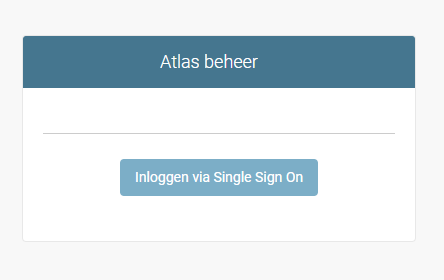

Handleiding Admin Module Atlas
============================================

Deze handleiding beschrijft de werking van de Admin Module. In de Admin Module wordt Atlas geconfigureerd.

## Inhoud

- [INTRODUCTIE](#introductie)
- [INSTALLATIE](installlokaal.md)
- [DASHBOARD](dashboard.md)
- [GEBRUIKERSBEHEER](gebruikers.md)
- [GROEPEN](groepen.md)
- [BEVEILIGING](layer_security.md)
- [KAARTEN](kaarten.md)
- [BRONNEN](bronnen.md)
- [CATEGORIEEN](categorie.md)
- [KAARTLAGEN](kaartlagen.md)
- [KAARTEN](kaarten.md)
- [VIEWERS](viewers.md)

## INTRODUCTIE

Bij het installeren van Atlas wordt in de laatste stap een [superuser aangemaakt](./installlokaal.md#maak-een-superuser-aan). Met deze gebruiker (superuser) kan in de adminmodule worden ingelogd op http://localhost:8000/atlas/admin/ (Let op dat de url eindigt met een /).
Binnen de adminmodule kunnen additionele gebruikers worden aangemaakt en rechten worden toegekend. Alleen gebruikers met supergebruikerstatus hebben toegang tot de adminmodule.
Via de parameter [ADMIN_IPS](installlokaal.md) kan worden bepaald welke ip adressen toegang hebben tot de adminmodule. Om beveiligingsredenen zouden deze ip adressen altijd binnen het netwerk van de interne WFS server moeten liggen.
Het inloggen in de adminmodule verloopt via Single-Sign-On. Het openen van de adminmodule buiten het interne netwerk leidt tot een foutmelding.  

!!! Alert "Let op"
    In tegenstelling met de URL voor Atlas, moet de URL voor de adminmodule afgesloten worden met een /. Zonder een / aan het eind zal een 'Page not found' / 404 error verschijnen.
