Functies binnen Atlas
=====================

##Keuze van de zichtbare kaartlagen

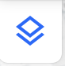

Met deze knop wordt het menu geopend waarin de kaartlagen geselecteerd kunnen worden. Klik op één van de categorieën om de onderliggende kaartlagen te tonen.

Selecteer een kaartlaag door er op te klikken. Achter de categorie staat nu het aantal kaartlagen dat geopend is. Dit kan handig zijn wanneer vanuit meerdere categorieën kaartlagen geopend zijn.

##Legenda

Wanneer 1 of meer lagen geselecteerd zijn, wordt het sybool Zichtbare lagen weergegeven. Klik hierop om de legenda van de actieve kaartlaag te tonen.

 

Klik op het [Transparantie symbool](./help.md#zichtbaarheid-transparantieopacity) Transparantie symbool om de transparantie van de kaartlaag in te stellen. Dit kan handig zijn wanneer meerdere kaartlagen geopend zijn en de zichtbaarheid van onderliggende kaartlagen groter moet zijn.
Klik op het [ⓘ symbool om metadata](./help.md#toon-metadata-van-een-kaartlaag) over de kaartlaag te bekijken. 
Klik op het kruisje om een kaartlaag te sluiten. 

##Toon metadata van een kaartlaag

Metadata geeft informatie over de data. Bijvoorbeeld wanneer deze voor het laatst is bijgewerkt, wie verantwoordelijk is voor de juiste gegevens en wat het doel van de kaartlaag is.
De metadata wordt zichtbaar wanneer je op het ⓘ symbool klikt. Dit symbool is zichtbaar als je met de muis, in het kaartlagenmenu, over de kaartlagen gaat of wanneer je op dit symbool klikt vanuit de [legenda](./help.md#legenda).

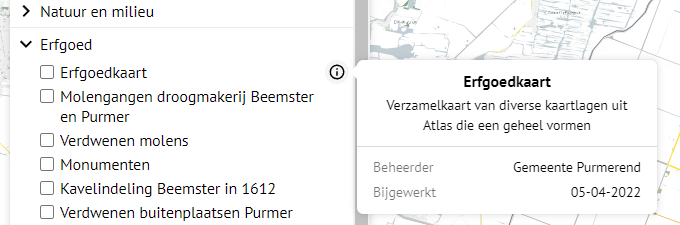 

Wanneer uitgebreide metadata beschikbaar is voor een kaartlaag dan wordt ook de link Meer informatie getoond. Via deze link wordt een extra pagina met informatie over de kaartlaag getoond.

 

##Zoek op kaartlaag

Via het zoekveld van het kaartlagenvenster kun je zoeken naar kaartlagen. Wanneer de eerste letter, of een deel van de naam van de laag, wordt ingegeven dan klapt automatisch de categorie open waarin deze kaartlaag zich bevindt. Wanneer je bijvoorbeeld zoekt naar een kaartlaag met kadastrale informatie, dan kun je in het zoekveld 'kad' ingeven. Alle kaartlagen waarin 'kad' voorkomt, worden dan zichtbaar.

##Zichtbaarheid transparantie/opacity

In de lijstweergave van zichtbare lagen kan de transparantie van de laag ingesteld worden. Klik op het transparantie symbool en stel, met de schuifbalk of door het intypen van een getal, de gewenste transparantie van de laag in.
De waarde 0 is volledig transparant, de waarde 100 is ondoorzichtig.

##Zoek adres

Er kan een adres gezocht worden met onderstaande zoekbalk. Wanneer een (gedeelte van een) adres ingegeven wordt, dan toont de zoekfunctie alle adressen die daaraan voldoen. Selecteer een adres om naar de locatie in de kaart te gaan. Als er kaartlagen geopend zijn, worden direct de detailgegevens van objecten op de adreslocatie getoond in het [detailpaneel](./gebruiktetermen.md#detailpaneel).

##Zoek op coördinaat

In de zoekbalk kan ook een (RD) coördinaat ingegeven worden, met of zonder haakjes er omheen. Hierna verschijnt dit coördinaat direct onder de zoekbalk. Wanneer hierop geklikt wordt zal Atlas naar het betreffende coördinaat in de kaart gaan.

##Vertaling naar WGS 84 projectie

Wanneer op een locatie zonder adres is geklikt, verschijnt het coördinaat in het datascherm. Klik op de locatiepin naast het RD coördinaat om de WGS 84 versie te zien. Bijvoorbeeld Google Maps maakt gebruik van WGS 84 projectie.

##Details van objecten tonen

Als (WFS) kaartlagen actief zijn, kunt je van bevraagbare objecten de details opvragen. Klik hiervoor in de kaart om een locatie te selecteren. Links wordt een paneel geopend met daarin de details van alle objecten die op de aangeklikte locatie zijn gevonden.

Per object kan de mogelijkheid bestaan om één van de volgende opties te gebruiken:

* **Maak selectie**: Met de knop *"Maak selectie"* is het mogelijk om de geometrie die bij het object hoort te gebruiken als geometrisch filter. In de dataweergave wordt dan alleen de data getoond die zich specifiek binnen deze geometrie bevindt.
* **Bekijk**: Met de knop *"Bekijk"* kun je inzoomen op de geometrie die bij het object hoort. Dit helpt om snel het betreffende object op de kaart te lokaliseren.
* **Kopieer**: Met de knop *"Kopieer"* kun je alle data die bij het object hoort kopiëren in een net en gestructureerd formaat, zodat je deze eenvoudig kunt hergebruiken of delen.

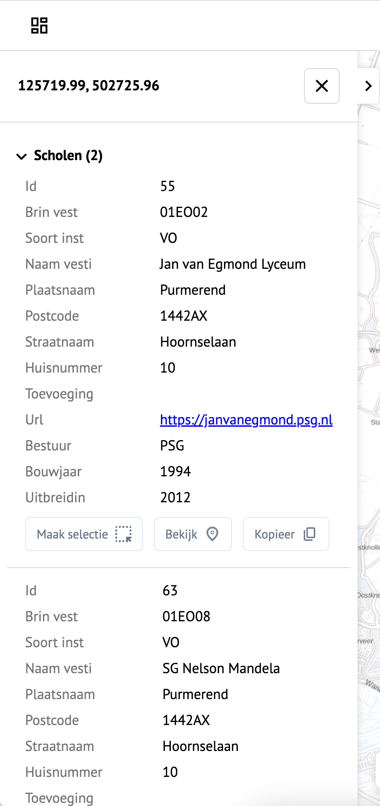

Met de Toon details knop kan het detail paneel ingeklapt en uitgeklapt worden.

##Gekoppelde gegevens bekijken

Aan sommige objecten in de kaart kunnen meer gegevens hangen dan alleen de directe objectgegevens. Dit geldt bijvoorbeeld voor de kadastrale percelen. Het vlak in de kaart heeft een kadastraal nummer.
In gekoppelde tabellen zijn deelpercelen, adressen en eigenaren (rechthebbenden) terug te vinden. Soms zijn dit meerdere per gekoppelde tabel. Zo kunnen zogeheten 1:n relaties bevraagd worden. (Bijvoorbeeld: 1 perceel met 2 eigenaren).
Als de beheerder gekoppelde tabellen heeft geconfigureerd, zijn bij het opvragen van de details van een object, de gekoppelde gegevens ook in het detailpaneel terug te vinden.
Voor het bekijken van gekoppelde gegevens kunnen extra gebruikersrechten nodig zijn.

##Objecten selecteren op de kaart binnen een polygoon of cirkel.

Met de knop Selecteer gebied kunnen objecten binnen een vlak gezocht worden. Dit vlak kan een polygoon zijn of een cirkel. Zoeken kan alleen op zichtbare lagen.
Klik op de knop Selecteer gebied en klik dan op Cirkel of Polygoon. Klik vervolgens op het eerste punt van de selectie. Bij een cirkel wordt dit het middelpunt. Beweeg daarna de muis naar buiten om de cirkel groter te maken. Klik nogmaals om de selectie te bevestigen. Bij de keuze voor een polygoon wordt na dubbelklikken de selectie bevestigd.

Teken een vlak in de kaart.

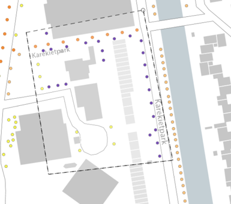

De objecten die zich binnen dit vlak bevinden worden weergegeven in het datapaneel.

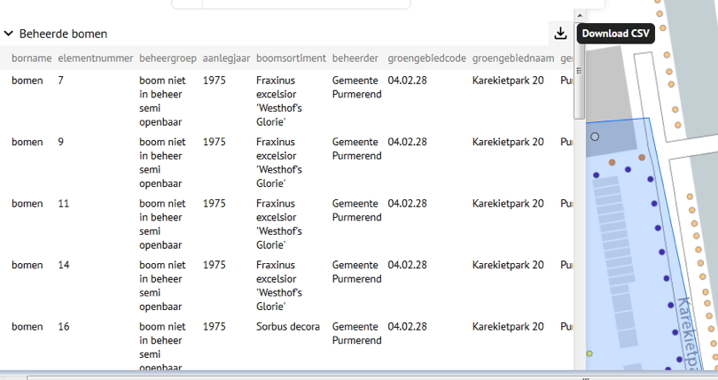

In dit voorbeeld is gekozen voor het selecteren van bomen binnen een vlak.

Als je adressen in een vlak wilt selecteren zet dan de laag BAG Adressen (onder categorie Basisregistraties) zichtbaar. De geselecteerde objecten kunnen gedownload worden naar een csv (comma seperated value) bestand. Een dergelijk bestand kan bijvoorbeeld in Excel geopend worden.

##Rondkijkfoto

Atlas heeft de mogelijkheid om meerdere externe viewers te configureren. Een voorbeeld van een externe viewer is Google Street View.
Wanneer een externe viewer is geconfigureerd, wordt bij het aanklikken van een locatie in het kaartscherm rechtsonder in beeld de panoramaknop getoond.

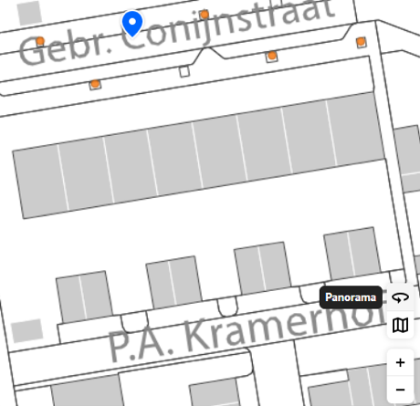

Met de panoramaknop wordt de externe viewer geopend. Rechtsboven in beeld is te zien welke externe viewer actief is.
Wanneer meerdere externe viewers zijn geconfigureerd kan hier gekozen worden voor een andere externe viewer.

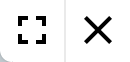

Het panorama scherm kan vergroot worden en gesloten worden met de getoonde knoppen. De functionaliteiten van de externe viewers worden hier verder niet toegelicht. Het openen van de obliekfoto kan met de meest rechtse knop.

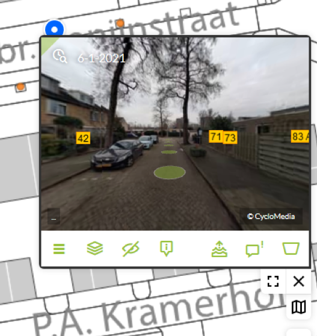

##Meten

Met de meetknop kunnen afstanden en oppervlaktes in de kaart gemeten worden. Kies de gewenste optie en teken een lijn of vlak in de kaart. Het resultaat van de meting verschijnt in een popup scherm.

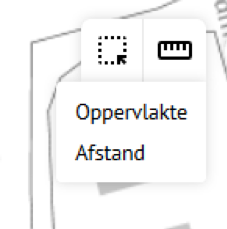

##Tekenen

Na [inloggen](./help.md#inloggen-binnen-atlas-intern-en-extern) binnen Atlas is, afhankelijk van de configuratie, de tekenfunctie zichtbaar in het extra-instellingen menu.
Met de tekenfunctie kunnen punten, lijnen en polygonen getekend worden.
Daarnaast is het mogelijk met tekst labels te plaatsen.
De tekenfunctie is bedoeld om "notities" in een kaartlaag te maken ter verduidelijking.
De tekening kan worden opgeslagen als url en is door iedereen die de url kent weer op te roepen.
Met de "undo" en "redo" functie kunnen acties ongedaan worden gemaakt of opnieuw uitvoerd worden. Bij het klikken op Verwijder tekening, wordt de hele tekening verwijderd.
Na het klikken op het tekensymbool, verschijnt een aantal keuzes: 
- Teken punt 
- Teken lijn
- Teken polygoon
- Teken label 
- Kies een kleur 
- Kies tekstgrootte 
- Kies lijndikte 
- Undo 
- Redo 
- Verwijder tekening
- Sla tekening op

Het klikken op een van de keuzes activeert deze keuze.

##Toon data

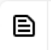

Wanneer binnen Atlas een WFS kaartlaag geladen is (een kaartlaag met aanklikbare objecten), verschijnt linksboven in het scherm, naast het [zoek adres](./help.md#zoek-adres) veld, de knop Toon data.
Bij het openen van het zoek-op-data paneel worden de tabellen met gegevens van alle zichtbare lagen geopend. Klik op een laagnaam om de tabel open te klappen.
Binnen de tabel kan gezocht worden op een aantal, door de beheerder ingestelde, zoekvelden. Na intypen van een zoekterm worden de resultaten per kaartlaag in het scherm weergegeven. Via het symbool Bekijk op kaart kan per gevonden resultaat naar het desbetreffende object in de kaart ingezoomd worden.

##Filteren op data

In het data paneel bevindt zich de knop Activeer filters.

Wanneer deze knop geactiveerd is, kunnen de te filteren velden gekozen worden en de waarde waarop gefilterd moet worden. Daarnaast kan door in de tabel op de veldnamen te klikken, de kolom gesorteerd worden.
Klik op de locatiepin om in de kaart naar het betreffende object te gaan.
Let op dat bij grote selecties het sorteren lang kan duren.

##Download / exporteer kaartlagen

Kaartlagen binnen Atlas kunnen gedownload worden in verschillende formaten:

- CSV
- ESRI Shape
- GeoJSON
- GeoPackage
- GML
- SQLite

Let op dat bij het downloaden naar een CSV bestand de coordinaten van objecten niet meekomen.
Voer de volgende stappen uit om een kaartlaag te kunnen downloaden:

- Selecteer een laag om te downloaden (er kunnen meerdere lagen tegelijk geselecteerd worden maar deze kunnen slecht per stuk gedownload worden).
- Klik op het Toon Data icoon linksboven in het weergavescherm. Nu verschijnt het scherm Zichtbare lagen.
- Klik op de laagnaam die je wilt downloaden in het Zichtbare lagen scherm.
- Klik op het Download icoon linksboven in het scherm en selecteer het gewenste downloadformaat.
- Het bestand wordt nu aangemaakt.

##Printen (naar PDF)

Atlas kan een schermafdruk naar een PDF bestand maken. Dit PDF bestand kan afgedrukt worden. Klik in het [extra instellingen](./help.md#extra-instellingen-menu) menu op Print. Het volgende scherm komt nu in beeld:

Bij het aanmaken van het PDF bestand kan een aantal opties meegegeven worden: 
*Titel*: Wanneer een titel wordt meegegeven dan verschijnt deze linksboven in het document. 
*Opmerkingen*: Wanneer opmerkingen worden ingevuld, verschijnen deze linksboven in het document. 
*Formaat*: standaard is dit A4. Een grootte tot A0 is mogelijk. Let op dat een bestand op A0 formaat een aantal honderd MB groot kan zijn, Het aanmaken van een A0 bestand neemt veel tijd in beslag.
*Oriëntatie*: Liggend (Landscape) of staand (Potrait). 
*Toon legenda*: Wanneer dit JA is dan wordt de legenda rechtsboven in het PDF document weergegeven. 
*Toon datum/tijd*:  Wanneer dit JA is dan wordt de datum en de tijd linksboven in het document weergegeven. 
*Toon schaal*: Wanneer dit JA is dan wodt de schaal linksonder in het PDF document weergegeven. 

##Kaartlagen vergelijken

Binnen Atlas is het mogelijk om kaartlagen met elkaar te vergelijken. Zo kun je bijvoorbeeld een luchtfoto uit 1990 naast een luchtfoto uit 2022 leggen. Deze functionaliteit activeer je via de knop "Vergelijk kaartlagen" (zie afbeelding hierboven).

Wanneer je op deze knop klikt, opent er een menu aan de zijkant van je scherm (zie afbeelding hieronder). Hier kun je twee kaartlagen selecteren om te vergelijken: één voor de linkerhelft en één voor de rechterhelft van het kaartbeeld.

Zodra je de kaartlagen hebt gekozen, kun je direct beginnen met vergelijken. Wil je het instellingspaneel tijdelijk verbergen, klik dan op "Sluit". Wil je stoppen met het vergelijken van kaartlagen, klik dan op "Stop vergelijken".

Onderaan in het midden van het scherm bevindt zich een slider. Met deze slider bepaal je welk deel van de kaartlaag zichtbaar is aan de linker- of rechterkant. Zo kun je heel precies en gedetailleerd kaartlagen met elkaar vergelijken.

## Herstel knop

In Atlas is het mogelijk om snel terug te keren naar het basis kaartscherm, bijvoorbeeld vanuit een samengesteld kaartbeeld met geselecteerde kaartlagen, actieve filters, tekeningen en/of selecties. Dit voorkomt dat je al je eerdere handelingen handmatig moet terugdraaien.

Hiervoor gebruik je de knop "Herstel" (zie screenshot hierboven). Met één klik zet je alle wijzigingen terug naar de oorspronkelijke instellingen, zodat je weer met een schoon kaartbeeld kunt beginnen.

##Huidige kaartscherm embedden in een andere webpagina

In het \"Knoppen/Tools\" gedeelte van het scherm (rechtsboven) vind je de functie Insluiten. Door hierop te klikken verschijnt het
huidige scherm met de HTML code om deze op te vragen. Gebruik de code om deze kaartweergave met alle geselecteerde lagen weer te geven in een andere webpagina.

##Huidige kaartscherm delen met een collega

Kopieer de URL in de adresbalk om een kaartscherm met alle instellingen te delen, via bijvoorbeeld mail.

Iemand die via de gedeelde link Atlas opent, ziet dezelfde instellingen
betreffende:

- Middelpunt van de kaart
- Schaal van de kaart
- Zichtbare lagen in de kaart

##Extra instellingen menu

Na het klikken rechtsboven in het scherm op de drie verticale puntjes, verschijnt het extra instellingen menu.

##Inloggen binnen Atlas, intern en extern

Atlas bevat zogenaamde open en gesloten kaartlagen. De open kaartlagen zijn te bekijken voor iedereen die toegang tot Atlas heeft.
De gesloten kaartlagen zijn alleen voor bepaalde gebruikersgroepen te bekijken. Voor alle gesloten kaartlagen geldt dat de gebruiker binnen Atlas moet inloggen. Daarnaast is het zo dat sommige kaartlagen
alleen zichtbaar zijn wanneer de gebruiker ook binnen het Purmerend netwerk is ingelogd.
De login binnen Atlas werkt volgens het 'Single Sign On'(SSO) principe. Wanneer een gebruiker binnen het netwerk van Purmerend al is ingelogd, dan is het inloggen binnen Atlas slechts een kwestie van op de
login-knop klikken. Probeert een gebruiker extern binnen Atlas in te loggen dan is het nodig eenmalig de accountnaam en wachtwoord in te geven. Dit is de standaard 2-factor authenticatie (2FA) login.
Wanneer geprobeert wordt om gesloten kaartlaaggegevens op te vragen zonder ingelogd te zijn, dan is alleen de melding: "U moet ingelogd zijn om deze data te bekijken" zichtbaar. Wanneer geprobeert wordt om
gesloten kaartlaaggegevens op te vragen zonder rechten hiervoor, dan is alleen de melding: "U heeft geen rechten om deze data te bekijken" zichtbaar. Mocht je onterecht een van deze meldingen zien, neem dan
contact op met de beheerder van Atlas.

Klik rechtsboven in het Atlas-scherm op de drie verticale puntjes om het extra instellingen menu met de loginkeuze te tonen.

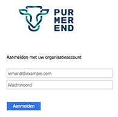

Wanneer extern binnen Atlas wordt ingelogt, dan is het nodig gebruikersnaam en wachtwoord in te geven. De manier waarop dit gebeurt kan per organisatie verschillen

[Versie-informatie](https://gitlab.com/purmerend/atlas/-/releases)