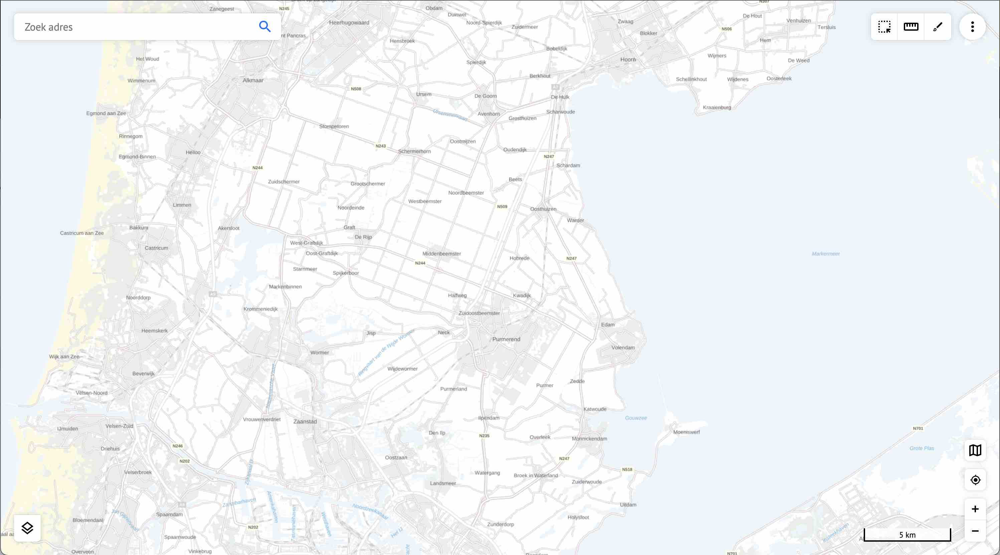

Opbouw van het scherm
=====================

Na het starten van Atlas is het [*kaartscherm*](./gebruiktetermen.md#kaartscherm) te zien: 

## De bedieningsfuncties

In de hoeken van het kaartscherm bevinden zich de bedieningsfuncties

*Linksonder*  
- Het [lagenmenu](./help.md#keuze-van-de-zichtbare-kaartlagen)  

*Linksboven*  
- Het [zoekveld voor adressen](./help.md#zoek-adres) 

*Rechtsboven*  
Afhankelijk van de instellingen van Atlas, zijn de volgende functies te zien:  

- Selecteer objecten door middel van een  [selectievenster](./help.md#objecten-selecteren-op-de-kaart-binnen-een-polygoon).
- [Meet afstanden of oppervlakten](./help.md#meten) 
- [Teken in de kaartlaag](./help.md#tekenen) en sla de tekening op als url.
- [Extra instellingen](./help.md#extra-instellingen-menu) menu. [Log in](./help.md#inloggen-binnen-atlas-intern-en-extern), Embed een  deel van het scherm, [Print het huidige kaartscherm](./help.md#printen-naar-pdf), Helpfunctie en Disclaimer.  

 

*Rechtsonder*  

## Schaalindicator

Via de schaalindicator rechtsonder in beeld, kun je de weergaveverhouding te zien. door er op te klikken kan gewisseld worden tussen een één op X weergave of een afstandsweergave.

## Pannen en zoomen

In- en uitzoomen kan door gebruik van de plus en min knoppen of door gebruik van het muiswiel.
Om in te zoomen op een gebied is het ook mogelijk om shift in te drukken, en een rechthoek te trekken in de kaart. Verschuiven van de kaart kan door middel van klikken en aansluitend slepen in de kaart.

## Keuze van de achtergrondkaart

Met deze knop kan het menu worden geopend waarin de gewenste achtergrondkaart ingesteld kan worden.

## GPS-locatie tonen

Op een mobiel device (telefoon, Ipad) met GPS, kan de huidige locatie worden getoond.
Gebruik hiervoor bovenstaand icoon. Let op dat locatievoorzieningen aan moeten staan voor deze functie anders zal een foutmelding verschijnen. De locatievoorziening moet aan staan voor de browser waarin Atlas geopend is.

